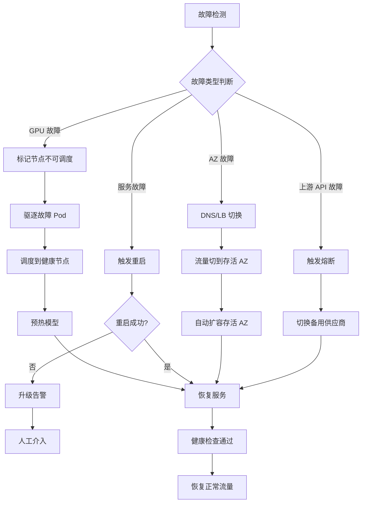

# AI 系统高可用架构设计 (High Availability 2026)

> **一句话理解**: 高可用架构是 AI 系统的"安全网"——通过多副本、自动故障转移、跨区域容灾等机制，确保 AI 服务在面对硬件故障、软件缺陷、流量突增时仍能稳定运行，达到 99.9%-99.99% 的可用性目标。

> **相关文档**: [AI 系统架构全景图](./AI_System_Architecture_2026.md) | [AI 基础设施指南](./AI_Infrastructure_2026.md) | [容量规划](./Capacity_Planning_2026.md)

---

## 1. 高可用概述

### 1.1 AI 系统可用性等级

| 等级 | 可用性 | 年停机时间 | 适用场景 |
|-----|--------|----------|---------|
| **基础** | 99.0% | 87.6 小时 | 开发/测试环境 |
| **标准** | 99.9% | 8.76 小时 | 内部 AI 工具 |
| **企业** | 99.95% | 4.38 小时 | 面向客户的 AI 服务 |
| **关键** | 99.99% | 52.56 分钟 | 金融/医疗/自动驾驶 |

### 1.2 AI 系统特有的高可用挑战

| 挑战 | 说明 | 传统系统对比 |
|-----|------|------------|
| **GPU 故障率高** | GPU 卡 MTBF ~10K 小时 | CPU 故障率低一个数量级 |
| **模型加载慢** | 大模型加载需 30s-5min | 应用启动通常 <10s |
| **状态管理复杂** | KV Cache、对话历史、Agent 状态 | 通常无状态或简单状态 |
| **热启动依赖** | 模型需预热才能达到最优性能 | 通常无预热需求 |
| **成本约束** | GPU 冗余成本高昂 | CPU 冗余成本可控 |
| **长连接多** | 流式响应、WebSocket | 短连接为主 |

### 1.3 高可用设计原则

| 原则 | 说明 | 实践 |
|-----|------|------|
| **消除单点故障** | 任何单组件故障不影响服务 | 多副本、多路径 |
| **故障快速检测** | 秒级发现故障 | 健康检查、心跳机制 |
| **自动故障恢复** | 无需人工干预 | 自动重启、自动切换 |
| **优雅降级** | 部分失败时仍能提供有限服务 | 降级策略、熔断器 |
| **混沌工程验证** | 主动注入故障测试韧性 | Chaos Monkey、GameDay |

---

## 2. 多可用区部署架构

### 2.1 部署拓扑

```
┌─────────────────────────────────────────────────────────────────┐
│                     多可用区高可用部署                              │
├─────────────────────────────────────────────────────────────────┤
│                                                                 │
│   ┌─────────────┐     ┌─────────────┐     ┌─────────────┐      │
│   │  AZ-1       │     │  AZ-2       │     │  AZ-3       │      │
│   │  ┌───────┐  │     │  ┌───────┐  │     │  ┌───────┐  │      │
│   │  │ API×3 │  │     │  │ API×3 │  │     │  │ API×2 │  │      │
│   │  └───────┘  │     │  └───────┘  │     │  └───────┘  │      │
│   │  ┌───────┐  │     │  ┌───────┐  │     │  ┌───────┐  │      │
│   │  │ LLM×2 │  │     │  │ LLM×2 │  │     │  │ LLM×1 │  │      │
│   │  │(GPU)  │  │     │  │(GPU)  │  │     │  │(GPU)  │  │      │
│   │  └───────┘  │     │  └───────┘  │     │  └───────┘  │      │
│   │  ┌───────┐  │     │  ┌───────┐  │     │  ┌───────┐  │      │
│   │  │ DB    │◄─┼────┼─►│ DB    │◄─┼────┼─►│ DB    │  │      │
│   │  │(Replica) │     │  │(Primary) │     │  │(Replica) │      │
│   │  └───────┘  │     │  └───────┘  │     │  └───────┘  │      │
│   │  ┌───────┐  │     │  ┌───────┐  │     │  ┌───────┐  │      │
│   │  │Redis  │◄─┼────┼─►│Redis  │◄─┼────┼─►│Redis  │  │      │
│   │  │Sentinel│  │     │ │Master │  │     │  │Sentinel│  │      │
│   │  └───────┘  │     │  └───────┘  │     │  └───────┘  │      │
│   └─────────────┘     └─────────────┘     └─────────────┘      │
│                                                                 │
│                    ┌─────────────┐                              │
│                    │ Global LB   │                              │
│                    │ (NLB/ALB)   │                              │
│                    └─────────────┘                              │
│                                                                 │
└─────────────────────────────────────────────────────────────────┘
```

### 2.2 K8s 高可用配置

```yaml
# LLM 推理服务高可用部署
apiVersion: apps/v1
kind: Deployment
metadata:
  name: llm-inference
  namespace: ai-services
spec:
  replicas: 5
  strategy:
    type: RollingUpdate
    rollingUpdate:
      maxSurge: 1
      maxUnavailable: 0  # 零停机更新
  template:
    metadata:
      labels:
        app: llm-inference
    spec:
      # 反亲和性：确保 Pod 分散到不同 AZ
      affinity:
        podAntiAffinity:
          requiredDuringSchedulingIgnoredDuringExecution:
            - labelSelector:
                matchExpressions:
                  - key: app
                    operator: In
                    values: [llm-inference]
              topologyKey: topology.kubernetes.io/zone
      
      # Pod 中断预算
      terminationGracePeriodSeconds: 120  # 等待进行中请求完成
      
      containers:
        - name: inference
          image: registry/llm-inference:latest
          resources:
            requests:
              nvidia.com/gpu: 1
              memory: 80Gi
            limits:
              nvidia.com/gpu: 1
              memory: 80Gi
          
          # 健康检查
          startupProbe:
            httpGet:
              path: /health/startup
              port: 8080
            initialDelaySeconds: 30
            periodSeconds: 10
            failureThreshold: 30    # 模型加载可能需要 5 分钟
            
          readinessProbe:
            httpGet:
              path: /health/ready
              port: 8080
            periodSeconds: 5
            failureThreshold: 3
            
          livenessProbe:
            httpGet:
              path: /health/live
              port: 8080
            periodSeconds: 10
            failureThreshold: 5

---
# Pod 中断预算
apiVersion: policy/v1
kind: PodDisruptionBudget
metadata:
  name: llm-inference-pdb
spec:
  minAvailable: 3
  selector:
    matchLabels:
      app: llm-inference
```

---

## 3. 故障检测与恢复

### 3.1 故障分类与应对

| 故障类型 | 检测方式 | 恢复时间 | 恢复策略 |
|---------|---------|---------|---------|
| **GPU 硬件故障** | NVIDIA DCGM 监控 | 3-5 分钟 | 自动驱逐 + 新 Pod 调度 |
| **OOM (显存不足)** | K8s OOMKill | 1-3 分钟 | 自动重启 + 降低批大小 |
| **模型服务卡死** | 健康检查超时 | 30-60 秒 | Kill + 重启 |
| **网络分区** | 心跳超时 | 10-30 秒 | 流量切换到其他 AZ |
| **数据库故障** | 连接检测 | 5-30 秒 | 主从切换 |
| **外部 API 故障** | 超时/错误率 | 即时 | 降级到备用模型 |

### 3.2 故障恢复流程



### 3.3 健康检查实现

```python
"""AI 服务健康检查"""

from fastapi import FastAPI
from datetime import datetime
import asyncio

app = FastAPI()

class HealthChecker:
    """多维度健康检查"""
    
    def __init__(self):
        self.model_loaded = False
        self.model_warmed_up = False
        self.last_inference_time = None
        self.consecutive_errors = 0
        self.max_errors_threshold = 5
    
    async def startup_check(self) -> dict:
        """启动检查：模型是否加载完成"""
        return {
            "status": "ready" if self.model_loaded else "loading",
            "model_loaded": self.model_loaded,
            "model_warmed_up": self.model_warmed_up
        }
    
    async def readiness_check(self) -> dict:
        """就绪检查：是否可以接收流量"""
        is_ready = (
            self.model_loaded and
            self.model_warmed_up and
            self.consecutive_errors < self.max_errors_threshold
        )
        return {
            "status": "ready" if is_ready else "not_ready",
            "consecutive_errors": self.consecutive_errors,
            "gpu_available": await self._check_gpu(),
            "memory_ok": await self._check_memory()
        }
    
    async def liveness_check(self) -> dict:
        """存活检查：进程是否正常"""
        # 检查最近是否有成功推理
        if self.last_inference_time:
            idle_seconds = (datetime.now() - self.last_inference_time).seconds
            is_stuck = idle_seconds > 300  # 5 分钟无推理视为异常
        else:
            is_stuck = False
        
        return {
            "status": "alive" if not is_stuck else "stuck",
            "uptime_seconds": self._get_uptime(),
            "last_inference_ago": idle_seconds if self.last_inference_time else None
        }
    
    async def _check_gpu(self) -> bool:
        """检查 GPU 状态"""
        try:
            import torch
            return torch.cuda.is_available() and torch.cuda.memory_allocated() > 0
        except Exception:
            return False
    
    async def _check_memory(self) -> bool:
        """检查显存是否充足"""
        try:
            import torch
            free_memory = torch.cuda.get_device_properties(0).total_mem - torch.cuda.memory_allocated()
            return free_memory > 1e9  # 至少 1GB 空闲
        except Exception:
            return False

health = HealthChecker()

@app.get("/health/startup")
async def startup():
    result = await health.startup_check()
    status_code = 200 if result["status"] == "ready" else 503
    return result

@app.get("/health/ready")
async def ready():
    result = await health.readiness_check()
    status_code = 200 if result["status"] == "ready" else 503
    return result

@app.get("/health/live")
async def live():
    result = await health.liveness_check()
    status_code = 200 if result["status"] == "alive" else 503
    return result
```

---

## 4. LLM 服务高可用模式

### 4.1 模型预热池

```python
"""模型预热池：减少冷启动时间"""

class ModelWarmPool:
    """
    预热池策略：
    - 维持 N 个已加载模型的热实例
    - 新请求优先路由到热实例
    - 故障恢复时从预热池快速替补
    """
    
    def __init__(self, pool_size: int = 2):
        self.pool_size = pool_size
        self.warm_instances = []
        self.active_instances = []
    
    async def initialize_pool(self, model_config: dict):
        """初始化预热池"""
        for i in range(self.pool_size):
            instance = await self._create_warm_instance(model_config)
            self.warm_instances.append(instance)
    
    async def promote_instance(self) -> dict:
        """从预热池提升一个实例到活跃状态"""
        if not self.warm_instances:
            return None
        
        instance = self.warm_instances.pop(0)
        self.active_instances.append(instance)
        
        # 异步补充预热池
        asyncio.create_task(self._replenish_pool())
        
        return instance
    
    async def _replenish_pool(self):
        """补充预热池"""
        while len(self.warm_instances) < self.pool_size:
            instance = await self._create_warm_instance(self.model_config)
            self.warm_instances.append(instance)
```

### 4.2 多供应商 Fallback

```python
"""多供应商降级策略"""

class MultiProviderFallback:
    """
    供应商降级链：
    Primary (OpenAI) → Secondary (Anthropic) → Tertiary (本地模型) → 缓存
    """
    
    def __init__(self):
        self.providers = [
            {"name": "openai", "model": "gpt-4o", "timeout": 30},
            {"name": "anthropic", "model": "claude-3.5-sonnet", "timeout": 30},
            {"name": "local", "model": "llama-3.1-70b", "timeout": 60},
        ]
        self.circuit_breakers = {}
    
    async def call_with_fallback(self, request: dict) -> dict:
        """带降级的调用"""
        errors = []
        
        for provider in self.providers:
            # 检查熔断器
            if self._is_circuit_open(provider["name"]):
                continue
            
            try:
                response = await self._call_provider(provider, request)
                return {
                    "response": response,
                    "provider": provider["name"],
                    "fallback": len(errors) > 0
                }
            except Exception as e:
                errors.append({"provider": provider["name"], "error": str(e)})
                self._record_failure(provider["name"])
        
        # 所有供应商都失败，尝试缓存
        cached = await self._get_cached_response(request)
        if cached:
            return {"response": cached, "provider": "cache", "fallback": True}
        
        raise AllProvidersFailedException(errors)
    
    def _is_circuit_open(self, provider: str) -> bool:
        """检查熔断器状态"""
        breaker = self.circuit_breakers.get(provider)
        if not breaker:
            return False
        return breaker["failures"] >= 5 and \
               (time.time() - breaker["last_failure"]) < 60  # 60 秒冷却
```

### 4.3 流式响应容错

```python
"""流式响应的高可用处理"""

async def resilient_stream(request: dict):
    """
    流式响应容错：
    - 中途断开自动重连
    - 保存已生成内容
    - 从断点继续生成
    """
    generated_tokens = []
    retry_count = 0
    max_retries = 3
    
    while retry_count < max_retries:
        try:
            async for chunk in llm_service.stream(request):
                generated_tokens.append(chunk)
                yield chunk
            return  # 正常完成
            
        except ConnectionError:
            retry_count += 1
            if retry_count >= max_retries:
                # 返回已生成的部分 + 截断标记
                yield {"type": "truncated", "reason": "connection_lost"}
                return
            
            # 重连并从断点继续
            request["prefix"] = "".join(generated_tokens)
            await asyncio.sleep(0.5 * retry_count)
```

---

## 5. 数据层高可用

### 5.1 数据库高可用配置

```yaml
# PostgreSQL 高可用集群 (Patroni)
patroni:
  scope: ai-db-cluster
  bootstrap:
    dcs:
      ttl: 30
      loop_wait: 10
      retry_timeout: 10
      maximum_lag_on_failover: 1048576  # 1MB
    initdb:
      - encoding: UTF8
      - data-checksums
    pg_hba:
      - host replication replicator 0.0.0.0/0 md5
      - host all all 0.0.0.0/0 md5
  
  postgresql:
    parameters:
      max_connections: 200
      shared_buffers: 4GB
      effective_cache_size: 12GB
      synchronous_commit: "on"
      wal_level: replica
      max_wal_senders: 5
      max_replication_slots: 5
      hot_standby: "on"
```

### 5.2 向量数据库高可用

```yaml
# Milvus 高可用配置
milvus:
  cluster:
    enabled: true
    
  proxy:
    replicas: 3
    
  queryNode:
    replicas: 3
    resources:
      limits:
        memory: 32Gi
        
  dataNode:
    replicas: 2
    
  indexNode:
    replicas: 2
    
  minio:  # 对象存储
    mode: distributed
    replicas: 4
    
  etcd:  # 元数据
    replicas: 3
    
  pulsar:  # 消息队列
    broker:
      replicas: 3
    bookkeeper:
      replicas: 3
```

### 5.3 缓存高可用

```yaml
# Redis Sentinel 高可用
redis:
  sentinel:
    enabled: true
    replicas: 3
    
  master:
    persistence:
      enabled: true
      storageClass: fast-ssd
      
  replica:
    replicaCount: 2
    persistence:
      enabled: true
      
  # 哨兵配置
  sentinel:
    downAfterMilliseconds: 5000
    failoverTimeout: 60000
    parallelSyncs: 1
```

---

## 6. 跨区域容灾

### 6.1 容灾架构

```
┌─────────────────────────────────────────────────────────────────┐
│                     跨区域容灾架构                                │
├─────────────────────────────────────────────────────────────────┤
│                                                                 │
│   Region A (Active)                Region B (Standby/Active)   │
│   ┌───────────────────┐          ┌───────────────────┐        │
│   │ ┌─────┐ ┌─────┐  │          │ ┌─────┐ ┌─────┐  │        │
│   │ │ LLM │ │ API │  │   异步   │ │ LLM │ │ API │  │        │
│   │ │ ×4  │ │ ×6  │  │ ◄──────► │ │ ×2  │ │ ×3  │  │        │
│   │ └─────┘ └─────┘  │   复制   │ └─────┘ └─────┘  │        │
│   │ ┌─────┐ ┌─────┐  │          │ ┌─────┐ ┌─────┐  │        │
│   │ │ DB  │ │ Vector│ │          │ │ DB  │ │ Vector│ │        │
│   │ │Primary│ │ Primary│          │ │Replica│ │Replica│ │        │
│   │ └─────┘ └─────┘  │          │ └─────┘ └─────┘  │        │
│   └───────────────────┘          └───────────────────┘        │
│                                                                 │
│                    ┌────────────────┐                           │
│                    │  Global DNS /  │                           │
│                    │  Traffic Manager│                           │
│                    └────────────────┘                           │
│                                                                 │
│   RPO: < 1 分钟 (异步复制延迟)                                  │
│   RTO: < 5 分钟 (自动切换)                                      │
│                                                                 │
└─────────────────────────────────────────────────────────────────┘
```

### 6.2 容灾策略选择

| 策略 | RPO | RTO | 成本 | 适用场景 |
|------|-----|-----|------|---------|
| **Active-Passive** | 分钟级 | 5-15 分钟 | 1.3x | 一般业务 |
| **Active-Active** | 接近 0 | <1 分钟 | 2x | 关键业务 |
| **Pilot Light** | 小时级 | 15-60 分钟 | 1.1x | 非核心系统 |
| **Multi-Region Active** | 0 | 0 | 2.5x | 全球化服务 |

### 6.3 容灾切换自动化

```python
"""容灾自动切换"""

class DisasterRecoveryManager:
    """容灾管理器"""
    
    def __init__(self):
        self.primary_region = "us-west-2"
        self.dr_region = "us-east-1"
        self.health_check_interval = 10  # 秒
        self.failover_threshold = 3     # 连续失败次数
    
    async def monitor_and_failover(self):
        """监控并自动切换"""
        consecutive_failures = 0
        
        while True:
            is_healthy = await self._check_primary_health()
            
            if is_healthy:
                consecutive_failures = 0
            else:
                consecutive_failures += 1
                
                if consecutive_failures >= self.failover_threshold:
                    await self._execute_failover()
                    consecutive_failures = 0
            
            await asyncio.sleep(self.health_check_interval)
    
    async def _execute_failover(self):
        """执行容灾切换"""
        # 1. 更新 DNS 权重
        await self._update_dns(
            primary_weight=0,
            dr_weight=100
        )
        
        # 2. 提升 DR 数据库为主库
        await self._promote_dr_database()
        
        # 3. 扩容 DR 区域推理服务
        await self._scale_dr_inference(target_replicas=8)
        
        # 4. 通知运维团队
        await self._send_alert(
            severity="critical",
            message=f"Region failover: {self.primary_region} → {self.dr_region}"
        )
    
    async def _execute_failback(self):
        """故障恢复后回切"""
        # 1. 验证主区域恢复
        if not await self._verify_primary_recovery():
            return False
        
        # 2. 数据同步追齐
        await self._sync_data_to_primary()
        
        # 3. 渐进式切回流量
        for weight in [10, 30, 50, 80, 100]:
            await self._update_dns(
                primary_weight=weight,
                dr_weight=100 - weight
            )
            await asyncio.sleep(300)  # 每步观察 5 分钟
        
        return True
```

---

## 7. 监控与告警

### 7.1 高可用关键指标

```yaml
# Prometheus 高可用告警规则
groups:
  - name: ha-alerts
    rules:
      # GPU 故障
      - alert: GPUError
        expr: nvidia_gpu_errors_total > 0
        for: 1m
        labels:
          severity: critical
        annotations:
          summary: "GPU 硬件错误检测"
          
      # 推理服务可用实例不足
      - alert: InsufficientReplicas
        expr: |
          kube_deployment_status_replicas_available{deployment="llm-inference"} 
          < kube_deployment_spec_replicas{deployment="llm-inference"} * 0.5
        for: 2m
        labels:
          severity: critical
        annotations:
          summary: "推理服务可用实例低于 50%"
          
      # 数据库主从延迟
      - alert: ReplicationLag
        expr: pg_replication_lag_seconds > 30
        for: 5m
        labels:
          severity: warning
        annotations:
          summary: "数据库主从复制延迟超过 30s"
          
      # 跨区域延迟异常
      - alert: CrossRegionLatency
        expr: cross_region_latency_ms > 200
        for: 5m
        labels:
          severity: warning
        annotations:
          summary: "跨区域延迟异常升高"
          
      # 错误率突增
      - alert: ErrorRateSpike
        expr: |
          rate(llm_errors_total[5m]) / rate(llm_requests_total[5m]) > 0.05
        for: 2m
        labels:
          severity: critical
        annotations:
          summary: "LLM 服务错误率超过 5%"
```

### 7.2 SLA 仪表板指标

| 指标 | 计算方式 | 目标 |
|-----|---------|------|
| **可用性** | (总时间 - 停机时间) / 总时间 | >99.95% |
| **成功率** | 成功请求 / 总请求 | >99.9% |
| **P95 延迟** | 95 分位延迟 | <2s (Chat) |
| **P99 延迟** | 99 分位延迟 | <5s (Chat) |
| **MTTR** | 平均恢复时间 | <5 分钟 |
| **MTBF** | 平均故障间隔 | >720 小时 |

---

## 8. 最佳实践清单

### 8.1 高可用检查清单

| 层级 | 检查项 | 状态 |
|-----|--------|------|
| **计算层** | LLM 服务多副本 (≥3) | □ |
| | Pod 反亲和 (跨 AZ 分布) | □ |
| | PDB 配置 (最小可用数) | □ |
| | GPU 故障自动驱逐 | □ |
| | 模型预热池就位 | □ |
| **数据层** | 数据库主从高可用 | □ |
| | 向量数据库集群模式 | □ |
| | Redis Sentinel/Cluster | □ |
| | 备份策略 (RPO <1h) | □ |
| **网络层** | 多 AZ 负载均衡 | □ |
| | 健康检查配置 | □ |
| | 超时和重试策略 | □ |
| | 熔断器配置 | □ |
| **容灾** | DR 区域就绪 | □ |
| | 自动切换脚本测试 | □ |
| | 回切流程验证 | □ |
| | 定期演练 (季度) | □ |
| **监控** | 核心指标告警 | □ |
| | SLA 仪表板 | □ |
| | On-call 值班制度 | □ |
| | 故障复盘机制 | □ |

---

## 9. 参考资源

- [Kubernetes Production Best Practices](https://learnk8s.io/production-best-practices)
- [AWS Well-Architected AI/ML Lens](https://docs.aws.amazon.com/wellarchitected/latest/machine-learning-lens/)
- [Google SRE Book](https://sre.google/sre-book/table-of-contents/)
- [NVIDIA GPU Monitoring (DCGM)](https://developer.nvidia.com/dcgm)

---

*Last updated: 2026-04-14*
*Version: 1.0.0*

## Related

- [[12_Architecture_Infrastructure/Architecture_Overview/AI_Infrastructure_2026|AI_Infrastructure_2026]]
- [[12_Architecture_Infrastructure/Architecture-in-nutshell.md|Architecture-in-nutshell]]
- [[12_Architecture_Infrastructure/Architecture_Infrastructure_for_dummy.md|Architecture_Infrastructure_for_dummy]]
- [[12_Architecture_Infrastructure/Architecture_Overview/Spring_AI_Architecture|Spring_AI_Architecture]]
- [[_concepts/llm-infrastructure.md|llm-infrastructure]]
