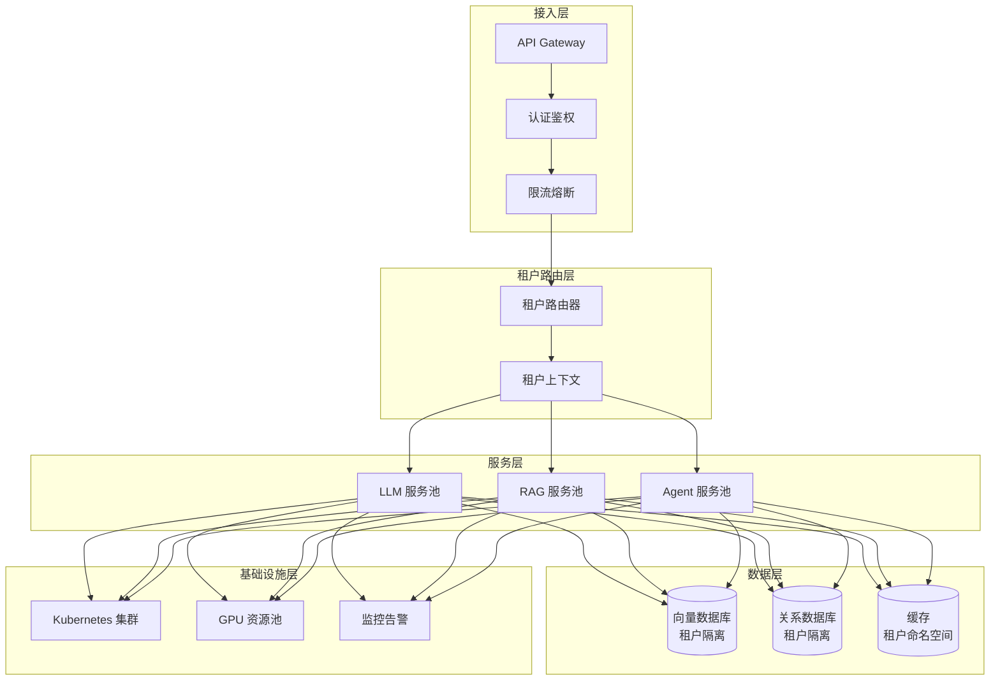

# AI 系统多租户架构 (Multi-Tenant Architecture for AI Systems)

> 中文简称：AI 系统多租户架构

> **一句话理解**: 多租户架构是 AI 服务的"公寓楼"——在共享基础设施上为不同租户提供隔离、安全、可计费的服务，实现资源效率与租户隔离的平衡。

> **相关文档**: [AI 系统架构全景图](./03_AI_系统_架构_2026.md) | [AI 基础设施指南](./02_AI_基础设施_2026.md) | [成本优化](./01_AI_成本优化_2026.md) | [高可用设计](./06_高可用_2026.md)

---

## 1. 多租户概述

### 1.1 为什么 AI 系统需要多租户？

| 需求 | 单租户问题 | 多租户优势 |
|-----|----------|----------|
| **成本效率** | 资源独占，利用率低 | 资源共享，成本分摊 |
| **运维效率** | 每客户独立部署 | 统一运维，规模效应 |
| **数据隔离** | 物理隔离成本高 | 逻辑隔离更灵活 |
| **弹性扩展** | 按峰值配置浪费 | 按需共享更经济 |
| **企业需求** | 中小企业负担重 | SaaS 模式降低门槛 |

### 1.2 多租户隔离模型

```
多租户隔离级别

┌─────────────────────────────────────────────────────────────┐
│                     隔离级别 (从低到高)                        │
├─────────────────────────────────────────────────────────────┤
│                                                              │
│  共享一切          共享服务           共享数据库      独立部署   │
│  (Shared All)     (Shared Service)   (Shared DB)    (Isolated) │
│                                                              │
│  ┌─────────┐     ┌─────────┐      ┌─────────┐    ┌─────────┐ │
│  │Tenant A │     │Tenant A │      │Tenant A │    │Tenant A │ │
│  │Tenant B │     │Tenant B │      │Tenant B │    │Tenant B │ │
│  │Tenant C │     │Tenant C │      │Tenant C │    │Tenant C │ │
│  │    ↓    │     │    ↓    │      │    ↓    │    │    ↓    │ │
│  │  共享   │     │ 独立Schema│     │ 独立DB  │    │独立实例 │ │
│  │  一切   │     │ 共享服务  │      │共享服务  │    │共享网络 │ │
│  └─────────┘     └─────────┘      └─────────┘    └─────────┘ │
│                                                              │
│  成本: 低 ◄──────────────────────────────────────────► 高    │
│  隔离: 弱 ◄──────────────────────────────────────────► 强    │
│  复杂度: 低 ◄──────────────────────────────────────────► 高  │
└─────────────────────────────────────────────────────────────┘
```

### 1.3 AI 系统多租户特点

| 特点 | 说明 | 架构影响 |
|-----|------|---------|
| **计算密集** | GPU 资源昂贵 | 资源共享与隔离的平衡 |
| **数据敏感** | 训练数据、用户查询 | 严格的数据隔离要求 |
| **性能敏感** | 推理延迟要求高 | 资源竞争需要控制 |
| **成本动态** | Token 消耗不定 | 精细化计费计量 |
| **模型多样** | 不同租户可能需要不同模型 | 模型版本管理 |

---

## 2. 架构设计

### 2.1 整体架构



### 2.2 租户上下文管理

```python
"""
租户上下文管理
"""

from dataclasses import dataclass, field
from typing import Dict, List, Optional, Any
from enum import Enum
from contextlib import contextmanager
import threading

class TenantTier(Enum):
    """租户等级"""
    FREE = "free"           # 免费版
    STARTER = "starter"     # 入门版
    PRO = "pro"             # 专业版
    ENTERPRISE = "enterprise"  # 企业版

class IsolationLevel(Enum):
    """隔离级别"""
    SHARED = "shared"              # 共享所有资源
    SCHEMA_ISOLATED = "schema"     # Schema 隔离
    DATABASE_ISOLATED = "database" # 数据库隔离
    INSTANCE_ISOLATED = "instance" # 实例隔离

@dataclass
class TenantQuota:
    """租户配额"""
    # 计算配额
    max_tokens_per_day: int = 100000
    max_tokens_per_minute: int = 1000
    max_concurrent_requests: int = 5
    
    # 存储配额
    max_vector_count: int = 10000
    max_storage_gb: float = 1.0
    
    # 模型配额
    allowed_models: List[str] = field(default_factory=lambda: ["gpt-3.5-turbo"])
    max_context_length: int = 4096
    
    # 功能配额
    enable_rag: bool = False
    enable_agent: bool = False
    enable_fine_tuning: bool = False

@dataclass
class TenantConfig:
    """租户配置"""
    tenant_id: str
    tenant_name: str
    tier: TenantTier = TenantTier.FREE
    
    # 隔离配置
    isolation_level: IsolationLevel = IsolationLevel.SHARED
    dedicated_resources: bool = False
    
    # 配额
    quota: TenantQuota = field(default_factory=TenantQuota)
    
    # 模型配置
    default_model: str = "gpt-3.5-turbo"
    model_parameters: Dict[str, Any] = field(default_factory=dict)
    
    # 数据配置
    vector_db_namespace: str = ""
    database_schema: str = ""
    
    # 安全配置
    allowed_ip_ranges: List[str] = field(default_factory=list)
    encryption_key_id: Optional[str] = None
    
    # 计费配置
    billing_plan: str = "usage_based"
    cost_center: Optional[str] = None

class TenantContext:
    """租户上下文"""
    
    _current: threading.local = threading.local()
    
    def __init__(self, config: TenantConfig):
        self.config = config
        self._request_count = 0
        self._token_usage = 0
    
    @classmethod
    def get_current(cls) -> Optional['TenantContext']:
        """获取当前租户上下文"""
        return getattr(cls._current, 'context', None)
    
    @classmethod
    def set_current(cls, context: 'TenantContext'):
        """设置当前租户上下文"""
        cls._current.context = context
    
    @classmethod
    @contextmanager
    def with_tenant(cls, config: TenantConfig):
        """租户上下文管理器"""
        context = TenantContext(config)
        previous = cls.get_current()
        try:
            cls.set_current(context)
            yield context
        finally:
            if previous:
                cls.set_current(previous)
            else:
                cls._current.context = None
    
    def check_quota(self, token_count: int = 0) -> bool:
        """检查配额"""
        if self._token_usage + token_count > self.config.quota.max_tokens_per_day:
            return False
        return True
    
    def record_usage(self, tokens: int):
        """记录使用量"""
        self._token_usage += tokens
        self._request_count += 1


class TenantRouter:
    """租户路由器"""
    
    def __init__(self):
        self._tenants: Dict[str, TenantConfig] = {}
        self._default_config = TenantConfig(
            tenant_id="default",
            tenant_name="Default Tenant"
        )
    
    def register_tenant(self, config: TenantConfig):
        """注册租户"""
        self._tenants[config.tenant_id] = config
    
    def get_tenant(self, tenant_id: str) -> TenantConfig:
        """获取租户配置"""
        return self._tenants.get(tenant_id, self._default_config)
    
    def route_request(self, 
                      tenant_id: str,
                      request_type: str) -> Dict[str, Any]:
        """路由请求"""
        config = self.get_tenant(tenant_id)
        
        return {
            "tenant_id": tenant_id,
            "config": config,
            "model": config.default_model,
            "namespace": config.vector_db_namespace or f"tenant_{tenant_id}",
            "rate_limit": {
                "rpm": config.quota.max_tokens_per_minute,
                "concurrent": config.quota.max_concurrent_requests
            }
        }
```

### 2.3 数据隔离实现

```python
"""
数据隔离实现
"""

from typing import Dict, List, Any, Optional
from dataclasses import dataclass
import hashlib

class DataIsolationStrategy:
    """数据隔离策略基类"""
    
    def get_tenant_filter(self, tenant_id: str) -> Dict:
        """获取租户过滤条件"""
        raise NotImplementedError
    
    def get_tenant_namespace(self, tenant_id: str) -> str:
        """获取租户命名空间"""
        raise NotImplementedError

class SharedDatabaseStrategy(DataIsolationStrategy):
    """共享数据库策略（使用 tenant_id 列隔离）"""
    
    def __init__(self, tenant_column: str = "tenant_id"):
        self.tenant_column = tenant_column
    
    def get_tenant_filter(self, tenant_id: str) -> Dict:
        return {self.tenant_column: tenant_id}
    
    def apply_to_query(self, 
                       query: str, 
                       tenant_id: str) -> str:
        """将租户过滤应用到 SQL 查询"""
        # 简化实现：添加 WHERE 条件
        if "WHERE" in query.upper():
            return f"{query} AND {self.tenant_column} = '{tenant_id}'"
        else:
            return f"{query} WHERE {self.tenant_column} = '{tenant_id}'"

class SchemaIsolatedStrategy(DataIsolationStrategy):
    """Schema 隔离策略"""
    
    def __init__(self):
        self._schemas: Dict[str, str] = {}
    
    def register_tenant_schema(self, tenant_id: str, schema: str):
        """注册租户 Schema"""
        self._schemas[tenant_id] = schema
    
    def get_tenant_schema(self, tenant_id: str) -> str:
        """获取租户 Schema"""
        return self._schemas.get(tenant_id, f"tenant_{tenant_id}")
    
    def get_tenant_filter(self, tenant_id: str) -> Dict:
        return {"schema": self.get_tenant_schema(tenant_id)}
    
    def get_tenant_namespace(self, tenant_id: str) -> str:
        return self.get_tenant_schema(tenant_id)

class VectorDBIsolation:
    """向量数据库租户隔离"""
    
    def __init__(self, client):
        self.client = client
    
    def create_tenant_namespace(self, tenant_id: str):
        """创建租户命名空间"""
        namespace = f"tenant_{tenant_id}"
        # 创建命名空间/集合
        self.client.create_collection(
            name=namespace,
            metadata={"tenant_id": tenant_id}
        )
        return namespace
    
    def insert_vectors(self,
                       tenant_id: str,
                       vectors: List[Dict],
                       namespace: str = None):
        """插入向量（带租户隔离）"""
        ns = namespace or f"tenant_{tenant_id}"
        
        # 添加租户元数据
        for vec in vectors:
            vec["metadata"]["tenant_id"] = tenant_id
        
        self.client.add(
            collection_name=ns,
            documents=[v["document"] for v in vectors],
            embeddings=[v["embedding"] for v in vectors],
            metadatas=[v["metadata"] for v in vectors]
        )
    
    def query_vectors(self,
                      tenant_id: str,
                      query_embedding: List[float],
                      top_k: int = 10,
                      namespace: str = None) -> List[Dict]:
        """查询向量（带租户过滤）"""
        ns = namespace or f"tenant_{tenant_id}"
        
        results = self.client.query(
            collection_name=ns,
            query_embeddings=[query_embedding],
            n_results=top_k,
            where={"tenant_id": tenant_id}  # 额外过滤保证
        )
        
        return results

class CacheIsolation:
    """缓存租户隔离"""
    
    def __init__(self, redis_client, key_prefix: str = "tenant"):
        self.redis = redis_client
        self.key_prefix = key_prefix
    
    def _make_key(self, tenant_id: str, key: str) -> str:
        """生成带租户前缀的 Key"""
        return f"{self.key_prefix}:{tenant_id}:{key}"
    
    def get(self, tenant_id: str, key: str) -> Optional[Any]:
        """获取缓存"""
        full_key = self._make_key(tenant_id, key)
        return self.redis.get(full_key)
    
    def set(self, 
            tenant_id: str, 
            key: str, 
            value: Any, 
            ttl: int = 3600):
        """设置缓存"""
        full_key = self._make_key(tenant_id, key)
        self.redis.setex(full_key, ttl, value)
    
    def delete(self, tenant_id: str, key: str):
        """删除缓存"""
        full_key = self._make_key(tenant_id, key)
        self.redis.delete(full_key)
    
    def delete_tenant_cache(self, tenant_id: str):
        """清空租户所有缓存"""
        pattern = f"{self.key_prefix}:{tenant_id}:*"
        keys = self.redis.keys(pattern)
        if keys:
            self.redis.delete(*keys)
```

---

## 3. 资源管理与隔离

### 3.1 GPU 资源隔离

```python
"""
GPU 资源多租户管理
"""

from typing import Dict, List, Optional
from dataclasses import dataclass
from enum import Enum
import time

class GPUSliceType(Enum):
    """GPU 切分类型"""
    EXCLUSIVE = "exclusive"    # 独占模式
    TIME_SHARING = "time"      # 时间分片
    MIG = "mig"                # NVIDIA MIG
    VGPU = "vgpu"              # 虚拟 GPU

@dataclass
class GPUSlice:
    """GPU 切片"""
    slice_id: str
    gpu_id: int
    slice_type: GPUSliceType
    
    # 资源配置
    memory_mb: int
    compute_percentage: float  # 计算能力百分比
    
    # 租户绑定
    tenant_id: Optional[str] = None
    
    # 状态
    status: str = "available"
    current_usage: float = 0.0

class GPUResourceManager:
    """GPU 资源管理器"""
    
    def __init__(self, total_gpus: int, memory_per_gpu: int):
        self.total_gpus = total_gpus
        self.memory_per_gpu = memory_per_gpu
        
        # GPU 切片池
        self.slices: Dict[str, GPUSlice] = {}
        self.tenant_allocations: Dict[str, List[str]] = {}
    
    def allocate_gpu(self,
                     tenant_id: str,
                     memory_requirement: int,
                     slice_type: GPUSliceType = GPUSliceType.TIME_SHARING) -> Optional[GPUSlice]:
        """为租户分配 GPU 资源"""
        
        # 查找合适的切片
        available_slice = self._find_available_slice(
            memory_requirement, slice_type
        )
        
        if available_slice:
            available_slice.tenant_id = tenant_id
            available_slice.status = "allocated"
            
            if tenant_id not in self.tenant_allocations:
                self.tenant_allocations[tenant_id] = []
            self.tenant_allocations[tenant_id].append(available_slice.slice_id)
            
            return available_slice
        
        return None
    
    def release_gpu(self, tenant_id: str, slice_id: str):
        """释放 GPU 资源"""
        if slice_id in self.slices:
            self.slices[slice_id].tenant_id = None
            self.slices[slice_id].status = "available"
            self.slices[slice_id].current_usage = 0.0
        
        if tenant_id in self.tenant_allocations:
            self.tenant_allocations[tenant_id] = [
                s for s in self.tenant_allocations[tenant_id] if s != slice_id
            ]
    
    def get_tenant_usage(self, tenant_id: str) -> Dict:
        """获取租户 GPU 使用情况"""
        slice_ids = self.tenant_allocations.get(tenant_id, [])
        
        total_memory = 0
        total_compute = 0
        
        for slice_id in slice_ids:
            slice_obj = self.slices.get(slice_id)
            if slice_obj:
                total_memory += slice_obj.memory_mb
                total_compute += slice_obj.compute_percentage
        
        return {
            "tenant_id": tenant_id,
            "slices": slice_ids,
            "total_memory_mb": total_memory,
            "total_compute_percentage": total_compute
        }
    
    def _find_available_slice(self,
                               memory_requirement: int,
                               slice_type: GPUSliceType) -> Optional[GPUSlice]:
        """查找可用切片"""
        for slice_obj in self.slices.values():
            if (slice_obj.status == "available" and
                slice_obj.slice_type == slice_type and
                slice_obj.memory_mb >= memory_requirement):
                return slice_obj
        return None
    
    def create_mig_slices(self, gpu_id: int, profile: str = "1g.5gb"):
        """创建 MIG 切片"""
        # MIG profile 配置
        profiles = {
            "1g.5gb": {"memory": 5120, "compute": 0.125},
            "2g.10gb": {"memory": 10240, "compute": 0.25},
            "3g.20gb": {"memory": 20480, "compute": 0.375},
            "7g.40gb": {"memory": 40960, "compute": 0.875}
        }
        
        config = profiles.get(profile, profiles["1g.5gb"])
        
        slice_obj = GPUSlice(
            slice_id=f"mig-{gpu_id}-{profile}-{int(time.time())}",
            gpu_id=gpu_id,
            slice_type=GPUSliceType.MIG,
            memory_mb=config["memory"],
            compute_percentage=config["compute"]
        )
        
        self.slices[slice_obj.slice_id] = slice_obj
        return slice_obj
```

### 3.2 Kubernetes 多租户

```yaml
# 租户命名空间隔离
apiVersion: v1
kind: Namespace
metadata:
  name: tenant-abc123
  labels:
    tenant: abc123
    tier: enterprise
---
# 租户资源配额
apiVersion: v1
kind: ResourceQuota
metadata:
  name: tenant-abc123-quota
  namespace: tenant-abc123
spec:
  hard:
    requests.cpu: "10"
    requests.memory: 20Gi
    requests.nvidia.com/gpu: "2"
    limits.cpu: "20"
    limits.memory: 40Gi
    pods: "50"
---
# 网络策略 - 租户隔离
apiVersion: networking.k8s.io/v1
kind: NetworkPolicy
metadata:
  name: tenant-abc123-isolation
  namespace: tenant-abc123
spec:
  podSelector: {}
  policyTypes:
    - Ingress
    - Egress
  ingress:
    # 仅允许同租户内通信
    - from:
        - namespaceSelector:
            matchLabels:
              tenant: abc123
    # 允许来自网关的流量
    - from:
        - namespaceSelector:
            matchLabels:
              name: api-gateway
  egress:
    # 允许访问共享服务
    - to:
        - namespaceSelector:
            matchLabels:
              name: shared-services
      ports:
        - protocol: TCP
          port: 443
    # 允许 DNS
    - to:
        - namespaceSelector: {}
      ports:
        - protocol: UDP
          port: 53
```

```python
"""
Kubernetes 多租户管理器
"""

from typing import Dict, Optional
import yaml

class K8sTenantManager:
    """Kubernetes 租户管理"""
    
    def __init__(self, k8s_client):
        self.client = k8s_client
    
    def create_tenant_namespace(self, 
                                 tenant_id: str,
                                 tier: str = "starter") -> Dict:
        """创建租户命名空间"""
        namespace_name = f"tenant-{tenant_id}"
        
        # 创建命名空间
        self.client.create_namespace(
            body={
                "apiVersion": "v1",
                "kind": "Namespace",
                "metadata": {
                    "name": namespace_name,
                    "labels": {
                        "tenant": tenant_id,
                        "tier": tier,
                        "created-by": "tenant-manager"
                    }
                }
            }
        )
        
        # 应用资源配额
        quota_config = self._get_quota_for_tier(tier)
        self._apply_resource_quota(namespace_name, tenant_id, quota_config)
        
        # 应用网络策略
        self._apply_network_policy(namespace_name, tenant_id)
        
        return {
            "namespace": namespace_name,
            "tenant_id": tenant_id,
            "tier": tier,
            "quota": quota_config
        }
    
    def _get_quota_for_tier(self, tier: str) -> Dict:
        """获取租户等级对应的配额"""
        quotas = {
            "free": {
                "cpu": "1",
                "memory": "2Gi",
                "gpu": "0",
                "pods": "5"
            },
            "starter": {
                "cpu": "4",
                "memory": "8Gi",
                "gpu": "0",
                "pods": "20"
            },
            "pro": {
                "cpu": "10",
                "memory": "20Gi",
                "gpu": "1",
                "pods": "50"
            },
            "enterprise": {
                "cpu": "50",
                "memory": "100Gi",
                "gpu": "8",
                "pods": "200"
            }
        }
        return quotas.get(tier, quotas["free"])
    
    def _apply_resource_quota(self, 
                               namespace: str, 
                               tenant_id: str, 
                               quota: Dict):
        """应用资源配额"""
        quota_manifest = {
            "apiVersion": "v1",
            "kind": "ResourceQuota",
            "metadata": {
                "name": f"{tenant_id}-quota",
                "namespace": namespace
            },
            "spec": {
                "hard": {
                    "requests.cpu": quota["cpu"],
                    "requests.memory": quota["memory"],
                    "limits.cpu": str(int(quota["cpu"]) * 2),
                    "limits.memory": str(int(quota["memory"].replace("Gi", "")) * 2) + "Gi",
                    "pods": quota["pods"]
                }
            }
        }
        
        if quota["gpu"] != "0":
            quota_manifest["spec"]["hard"]["requests.nvidia.com/gpu"] = quota["gpu"]
        
        self.client.create_namespaced_resource_quota(
            namespace=namespace,
            body=quota_manifest
        )
    
    def _apply_network_policy(self, namespace: str, tenant_id: str):
        """应用网络策略"""
        policy = {
            "apiVersion": "networking.k8s.io/v1",
            "kind": "NetworkPolicy",
            "metadata": {
                "name": f"{tenant_id}-isolation",
                "namespace": namespace
            },
            "spec": {
                "podSelector": {},
                "policyTypes": ["Ingress", "Egress"],
                "ingress": [
                    {
                        "from": [
                            {
                                "namespaceSelector": {
                                    "matchLabels": {"tenant": tenant_id}
                                }
                            }
                        ]
                    }
                ],
                "egress": [
                    {
                        "to": [
                            {
                                "namespaceSelector": {
                                    "matchLabels": {"name": "shared-services"}
                                }
                            }
                        ]
                    }
                ]
            }
        }
        
        self.client.create_namespaced_network_policy(
            namespace=namespace,
            body=policy
        )
```

---

## 4. 计费与计量

### 4.1 计量系统

```python
"""
使用量计量系统
"""

from dataclasses import dataclass, field
from typing import Dict, List
from datetime import datetime, timedelta
import json

@dataclass
class UsageRecord:
    """使用记录"""
    tenant_id: str
    timestamp: datetime
    
    # Token 使用
    prompt_tokens: int = 0
    completion_tokens: int = 0
    total_tokens: int = 0
    
    # 模型信息
    model: str = ""
    
    # 请求信息
    request_id: str = ""
    latency_ms: float = 0
    success: bool = True
    
    # 资源使用
    gpu_seconds: float = 0
    storage_bytes: float = 0
    
    # 成本
    cost_usd: float = 0.0

class UsageMeter:
    """使用量计量器"""
    
    # 模型定价（$/1K tokens）
    MODEL_PRICING = {
        "gpt-4-turbo": {"prompt": 0.01, "completion": 0.03},
        "gpt-4": {"prompt": 0.03, "completion": 0.06},
        "gpt-3.5-turbo": {"prompt": 0.0005, "completion": 0.0015},
        "claude-3-opus": {"prompt": 0.015, "completion": 0.075},
        "claude-3-sonnet": {"prompt": 0.003, "completion": 0.015}
    }
    
    def __init__(self, storage_backend):
        self.storage = storage_backend
    
    def record_usage(self, record: UsageRecord):
        """记录使用量"""
        # 计算成本
        record.cost_usd = self._calculate_cost(record)
        record.total_tokens = record.prompt_tokens + record.completion_tokens
        
        # 存储记录
        self.storage.store(record)
    
    def _calculate_cost(self, record: UsageRecord) -> float:
        """计算成本"""
        pricing = self.MODEL_PRICING.get(record.model, 
                                         {"prompt": 0.001, "completion": 0.002})
        
        prompt_cost = (record.prompt_tokens / 1000) * pricing["prompt"]
        completion_cost = (record.completion_tokens / 1000) * pricing["completion"]
        
        return prompt_cost + completion_cost
    
    def get_tenant_usage(self,
                         tenant_id: str,
                         start_time: datetime,
                         end_time: datetime) -> Dict:
        """获取租户使用量"""
        records = self.storage.query(
            tenant_id=tenant_id,
            start_time=start_time,
            end_time=end_time
        )
        
        return self._aggregate_usage(records)
    
    def _aggregate_usage(self, records: List[UsageRecord]) -> Dict:
        """聚合使用量"""
        total_tokens = 0
        total_cost = 0.0
        model_breakdown: Dict[str, Dict] = {}
        daily_breakdown: Dict[str, Dict] = {}
        
        for record in records:
            total_tokens += record.total_tokens
            total_cost += record.cost_usd
            
            # 按模型分解
            if record.model not in model_breakdown:
                model_breakdown[record.model] = {
                    "tokens": 0, "cost": 0.0, "requests": 0
                }
            model_breakdown[record.model]["tokens"] += record.total_tokens
            model_breakdown[record.model]["cost"] += record.cost_usd
            model_breakdown[record.model]["requests"] += 1
            
            # 按天分解
            day = record.timestamp.strftime("%Y-%m-%d")
            if day not in daily_breakdown:
                daily_breakdown[day] = {"tokens": 0, "cost": 0.0}
            daily_breakdown[day]["tokens"] += record.total_tokens
            daily_breakdown[day]["cost"] += record.cost_usd
        
        return {
            "total_tokens": total_tokens,
            "total_cost": total_cost,
            "total_requests": len(records),
            "model_breakdown": model_breakdown,
            "daily_breakdown": daily_breakdown
        }

class BillingEngine:
    """计费引擎"""
    
    def __init__(self, usage_meter: UsageMeter):
        self.meter = usage_meter
    
    def generate_invoice(self,
                         tenant_id: str,
                         billing_period: str) -> Dict:
        """生成账单"""
        # 解析计费周期
        year, month = map(int, billing_period.split("-"))
        start = datetime(year, month, 1)
        if month == 12:
            end = datetime(year + 1, 1, 1) - timedelta(seconds=1)
        else:
            end = datetime(year, month + 1, 1) - timedelta(seconds=1)
        
        # 获取使用量
        usage = self.meter.get_tenant_usage(tenant_id, start, end)
        
        # 生成账单明细
        invoice = {
            "invoice_id": f"INV-{tenant_id}-{billing_period}",
            "tenant_id": tenant_id,
            "billing_period": billing_period,
            "start_date": start.isoformat(),
            "end_date": end.isoformat(),
            "line_items": [],
            "subtotal": 0.0,
            "tax": 0.0,
            "total": 0.0
        }
        
        # 按模型生成明细
        for model, data in usage["model_breakdown"].items():
            invoice["line_items"].append({
                "description": f"{model} API Usage",
                "tokens": data["tokens"],
                "requests": data["requests"],
                "amount": data["cost"]
            })
            invoice["subtotal"] += data["cost"]
        
        # 计算税金（假设10%）
        invoice["tax"] = invoice["subtotal"] * 0.1
        invoice["total"] = invoice["subtotal"] + invoice["tax"]
        
        return invoice
```

---

## 5. 安全与合规

### 5.1 租户安全架构

```python
"""
租户安全与访问控制
"""

from typing import Dict, List, Optional
from dataclasses import dataclass
from enum import Enum
import hashlib
import secrets

class Permission(Enum):
    """权限"""
    READ = "read"
    WRITE = "write"
    DELETE = "delete"
    ADMIN = "admin"

@dataclass
class APIKey:
    """API 密钥"""
    key_id: str
    tenant_id: str
    key_hash: str  # 存储哈希而非明文
    name: str
    permissions: List[Permission]
    created_at: datetime
    expires_at: Optional[datetime] = None
    last_used: Optional[datetime] = None
    is_active: bool = True

class TenantAuthManager:
    """租户认证管理"""
    
    def __init__(self, storage):
        self.storage = storage
        self._api_keys: Dict[str, APIKey] = {}
    
    def create_api_key(self,
                       tenant_id: str,
                       name: str,
                       permissions: List[Permission],
                       expires_days: int = 365) -> tuple:
        """创建 API 密钥"""
        # 生成密钥
        raw_key = secrets.token_urlsafe(32)
        key_id = f"sk-{tenant_id[:8]}-{secrets.token_hex(8)}"
        
        # 存储哈希
        key_hash = hashlib.sha256(raw_key.encode()).hexdigest()
        
        api_key = APIKey(
            key_id=key_id,
            tenant_id=tenant_id,
            key_hash=key_hash,
            name=name,
            permissions=permissions,
            created_at=datetime.now(),
            expires_at=datetime.now() + timedelta(days=expires_days)
        )
        
        self._api_keys[key_id] = api_key
        self.storage.store(api_key)
        
        # 返回明文密钥（仅此一次）
        return key_id, raw_key
    
    def verify_api_key(self, key_id: str, raw_key: str) -> Optional[APIKey]:
        """验证 API 密钥"""
        api_key = self._api_keys.get(key_id)
        
        if not api_key:
            return None
        
        if not api_key.is_active:
            return None
        
        if api_key.expires_at and datetime.now() > api_key.expires_at:
            return None
        
        # 验证哈希
        key_hash = hashlib.sha256(raw_key.encode()).hexdigest()
        if key_hash != api_key.key_hash:
            return None
        
        # 更新最后使用时间
        api_key.last_used = datetime.now()
        
        return api_key
    
    def revoke_api_key(self, key_id: str):
        """撤销 API 密钥"""
        if key_id in self._api_keys:
            self._api_keys[key_id].is_active = False

class TenantAccessControl:
    """租户访问控制"""
    
    def __init__(self):
        self.rbac: Dict[str, Dict[str, List[Permission]]] = {}
    
    def grant_permission(self,
                         tenant_id: str,
                         resource: str,
                         permissions: List[Permission]):
        """授予权限"""
        if tenant_id not in self.rbac:
            self.rbac[tenant_id] = {}
        
        self.rbac[tenant_id][resource] = permissions
    
    def check_permission(self,
                         tenant_id: str,
                         resource: str,
                         permission: Permission) -> bool:
        """检查权限"""
        tenant_perms = self.rbac.get(tenant_id, {})
        resource_perms = tenant_perms.get(resource, [])
        
        return Permission.ADMIN in resource_perms or permission in resource_perms
    
    def enforce_tenant_isolation(self, 
                                  tenant_id: str,
                                  resource_tenant_id: str) -> bool:
        """强制租户隔离"""
        # 租户只能访问自己的资源
        return tenant_id == resource_tenant_id
```

---

## 6. 最佳实践

### 6.1 隔离级别选择指南

| 场景 | 推荐隔离级别 | 理由 |
|-----|------------|------|
| **SaaS 初创** | 共享数据库 | 快速迭代，成本最低 |
| **企业客户** | Schema 隔离 | 合规要求，数据隔离 |
| **金融医疗** | 数据库隔离 | 最高安全要求 |
| **大型企业** | 实例隔离 | 完全控制，定制化需求 |

### 6.2 多租户架构检查清单

| 检查项 | 要求 |
|-------|------|
| 数据隔离 | 所有查询必须带租户过滤 |
| 资源配额 | 设置合理配额并强制执行 |
| 认证鉴权 | 每个请求验证租户身份 |
| 计费计量 | 精确记录所有使用量 |
| 监控隔离 | 租户级别监控和告警 |
| 故障隔离 | 单租户故障不影响其他 |
| 合规审计 | 满足数据驻留要求 |

### 6.3 常见陷阱

| 陷阱 | 后果 | 避免 |
|-----|------|------|
| 遗漏租户过滤 | 数据泄露 | 使用中间件强制注入 |
| 资源未限流 | 嘈杂邻居 | 配额 + 熔断器 |
| 密钥泄露 | 未授权访问 | 密钥轮换 + 监控异常 |
| 计费不精确 | 收入损失 | 每请求精确计量 |

---

## 7. FAQ

### Q1: 如何处理租户间的资源竞争？

**A**:
1. **配额限制**：硬限制防止单租户占用过多资源
2. **优先级队列**：企业版租户优先处理
3. **资源预留**：为关键租户预留专用资源
4. **弹性扩展**：高峰期自动扩容

### Q2: 如何实现跨租户的数据分析？

**A**:
1. 在数据仓库层面做聚合，不影响在线服务
2. 使用匿名化/聚合数据
3. 明确告知租户并获得同意
4. 遵守数据保护法规

### Q3: 如何支持租户自定义模型？

**A**:
1. 提供 Fine-tuning 服务
2. 模型版本隔离存储
3. 推理时按租户路由到对应模型
4. 额外收费覆盖存储和推理成本

---

*文档版本: 1.0.0* 
*最后更新: 2026-04-13*

## Related

- [[12_架构基建/02_架构概览/02_AI_基础设施_2026|AI_Infrastructure_2026]]
- [[12_架构基建/01_架构基础/03_架构师ure_简明指南.md|Architecture-in-nutshell]]
- [[12_架构基建/02_架构概览/02_AI_基础设施_2026|Architecture_Infrastructure_for_dummy]]
- [[12_架构基建/02_架构概览/10_Spring_AI_架构|Spring_AI_Architecture]]
- [[概念/LLM/llm-infrastructure.md|llm-infrastructure]]
