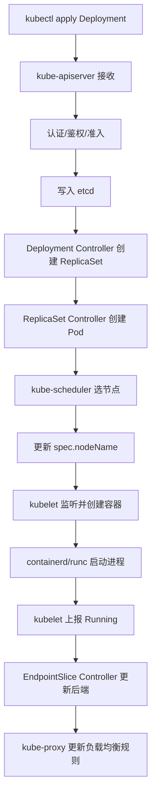
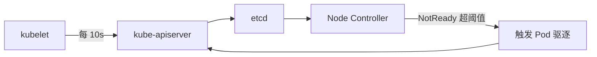

> [!warning] 生产安全提示 · Production Safety
> 本文档含可执行命令/操作步骤。执行前请核对风险等级（🟢低/🔶中/🔴高），高危命令必须 dry-run 并确认回滚方案。完整策略见 [生产安全策略](治理/Production_Safety_Policy.md)。
<!-- op-safety-banner v1 -->

# Kubernetes 核心组件深度解析

> **一句话理解**: Kubernetes 是一套以声明式 API 为核心的分布式操作系统，控制平面组件负责"决策与记忆"，节点组件负责"执行与汇报"——工单里 80% 的异常都可归因到这两类组件的通信、状态或资源故障。

> 📐 **概念方法论**: 排查 K8s 问题遵循"控制平面 → 节点 → 网络 → 存储"的分层思路。先确认 `kube-apiserver` 和 `etcd` 健康，再看 `kubelet` 与容器运行时，最后定位 CNI / CSI / 业务容器。阿里云专有云场景下，还要叠加 飞天企业版 Apsara Stack、天基 Tianji、洛神 Luoshen、神龙 X-Dragon 等基础设施层的映射关系。

---

## 目录

1. [控制平面组件](#1-控制平面组件)
2. [节点组件](#2-节点组件)
3. [组件交互链路](#3-组件交互链路)
4. [常见故障与排查](#4-常见故障与排查)
5. [阿里云专有云关联](#5-阿里云专有云关联)
6. [Related](#related)

---

## 1. 控制平面组件

控制平面（Control Plane）是 K8s 的大脑，负责维护集群期望状态并通过 etcd 持久化。生产环境通常多副本高可用部署。

### 1.1 kube-apiserver —— 统一入口

`kube-apiserver` 是 K8s 唯一的 RESTful API 入口，所有组件（kubectl、controller、scheduler、kubelet）都通过它读写资源。

| 职责 | 说明 |
|------|------|
| API 统一入口 | 所有资源操作必经之地 |
| 认证鉴权准入 | Authentication → Authorization → Admission Control |
| 状态校验持久化 | 合法请求写入 etcd，返回 watch 事件 |
| 版本化与聚合 | 多 API 版本、CRD、API Aggregation |

**关键配置示例**:

```yaml
# /etc/kubernetes/manifests/kube-apiserver.yaml 节选
command:
  - kube-apiserver
  - --advertise-address=192.168.1.10
  - --etcd-servers=https://192.168.1.10:2379,https://192.168.1.11:2379,https://192.168.1.12:2379
  - --client-ca-file=/etc/kubernetes/pki/ca.crt
  - --authorization-mode=Node,RBAC
  - --enable-admission-plugins=NodeRestriction,LimitRanger,ResourceQuota,PodSecurity
  - --audit-log-path=/var/log/kubernetes/audit/audit.log
```

**排查命令**:

```bash
kubectl get pods -n kube-system -l component=kube-apiserver
kubectl logs -n kube-system kube-apiserver-<master-node> --tail=200
openssl x509 -in /etc/kubernetes/pki/apiserver.crt -noout -dates
kubectl get --raw /healthz
kubectl get --raw /readyz
```

### 1.2 etcd —— 分布式状态存储

`etcd` 是 K8s 唯一持久化存储，保存所有资源对象、事件和元数据，基于 Raft 协议保证一致性。

- Key 前缀: `/registry/<资源类型>/<命名空间>/<资源名>`
- 例如: `/registry/pods/default/nginx-xxx`
- 必须定期 snapshot 备份，关注数据库大小与碎片率

**排查命令**:

```bash
# 查看成员与健康
kubectl exec -it etcd-master-01 -n kube-system -- etcdctl \
  --endpoints=https://127.0.0.1:2379 \
  --cacert=/etc/kubernetes/pki/etcd/ca.crt \
  --cert=/etc/kubernetes/pki/etcd/healthcheck-client.crt \
  --key=/etc/kubernetes/pki/etcd/healthcheck-client.key \
  member list -w table

kubectl exec -it etcd-master-01 -n kube-system -- etcdctl \
  --endpoints=https://127.0.0.1:2379 \
  --cacert=/etc/kubernetes/pki/etcd/ca.crt \
  --cert=/etc/kubernetes/pki/etcd/healthcheck-client.crt \
  --key=/etc/kubernetes/pki/etcd/healthcheck-client.key \
  endpoint health

# 备份
etcdctl snapshot save /var/backups/etcd-snapshot-$(date +%Y%m%d-%H%M%S).db
```

### 1.3 kube-scheduler —— 调度决策

`kube-scheduler` 负责把未绑定节点的 Pod 调度到合适 Node 上。只负责决策，绑定动作通过 apiserver 写入 etcd。

- **Predicates（过滤）**: 硬约束，如资源、污点容忍、节点亲和、PV 拓扑
- **Priorities（打分）**: 软约束，如资源均衡、镜像本地性、Pod 反亲和

**排查命令**:

```bash
kubectl logs -n kube-system kube-scheduler-<master-node>
kubectl describe pod <pod-name> -n <namespace> | grep -A 20 Events
kubectl describe node <node-name> | grep -A 5 "Allocated resources"
kubectl get node <node-name> -o yaml | grep -A 10 taints
```

### 1.4 kube-controller-manager —— 状态收敛

运行多个内置控制器，持续把实际状态接近期望状态。

| 控制器 | 职责 |
|--------|------|
| Deployment Controller | 滚动更新与回滚 |
| ReplicaSet Controller | 保证 Pod 副本数 |
| Node Controller | 监控节点健康，触发 Pod 驱逐 |
| EndpointSlice Controller | 维护 Service 后端列表 |
| ServiceAccount Controller | 自动创建 default SA/Token |
| PersistentVolume Controller | PVC/PV 绑定与回收 |
| Job/CronJob Controller | 批处理任务生命周期 |

**排查命令**:

```bash
kubectl logs -n kube-system kube-controller-manager-<master-node>
kubectl get endpoints -n kube-system kube-controller-manager -o yaml
kubectl describe deployment <name> -n <namespace>
kubectl get events --field-selector reason=TaintManagerEviction
```

### 1.5 cloud-controller-manager —— 云厂商控制逻辑

可选组件，负责把集群状态同步到云平台。在 飞天企业版 Apsara Stack 中，它对接 OpenAPI，管理 SLB、路由、节点生命周期。

| 控制器 | 职责 |
|--------|------|
| Node Controller | 从云平台读取节点信息，初始化 Node 对象 |
| Route Controller | 为 Pod CIDR 配置云网络路由 |
| Service Controller | 为 LoadBalancer Service 创建/删除 SLB |

**排查命令**:

```bash
kubectl get pods -n kube-system -l component=cloud-controller-manager
kubectl logs -n kube-system cloud-controller-manager-<node>
kubectl describe svc <svc-name> -n <namespace>
kubectl get node <node-name> -o jsonpath='{.spec.providerID}'
```

---

## 2. 节点组件

节点组件运行在每个 Worker 节点上，执行控制平面指令并维护本地容器与网络。

### 2.1 kubelet —— 节点代理

`kubelet` 是节点核心代理，负责 Pod 生命周期、健康检查、资源监控、状态上报、卷与镜像管理。

```
kubelet --CRI gRPC--> containerd --runC/crun--> 容器进程
```

**关键配置**:

```yaml
kind: KubeletConfiguration
apiVersion: kubelet.config.k8s.io/v1beta1
address: 0.0.0.0
port: 10250
readOnlyPort: 0
cgroupDriver: systemd
clusterDNS:
  - 10.96.0.10
clusterDomain: cluster.local
authentication:
  anonymous: { enabled: false }
  webhook: { enabled: true }
  x509:
    clientCAFile: /etc/kubernetes/pki/ca.crt
authorization:
  mode: Webhook
```

**排查命令**:

```bash
systemctl status kubelet
journalctl -u kubelet -f -n 500
kubectl describe node <node-name>
kubectl get node <node-name> -o jsonpath='{.status.conditions}'
```

### 2.2 kube-proxy —— 服务代理

运行在每个节点上，把 Service ClusterIP 映射到后端 Pod，实现服务发现与负载均衡。

| 模式 | 机制 | 适用场景 |
|------|------|----------|
| iptables | iptables NAT 规则 | 中小规模，默认 |
| ipvs | 内核 IPVS 模块 | 大规模高并发 |
| nftables | 基于 nftables | K8s 1.31+ |

**排查命令**:

```bash
kubectl get pods -n kube-system -l k8s-app=kube-proxy
kubectl logs -n kube-system kube-proxy-<node>
kubectl get configmap kube-proxy -n kube-system -o yaml | grep mode
iptables -t nat -L KUBE-SERVICES -n | head
ipvsadm -Ln
```

### 2.3 Container Runtime —— 容器运行底层

K8s 通过 CRI 与容器运行时交互，主流为 containerd。

| 组件 | 职责 |
|------|------|
| containerd daemon | 接收 CRI 请求，管理镜像、容器、任务 |
| runc/crun | OCI 运行时，创建容器进程 |
| snapshotter | 管理文件系统层（默认 overlayfs） |
| CRI plugin | 把 CRI 请求翻译为 containerd 内部 API |

**排查命令**:

```bash
systemctl status containerd
journalctl -u containerd -f -n 300
crictl ps -a
crictl pods
crictl logs <container-id>
ctr -n k8s.io images list | head
```

**crictl 配置**:

```yaml
# /etc/crictl.yaml
runtime-endpoint: unix:///run/containerd/containerd.sock
image-endpoint: unix:///run/containerd/containerd.sock
timeout: 10
debug: false
```

---

## 3. 组件交互链路

### 3.1 Pod 创建到运行



### 3.2 Pod 删除链路

```mermaid
flowchart TD
    A[kubectl delete pod] --> B[apiserver 设置 DeletionTimestamp]  # ⚠️ HIGH-RISK — 删除 K8s 资源，服务可能中断 [回滚：见文档/备份]
    B --> C[etcd 更新]
    C --> D[kubelet 收到删除事件]
    D --> E[发送 SIGTERM]
    E --> F[等待 gracePeriod]
    F -->|成功| G[containerd 删除容器]
    F -->|超时| H[发送 SIGKILL]
    H --> G
    G --> I[apiserver 删除 Pod 对象]
```

### 3.3 节点状态上报



---

## 4. 常见故障与排查

### 4.1 控制平面

| 症状 | 可能原因 | 排查命令 |
|------|----------|----------|
| kubectl 超时 | apiserver 不可用、证书过期、网络中断 | `kubectl cluster-info`、 `kubectl get --raw /healthz`、 `openssl x509 -in /etc/kubernetes/pki/apiserver.crt -noout -dates` |
| Pod 状态不更新 | controller-manager 异常、Leader 选举失败 | `kubectl logs kube-controller-manager-*`、`kubectl get endpoints kube-controller-manager` |
| 集群操作卡顿 | etcd IO 延迟高、数据库过大 | `etcdctl endpoint status`、`iostat -x 1` |
| apiserver 403 | RBAC 错误、Token 失效 | `kubectl auth can-i --as=system:serviceaccount:<ns>:<sa> <verb> <resource>` |
| 准入拒绝 | Webhook 不可用、Quota 不足 | `kubectl describe <resource>`、 `kubectl get mutatingwebhookconfigurations` |

### 4.2 调度

| 症状 | 可能原因 | 排查命令 |
|------|----------|----------|
| Pod 长期 Pending | 资源不足、污点不匹配、亲和性过强、PVC 未绑定 | `kubectl describe pod`、 `kubectl describe node` |
| 调度到错误节点 | nodeSelector/affinity/tolerations 错误 | `kubectl get pod -o yaml`、检查节点 labels |
| 负载不均衡 | 打分策略不合适、污点不均 | 查看 scheduler 日志、KubeSchedulerConfiguration |

### 4.3 节点与运行时

| 症状 | 可能原因 | 排查命令 |
|------|----------|----------|
| Node NotReady | kubelet 停止、运行时异常、PLEG 不健康、磁盘压力 | `systemctl status kubelet`、`journalctl -u kubelet`、`kubectl describe node` |
| ContainerCreating | 镜像拉取失败、CNI 未就绪、Volume 挂载失败 | `kubectl describe pod`、`crictl ps -a` |
| ImagePullBackOff | 镜像不存在、仓库无权限、网络不通 | `kubectl describe pod`、手动 `crictl pull` |
| CrashLoopBackOff | 启动命令错误、依赖缺失、OOMKilled | `kubectl logs --previous`、检查 limits |
| 退出码 137 | OOMKilled 或 SIGKILL | `kubectl describe pod` 看 Last State |
| 退出码 1/2 | 应用启动失败或 panic | `kubectl logs` |

### 4.4 网络

| 症状 | 可能原因 | 排查命令 |
|------|----------|----------|
| Service 无法访问 | kube-proxy 异常、EndpointSlice 为空、规则缺失 | `kubectl get endpoints`、 `ipvsadm -Ln` |
| 跨节点不通 | CNI 异常、路由缺失、安全组拦截 | 检查 CNI Pod 日志、ping 跨节点 Pod IP |
| DNS 解析失败 | CoreDNS 异常、Service 配置错误 | `kubectl get pods -n kube-system -l k8s-app=kube-dns`、 `nslookup kubernetes.default` |
| LoadBalancer 无 IP | cloud-controller-manager 异常、SLB 配额不足 | `kubectl describe svc`、CCM 日志 |

### 4.5 存储

| 症状 | 可能原因 | 排查命令 |
|------|----------|----------|
| PVC 长期 Pending | StorageClass 不存在、CSI 未就绪、后端无资源 | `kubectl describe pvc`、`kubectl get sc`、CSI Pod 日志 |
| 挂载失败 | PV 拓扑不匹配、NFS/iSCSI 网络不通 | `kubectl describe pod`、节点 `/var/log/messages` |
| 写入失败 | 文件系统只读、权限不足、后端故障 | 容器内 `df -h`/`touch`、CSI 日志 |

### 4.6 快速巡检脚本

```bash
#!/bin/bash
# k8s-health-check.sh

echo "=== 1. 节点状态 ==="
kubectl get nodes -o wide

echo "=== 2. 控制平面 Pod ==="
kubectl get pods -n kube-system

echo "=== 3. 告警事件 ==="
kubectl get events -A --field-selector type=Warning --sort-by='.lastTimestamp' | tail -30

echo "=== 4. 非 Running Pod ==="
kubectl get pods -A --field-selector status.phase!=Running,status.phase!=Succeeded

echo "=== 5. etcd 健康 ==="
kubectl exec -it etcd-master-01 -n kube-system -- etcdctl \
  --endpoints=https://127.0.0.1:2379 \
  --cacert=/etc/kubernetes/pki/etcd/ca.crt \
  --cert=/etc/kubernetes/pki/etcd/healthcheck-client.crt \
  --key=/etc/kubernetes/pki/etcd/healthcheck-client.key \
  endpoint health

echo "=== 6. 组件健康 ==="
kubectl get --raw /healthz
kubectl get --raw /readyz
```

---

## 5. 阿里云专有云关联

### 5.1 产品形态

| 产品 | 定位 | 组件管理特点 |
|------|------|--------------|
| 容器服务 ACK 专有版 | 企业级容器平台，独立部署在客户数据中心 | 控制平面由 Tianji 编排，多 AZ 高可用，对接 洛神 Luoshen 网络与 盘古 Pangu 存储 |
| 容器服务 ACK 敏捷版 | 轻量级容器平台，适配边缘/小型化场景 | 轻量部署，常与 神龙 X-Dragon 裸金属或虚拟机集成 |

### 5.2 控制平面映射

| K8s 组件 | 专有云映射 | 工单关注点 |
|----------|-----------|------------|
| kube-apiserver | Master 节点静态 Pod，Tianji 管生命周期与证书轮换 | 证书过期、Tianji Agent 异常、ASCM 控制台无法操作 |
| etcd | 3 节点高可用，数据盘建议本地 SSD 或 盘古 Pangu 高性能云盘 | IO 延迟、数据库膨胀、快照备份 |
| kube-scheduler / kube-controller-manager | 静态 Pod，Tianji 监控 | Leader 选举、调度异常、节点驱逐 |
| cloud-controller-manager | 对接 Apsara Stack OpenAPI，管理 SLB/路由/节点元数据 | LoadBalancer 无 IP、ProviderID 缺失、路由不可达 |

### 5.3 节点组件映射

| K8s 组件 | 专有云映射 | 工单关注点 |
|----------|-----------|------------|
| kubelet | Worker 节点（虚拟机或 神龙 X-Dragon 裸金属） | NotReady、PLEG 不健康、资源上报异常 |
| kube-proxy | iptables/ipvs 模式 | Service 访问异常、NodePort 不通 |
| container runtime | 通常 containerd，镜像对接 ACR 专有云版 | 镜像拉取失败、运行时崩溃、sandbox 镜像缺失 |
| CNI | 洛神 Luoshen VPC / Terway | Pod IP 分配失败、跨节点通信异常、安全组拦截 |
| CSI | 盘古 Pangu 云盘 / NAS 专有云版 | PVC 绑定失败、挂载超时、快照异常 |

### 5.4 天基 Tianji 与 ASCM

- **天基 Tianji**: 飞天企业版 Apsara Stack 运维底盘，负责部署、监控、告警、升级。K8s 静态 Pod、证书、系统组件多由 Tianji 托管。
- **ASCM**: 专有云云管平台，提供控制台、租户、配额、监控大盘。工单常通过 ASCM 查看集群列表、节点状态、告警事件。

**典型排障路径**:

```
用户报障: ACK 专有版某节点 NotReady
    │
    ▼
1. ASCM 控制台查看节点状态与告警
    ▼
2. Master 节点检查 apiserver / controller-manager / scheduler 日志
    ▼
3. 异常 Worker 检查 kubelet / containerd / Tianji Agent
    ▼
4. 检查 洛神 Luoshen 网络（安全组、VPC 路由、VSwitch）
    ▼
5. 检查 盘古 Pangu 存储挂载状态
    ▼
6. 必要时在 Tianji 发起组件重启或节点替换
```

### 5.5 神龙 X-Dragon

**神龙 X-Dragon** 是阿里云自研弹性裸金属服务器，在 ACK 中常用于 GPU 训练/推理、高性能计算、容器专属宿主机。

工单中还需确认：
- 神龙 MOC 或相关 Agent 是否健康
- 洛神 Luoshen 弹性网卡是否正确挂载
- 热升级、固件、驱动版本是否与 ACK 版本匹配

### 5.6 洛神 Luoshen 与容器网络

| 模式 | 特点 | 场景 |
|------|------|------|
| Flannel/Calico Overlay | VXLAN/IPIP Overlay | 简单网络，不要求强 VPC 互通 |
| Terway | 阿里云自研 CNI，Pod 直接挂 洛神 Luoshen ENI | 高性能、低延迟、Pod 与 VPC 直接互通 |

Terway 问题排查:

```bash
kubectl get pods -n kube-system -l app=terway
kubectl logs -n kube-system terway-<node>
kubectl get node <node-name> -o yaml | grep -A 20 allocatable
```

### 5.7 盘古 Pangu 与 CSI

| 存储类型 | CSI 插件 | 用途 |
|----------|----------|------|
| 盘古云盘 | diskplugin.csi.alibabacloud.com | 数据库、有状态应用 |
| 盘古 NAS | nasplugin.csi.alibabacloud.com | 共享文件存储 |
| OSS | ossplugin.csi.alibabacloud.com | 对象存储、大数据 |

```bash
kubectl get pods -n kube-system -l app=csi-plugin
kubectl get sc
kubectl get pvc,pv -n <namespace>
kubectl logs -n kube-system csi-plugin-<node> -c csi-plugin
```

### 5.8 女娲 Nüwa

**女娲 Nüwa** 是阿里云自研分布式一致性服务，部分专有云产品会用它替代或补充 etcd。若遇到 apiserver 读取延迟、多 Master 状态不一致、升级后配置未同步，应检查女娲服务状态。

### 5.9 专有云运维 Checklist

```markdown
- [ ] ASCM 确认集群版本、节点数量、告警事件
- [ ] 检查 Tianji Agent 心跳上报
- [ ] 检查 Master 静态 Pod 状态
- [ ] 检查 Worker kubelet / containerd / kube-proxy
- [ ] 检查 洛神 Luoshen 网络（安全组、VSwitch、路由、ENI）
- [ ] 检查 盘古 Pangu 存储（云盘、NAS、CSI 插件）
- [ ] 检查 CCM / Terway / CSI 等专有云插件日志
- [ ] 检查证书有效期，必要时 Tianji 触发轮换
- [ ] 重大操作前对 etcd 做 snapshot 备份
```

---

## Related

- [[架构基建/AI_Stack/AI_Stack_K8s_Operations_Guide|AI Stack K8s 编排指南]] — AI Stack 场景下的 kubectl / helm 实践
- [[架构基建/CNCF_Cloud_Native_AI/kagent_Deep_Dive|kagent Deep Dive]] — Kubernetes 原生 DevOps AI Agent 框架
- [[架构基建/Architecture_Infrastructure_for_dummy|架构基础设施入门]] — 面向初学者的基础设施概念
- [[架构基建/Architecture-in-nutshell|架构基础设施精要]] — 架构与基础设施核心知识速览
- [[架构基建/Hardware_Compute/CDI_Deep_Dive|CDI: 容器设备接口标准]] — 容器化设备挂载规范
- [[架构基建/Hardware_Compute/DRA_Deep_Dive|DRA: 动态资源分配]] — K8s 动态资源调度机制
- [[运维/AI_Ops_2026|AI Ops 2026: 智能运维体系与实践]] — AI 驱动的运维体系
- [[clusterrole]]
- [[clusterrolebinding]]
- [[role]]
- [[rolebinding]]
- [[label]]
- [[annotation]]
- [[selector]]
- [[daemonset]]
- [[vertical-pod-autoscaler]]
- [[pod-security-standards]]
- [[trivy]]
