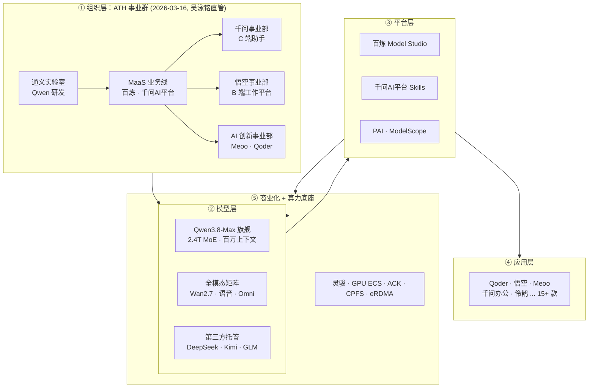

# 阿里云大模型产品全景 (Alibaba Cloud LLM Product Landscape)

> 中文简称：阿里云大模型产品全景

> **一句话理解**: 把阿里巴巴所有和 AI 大模型有关的家底摆在一张桌上——谁在研究模型、谁在卖模型、谁在用模型、能卖给客户什么方案，全部一张图说清。

---

## 一、阿里 AI 版图总览（五层框架）

面试时先讲框架再讲细节。阿里 AI 全栈可按五层理解，层层递进：

> ATH 的核心逻辑是"创造 Token（通义实验室）、输送 Token（MaaS 业务线）、应用 Token（三大事业部）"——这是阿里 AI 战略的顶层架构，面试从这讲起最能体现架构思维。

---

## 二、阿里巴巴 AI 全资源清单

### 模型层（Token 的创造）

| 模型 | 类型 | 关键参数/能力 |
|------|------|---------------|
| Qwen3.8-Max | 闭源旗舰 | 2.4T MoE（95B 激活）、百万上下文、长视频理解、自主编程 |
| Qwen3.7-Plus / Max | 闭源 | 企业级通用、Hybrid Thinking 混合思维 |
| Qwen3.6-Flash | 闭源轻量 | 高吞吐低成本 |
| Qwen3.5-Omni-Flash | 全模态 | 图文音视频统一输入 |
| Qwen3.5-LiveTranslate | 同传 | 听懂 60 种语言、会说 29 种 |
| Qwen-Image-3.0-Pro | 图像 | 专业级文生图/图生图 |
| Wan2.7-T2V / R2V | 视频 | 分钟级文生视频、参考图生视频 |
| HappyHorse-1.1-T2V / I2V | 视频 | 快速生成、风格化 |
| Qwen3-TTS / CosyVoice-V3 / Fun-ASR | 语音 | 合成、情感语音、实时识别 |
| Qwen3.8-2.4T-A95B 等开源系列 | 开源 | 8B → 2.4T 全尺寸，ModelScope 分发 |
| DeepSeek-V4-Pro / Kimi-K3 / GLM-5.2 / MiniMax | 第三方托管 | 百炼"模型超市"模式 |

### 平台层（Token 的输送）

| 平台 | 定位 | 核心能力 |
|------|------|----------|
| 百炼 Model Studio | 企业级 MaaS | API、RAG、Agent 编排、微调、第三方模型托管 |
| 千问AI平台 | Agent 原生 MaaS | Skills 技能包、CLI 生态（npx skills add） |
| PAI | AI 工程平台 | DSW 开发 / DLC 训练 / EAS 推理 |
| ModelScope 魔搭 | 开源社区 | 模型分发、数据集、Demo |
| AI Stack | 专有云一体机 | 私有化部署、训推一体 |

### 应用层（Token 的应用）

| 应用 | 归属 | 定位 |
|------|------|------|
| 千问 App | 千问事业部 | C 端 AI 助手，Token Plan 入口 |
| Qoder | AI 创新事业部 | 智能体编程平台 |
| 悟空 | 悟空事业部 | B 端 AI 工作平台（钉钉生态） |
| 秒悟 Meoo | AI 创新事业部 | AI 原生应用无代码构建 |
| 千问办公 QwenWork | 千问事业部 | AI 办公套件 |
| 伶鹊 | MaaS 关联 | 智能客服 |
| 通义灵码 | 阿里云 | 智能编码助手（智能体模式） |
| 通义听悟 | 阿里云 | 音视频转写、会议纪要 |
| 通义万相 | 通义实验室 | 视觉生成（Wan 产品化） |
| 通义星尘 | 阿里云 | 角色对话智能体 + 数字人 |
| 通义晓蜜 | 阿里云 | 智能客服（CCAI）/对话分析 |
| 全妙 / 万小智 / QwenPaw / 万有无界 | AI 创新/千问 | 视频创作、轻量智能体、跨端助手、沉浸式多智能体 |

### 算力与商业化

| 类别 | 产品/计划 | 说明 |
|------|-----------|------|
| 算力 | 灵骏智算 / GPU ECS / ACK / CPFS / eRDMA | 训练集群、弹性推理、容器、高速存储、RDMA 网络 |
| 商业化 | Token Plan（39/139/499 元/月） | C 端订阅制 |
| 商业化 | Night Plan（夜间 2-5 折） | 消化闲置算力 |
| 商业化 | OPC 计划（百万 Token 补贴） | 抢夺开发者生态 |

---

## 三、客户架构方案地图（面试核心武器）

以下 10 大方案是给客户讲"阿里能帮你做什么"的标准武器，每个都有独立文档：

| # | 方案 | 核心组件 | 适用客户 | 文档 |
|---|------|----------|----------|------|
| 1 | 大模型训练平台 | 灵骏 + PAI DLC + CPFS + eRDMA | 需要自训/大规模微调 | [11_架构方案_大模型训练平台](./架构方案/11_架构方案_大模型训练平台.md) |
| 2 | 大模型推理服务 | GPU ECS + ACK + vLLM + EAS + 网关 | 生产推理、高并发 | [12_架构方案_大模型推理服务](./架构方案/12_架构方案_大模型推理服务.md) |
| 3 | 企业知识库 RAG | 百炼 + 向量库 + 混合检索 + Rerank | 知识密集型企业 | [13_架构方案_企业知识库RAG](./架构方案/13_架构方案_企业知识库RAG.md) |
| 4 | Agent 智能体平台 | 千问AI平台 + Skills + MCP + 治理 | 运维/客服/流程自动化 | [14_架构方案_Agent智能体平台](./架构方案/14_架构方案_Agent智能体平台.md) |
| 5 | 智能客服 | 晓蜜/伶鹊 + RAG + 工单 + 人工接管 | 客服团队 | [15_架构方案_智能客服](./架构方案/15_架构方案_智能客服.md) |
| 6 | 私有化部署 | AI Stack 一体机 + 百炼专属版 + 开源模型 | 金融/政务/涉密 | [16_架构方案_私有化部署](./架构方案/16_架构方案_私有化部署.md) |
| 7 | 多模态内容生成 | 万相/Wan + 听悟 + 星尘 + 语音矩阵 | 营销/会议/直播 | [17_架构方案_多模态内容生成](./架构方案/17_架构方案_多模态内容生成.md) |
| 8 | 模型微调与行业定制 | PAI + LoRA/QLoRA + 评估体系 | 行业术语/风格对齐 | [18_架构方案_模型微调与行业定制](./架构方案/18_架构方案_模型微调与行业定制.md) |
| 9 | AI 安全与合规 | 内容安全 + 安全护栏 + 隐私计算 + 合规框架 | 金融/政务/出海 | [19_架构方案_AI安全与合规](./架构方案/19_架构方案_AI安全与合规.md) |
| 10 | 边缘推理与全球化 | ENS + GA + 模型压缩 + 云边端三级架构 | IoT/全球 SaaS/工厂 | [20_架构方案_边缘推理与全球化](./架构方案/20_架构方案_边缘推理与全球化.md) |

**方案组合打法（面试加分）**：

- 客服客户 = 方案 5 + 3（RAG）+ 2（推理底座）
- 政企客户 = 方案 6 + 1（私有化训练）+ 3
- 运维智能化 = 方案 4 + 2 + 可观测性（对标用户自身 SRE 背景）
- 出海客户 = 方案 10（全球化）+ 9（合规）+ 2（多地域推理）

---

## 四、面试认知框架

### 1. 组织即架构

| 层次 | 对应产品 | 一句话 |
|------|----------|--------|
| 战略 | ATH 事业群（2026-03-16） | Token 全生命周期管理 |
| 演变 | Token Foundry（2026-06-08） | 模型生产 + 前沿探索合并，周靖人转首席科学家 |
| 平行 | 阿里云智能 | 卖铲子（算力），ATH 挖金子（模型）——互为飞轮 |

### 2. 竞争格局

| 对手 | 阿里应对 |
|------|----------|
| OpenAI / Claude | Qwen3.8-Max 旗舰对标 + 价格优势 |
| DeepSeek | 开源全家桶 + Night Plan 低价策略 |
| 豆包 / 文心 | 千问 App + Token Plan 订阅 |
| AWS Bedrock | 百炼第三方模型托管双轨模式 |

### 3. 商业模式

- C 端：Token Plan 订阅（39/139/499 元/月）
- B 端：API 按量计费 + 私有化整单
- 开发者：OPC 补贴 + Skills 生态
- 算力侧：Night Plan 夜间折扣消化闲置 GPU

### 4. 与目标岗位的关联（面试自述角度）

- **大模型架构师**：五层框架 + 8 大方案 = 完整的方案设计能力证明
- **AI Infra SRE**：方案 1/2/6 的算力与部署细节 = 深度的基础设施认知
- **Agent 平台工程师**：方案 4 的 Skills/MCP/治理 = 与自身运维智能体经验强关联

---

## 五、文档导航（全部展开）

| 文档 | 内容 | 适用读者 |
|------|------|----------|
| [05_ATH_事业群与组织架构](./产品/05_ATH_事业群与组织架构.md) | ATH 五大事业部、Token Foundry 演变、组织逻辑 | 架构师、战略分析 |
| [06_Qwen模型家族_2026](./产品/06_Qwen模型家族_2026.md) | Qwen3.8-Max、全模态矩阵、开源系列、第三方托管 | 模型选型、应用开发 |
| [07_MaaS平台_百炼与千问AI平台](./产品/07_MaaS平台_百炼与千问AI平台.md) | 百炼、千问AI平台 Skills/CLI、PAI、ModelScope | 平台工程师、Agent 开发者 |
| [08_AI原生应用矩阵](./产品/08_AI原生应用矩阵.md) | Qoder、悟空、秒悟、千问办公、伶鹊等 15+ 款 | 产品经理、架构师 |
| [09_Token经济与商业化](./产品/09_Token经济与商业化.md) | Token Plan、Night Plan、OPC、API 计费 | 架构师、成本分析 |
| [10_算力与基础设施](./产品/10_算力与基础设施.md) | 灵骏、GPU ECS、ACK、CPFS、eRDMA | 基础设施工程师、SRE |
| [11_平头哥_自研芯片与AI加速](./产品/11_平头哥_自研芯片与AI加速.md) | 含光/倚天/玄铁/真武 PPU + SAIL 软件栈 | 芯片架构、硬件选型 |
| [12_数据平台_与AI数据工程](./产品/12_数据平台_与AI数据工程.md) | MaxCompute + DataWorks + Hologres + PAI-FeatureStore | 数据工程师、ML 工程师 |
| 11-18 架构方案（见下方方案地图） | 8 大客户方案完整展开 | 面试/售前 |

### 专有云系列（历史沉淀）

| 文档 | 内容 |
|------|------|
| [01_阿里云_AI技术栈_深入分析](./专有云/01_阿里云_AI技术栈_深入分析.md) | 专有云 AI Stack 三层架构 |
| [02_阿里云_专有云_索引](./专有云/02_阿里云_专有云_索引.md) | 专有云 AI 基础设施实践 |
| [03_阿里云_专有云_K8s_上下文](./专有云/03_阿里云_专有云_K8s_上下文.md) | ACK 架构、ASCM、天基、GPU 调度 |
| [04_阿里云_PAI_深入分析](./专有云/04_阿里云_PAI_深入分析.md) | PAI-DSW/DLC/EAS 深度解析 |

---

## Related

- [[12_架构基建/06_云厂商/AWS/01_AWS_Bedrock_深入分析|AWS Bedrock 深度解析]] — 海外对标
- [[12_架构基建/06_云厂商/Google_Cloud/01_Google_Vertex_AI_深入分析|Google Vertex AI 深度解析]] — 海外对标
- [[05_大模型/14_中国LLM生态/19_Qwen_深入分析|Qwen 深入分析]] — 技术演进史
- [[12_架构基建/03_AI技术栈/02_AI技术栈_深入分析|阿里云 AI Stack 深入分析]] — 专有云平台
- [[12_架构基建/06_云厂商/index|云厂商索引]]

---

*Last updated: 2026-08-21*
