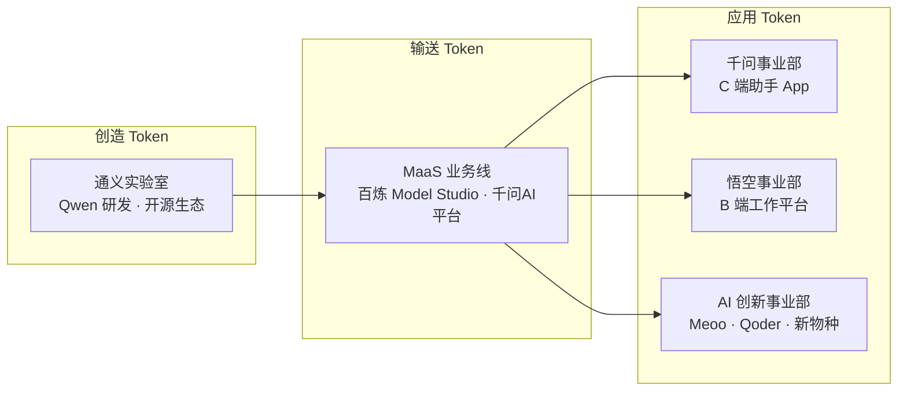

# ATH 事业群与组织架构 (Alibaba Token Hub)

> 中文简称：ATH 事业群

> **一句话理解**: 阿里把"造模型、卖模型、用模型"的人塞进一个叫 ATH 的新部门，相当于给大模型业务建了一个独立指挥部。

---

## 成立背景

**ATH（Alibaba Token Hub，阿里 Token 中心）事业群**成立于 **2026-03-16**，由阿里巴巴集团 CEO 吴泳铭直接分管，与阿里云智能事业群平行。这是阿里在大模型竞争白热化阶段的组织级回应——把散落在各事业部的 AI 能力收拢到一个垂直体系内，确保从模型研发到商业变现的决策链条最短。

**成立动因**：

| 动因 | 说明 |
|------|------|
| 竞争压力 | DeepSeek、字节豆包、腾讯混元在模型与 C 端市场的双重挤压 |
| 商业化提速 | Qwen 系列 API 调用量指数增长，需要专职商业团队 |
| 组织效率 | 此前模型研发在通义实验室、应用在各事业部，协同成本高 |
| 资本叙事 | 独立事业群 = 更清晰的估值单元与融资路径 |

---

## 组织逻辑：创造 Token、输送 Token、应用 Token

ATH 的组织设计围绕 Token 的完整生命周期展开，这是理解阿里大模型战略的核心框架：

> 三个环节层层递进：实验室造出最强模型，MaaS 平台把模型变成标准化的 Token 服务，三大事业部再把这些 Token 能力装进面向不同人群的产品里。

---

## 五大事业部详解

| 事业部 | 核心产品 | 定位 | 对标 |
|--------|----------|------|------|
| 通义实验室 | Qwen 系列模型、Wan 系列视频模型 | 基础模型研发（前沿 + 开源） | OpenAI 研究部门 |
| MaaS 业务线 | 百炼 Model Studio、千问AI平台 | 模型即服务：API、工具链、部署 | AWS Bedrock / Azure OpenAI |
| 千问事业部 | 千问 App（原通义 App） | C 端个人 AI 助手 | ChatGPT / 豆包 |
| 悟空事业部 | 悟空平台（wukong.dingtalk.com） | B 端 AI 工作平台，深度接入钉钉 | 飞书智能伙伴 / Microsoft 365 Copilot |
| AI 创新事业部 | 秒悟 Meoo、Qoder 等 | 孵化 AI 原生新应用 | 内部创新实验室 |

### 各事业部要点

- **通义实验室**：Qwen 家族的"母体"，同时承担开源生态运营（ModelScope 魔搭社区）。2026-08 发布 Qwen3.8-Max（2.4T 参数 MoE），是当前阿里最强的旗舰模型。
- **MaaS 业务线**：面向开发者和企业的商业化主出口。百炼（Model Studio）走企业级路线，千问AI平台（qianwenai.com）走"为 Agent 而生"的新路线（Skills 工具链 + CLI 生态）。
- **千问事业部**：C 端用户入口，承载订阅制商业化（Token Plan）。C 端助手 App 历经两次更名：通义千问 App（2023-10）→ 通义 App（2024-05）→ 千问 App（2025-11），当前统一为千问品牌。
- **悟空事业部**：企业工作场景的 AI 底座，与钉钉生态深度融合。
- **AI 创新事业部**：负责孵化下一代 AI 原生应用，秒悟（Meoo）、Qoder 均出自这里，是阿里的"第二曲线"试验田。

---

## Token Foundry：组织演变的新阶段

**Token Foundry 事业部**于 **2026-06-08** 由"通义大模型事业部 + 未来生活实验室"合并成立，仍由 CEO 直接管理。关键人事变化：**周靖人转任集团首席科学家**，原岗位由合并后的 Token Foundry 负责人接管。

| 时间线 | 事件 |
|--------|------|
| 2026-03-16 | ATH 事业群成立，五大事业部格局确立 |
| 2026-06-08 | 通义大模型事业部与未来生活实验室合并 → Token Foundry |
| 2026-06 起 | 周靖人任集团首席科学家，专注前沿研究 |

**演变解读**：从 ATH 到 Token Foundry 的调整，本质是阿里把"模型生产"与"前沿探索"分离——Token Foundry 专注模型工业化生产（大模型事业部的模型工程化能力），未来生活实验室的前沿研究并入后形成"研究 + 工程"闭环，而周靖人升任首席科学家意味着阿里对前沿技术路线的重视提升到集团层面。

---

## 与阿里云智能事业群的关系

ATH 与阿里云智能（公共云、专有云、飞天）是**平行事业群**，但业务深度耦合：

| 维度 | 阿里云智能 | ATH |
|------|-----------|-----|
| 核心 | 云计算基础设施（IaaS/PaaS） | 模型与 AI 应用（AI 全栈） |
| 交付物 | ECS、ACK、PAI、灵骏智算 | Qwen API、百炼、Qoder、悟空 |
| 协作模式 | 提供算力底座（GPU ECS、CPFS、eRDMA） | 消费算力，反向拉动云资源需求 |
| 关键人物 | 公共云与专有云团队 | 吴泳铭直管，五大事业部 |

> 架构师视角：阿里云智能是"卖铲子"的，ATH 是"挖金子"的——但两者互为增长飞轮：ATH 的模型需求拉动阿里云 GPU 消耗，阿里云的大规模算力又支撑 ATH 的模型训练与推理。

---

## Related

- [阿里云大模型产品全景](../README.md) — 四层产品地图总入口
- [[06_Qwen模型家族_2026|Qwen 模型家族 2026]] — 通义实验室的产出物
- [[07_MaaS平台_百炼与千问AI平台|MaaS 平台：百炼与千问AI平台]] — MaaS 业务线的双平台
- [[08_AI原生应用矩阵|AI 原生应用矩阵]] — 千问 / 悟空 / AI 创新三大事业部的产品
- [[12_架构基建/03_AI技术栈/02_AI技术栈_深入分析|阿里云 AI Stack 深入分析]] — 专有云侧的 AI 平台

---

*Last updated: 2026-08-21*
