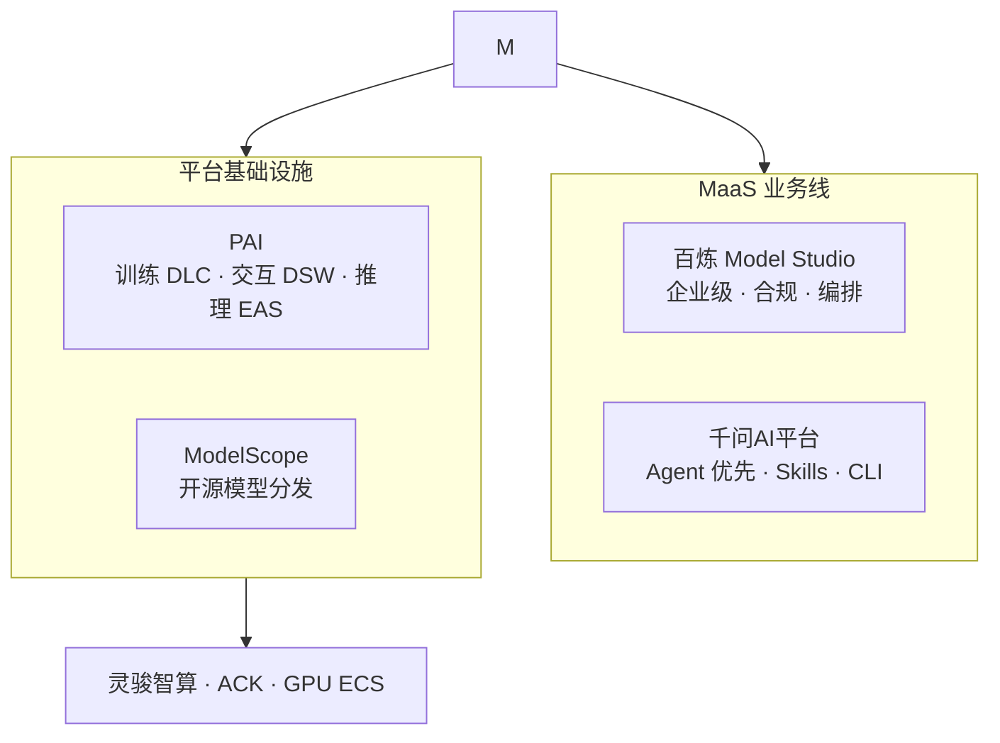

# MaaS 平台：百炼与千问AI平台 (Model Studio & Qianwen AI Platform)

> 中文简称：MaaS 平台

> **一句话理解**: 模型是发动机，平台是整车——百炼和千问AI平台负责把 Qwen 装成开发者和企业能直接开走的车。

---

## 平台层全景

MaaS 业务线运营着两个定位互补的平台，加上 PAI 与 ModelScope，构成阿里 AI 平台四件套：

| 平台 | 定位 | 目标用户 | 核心能力 |
|------|------|----------|----------|
| 百炼 Model Studio | 企业级模型托管与应用构建平台 | 企业、ISV、开发者 | 模型 API / 微调 / 部署 / 评测 / 应用构建 / RAG / MCP / CLI |
| 千问AI平台 | 为 Agent 而生的新 MaaS | Agent 开发者、个人开发者 | Skills 工具链、CLI、轻量接入 |
| PAI | 模型训练与推理平台 | AI 工程师、数据科学家 | DSW/DLC/EAS、灵骏算力 |
| ModelScope 魔搭 | 开源模型社区 | 研究者、开源爱好者 | 模型下载、Demo 体验、社区 |



> 百炼是"重型卡车"（企业级、合规、可编排），千问AI平台是"轻量跑车"（Agent 优先、即插即用）——两者共享同一批模型，但为不同场景设计。

---

## 百炼 Model Studio：完整功能清单

百炼（Model Studio）是阿里云的一站式大模型开发与应用平台，集成千问及主流第三方模型。面向开发者提供兼容 OpenAI 的 API 和全链路模型服务；面向业务人员提供可视化应用构建能力。完整功能矩阵如下：

### 一、模型服务（Model Services）

#### 1. 开箱即用的模型市场

| 模型类别 | 代表模型 | 用途 |
|---------|---------|------|
| **千问旗舰** | Qwen3.8-Max、Qwen3.7-Plus、Qwen3-Max | 复杂推理、Agent、编程 |
| **千问性价比** | Qwen3-Plus、Qwen3-Flash | 速度与成本均衡，多数场景首选 |
| **千问 VL** | Qwen3-VL-Plus | 视觉理解、空间感知、视频理解 |
| **千问语音** | Qwen3-TTS-Flash、Fun-ASR | 语音合成与识别 |
| **千问长文本** | Qwen3-Long | 百万 token 上下文 |
| **第三方旗舰** | DeepSeek-V4-Pro（MoE）、Kimi-K3、GLM-5.2 | 第三方顶级模型 |
| **细分领域** | 法律、翻译、意图理解、角色扮演、深入研究 | 行业垂直 |
| **多模态** | HappyHorse-1.1-T2V/I2V、Wan2.7-T2V | 视频生成 |

#### 2. 模型调优（Fine-tuning）

| 调优方式 | 适用场景 |
|---------|---------|
| **SFT（监督微调）** | 业务数据有标注，最常见的微调方式 |
| **CPT（继续预训练）** | 行业语料二次训练，让模型掌握领域语言 |
| **DPO（直接偏好优化）** | 偏好对齐，避免 RLHF 的复杂性 |
| **可视化微调** | 无需编写训练代码，UI 拖拽完成 |

#### 3. 模型部署（资源专享推理服务）

| 部署特性 | 说明 |
|---------|------|
| **资源专享** | 独立算力池，不与他人共享 |
| **按时长/包月/Token 量计费** | 灵活计费模式 |
| **高并发 / 低延迟** | 满足生产级 SLA |
| **自动扩缩容** | QPS 弹性伸缩 |

#### 4. 模型评测（Evaluation）

| 评测方式 | 适用场景 |
|---------|---------|
| **人工评测** | 关键样本的高质量反馈 |
| **自动评测** | 大批量回归测试 |
| **基线评测** | 与基线模型横向对比 |
| **评测体系** | 提前发现潜在调用风险 |

---

### 二、应用构建（Application Building）

#### 1. 应用类型

| 类型 | 描述 | 适用用户 |
|------|------|---------|
| **智能体应用（Agent 1.0）** | 可视化构建 AI 助手，单 Agent 处理客户咨询 | 业务人员 |
| **工作流应用** | 可视化流程编排，多步骤任务串联 | 业务人员 |
| **高代码应用** | Python 项目部署为后端服务，含自动化运维、可观测、日志 | 开发者 |

#### 2. 功能拓展

| 扩展能力 | 说明 |
|---------|------|
| **知识库（RAG）** | 接入私有数据和专业领域知识，支持文档/表格/图片/音视频多模态 |
| **插件（Plugin）** | 调用外部 API 与服务 |
| **MCP（模型上下文协议）** | 标准化外部工具调用协议 |
| **联网搜索** | Harness 工具，实时获取网络信息 |
| **长期记忆库** | 自动提取对话关键信息并持久化存储 |

#### 3. 应用分享与发布

| 发布渠道 | 说明 |
|---------|------|
| **网页应用** | 一键发布为可嵌入的网页组件 |
| **钉钉机器人** | 集成到企业钉钉 |
| **微信公众号** | 服务号对接 |
| **音视频互动智能体** | 实时音视频通话中的 AI 智能体 |

#### 4. 应用模板市场

提供丰富的预制 AI 应用模板，涵盖多种使用场景，助用户快速发现并复用成熟的 AI 解决方案。

---

### 三、百炼 CLI（命令行工具）

百炼 CLI（`bl` 命令）让 AI Agent 用一行命令调用阿里云百炼的全模态 AI 能力。

#### 1. 全模态原子能力

| 能力 | 代表模型 |
|------|---------|
| **文本生成** | qwen3.8-max（智能体时代旗舰） |
| **图像生成** | qwen-image-3.0（图片生成与编辑融合） |
| **图像编辑** | qwen-image-3.0（智能编辑，支持多图合成） |
| **视觉理解** | qwen3-vl-plus（视觉 coding、空间感知） |
| **语音生成** | cosyvoice-v3-flash（5-20s 样本即可克隆） |
| **语音识别** | fun-asr（覆盖 30 种语种） |
| **全模态** | qwen3.5-omni-plus（10h 音频与 400s 音视频） |
| **图生视频** | happyhorse-1.1-i2v |

#### 2. 知识库管理（Knowledge Studio CLI / `kscli`）

| 命令 | 功能 |
|------|------|
| `bl knowledge create/list/info/update/delete` | 知识库完整生命周期管理 |
| `bl knowledge doc upload/list/status/tag/delete` | 文档管理（支持 OSS 导入） |
| `bl knowledge service list/get/create/update/deploy/delete` | 检索/问答服务管理 |
| `bl knowledge chunk add/list/update/delete` | 文档切片管理 |
| `bl knowledge category list/add/delete` | 类目管理 |
| `bl knowledge collection create/get` | 数据集管理 |
| `bl knowledge search/chat` | 检索与问答（支持指定服务版本） |

#### 3. 兼容的 AI Agent 框架

| 编码 Agent | Agent 框架 | 其他 |
|-----------|-----------|------|
| Claude Code、Cursor、Qoder、Windsurf | LangChain、LangGraph、LlamaIndex | Dify、Coze、n8n |
| Cline、Aider、Continue、Cody | AutoGen、CrewAI、Semantic Kernel | MCP、FastGPT、LobeChat |
| GitHub Copilot、Qwen Code、OpenClaw | MetaGPT | OpenCode |

#### 4. Skill 技能体系

- **`bailian-web-search` 路由技能** — 让 Agent 自动选中正确的联网搜索入口
- **图片与视频生成 Skill** — 图像、视频生成的专用技能包
- **模型微调 Skill** — 微调任务的专用技能包
- **Managed Agent Skill** — 智能体部署的专用技能包
- **共享执行协议 Skill** — 通用执行逻辑的技能包

#### 5. Managed Agent Deployment

- `agents.yaml` 中声明的 `deployments` 会创建原生 AgentStudio 资源
- 支持服务端 Cron 调度、本地文件资源上传
- 通过 `destroy` 归档，下一次 `apply` 时迁移旧版模拟 Deployment state

---

### 四、计费套餐（Billing Plans）

#### 1. Agent Plan（个人/Agent 套餐）

| 套餐 | 价格 | 5h 额度 | 7d 额度 | 并发 Agent | 适用场景 |
|------|------|---------|---------|-----------|---------|
| **Lite** | ¥39/月 | 700 Credits | 2,500 Credits | 1-2 | 原型验证、轻度测试 |
| **Standard**（推荐） | ¥139/月 | 3,000 Credits | 10,000 Credits | 3-4 | 高频调用、多 Agent 并行 |
| **Pro** | ¥499/月 | 12,000 Credits | 40,000 Credits | 6-8 | 重度依赖、高并发、海量调用 |

#### 2. Token Plan（团队订阅）

| 版本 | 价格 | 说明 |
|------|------|------|
| 个人版 | 限时体验 | Qwen3.8-Max 首发尝鲜，限时加量 10 倍 |
| 团队版 | 谈判定价 | 不使用客户数据训练模型 |

#### 3. Coding Plan（AI 编码套餐）

- 固定月费，提供月度请求额度
- 专为 Claude Code、Cursor、Qoder 等编码工具设计
- 支持在 AI 编码工具中使用，无按量扣费风险
- 专属 Base URL 和 API Key

#### 4. 通用节省计划 + Night Plan

- **通用节省计划**：抵扣模型推理 Token 用量
- **Night Plan**：夜间 5 折，Qwen/Meoo/TokenPlan 客户专享，消化闲置 GPU

#### 5. 免费额度

- 新用户北京地域专属新人免费额度
- 可开启"免费额度用完即停"功能
- 80+ 产品免费试用，每个模型 100 万 token

---

### 五、管控与权限（Management）

| 能力 | 说明 |
|------|------|
| **多租户体系** | 业务空间管理、模型授权、限流管理 |
| **API Key 管理** | 创建、撤销、轮转 |
| **RAM 权限控制** | 与阿里云访问控制集成，细粒度授权 |
| **模型监控** | 调用量、Token 消耗、成功率统计 |
| **动态限流** | 按业务空间调整 RPM/TPM |
| **审计日志** | 全链路调用追溯 |

---

### 六、OpenAI 兼容与多地域

#### 1. OpenAI 兼容接口

```python
from openai import OpenAI
client = OpenAI(
    api_key=os.getenv("DASHSCOPE_API_KEY"),
    base_url="https://{WorkspaceId}.cn-beijing.maas.aliyuncs.com/compatible-mode/v1",
)
completion = client.chat.completions.create(
    model="qwen3.8-max",
    messages=[{"role": "user", "content": "你是谁？"}]
)
```

只需调整 API Key、base_url 和模型名称，即可将现有 OpenAI 代码迁移至百炼。

#### 2. 支持的地域

| 地域 | 控制台地址 |
|------|----------|
| 华北2（北京） | bailian.console.aliyun.com |
| 美国（弗吉尼亚） | modelstudio.console.aliyun.com/us-east-1 |
| 国际（新加坡） | modelstudio.console.aliyun.com |
| 德国（法兰克福） | modelstudio.console.aliyun.com/eu-central-1 |
| 日本（东京） | modelstudio.console.aliyun.com/ap-northeast-1 |

**注意**：不同地域的 API Key 不通用，Base URL 不同，支持的模型、价格、功能有差异。

---

### 七、典型场景

| 场景 | 使用的功能组合 |
|------|---------------|
| **电商主图批量生成** | 图像生成 + 应用模板 + 联网搜索 |
| **白底图转场景图** | 图像编辑 + 商品理解模型 |
| **IP 形象延展设计** | 图像生成 + 风格控制 |
| **企业客服机器人** | 智能体 + RAG + 人工接管 |
| **企业知识问答** | RAG + 工作流 + MCP 工具调用 |
| **AI 编码助手** | Coding Plan + Qwen Code/Cursor 集成 |
| **跨语种实时翻译** | qwen3.5-livetranslate + 流式响应 |
| **旅行讲解搭子** | 多模态套件 + 智能眼镜适配 |

---

## 千问AI平台：为 Agent 而生的新 MaaS

**千问AI平台（qianwenai.com）**是 ATH 时代的新物种——定位不再是"模型 API 市场"，而是 **Agent 操作系统**：

### Skills 工具链

| 能力 | 说明 |
|------|------|
| Skills 体系 | 结构化技能包（prompt + 工具定义 + 校验规则），可复用、可分享 |
| Skills 市场 | 社区共享技能，安装即用 |
| 与模型深度耦合 | Skills 是模型能力的外延，而非独立插件 |

### CLI 生态

```bash
# 安装千问AI平台部署工具链（官方示例）
npx skills add QianWen-AI/qwenai-deploy
```

- **命令行优先**：开发者从 IDE / 终端直接接入，符合 Agent 开发者的工作习惯
- **GitHub 生态集成**：Skills 通过 GitHub 仓库分发，天然复用开源协作流程
- **部署一体化**：CLI 管模型部署、Skills 管理、API 调用

### 与传统 MaaS 的差异

| 维度 | 传统 MaaS（百炼风格） | 千问AI平台 |
|------|----------------------|------------|
| 核心对象 | 模型 API | Agent + Skills |
| 开发者入口 | Web 控制台 | CLI / 代码 |
| 扩展方式 | 插件市场 | Skills 包（GitHub 分发） |
| 目标场景 | 企业应用集成 | Agent 应用开发 |
| 思维模型 | "调用模型" | "组装智能体" |

> 架构师视角：千问AI平台标志着 MaaS 从"模型调用"转向"能力组装"——未来的应用不再由开发者写死逻辑，而是由 Agent 按需装配 Skills 完成。这与 15_智能体 章节的 Agent 生态趋势完全同频。

---

## PAI：训练与推理平台

PAI（Platform for AI）是阿里云面向 AI 工程化的平台，详见 [[../专有云/04_阿里云_PAI_深入分析]]：

| 组件 | 全称 | 用途 |
|------|------|------|
| DSW | Data Science Workshop | 交互式开发环境（Notebook） |
| DLC | Deep Learning Container | 分布式训练任务 |
| EAS | Elastic Algorithm Service | 模型在线推理服务 |

PAI 与 ATH 模型体系的关系：百炼消费 PAI 的推理能力，PAI 消费灵骏智算的算力——三层递进。

---

## ModelScope 魔搭：开源生态入口

ModelScope 承担阿里开源战略的社区角色：

- 全球最大的中文开源模型社区之一
- Qwen 全系开源模型官方首发渠道
- 提供模型托管、数据集、训练微调 Demo 一条龙

---

## 平台选型指南

| 需求 | 选择 |
|------|------|
| 企业级合规部署 + 应用构建 | 百炼 Model Studio |
| 调用千问 API 做集成 | 百炼（兼容 OpenAI） |
| 开发 Agent 应用 + Skills | 千问AI平台 |
| 训练自有模型 | PAI DLC + 灵骏智算 |
| 体验开源模型 | ModelScope 魔搭 |
| 高吞吐推理服务 | PAI EAS / 百炼模型部署 |
| AI 编码工具接入 | 百炼 Coding Plan |
| 多模态创作（图像/视频/语音） | 百炼 CLI + 应用模板 |

---

## 面试要点

| 问题方向 | 关键回答点 |
|---------|-----------|
| **百炼 vs PAI** | 百炼是模型 API 与编排层（MaaS），PAI 是训练与底层算力层。百炼调用 PAI 的推理服务 |
| **百炼 vs 千问AI平台** | 百炼是企业级控制台优先（MaaS 经典），千问AI平台是 Agent 优先（CLI + Skills） |
| **RAG vs 微调** | RAG 适合知识更新频繁、不需要修改模型行为的场景；微调适合稳定领域知识、风格对齐 |
| **OpenAI 兼容意义** | 一行代码迁移现有 OpenAI 应用，降低企业切换成本 |

---

## 相关链接

- [百炼官方产品页](https://www.aliyun.com/product/bailian) — 大模型服务与应用平台
- [百炼控制台](https://bailian.console.aliyun.com/) — 模型广场、应用构建、知识库管理
- [百炼 CLI](https://bailian.console.aliyun.com/cli) — 一行命令调用全模态 AI
- [百炼帮助中心](https://help.aliyun.com/zh/model-studio/) — 完整产品文档
- [千问AI平台](https://www.qianwenai.com/) — Agent 优先的新 MaaS
- [ModelScope 魔搭](https://modelscope.cn/) — 开源模型社区

---

## Related

- [[../README|阿里云大模型产品全景]] — 四层产品地图总入口
- [[06_Qwen模型家族_2026|Qwen 模型家族 2026]] — 平台上的"货"
- [[08_AI原生应用矩阵|AI 原生应用矩阵]] — 平台之上的"车"
- [[../专有云/04_阿里云_PAI_深入分析|阿里云 PAI 深度解析]] — PAI 训练推理平台细节
- [[12_架构基建/06_云厂商/AWS/01_AWS_Bedrock_深入分析|AWS Bedrock]] — 海外对标
- [[12_架构基建/06_云厂商/Google_Cloud/01_Google_Vertex_AI_深入分析|Google Vertex AI]] — 海外对标

---

*Last updated: 2026-08-24*