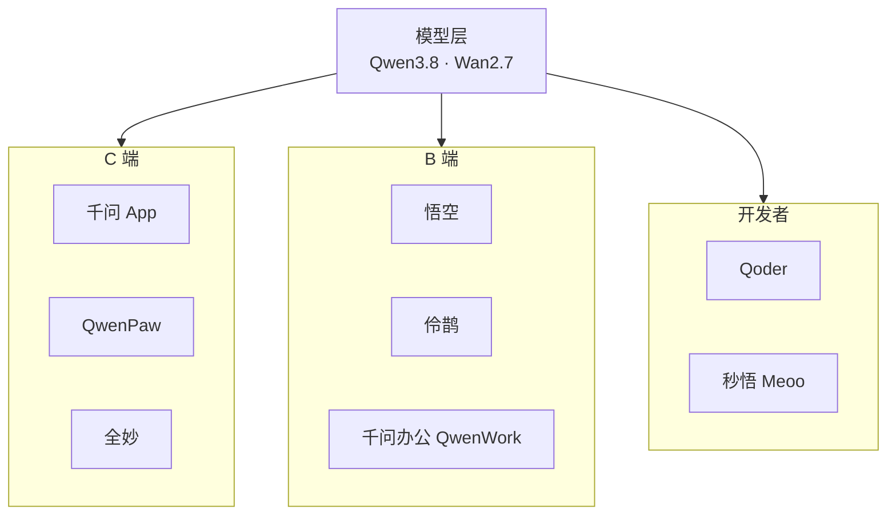

# AI 原生应用矩阵 (AI Native Application Matrix)

> 中文简称：AI 原生应用矩阵

> **一句话理解**: 阿里把自家大模型装进了 9 款"AI 原住民"应用里——写代码的、办公的、做客服的、剪视频的，各司其职。

---

## 应用全景

ATH 的应用层由三大事业部承载：千问事业部（C 端）、悟空事业部（B 端）、AI 创新事业部（新物种）。当前已公开的产品矩阵：

| 应用 | 所属 | 定位 | 一句话描述 |
|------|------|------|-----------|
| 千问 App | 千问事业部 | C 端 AI 助手 | 阿里版 ChatGPT，Token Plan 订阅入口 |
| 悟空 | 悟空事业部 | B 端 AI 工作平台 | 深度接入钉钉的企业智能工作台 |
| Qoder | AI 创新事业部 | 智能体编程平台 | 会自己写代码、改代码的编程 Agent |
| 秒悟 Meoo | AI 创新事业部 | AI 原生应用平台 | 无代码构建 AI 应用的底座 |
| 千问办公 QwenWork | 千问事业部 | 办公套件 | 文档/表格/幻灯片全 AI 化 |
| 伶鹊 | MaaS 关联 | 智能客服 | 企业级对话式客服解决方案 |
| 全妙 | AI 创新事业部 | 视频创作 | AI 视频生成与剪辑 |
| 万小智 | AI 创新事业部 | 智能助手硬件/应用 | 面向个人场景的轻量智能体 |
| QwenPaw | 千问事业部 | 多终端助手 | 跨设备 AI 助手（桌面/移动） |
| 万有无界 | AI 创新事业部 | 沉浸式智能体 | 多智能体协同的下一代交互 |

> 应用层是 ATH "应用 Token"逻辑的落地：每一款应用本质上是把 Qwen 能力装进特定人群的工作流，而不是"套壳聊天机器人"。

---

## 开发者向：Qoder 与秒悟

### Qoder：智能体编程平台

- **定位**：不是"代码补全工具"，而是能自主完成编程任务的智能体
- **能力**：需求理解 → 代码生成 → 测试 → 修复的闭环；基于 Qwen3.8-Max 的自主编程能力
- **意义**：阿里在 AI 编程赛道对 GitHub Copilot / Cursor 的正面回应，属于"编程 Agent"新范式

### 秒悟 Meoo：AI 原生应用构建平台

- **定位**：让非程序员也能构建 AI 应用（低代码 / 无代码）
- **能力**：应用模板、Agent 编排、模型接入
- **意义**：降低 AI 应用门槛，是 AI 创新事业部孵化的"大众化"入口

---

## B 端向：悟空与千问办公

### 悟空（wukong.dingtalk.com）

- **定位**：B 端 AI 工作平台，深度接入钉钉生态
- **能力**：企业知识库问答、工作流自动化、会议智能纪要、行业解决方案
- **意义**：阿里 B 端 AI 的战略支点——钉钉已有企业组织关系数据，悟空把这些数据变成 AI 生产力

### 千问办公 QwenWork

- **定位**：对标 Microsoft 365 Copilot / 飞书智能伙伴的办公套件
- **能力**：文档生成、表格分析、PPT 制作、邮件撰写
- **意义**：C 端办公场景的付费入口，与 Token Plan 深度绑定

### 伶鹊：智能客服

- **定位**：企业级对话式客服
- **能力**：多轮对话、工单流转、人工接管、知识库应答
- **意义**：AI 商业化最早成熟的应用场景，是阿里 To B AI 的现金牛产品

---

## C 端向：千问、QwenPaw、全妙

| 应用 | 核心场景 | 商业模式 |
|------|----------|----------|
| 千问 App | 日常问答、写作、翻译、图像理解 | Token Plan 订阅（39/139/499 元/月） |
| QwenPaw | 跨设备随身助手 | 免费 + 订阅 |
| 全妙 | AI 视频生成与剪辑 | 按量付费 |

---

## 架构师视角：应用层的战略意义

1. **入口之争**：C 端千问 App 对位豆包、ChatGPT；B 端悟空对位飞书——入口即流量，流量即数据，数据反哺模型
2. **商业模式验证**：应用层是 Token Plan 订阅制的试验场，验证"模型能力直接变现"的路径
3. **生态卡位**：Qoder 与秒悟瞄准开发者生态——开发者是 AI 时代的"石油工人"，锁定开发者 = 锁定未来应用
4. **与运维/Agent 岗位的关联**：伶鹊（客服 Agent）、悟空（工作流 Agent）都是企业级 Agent 落地样板，其架构（工具调用、记忆、工单流转）对 Agent 平台建设有直接参考价值

---

## Related

- [阿里云大模型产品全景](../README.md) — 四层产品地图总入口
- [[05_ATH_事业群与组织架构|ATH 事业群与组织架构]] — 应用的产品归属
- [[07_MaaS平台_百炼与千问AI平台|MaaS 平台：百炼与千问AI平台]] — 应用的模型供给
- [[15_智能体/01_Agent基础/README|Agent 基础]] — Agent 应用的技术底座
- [[12_架构基建/11_AI网关/README|AI 网关]] — 应用接入模型的网关层

---

*Last updated: 2026-08-21*
