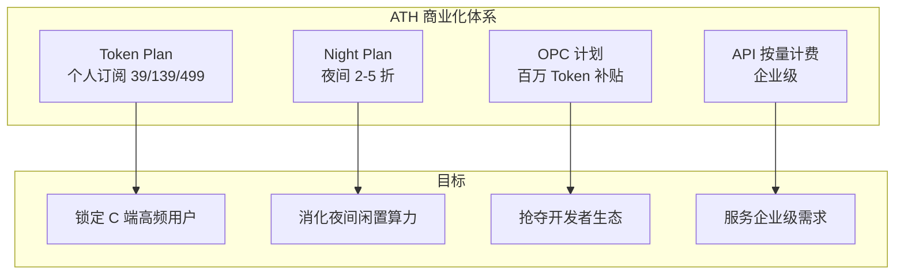

# Token 经济与商业化 (Token Economy & Monetization)

> 中文简称：Token 经济与商业化

> **一句话理解**: 阿里把 AI 能力像水电煤一样定价——买月票（Token Plan）、深夜打折（Night Plan）、拉新送券（OPC），把模型变成了订阅生意。

---

## 商业化总览

ATH 的商业模式从"按 Token 计费的 API"演进为**多层级定价体系**，核心逻辑：用订阅制锁定高频用户，用折扣机制消化闲置算力，用补贴计划抢夺开发者。

---

## Token Plan：个人订阅制

**Token Plan** 是千问 App 的订阅套餐，面向 C 端高频用户：

| 档位 | 月费 | 定位 |
|------|------|------|
| 基础档 | 39 元/月 | 日常问答、轻量写作 |
| 标准档 | 139 元/月 | 高频使用、全模态能力 |
| 旗舰档 | 499 元/月 | 深度推理、长视频、最大配额 |

**设计逻辑**：

- **定价锚点**：对比 ChatGPT Plus（约 20 美元/月），39 元档位定价更亲民，139 元档位对标国内豆包/文心会员
- **权益分层**：档位差异主要体现在模型档位（Flash vs Max）、上下文长度、视频/图像生成配额
- **年度订阅**：通常提供年付优惠（约 2 个月折扣），提升用户留存

---

## Night Plan：夜间算力折扣

**Night Plan（夜间计划）**允许用户在指定夜间时段以 **2-5 折** 的价格使用模型能力。

**商业逻辑**：

| 视角 | 说明 |
|------|------|
| 供给侧 | 夜间 GPU 利用率低，边际成本趋近于零，打折是"白赚" |
| 需求侧 | 吸引批处理型任务（数据处理、批量生成、离线翻译）用户 |
| 竞争侧 | 对位 DeepSeek 等低价玩家的"变相降价" |

**适用场景**：数据清洗、批量内容生成、离线翻译、测试跑批——所有不要求实时性的任务都可以"等晚上再跑"。

---

## OPC 计划：开发者补贴

**OPC（Open Platform Credits）计划**为开发者提供最高**百万 Token** 的补贴额度，用于新用户试用与生态建设。

**目标**：

1. **降低试用门槛**：开发者零成本验证模型效果
2. **争夺开发者**：在 DeepSeek、Kimi、GLM 之间抢 API 用户
3. **拉动平台消费**：补贴期结束后的自然转化率是核心考核指标

---

## 企业级定价：API 按量计费

企业场景保留传统按量计费模式，但增加了新的定价维度：

| 计费维度 | 说明 |
|----------|------|
| 输入/输出 Token | 基础计费单元，输出通常比输入贵 3-5 倍 |
| 模型档位 | Flash < Plus < Max，档位间价差 10 倍级 |
| 上下文长度 | 百万上下文按需付费，长上下文溢价 |
| 推理选项 | 深度思考（thinking budget）单独计费 |
| 峰值弹性 | 弹性扩容按实际用量计费 |

---

## 定价策略对比

| 玩家 | 模式 | 亮点 |
|------|------|------|
| 阿里 ATH | 订阅 + 折扣 + 补贴 | 三层体系最完整 |
| OpenAI | 订阅（ChatGPT Plus）+ API | 全球标杆 |
| DeepSeek | 纯 API 低价 | 价格屠夫 |
| 字节豆包 | 订阅 + 广告 | C 端流量打法 |
| 百度文心 | 订阅 + 企业定制 | To B 深耕 |

> 架构师视角：定价体系 = 商业模式的可视化。ATH 的"订阅 + 夜间折扣 + 开发者补贴"组合拳，本质是在算力成本、用户留存、生态扩张三个目标间做动态平衡——这也是理解阿里 AI 商业化节奏的钥匙。

---

## Related

- [阿里云大模型产品全景](../README.md) — 四层产品地图总入口
- [[06_Qwen模型家族_2026|Qwen 模型家族 2026]] — 被定价的"商品"
- [[08_AI原生应用矩阵|AI 原生应用矩阵]] — 订阅制的载体
- [[10_算力与基础设施|算力与基础设施]] — 成本侧的"生产工具"

---

*Last updated: 2026-08-21*
