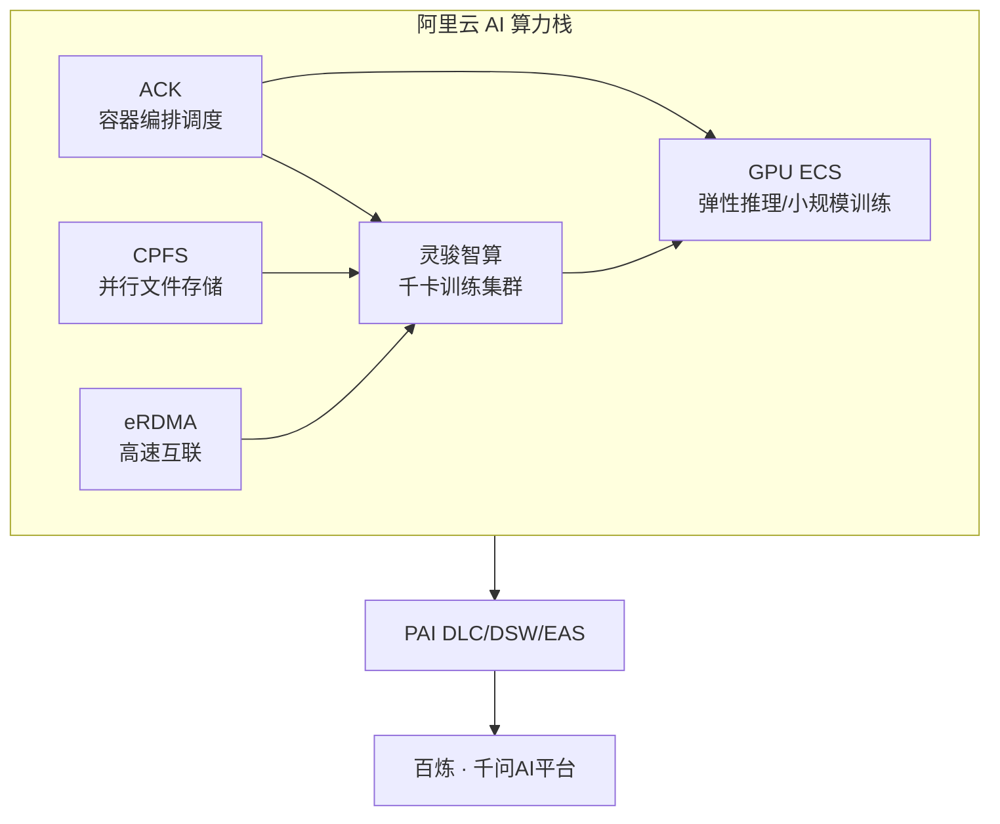

# 算力与基础设施 (Compute & Infrastructure)

> 中文简称：算力与基础设施

> **一句话理解**: 模型跑得动，全靠这层"机房"——阿里云把 GPU、网络、存储按 AI 训练的胃口专门做了套餐。

---

## 算力底座全景

阿里云 AI 算力由阿里云智能事业群供给，是 ATH 模型体系的物理地基：

| 产品 | 类别 | 一句话定位 |
|------|------|-----------|
| 灵骏智算 | AI 超算集群 | 千卡级训练集群，PAI 的算力底座 |
| GPU ECS | 弹性计算 | 按需租 GPU 云服务器 |
| ACK | 容器服务 | GPU 资源容器化编排 |
| CPFS | 并行文件存储 | AI 训练的高速共享存储 |
| eRDMA | 高速网络 | 低延迟 RDMA 网络互联 |

> 训练任务吃"灵骏 + CPFS + eRDMA"套餐，推理任务吃"GPU ECS + ACK"套餐——阿里云把 AI 负载做了场景化切分。

---

## 灵骏智算：千卡训练集群

灵骏（Lingjun）是阿里云面向大模型训练的智算集群产品：

| 维度 | 能力 |
|------|------|
| 规模 | 千卡级 GPU 集群（H 系列 / 自研芯片） |
| 互联 | 高带宽低延迟网络（eRDMA / RoCE） |
| 配套 | CPFS 高速存储、任务调度 |
| 定位 | 预训练、大规模微调的专用底座 |

**架构师视角**：灵骏对位 AWS 的 SageMaker HyperPod / 超算集群——是"重资产"路线，适合有长期训练需求的头部客户。

---

## GPU ECS：弹性推理算力

GPU 云服务器（ECS GPU 实例）是推理与中小规模训练的主力：

- **按需弹性**：分钟级开通，按量计费
- **实例族**：A10 / L20 / H20 / H100 等多代 GPU
- **场景**：vLLM / SGLang 推理服务、中小规模微调、开发测试

**与 ACK 配合**：GPU ECS + ACK 容器服务 = 生产级推理平台的标准组合，支持 GPU 共享（cGPU / GPU 共享调度）、弹性伸缩、蓝绿发布。

---

## ACK：容器编排底座

ACK（Container Service for Kubernetes）承载阿里云全部容器化 AI 工作负载：

| 版本 | 适用场景 |
|------|----------|
| 专有版 | 大型企业，Master 自管 |
| 托管版 | 标准生产，Master 托管 |
| Serverless | 弹性突发、短任务 |

专有云侧：ACK 专有版/敏捷版是 AI Stack 的容器底座，详见 [03_阿里云_专有云_K8s_上下文](03_阿里云_专有云_K8s_上下文.md)。

---

## CPFS：AI 训练高速存储

CPFS（并行文件系统）是专为 AI 训练设计的共享存储：

- **性能**：百万级 IOPS、百 GB/s 级吞吐
- **场景**：数据集共享、Checkpoint 读写、多节点并发访问
- **对比**：OSS（对象存储）适合归档，NAS 适合中小规模，CPFS 适合训练主线

---

## eRDMA：AI 集群高速互联

eRDMA（Elastic RDMA）提供云上 RDMA 网络能力：

| 特性 | 说明 |
|------|------|
| 延迟 | 微秒级，远低于普通 TCP |
| 带宽 | 100Gbps+ |
| 场景 | 分布式训练集合通信（AllReduce）、高性能推理 |

---

## 选型指南

| 需求 | 推荐组合 |
|------|----------|
| 千卡级预训练 | 灵骏智算 + CPFS + eRDMA |
| 生产推理服务 | GPU ECS + ACK + vLLM |
| 中小规模微调 | GPU ECS（按量）+ PAI DSW |
| 弹性突发任务 | ACK Serverless + GPU |
| 专有云部署 | AI Stack（软硬一体） |

---

## Related

- [阿里云大模型产品全景](../README.md) — 四层产品地图总入口
- [[07_MaaS平台_百炼与千问AI平台|MaaS 平台]] — 算力的上层消费者
- [04_阿里云_PAI_深入分析](04_阿里云_PAI_深入分析.md) — PAI 与算力的集成
- [01_阿里云_AI技术栈_深入分析](01_阿里云_AI技术栈_深入分析.md) — 专有云 AI Stack 架构
- [[12_架构基建/07_硬件与算力/README|硬件与算力]] — GPU/TPU 硬件知识

---

*Last updated: 2026-08-21*
