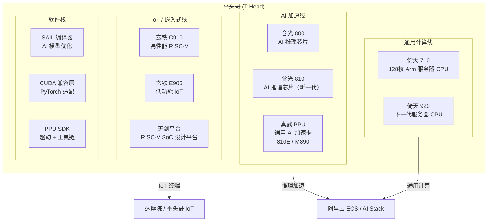

# 平头哥自研芯片与 AI 加速

> 中文简称：平头哥自研芯片

> **一句话理解**: 平头哥是阿里自研芯片的「武器库」——含光做 AI 推理、倚天跑通用计算、玄铁面向 IoT，三线齐发撑起阿里云算力自研底座。

---

## 1. 平头哥产品全景

---

## 2. 核心产品线

### 2.1 含光系列 — AI 推理专用芯片

| 芯片 | 定位 | 关键规格 | 典型场景 |
|------|------|---------|---------|
| **含光 800** | 第一代 AI 推理 ASIC | 16nm，INT8 500 TOPS | 图像识别、NLP 推理 |
| **含光 810** | 新一代 AI 推理芯片 | 12nm，INT8 800+ TOPS | 大模型推理、多模态 |
| **真武 810E** | AI 加速卡（PCIe） | 96GB HBM2e，700GB/s | 通义千问推理、vLLM 集成 |
| **真武 M890** | 高端 AI 加速卡 | 144GB，800GB/s，ICN Switch | 千亿参数模型推理 |

> **详情**: [[01_数学基础/10_AI硬件/08_T_Head_PPU_深入分析|平头哥真武 PPU 深度解析]]

### 2.2 倚天系列 — 通用服务器 CPU

| 芯片 | 定位 | 关键规格 | 典型场景 |
|------|------|---------|---------|
| **倚天 710** | Arm 服务器 CPU | 128核，5nm，3.2GHz，DDR5 | 通用计算、Web 服务、数据库 |
| **倚天 920** | 下一代服务器 CPU | 更高主频 + 更大缓存 | 云原生工作负载 |

**核心竞争力**：自研 Arm 架构 + 阿里云深度优化，单核性能对标 Ampere Altra。

### 2.3 玄铁系列 — RISC-V 处理器

| 芯片 | 定位 | 关键规格 | 典型场景 |
|------|------|---------|---------|
| **玄铁 C910** | 高性能 RISC-V | 12级流水线，支持 Linux | 边缘计算、网关、机器人 |
| **玄铁 E906** | 低功耗 RISC-V | 超低功耗，实时操作系统 | IoT 终端、传感器、MCU |
| **无剑平台** | SoC 设计平台 | 开源 RISC-V IP 核 | 定制化芯片设计 |

**生态意义**：推动 RISC-V 中国生态，玄铁 IP 已开源给中科院和生态伙伴。

---

## 3. 软件栈与生态兼容

| 软件层 | 组件 | 功能 |
|--------|------|------|
| **编译优化** | SAIL | AI 模型编译、算子融合、量化优化 |
| **CUDA 兼容** | T-Head CUDA Compat Layer | PyTorch / CUDA 代码无需修改即可在 PPU 上运行 |
| **驱动层** | PPU SDK / ppu-smi | 设备管理、监控、调试 |
| **框架适配** | PyTorch / vLLM / SGLang 适配 | 主流 AI 框架原生支持 |

> **CUDA Graph 支持**: 详见 [[概念/GPU/cuda-graph|CUDA Graph]]，PPU 通过 SAIL 提供 CUDA 兼容层。

**Day 0 适配能力**：GLM-5.2 等主流模型发布当日即完成平头哥适配。

---

## 4. 在阿里云产品中的应用

| 阿里云产品 | 使用的平头哥芯片 | 场景 |
|-----------|-----------------|------|
| **灵骏智算集群** | 真武 810E / M890 | 大模型训练与推理 |
| **ECS 实例** | 倚天 710（g8y 系列） | 通用 Arm 云计算 |
| **AI Stack 专有云** | 含光 / PPU | 企业私有化 AI 推理 |
| **边缘节点** | 玄铁 C910 | 边缘 AI 推理、IoT 网关 |
| **通义千问推理** | 真武 PPU | Qwen 系列模型推理 |

---

## 5. 与其他国产 AI 芯片对比

| 维度 | 平头哥 | 华为昇腾 | 寒武纪 | 海光 DCU |
|------|--------|---------|--------|---------|
| **架构** | 自研 ASIC + Arm CPU | 达芬奇 NPU | MLU 架构 | x86 + DCU |
| **AI 推理** | ★★★★☆ | ★★★★★ | ★★★★☆ | ★★★☆☆ |
| **通用计算** | ★★★★☆（倚天） | ★★★☆☆ | ★★☆☆☆ | ★★★★☆ |
| **生态成熟度** | ★★★★☆ | ★★★★★ | ★★★☆☆ | ★★★☆☆ |
| **云原生集成** | ★★★★★ | ★★★★☆ | ★★★☆☆ | ★★★☆☆ |

> **完整对比**: [[01_数学基础/10_AI硬件/03_Chinese_AI_Chips_深入分析|中国 AI 芯片深度解析]]

---

## 6. 面试要点

| 问题方向 | 关键回答点 |
|---------|-----------|
| **平头哥 vs 昇腾** | 平头哥有通用 CPU（倚天）+ RISC-V（玄铁）三条线，昇腾聚焦 AI 推理；平头哥与阿里云生态深度集成 |
| **PPU vs GPU** | PPU 是专用 AI 加速卡，CUDA 兼容降低迁移成本；GPU 是通用并行计算，灵活性更强 |
| **RISC-V 生态** | 玄铁是中国 RISC-V 核心推动者，开源 IP 核降低芯片设计门槛 |
| **商业化路径** | 芯片不单卖，通过阿里云服务化（ECS 实例、灵骏集群、AI Stack）变现 |

---

*Last updated: 2026-08-22*
