# 数据平台与 AI 数据工程

> 中文简称：数据平台与AI数据工程

> **一句话理解**: 数据平台是 AI 的「粮仓」——MaxCompute 存算数据、DataWorks 管质量、Hologres 跑实时查询，三件套把原始数据变成 AI 训练的「干净粮食」。

---

## 1. 产品全景

```mermaid
flowchart LR
    subgraph 数据源["数据源"]
        业务DB["业务数据库"]
        日志["日志 / 埋点"]
        外部["外部数据源"]
    end

    subgraph 数据湖["数据存储与计算"]
        MaxCompute["MaxCompute (ODPS)<br/>大数据离线计算"]
        Hologres["Hologres<br/>实时数仓"]
        OSS["OSS / 盘古<br/>对象存储"]
    end

    subgraph 数据治理["数据治理"]
        DataWorks["DataWorks<br/>数据开发 / 调度 / 质量 / 治理"]
        DataMap["数据地图<br/>资产目录"]
        DataQuality["数据质量<br/>规则引擎"]
    end

    subgraph AI消费["AI 消费"]
        PAI_DLC["PAI-DLC<br/>训练数据加载"]
        PAI_Feature["PAI-FeatureStore<br/>特征平台"]
        RAG["RAG 知识库<br/>向量化存储"]
    end

    数据源 --> 数据湖
    数据湖 --> 数据治理
    数据治理 --> AI消费
```



---

## 2. 核心产品详解

### 2.1 MaxCompute (ODPS) — 大数据离线计算

| 维度 | 说明 |
|------|------|
| **定位** | PB 级别离线数据处理引擎，阿里云「数据仓库」核心 |
| **计算模型** | MapReduce / SQL / Spark / Graph |
| **存储** | 列式存储，自动压缩，生命周期管理 |
| **规模** | 单集群 10 万+ 节点，日处理 EB 级数据 |
| **AI 相关** | 训练数据预处理、特征工程、大规模数据集清洗 |

**与 AI 的关系**：MaxCompute 是 PAI-DLC 训练数据的上游，通过 DataWorks 调度把清洗好的数据写入 OSS/CPFS 供训练任务读取。

### 2.2 DataWorks — 数据开发治理平台

| 功能模块 | 说明 |
|---------|------|
| **数据开发** | 可视化 DAG 编排，支持 SQL/Python/Shell 节点 |
| **任务调度** | 定时 / 事件驱动 / 手动触发，支持跨项目依赖 |
| **数据质量** | 规则引擎（空值/唯一性/波动性检测），异常自动阻断 |
| **数据治理** | 数据地图、血缘分析、成本治理、权限管理 |
| **数据服务** | API 发布、数据共享、跨租户协作 |

**关键能力**：DataWorks 是阿里云数据治理的「控制塔」，AI 训练数据的 ETL 流程全部在这里编排和监控。

### 2.3 Hologres — 实时数仓

| 维度 | 说明 |
|------|------|
| **定位** | 实时 OLAP 数仓，支持高并发点查 + 复杂分析 |
| **架构** | 存算分离，兼容 PostgreSQL 协议 |
| **延迟** | 毫秒级点查，秒级聚合 |
| **AI 相关** | 实时特征计算、在线推理数据供给、RAG 实时索引 |

**与 MaxCompute 的关系**：MaxCompute 做离线批量处理，Hologres 做实时查询，通过外表（External Table）直接访问 MaxCompute 数据，零拷贝。

### 2.4 PAI-FeatureStore — 特征平台

| 功能 | 说明 |
|------|------|
| **离线特征** | 从 MaxCompute 批量计算，存储在 OSS/MaxCompute |
| **在线特征** | 低延迟特征服务，存储在 Redis/Hologres |
| **特征复用** | 跨项目共享特征，避免重复计算 |
| **训练-推理一致性** | 同一套特征定义用于训练和在线推理，避免 skew |

---

## 3. 数据管线架构（专有云参考）

```text
业务系统 / 日志系统
    │
    ▼
DataWorks (调度编排)
    ├── 离线分支
    │   └── MaxCompute → 数据清洗/特征工程 → OSS/CPFS → PAI-DLC 训练
    │
    ├── 实时分支
    │   └── Flink → Hologres 实时特征 → PAI-EAS 在线推理
    │
    └── 治理分支
        ├── 数据质量监控 → 异常阻断
        ├── 数据地图 → 血缘追踪
        └── 成本治理 → 资源优化
```

---

## 4. AI 训练数据工程最佳实践

| 阶段 | 工具 | 关键操作 |
|------|------|---------|
| **数据采集** | DataWorks + Kafka | 实时/批量数据接入 |
| **数据清洗** | MaxCompute SQL / Spark | 去重、格式统一、异常过滤 |
| **特征工程** | MaxCompute + PAI-FeatureStore | 特征提取、编码、归一化 |
| **数据验证** | DataWorks 数据质量 | 规则引擎自动检测 |
| **数据版本** | OSS 版本控制 + DataWorks | 数据集快照、可回溯 |
| **数据加载** | PAI-DLC + CPFS | 高吞吐分布式数据加载 |

> **故障排查**: [[11_模型运维/12_故障排查/01_数据_Validation_Failure_操作手册|数据验证失败操作手册]]

---

## 5. 与云厂商数据平台对比

| 维度 | 阿里云 | AWS | Google Cloud |
|------|--------|-----|-------------|
| **离线计算** | MaxCompute (ODPS) | Redshift / Athena | BigQuery |
| **数据调度** | DataWorks | Step Functions / Airflow | Cloud Composer |
| **实时数仓** | Hologres | Redshift Serverless | BigQuery |
| **特征平台** | PAI-FeatureStore | SageMaker Feature Store | Vertex AI Feature Store |
| **数据治理** | DataWorks 数据治理 | Glue + Lake Formation | Dataplex |
| **AI 集成** | 原生打通 PAI | 需手动集成 | 原生打通 Vertex AI |

---

## 6. 面试要点

| 问题方向 | 关键回答点 |
|---------|-----------|
| **MaxCompute vs Spark** | MaxCompute 是阿里自研的封闭生态，Spark 是开源生态；MaxCompute 在阿里云内部有更深的优化 |
| **Hologres vs ClickHouse** | Hologres 兼容 PG 协议 + 原生对接 MaxCompute，ClickHouse 更灵活但需要自运维 |
| **数据治理价值** | 训练数据质量直接影响模型效果，DataWorks 的数据质量规则引擎能自动阻断脏数据流入训练 |
| **特征一致性** | PAI-FeatureStore 解决训练-推理特征 skew 问题，这是生产 ML 系统最常见的 bug 之一 |

---

*Last updated: 2026-08-22*
