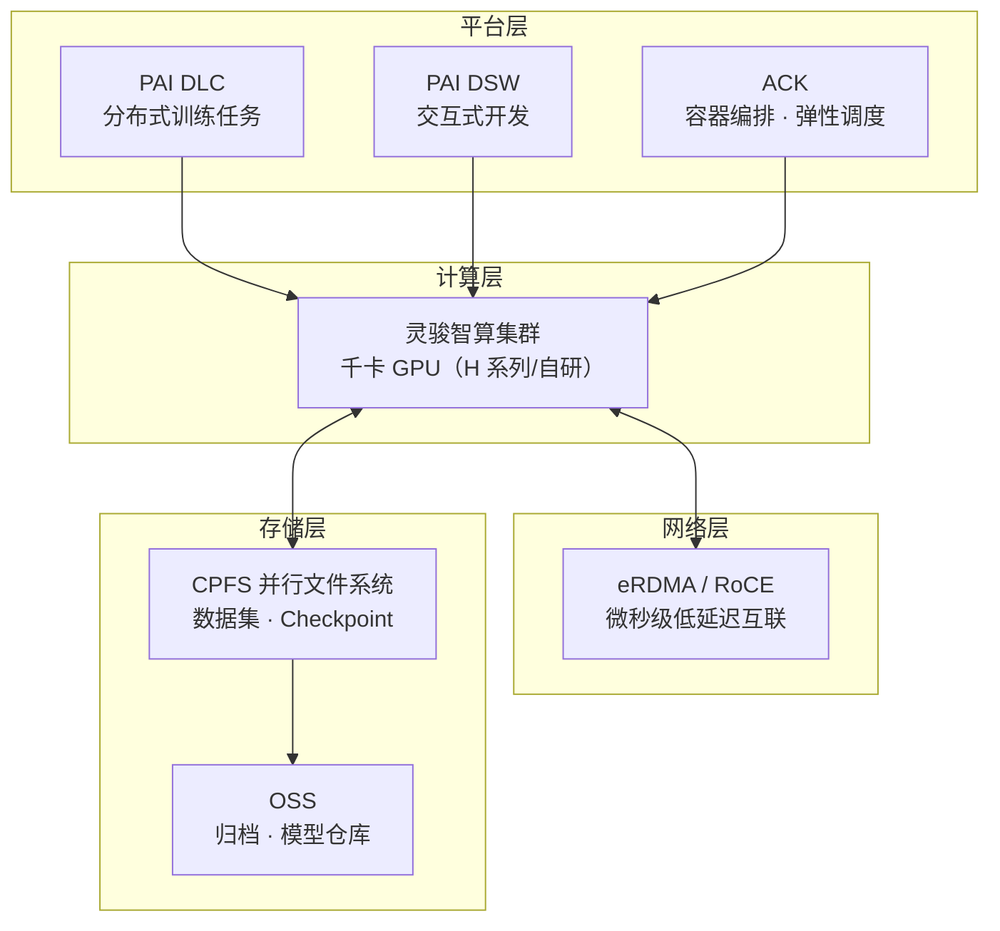

# 架构方案：大模型训练平台 (LLM Training Platform Blueprint)

> 中文简称：训练平台方案

> **一句话理解**: 给客户搭一个"AI 模型健身房"——千张显卡连成一台超级计算机，用来把模型从零练出来或者练强壮。

---

## 客户痛点

| 痛点 | 说明 |
|------|------|
| 算力规模 | 千卡级集群建设复杂，网络/存储/调度任一环节都是坑 |
| 数据吞吐 | 训练数据量大，普通存储 IO 成为瓶颈 |
| 通信效率 | 分布式训练集合通信慢，GPU 利用率低 |
| 工程门槛 | 任务编排、Checkpoint、容错恢复需要专业工程能力 |
| 成本失控 | 集群闲置率高，缺乏弹性与调度优化 |

---

## 目标架构

> 灵骏提供裸算力，eRDMA 保证通信不拖后腿，CPFS 保证数据喂得饱，PAI/ACK 负责把任务管起来——四层配合才能让 GPU 利用率跑到 85% 以上。

---

## 组件选型

| 组件 | 阿里云产品 | 选型理由 |
|------|-----------|----------|
| GPU 算力 | 灵骏智算 | 千卡级集群，专为训练设计 |
| 高速互联 | eRDMA | 微秒级延迟，支撑 AllReduce |
| 高速存储 | CPFS | 百万 IOPS，Checkpoint 秒级落盘 |
| 任务编排 | PAI DLC | 分布式训练开箱即用 |
| 开发环境 | PAI DSW | Notebook 交互开发 |
| 容器底座 | ACK | 弹性伸缩、GPU 共享调度 |
| 归档存储 | OSS | 模型权重、数据集归档 |

---

## 典型部署形态

### 形态一：云上弹性训练（推荐起步）

- 按需开通灵骏 + CPFS，训练结束释放，成本随用随付
- 适合：中小规模微调、PoC 验证

### 形态二：混合云训练

- 客户自有 IDC 部分算力 + 云上弹性扩容（数据面打通）
- 适合：已有硬件投入、突发算力需求的客户

### 形态三：专有云训练（AI Stack）

- 数据不出域的全私有化训练，详见 [16_架构方案_私有化部署](16_架构方案_私有化部署.md)
- 适合：金融、政务等高合规行业

---

## 架构师要点（面试向）

1. **瓶颈判断**：训练慢先查三件事——存储 IO（CPFS 打满？）、网络（eRDMA 丢包？）、调度（Gang 调度是否生效？）
2. **利用率指标**：GPU 利用率 > 85% 是健康线，低于 60% 优先查数据管道
3. **Checkpoint 策略**：高频小 Checkpoint + CPFS 并行写，故障恢复 RTO < 15 分钟
4. **成本结构**：训练成本 = GPU 时长费 + 存储费 + 网络费，弹性释放是最大省钱项
5. **容错设计**：节点故障自动摘除 + 任务重调度，训练任务必须"死不起"

---

## Related

- [阿里云大模型产品全景](../README.md) — 方案地图总入口
- [[10_算力与基础设施|算力与基础设施]] — 灵骏/CPFS/eRDMA 产品细节
- [[04_阿里云_PAI_深入分析|PAI 深入分析]] — DLC/DSW/EAS 深度解析
- [[12_架构方案_大模型推理服务|推理服务方案]] — 训练的"下游"场景

---

*Last updated: 2026-08-21*
