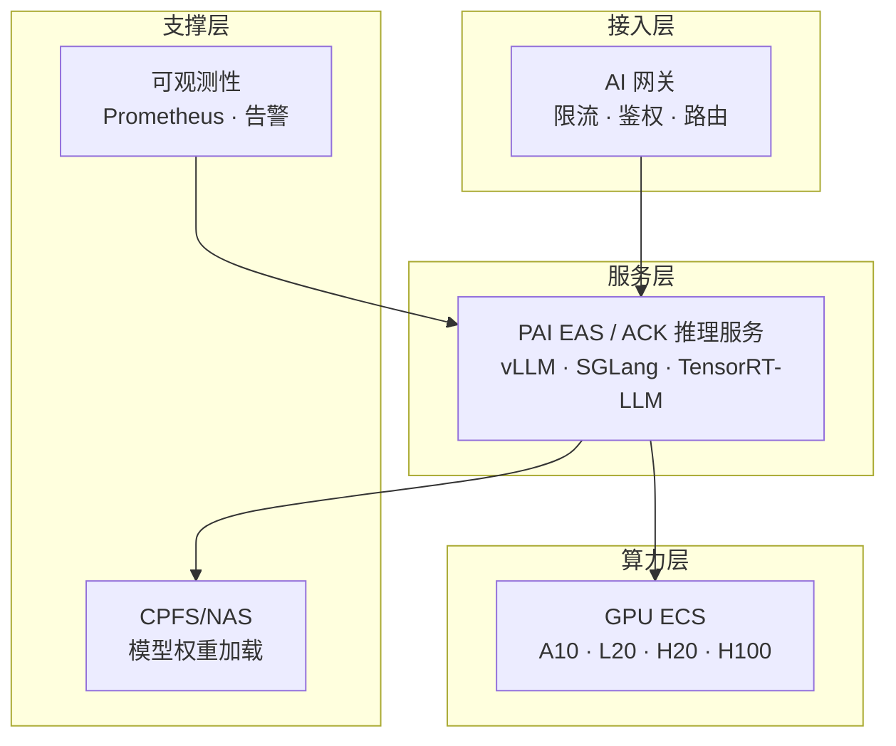

# 架构方案：大模型推理服务 (LLM Inference Service Blueprint)

> 中文简称：推理服务方案

> **一句话理解**: 把训练好的模型变成 7x24 小时营业的"AI 服务窗口"——吞吐要够大、延迟要够低、账单要够省。

---

## 客户痛点

| 痛点 | 说明 |
|------|------|
| 延迟抖动 | 首 Token 延迟不稳定，用户体验差 |
| 吞吐瓶颈 | 并发上来后吞吐上不去，GPU 利用率低 |
| 成本失控 | 推理 GPU 资源闲置率高，按峰值采购浪费大 |
| 弹性不足 | 流量突增（活动/推广）无法快速扩容 |
| 可观测性弱 | 缺乏 Token 吞吐、排队、缓存命中率的监控 |

---

## 目标架构

> 网关挡流量、引擎吃算力、监控保稳定——推理架构的三大支柱，缺一个都会在生产环境出事。

---

## 核心组件选型

| 组件 | 选型 | 说明 |
|------|------|------|
| 推理引擎 | vLLM / SGLang | 主流开源引擎，PagedAttention 提升吞吐 |
| 模型服务 | PAI EAS | 托管推理，自动弹性 |
| 容器底座 | ACK | GPU 调度、弹性伸缩、蓝绿发布 |
| GPU 实例 | H20 / L20 / A10 | 按模型规模与预算选择 |
| 网关 | AI 网关 / 云原生网关 | 限流、鉴权、多模型路由 |
| 观测 | Prometheus + Grafana | TTFT、TPOT、缓存命中率监控 |

---

## 关键性能指标（面试必答）

| 指标 | 含义 | 健康基线 |
|------|------|----------|
| TTFT | 首 Token 延迟 | < 500ms（在线场景） |
| TPOT | 每 Token 生成耗时 | < 50ms |
| 吞吐量 | Token/s | 越高越好，与并发强相关 |
| 缓存命中率 | Prefix Cache 命中 | > 60% 可显著降本 |
| GPU 利用率 | 平均利用率 | > 70% |
| 排队长度 | 请求队列 | 有界，避免雪崩 |

---

## 优化手段（面试加分项）

1. **连续批处理（Continuous Batching）**：vLLM 核心特性，动态合并请求，吞吐提升数倍
2. **Prefix Caching（前缀缓存）**：相同系统提示词复用 KV Cache，命中率高的场景成本直降
3. **量化**：FP8 / INT8 / AWQ，精度换吞吐，H20 上效果显著
4. **PD 分离（Prefill/Decode 分离）**：大模型长上下文场景，解耦首 Token 与生成阶段的算力需求
5. **弹性伸缩**：按队列深度自动扩缩容，错峰省钱
6. **多模型路由**：简单请求走 Flash 小模型，复杂请求走 Max 大模型——成本与质量平衡

---

## 部署形态

| 形态 | 场景 | 说明 |
|------|------|------|
| 标准在线 | 对话/客服/办公 | EAS 托管 + ACK 弹性 |
| 批量离线 | 数据清洗/批量生成 | 低峰期 + Night Plan 折扣 |
| 边缘推理 | 端侧场景 | 小模型 + 边缘节点 |
| 私有化 | 高合规行业 | AI Stack 一体机，见 [16_架构方案_私有化部署](16_架构方案_私有化部署.md) |

---

## Related

- [阿里云大模型产品全景](../README.md) — 方案地图总入口
- [[10_算力与基础设施|算力与基础设施]] — GPU ECS / ACK 细节
- [[11_架构方案_大模型训练平台|训练平台方案]] — 模型的"上游"来源
- [[14_架构方案_Agent智能体平台|Agent 平台方案]] — 推理服务的主要消费者
- [[12_架构基建/11_AI网关/README|AI 网关]] — 接入层细节

---

*Last updated: 2026-08-21*
