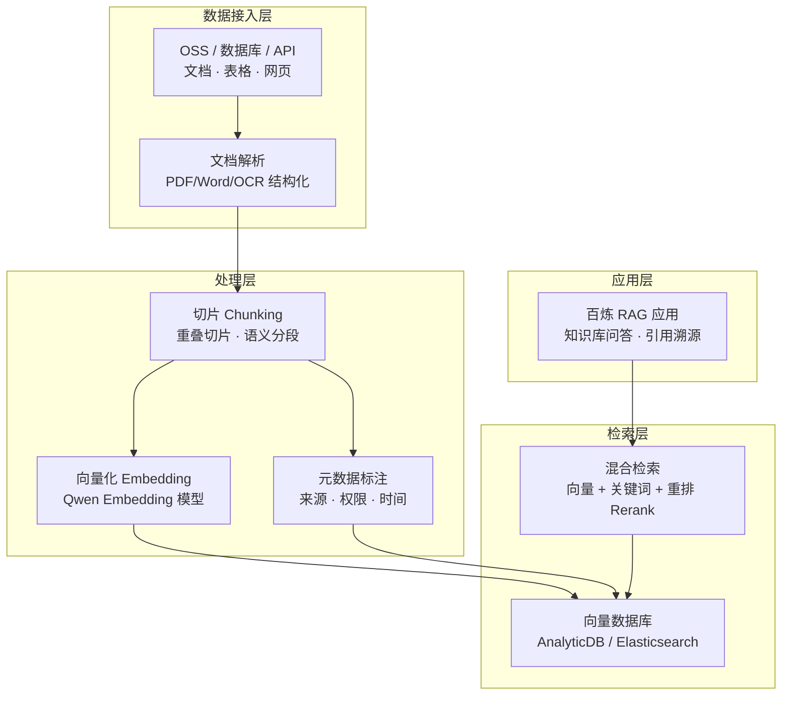

# 架构方案：企业知识库 RAG (Enterprise RAG Blueprint)

> 中文简称：企业知识库 RAG 方案

> **一句话理解**: 让 AI 先查公司资料再回答问题——把企业文档变成模型的"随身笔记本"，回答有出处、不瞎编。

---

## 客户痛点

| 痛点 | 说明 |
|------|------|
| 幻觉问题 | 通用模型回答无依据，企业场景不可接受 |
| 知识私有 | 企业文档/数据不能出域训练，但需要模型理解 |
| 知识更新 | 业务资料频繁变化，模型无法实时感知 |
| 检索质量 | 简单向量检索召回不准，答案质量差 |
| 权限合规 | 不同角色只能看到授权范围内的知识 |

---

## 目标架构

> 数据接入 → 切片向量化 → 入库索引 → 检索重排 → 生成回答：RAG 的五个环节环环相扣，任何一环粗糙都会拉低最终答案质量。

---

## 组件选型

| 环节 | 阿里云方案 | 说明 |
|------|-----------|------|
| 文档解析 | 百炼文档解析 | PDF/Word/扫描件 OCR 结构化 |
| 向量化 | Qwen Embedding | 中文语义理解领先 |
| 向量库 | AnalyticDB / Elasticsearch | 生产级向量检索 |
| 混合检索 | 百炼 RAG 引擎 | 向量 + BM25 + Rerank |
| 应用构建 | 百炼智能体应用 | 知识库问答开箱即用 |
| 私有化 | AI Stack + 百炼专属版 | 数据不出域，见 [16_架构方案_私有化部署](./16_架构方案_私有化部署.md) |

---

## 关键设计决策（面试必答）

1. **切片策略**：按语义段落切片 + 重叠窗口（100-200 token），长文档用层级切片
2. **混合检索优于纯向量**：向量抓语义、关键词抓精确匹配，Rerank 模型合并排序——Recall 提升 10-20%
3. **引用溯源**：回答必须带来源引用，可解释性是 To B 场景的底线
4. **权限过滤**：元数据（部门/密级）+ 检索后过滤（Post-Filter），防止越权泄露
5. **知识更新**：增量入库 + 定时全量刷新，知识新鲜度 SLA 要明确
6. **评估闭环**：用 RAGAS 等框架评估 Recall/Precision/忠实度，上线前后持续回归

---

## 评估指标

| 指标 | 含义 | 目标 |
|------|------|------|
| 检索召回率 | 相关文档被检出的比例 | > 85% |
| 答案忠实度 | 回答是否严格基于引用 | > 90% |
| 幻觉率 | 无依据编造的比例 | < 5% |
| 首答延迟 | 端到端回答时间 | < 3s |
| 知识覆盖率 | 知识库可回答问题占比 | 持续提升 |

---

## 典型场景

| 场景 | 数据源 | 关键能力 |
|------|--------|----------|
| 企业客服问答 | 产品文档/FAQ/工单 | 准确 + 引用 + 转人工 |
| 内部知识库 | 制度/流程/技术文档 | 权限隔离 + 全文检索 |
| 金融研报分析 | 研报/财报 PDF | 长文档解析 + 数字精度 |
| 法律合同审查 | 合同/法规库 | 条款定位 + 风险标注 |

---

## Related

- [阿里云大模型产品全景](../README.md) — 方案地图总入口
- [[07_MaaS平台_百炼与千问AI平台|MaaS 平台]] — 百炼 RAG 能力细节
- [[15_架构方案_智能客服|智能客服方案]] — RAG 最典型的下游应用
- [[12_架构基建/06_云厂商/Alibaba_Cloud/架构方案/14_架构方案_Agent智能体平台|Agent 平台方案]] — RAG 与 Agent 结合

---

*Last updated: 2026-08-21*
