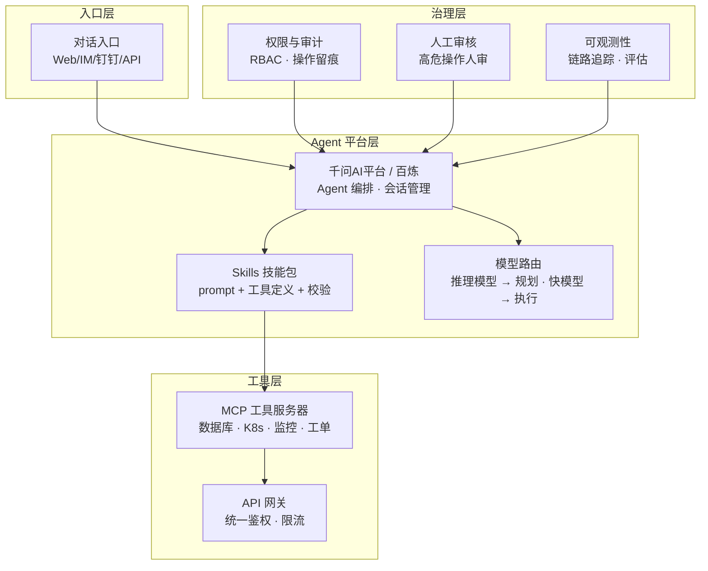

# 架构方案：Agent 智能体平台 (Agent Platform Blueprint)

> 中文简称：Agent 智能体平台方案

> **一句话理解**: 给客户搭一个"AI 员工车间"——模型负责动脑，工具负责动手，Agent 负责把活儿干完。

---

## 客户痛点

| 痛点 | 说明 |
|------|------|
| 单点问答不够用 | 业务需要"干活"（查系统、改配置、发工单），不只是聊天 |
| 工具接入复杂 | 每个业务系统一套 API，Agent 适配成本高 |
| 编排困难 | 多步骤任务（分析 → 决策 → 执行 → 复核）难以可靠编排 |
| 可靠性差 | Agent 幻觉导致错误操作，企业不敢放权 |
| 缺乏治理 | 权限、审计、人审、回滚机制缺失 |

---

## 目标架构

> Agent 平台的核心是"模型 + Skills + 工具"三位一体：模型负责推理规划，Skills 提供可复用的能力封装，工具层连接企业真实系统——治理层保证它不出错、可追责。

---

## 组件选型

| 组件 | 阿里云方案 | 说明 |
|------|-----------|------|
| Agent 编排 | 千问AI平台 / 百炼 | 工作流、多 Agent 协作 |
| 技能封装 | Skills 体系 | 结构化技能包，GitHub 分发 |
| 模型路由 | Qwen3.8-Max + Flash | 难任务大模型、简单任务小模型 |
| 工具连接 | MCP 标准 | 数据库、K8s、监控、工单系统 |
| 记忆 | 会话 + 向量记忆 | 长期记忆、用户画像 |
| 治理 | 权限 + 审计 + 人审 | 企业级安全底线 |
| 私有化 | AI Stack | 数据不出域，见 [16_架构方案_私有化部署](16_架构方案_私有化部署.md) |

---

## 典型场景（面试必答）

### 场景一：运维智能体（SRE/工单方向）

- **能力**：故障诊断（读监控 → 定位根因 → 建议处置）、工单分派与流转、变更巡检
- **Skills**：`k8s-diagnose`、`metric-query`、`ticket-flow`、`log-search`
- **关键点**：只读操作自动执行，高危操作（重启、扩容）必须人工确认

### 场景二：企业客服 Agent

- **能力**：知识问答 → 意图识别 → 工具调用（查订单/退换货）→ 转人工
- **关键点**：与 RAG 深度结合，见 [13_架构方案_企业知识库RAG](13_架构方案_企业知识库RAG.md)

### 场景三：流程自动化 Agent

- **能力**：报销审批、报表生成、跨系统数据搬运
- **关键点**：确定性流程用工作流编排，不确定性流程用 Agent 自主规划

---

## 企业级 Agent 落地的六大设计原则

1. **最小权限**：Agent 工具权限遵循 RBAC，只给完成任务的必要权限
2. **人审兜底**：高危操作（写操作、资金、删除）强制人工审核
3. **审计留痕**：每次工具调用记录输入输出，可回溯、可复盘
4. **护栏校验**：输出校验规则（格式、内容、敏感词），防幻觉扩散
5. **评估回归**：用黄金问题集持续评估 Agent 任务完成率，版本迭代不退化
6. **故障逃生**：Agent 挂死/误操作有熔断开关和回滚机制

---

## 面试加分：Agent 架构演进视角

| 阶段 | 形态 | 代表 |
|------|------|------|
| 1.0 | 提示词 + 工具调用 | 单轮工具调用 |
| 2.0 | 规划 + 执行循环 | ReAct、多步任务 |
| 3.0 | 技能生态 + 多 Agent | Skills 市场、千问AI平台 |
| 4.0 | 自主工作流 | 批量任务、无人值守（人审兜底） |

---

## Related

- [阿里云大模型产品全景](../README.md) — 方案地图总入口
- [[07_MaaS平台_百炼与千问AI平台|MaaS 平台]] — 千问AI平台 Skills 生态
- [[08_AI原生应用矩阵|AI 原生应用矩阵]] — 悟空/伶鹊等 Agent 应用样板
- [[13_架构方案_企业知识库RAG|企业知识库 RAG 方案]] — Agent 的记忆底座
- [[15_智能体/01_Agent基础/README|Agent 基础]] — Agent 技术原理

---

*Last updated: 2026-08-21*
