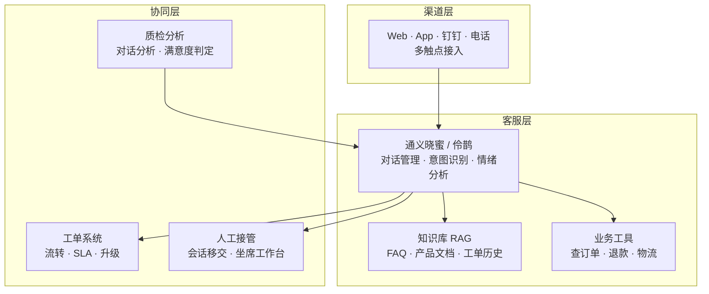

# 架构方案：智能客服 (Intelligent Customer Service Blueprint)

> 中文简称：智能客服方案

> **一句话理解**: 给客户配一个 7x24 小时不下班的"客服班长"——能答的它答，答不了的转人工，还能事后复盘服务质量。

---

## 客户痛点

| 痛点 | 说明 |
|------|------|
| 人力成本 | 客服团队规模大、流动性高、培训成本高 |
| 响应速度 | 高峰排队严重，用户等待时间长 |
| 一致性差 | 不同客服回答口径不一，服务质量波动 |
| 质检困难 | 海量会话人工抽检，覆盖率低 |
| 数据孤岛 | 客服数据与订单/工单系统割裂 |

---

## 目标架构

> 智能客服不是"AI 替代人工"，而是"AI 挡第一层、人工兜底层"——AI 处理高频标准化问题，人工专注复杂与高价值场景。

---

## 组件选型

| 组件 | 阿里云方案 | 说明 |
|------|-----------|------|
| 对话引擎 | 通义晓蜜 / 伶鹊 | 多轮对话、意图识别 |
| 知识底座 | 百炼 RAG | 企业知识库问答，见 [13_架构方案_企业知识库RAG](./13_架构方案_企业知识库RAG.md) |
| 业务打通 | API + MCP | 订单、物流、CRM 系统对接 |
| 工单流转 | 工单系统 | SLA、升级、闭环 |
| 人工接管 | 坐席工作台 | 会话移交、上下文保留 |
| 质检 | 通义晓蜜对话分析 | 合规检测、满意度判定 |
| 部署形态 | 公有云 / AI Stack 私有化 | 数据合规要求，见 [16_架构方案_私有化部署](./16_架构方案_私有化部署.md) |

---

## 关键设计决策（面试必答）

1. **转人工策略**：AI 置信度低、用户情绪负面、涉及敏感操作（退款/投诉）时果断转人工——转人工是能力不是失败
2. **上下文无缝移交**：AI 会话摘要 + 完整记录传给坐席，用户无需重复描述
3. **口径一致性**：知识库统一维护话术，质检规则自动校验回答是否符合规范
4. **闭环学习**：未解决问题回流知识库补全 → 覆盖率持续提升
5. **合规红线**：金融、医疗场景话术必须经过审核，禁止 AI 承诺性回复
6. **夜间无人值守**：Night Plan 折扣时段跑批量质检分析，成本最优

---

## 评估指标

| 指标 | 含义 | 目标 |
|------|------|------|
| 自助解决率 | AI 独立解决占比 | > 70% |
| 转人工率 | 需要人工介入占比 | < 30% |
| 首次响应时间 | 用户等待首答 | < 5s |
| 满意度 CSAT | 用户评分 | 持续提升 |
| 质检覆盖率 | AI 自动质检占比 | > 90%（人工抽检仅 5%） |

---

## 客户价值测算（讲给客户听）

| 维度 | 测算逻辑 |
|------|----------|
| 人力替代 | 自助解决 70% 高频问题 = 客服团队缩减 40-50% |
| 响应提速 | 首答 < 5s vs 人工排队 5-10 分钟 |
| 质量提升 | 口径统一 + 全量质检，投诉率下降 |
| 数据资产 | 对话数据反哺知识库与产品改进 |

---

## Related

- [阿里云大模型产品全景](../README.md) — 方案地图总入口
- [[08_AI原生应用矩阵|AI 原生应用矩阵]] — 伶鹊产品定位
- [[13_架构方案_企业知识库RAG|企业知识库 RAG 方案]] — 客服的知识底座
- [[14_架构方案_Agent智能体平台|Agent 平台方案]] — 客服 Agent 的平台化升级

---

*Last updated: 2026-08-21*
