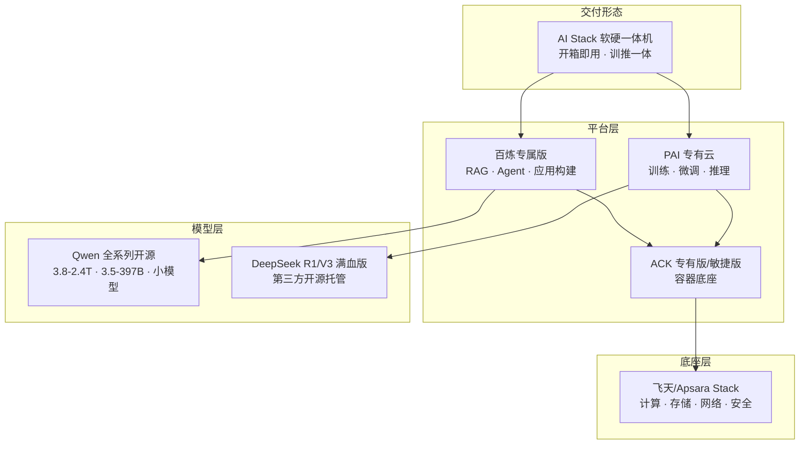

# 架构方案：私有化部署 (Private Deployment Blueprint)

> 中文简称：私有化部署方案

> **一句话理解**: 把 AI 模型搬进客户自己的机房——数据不出门，模型本地跑，适合"命根子数据"不能上云的单位。

---

## 客户痛点

| 痛点 | 说明 |
|------|------|
| 数据合规 | 金融/政务/医疗数据不能出域，公有云不可用 |
| 网络隔离 | 涉密内网与公网物理隔离 |
| 监管要求 | 等保、密评、行业监管对数据驻留的强制要求 |
| 定制需求 | 行业专属模型（术语、法规、业务逻辑）需本地训练微调 |
| 长期成本 | 频繁调用公有云 API 的累积成本高于本地部署 |

---

## 目标架构

> 私有化方案的本质是"把百炼 + PAI + Qwen 全家桶打包成一台能进客户机房的机器"——一体机降低交付复杂度，专有云底座保证数据闭环。

---

## 交付形态对比（面试必答）

| 形态 | 说明 | 适用客户 |
|------|------|----------|
| AI Stack 一体机 | 软硬一体、开箱即用，内置 Qwen 3 全尺寸 + DeepSeek 满血版 | 中小规模、快速交付 |
| 百炼专属版 | 私有化的百炼平台（RAG/Agent/应用） | 需要完整应用平台的客户 |
| Apsara Stack 专有云 | 完整飞天底座 + 全产品线 | 大型政企、大规模建设 |
| 混合形态 | 核心数据本地 + 弹性算力云上 | 平衡合规与弹性 |

---

## 组件选型

| 组件 | 方案 | 说明 |
|------|------|------|
| 一体机 | AI Stack | 预置模型 + 管理面，7 天级交付 |
| 应用平台 | 百炼专属版 | 知识库/Agent 应用本地化 |
| 训练推理 | PAI 专有云 | DSW/DLC/EAS 全链路 |
| 容器底座 | ACK 专有版/敏捷版 | K8s 编排，详见 [03_阿里云_专有云_K8s_上下文](../专有云/03_阿里云_专有云_K8s_上下文.md) |
| 模型 | Qwen 开源全系列 | 尺寸可选：2.4T → 8B |
| 存储 | CPFS / NAS 专有云 | 训练存储与模型仓库 |

---

## 关键设计决策

1. **模型尺寸选型**：按硬件预算选——单机跑 8B-32B，集群跑 397B，旗舰 2.4T 需数十卡
2. **训推一体 vs 分离**：一体机兼顾微调与推理；大规模场景训练/推理分集群
3. **升级路径**：模型版本升级要有灰度方案（新模型 + 回滚通道）
4. **监控运维**：专有云侧需要完整的 GPU/服务监控体系，复用 [01_阿里云_AI技术栈_深入分析](../专有云/01_阿里云_AI技术栈_深入分析.md) 的 AI Stack 运维经验
5. **安全合规**：等保 2.0/密评适配、模型权重加密、审计日志

---

## 客户价值测算

| 维度 | 说明 |
|------|------|
| 合规达标 | 数据不出域，满足监管硬性要求 |
| 交付提速 | 一体机 7 天级交付 vs 传统私有化数月 |
| 成本可预期 | 一次性采购 + 运维，无 API 按量账单 |
| 能力私有化 | 行业数据可本地微调，形成专属模型资产 |

---

## Related

- [阿里云大模型产品全景](../README.md) — 方案地图总入口
- [01_阿里云_AI技术栈_深入分析](../专有云/01_阿里云_AI技术栈_深入分析.md) — 专有云 AI Stack 三层架构
- [03_阿里云_专有云_K8s_上下文](../专有云/03_阿里云_专有云_K8s_上下文.md) — ACK 专有云上下文
- [[11_架构方案_大模型训练平台|训练平台方案]] — 私有化训练形态
- [[06_Qwen模型家族_2026|Qwen 模型家族]] — 开源模型选型

---

*Last updated: 2026-08-21*
