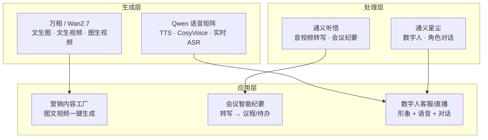

# 架构方案：多模态内容生成 (Multimodal Content Generation Blueprint)

> 中文简称：多模态内容生成方案

> **一句话理解**: 让 AI 既能写字又能画画拍视频、还能把会议录音变成纪要和数字人——内容生产的全链路自动化。

---

## 客户痛点

| 痛点 | 说明 |
|------|------|
| 内容产能 | 营销素材（图/文/视频）生产慢、成本高 |
| 会议效率 | 会议记录整理耗时，信息丢失 |
| 人力瓶颈 | 设计、剪辑、配音需要专业人力 |
| 客户触达 | 需要 7x24 数字人客服/直播 |
| 多模态整合 | 单一模态工具多、割裂、难协同 |

---

## 目标架构

> 多模态方案的骨架是"一个模型家族 + 三个场景出口"：Wan 管视觉、Qwen 语音矩阵管声音、听悟管转写、星尘管形象——按场景自由组合。

---

## 能力矩阵

| 场景 | 阿里云能力 | 说明 |
|------|-----------|------|
| 文生图 | Qwen-Image-3.0-Pro / Wan2.7-Image | 营销海报、产品图 |
| 文生视频 | Wan2.7-T2V / HappyHorse-1.1 | 短视频、广告片 |
| 图生视频 | Wan2.7-R2V / HappyHorse-1.1-I2V | 静态图动起来 |
| 语音合成 | Qwen3-TTS-Flash / CosyVoice-V3 | 配音、有声书 |
| 实时转写 | Fun-ASR-Realtime | 会议/直播实时字幕 |
| 音视频纪要 | 通义听悟 | 会议记录 → 议程/待办 |
| 数字人 | 通义星尘 | 形象 + 语音 + 实时交互 |

---

## 典型场景方案

### 场景一：营销内容工厂

- 输入产品素材 → 万相生成图片/视频 → TTS 配音 → 多平台分发
- 价值：素材生产周期从天级降到小时级，成本降 80%

### 场景二：会议智能纪要

- 录音/会议视频 → 听悟实时转写 → 议程/发言/待办自动结构化 → 同步钉钉/邮件
- 价值：纪要整理 1 小时 → 5 分钟，信息零丢失

### 场景三：数字人客服/直播

- 星尘数字人 + Qwen 对话 + 晓蜜知识库 → 7x24 直播/客服
- 价值：真人成本 1/10，可同时服务多路用户

---

## 选型指南

| 需求 | 选择 |
|------|------|
| 图片批量生成 | Qwen-Image-3.0-Pro |
| 视频营销素材 | Wan2.7-T2V |
| 会议纪要 | 通义听悟 |
| 数字人客服 | 通义星尘 + 通义晓蜜 |
| 实时字幕 | Fun-ASR-Realtime |
| 语音播报 | Qwen3-TTS-Flash |

---

## 架构师要点（面试向）

1. **模型 vs 应用**：万相/听悟/星尘是"能力"，营销工厂/纪要系统是"应用"——给客户方案时先想清楚是卖能力还是卖成品
2. **成本模型**：视频生成按秒计费、语音按字符计费——内容规模决定成本结构
3. **合规红线**：数字人/换脸需用户授权，内容生成需内容安全审核（违禁词/侵权）
4. **组合拳**：多模态方案常与 [13_架构方案_企业知识库RAG](./13_架构方案_企业知识库RAG.md) 和 [14_架构方案_Agent智能体平台](./14_架构方案_Agent智能体平台.md) 组合交付

---

## Related

- [阿里云大模型产品全景](../README.md) — 方案地图总入口
- [[06_Qwen模型家族_2026|Qwen 模型家族]] — Wan 与语音模型细节
- [[08_AI原生应用矩阵|AI 原生应用矩阵]] — 全妙/万小智等应用
- [[15_架构方案_智能客服|智能客服方案]] — 数字人客服的对接

---

*Last updated: 2026-08-21*
