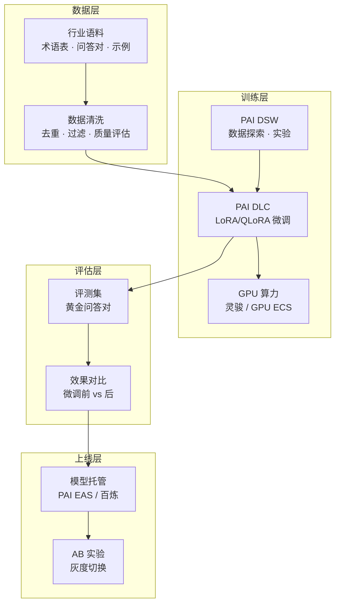

# 架构方案：模型微调与行业定制 (Model Fine-tuning Blueprint)

> 中文简称：模型微调方案

> **一句话理解**: 给通用模型"补课"——把行业术语、企业规则、专业话术教给它，让它从"通才"变成"行业专家"。

---

## 客户痛点

| 痛点 | 说明 |
|------|------|
| 术语不懂 | 通用模型不懂行业黑话（金融、医疗、法律） |
| 风格不符 | 回答不符合企业品牌口径和规范 |
| RAG 不够 | 知识库检索解决不了"会做"的问题（推理、格式、风格） |
| 数据敏感 | 行业数据不能出域，只能本地微调 |
| 效果难评 | 微调后效果无法量化评估，盲目迭代 |

---

## 技术选型：什么时候用微调（面试必答）

| 方案 | 适用场景 | 成本 | 效果 |
|------|----------|------|------|
| Prompt 工程 | 简单规则、少量示例 | 零成本 | 快但浅 |
| RAG | 知识密集、需要溯源 | 中 | 知识准但风格弱 |
| LoRA/QLoRA | 风格/术语/格式对齐 | 低（单卡可跑） | 强 |
| 全参微调 | 领域深度改造 | 高（多卡集群） | 最强 |
| 预训练 | 从零训练行业模型 | 极高 | 一般不需要 |

> 微调不是万能的——先问"知识问题"（用 RAG）还是"能力/风格问题"（用微调），两者常组合使用。

---

## 目标架构

> 微调的正确姿势是"数据准备 → 轻量训练 → 评估对比 → 灰度上线"四步闭环，数据质量决定效果上限，评估体系保证迭代方向正确。

---

## 关键设计决策

1. **数据质量 > 数据量**：1 万条高质量行业问答对 > 100 万条低质语料
2. **LoRA 起步**：先 LoRA（成本低、见效快），不够再全参——95% 场景 LoRA 足够
3. **混合数据**：行业数据 + 通用数据按比例混合（防灾难性遗忘）
4. **评估先行**：上线前必须有黄金评测集，量化对比微调前后效果
5. **版本管理**：模型版本 + 微调参数 + 数据集版本三者绑定可追溯
6. **防遗忘**：微调后仍要测通用能力（通用评测集回归），防止"学会新技能忘掉老技能"

---

## 微调数据准备清单

| 数据类型 | 说明 | 示例 |
|----------|------|------|
| 行业问答对 | 专家标注的 Q/A | 金融合规问答 5000 条 |
| 术语表 | 行业术语定义 | 医疗术语 2000 条 |
| 风格样本 | 品牌话术 | 客服回复风格 1000 条 |
| 格式样本 | 结构化输出 | 报告/合同模板 |
| 负样本 | 错误示范 | 应拒绝回答的场景 |

---

## 评估指标

| 指标 | 说明 | 方法 |
|------|------|------|
| 行业任务准确率 | 领域任务正确率 | 黄金评测集 |
| 通用能力保持 | 通用评测不退化 | 通用 benchmark 回归 |
| 风格一致性 | 是否符合企业口径 | 人工抽样 + LLM 判分 |
| 幻觉率 | 领域内编造比例 | 引用校验 |

---

## Related

- [阿里云大模型产品全景](../README.md) — 方案地图总入口
- [04_阿里云_PAI_深入分析](../专有云/04_阿里云_PAI_深入分析.md) — PAI 微调工程细节
- [[13_架构方案_企业知识库RAG|企业知识库 RAG 方案]] — 微调的最佳搭档
- [[11_架构方案_大模型训练平台|训练平台方案]] — 大规模微调的算力底座
- [[06_Qwen模型家族_2026|Qwen 模型家族]] — 开源模型微调选型

---

*Last updated: 2026-08-21*
