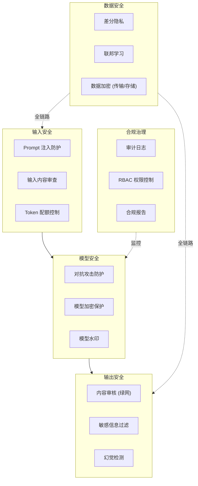

# 架构方案：AI 安全与合规

> 中文简称：AI安全与合规

> **一句话理解**: AI 安全就是给大模型加上「安全带」——输入端防注入、输出端防泄露、训练端防投毒、部署端防滥用，四层防线缺一不可。

---

## 1. AI 安全全景架构



---

## 2. 阿里云 AI 安全产品矩阵

| 产品 | 定位 | 关键能力 |
|------|------|---------|
| **内容安全（绿网）** | 内容审核服务 | 文本/图像/音频/视频审核，支持 200+ 场景 |
| **安全护栏（Guardrails）** | 大模型输入输出防护 | Prompt 注入检测、敏感词过滤、幻觉缓解 |
| **数字水印** | AI 生成内容溯源 | 图片/视频/文本隐式水印，不可见但可提取 |
| **隐私计算** | 数据安全计算 | 联邦学习、多方安全计算、可信执行环境（TEE） |
| **密钥管理服务（KMS）** | 密钥托管 | 模型权重加密、数据加密密钥管理 |
| **访问控制（RAM/RBAC）** | 权限管理 | 细粒度 API 权限、资源级访问控制 |
| **操作审计（ActionTrail）** | 审计日志 | 全量 API 调用记录、异常行为检测 |

---

## 3. 大模型安全防护方案

### 3.1 输入防护

```python
# 伪代码：多层输入防护
def input_guardrails(user_input, session):
    # 第 1 层：基本校验
    if len(user_input) > MAX_TOKENS:
        return "输入超长，请精简问题"

    # 第 2 层：Prompt 注入检测
    injection_score = detect_prompt_injection(user_input)
    if injection_score > THRESHOLD:
        return "检测到异常输入，请重新提问"

    # 第 3 层：内容审核
    moderation = content_moderation(user_input)
    if moderation.blocked:
        return "输入包含违规内容"

    # 第 4 层：上下文安全检查
    if is_jailbreak_attempt(session.history, user_input):
        return "检测到越狱尝试"

    return proceed_to_model(user_input)
```

### 3.2 输出防护

| 防护层 | 检测内容 | 处理方式 |
|--------|---------|---------|
| **事实性检查** | 幻觉、虚假信息 | RAG 检索验证 + 置信度过滤 |
| **敏感信息过滤** | PII（身份证/手机号/地址） | 正则匹配 + NER 模型 |
| **合规性检查** | 违规内容、偏见 | 内容安全 API 审核 |
| **一致性检查** | 输出与上下文矛盾 | 逻辑推理验证 |

### 3.3 模型保护

| 保护措施 | 说明 |
|---------|------|
| **模型加密** | 权重文件加密存储，运行时解密 |
| **模型水印** | 嵌入不可见标识，追溯模型泄露 |
| **API 限流** | Token 配额 + QPS 限制，防止模型被滥用 |
| **对抗训练** | 提升模型对对抗样本的鲁棒性 |

---

## 4. 数据隐私保护方案

### 4.1 联邦学习

```text
┌─────────────┐     ┌─────────────┐     ┌─────────────┐
│  企业 A      │     │  企业 B      │     │  企业 C      │
│  本地数据    │     │  本地数据    │     │  本地数据    │
│  本地训练    │     │  本地训练    │     │  本地训练    │
└──────┬──────┘     └──────┬──────┘     └──────┬──────┘
       │                   │                   │
       │    加密梯度上传    │                   │
       └───────────────────┼───────────────────┘
                           │
                    ┌──────▼──────┐
                    │  聚合服务器  │  ← 只聚合梯度，不碰原始数据
                    │  安全聚合    │
                    └──────┬──────┘
                           │
                    ┌──────▼──────┐
                    │  全局模型    │
                    └─────────────┘
```

### 4.2 差分隐私

| 应用场景 | 技术方案 | 效果 |
|---------|---------|------|
| **训练数据保护** | DP-SGD | 模型无法记忆单条训练数据 |
| **推理输出保护** | 输出扰动 | 防止通过多次查询还原训练数据 |
| **特征发布** | 特征扰动 | 保护用户隐私特征 |

---

## 5. 合规框架对照

| 合规标准 | 适用场景 | 阿里云对应产品 |
|---------|---------|---------------|
| **等保 2.0** | 国内企业必过 | 安全中心 + 态势感知 + WAF |
| **GDPR** | 欧盟数据保护 | 数据脱敏 + 数据加密 + 审计日志 |
| **个保法** | 国内个人信息保护 | 隐私计算 + 数据分类分级 |
| **AI 安全管理办法** | 国内 AI 服务 | 内容安全 + 安全评估 + 标识标注 |
| **SOC 2** | 国际安全审计 | 访问控制 + 审计日志 + 加密 |
| **ISO 27001** | 信息安全管理体系 | 全栈安全产品 |

---

## 6. 面试要点

| 问题方向 | 关键回答点 |
|---------|-----------|
| **Prompt 注入防护** | 多层防护：输入长度限制 → 注入检测模型 → 内容审核 API → 输出过滤 |
| **模型幻觉缓解** | RAG 检索增强 + 事实性验证 + 置信度标注 + 用户反馈闭环 |
| **数据隐私保护** | 联邦学习（数据不出域）+ 差分隐私（数学保证）+ TEE（硬件隔离）|
| **合规落地** | 等保 2.0 是基线，个保法/AI 安全管理办法是重点，需技术+制度双管齐下 |

---

*Last updated: 2026-08-22*
