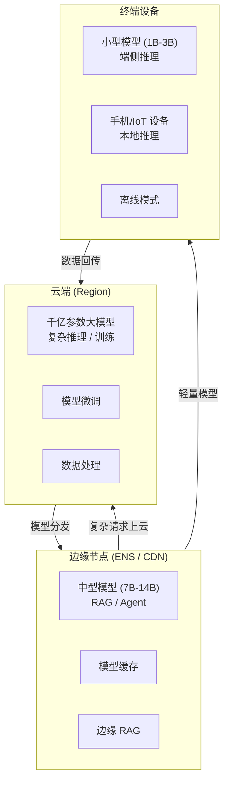

# 架构方案：边缘推理与全球化部署

> 中文简称：边缘推理与全球化

> **一句话理解**: 边缘推理就是把 AI 模型「搬到」离用户最近的地方——工厂车间、手机终端、海外节点——不用回传数据中心，毫秒级出结果。

---

## 1. 云-边-端三级推理架构



---

## 2. 阿里云边缘产品矩阵

| 产品 | 定位 | 关键能力 |
|------|------|---------|
| **边缘节点服务（ENS）** | 边缘计算节点 | 全国 300+ 节点，低延迟推理部署 |
| **IoT 边缘计算（Link IoT Edge）** | IoT 设备管理 | 设备接入、边缘 AI、规则引擎 |
| **全球加速（GA）** | 全球网络加速 | 智能路由、协议优化、跨境加速 |
| **CDN + 边缘函数** | 边缘计算 | 轻量推理逻辑在 CDN 节点执行 |
| **容器服务 ACK 边缘版** | 边缘容器 | 轻量 K8s 集群，边缘自治 |
| **函数计算 FC** | Serverless | 按需推理，冷启动优化 |

---

## 3. 边缘推理技术方案

### 3.1 模型压缩与优化

| 技术 | 压缩比 | 精度损失 | 适用场景 |
|------|--------|---------|---------|
| **INT8 量化** | 2-4x | <1% | GPU / NPU 边缘推理 |
| **INT4 量化（GPTQ/AWQ）** | 4-8x | 1-3% | 内存受限设备 |
| **知识蒸馏** | 5-10x | 2-5% | 大模型→小模型迁移 |
| **模型剪枝** | 2-3x | 1-2% | 结构化稀疏 |
| **ONNX Runtime** | 1.5-2x | 0% | 跨平台推理优化 |

### 3.2 边缘推理框架选型

| 框架 | 特点 | 适用设备 |
|------|------|---------|
| **ONNX Runtime Mobile** | 跨平台、GPU 加速 | 手机、平板 |
| **TensorRT-LLM** | NVIDIA GPU 优化 | 边缘 GPU 服务器 |
| **MNN** | 阿里自研、轻量 | 手机、IoT |
| **NCNN** | 腾讯开源、移动端 | 手机、嵌入式 |
| **llama.cpp** | CPU 推理、低内存 | 任意设备 |

---

## 4. 全球化部署方案

### 4.1 多地域架构

```text
                    ┌──────────────┐
                    │   全球控制面  │  ← 模型版本管理、配置下发
                    └──────┬───────┘
                           │
          ┌────────────────┼────────────────┐
          │                │                │
   ┌──────▼──────┐  ┌──────▼──────┐  ┌──────▼──────┐
   │  中国节点    │  │  新加坡节点  │  │  美国节点    │
   │  阿里云      │  │  阿里云      │  │  阿里云      │
   │  上海/北京   │  │  Singapore   │  │  Virginia   │
   └──────┬──────┘  └──────┬──────┘  └──────┬──────┘
          │                │                │
   ┌──────▼──────┐  ┌──────▼──────┐  ┌──────▼──────┐
   │  本地用户    │  │  东南亚用户  │  │  北美用户    │
   └─────────────┘  └─────────────┘  └─────────────┘
```

### 4.2 跨境合规要点

| 合规要求 | 说明 | 应对策略 |
|---------|------|---------|
| **数据不出境** | 中国数据不出境（个保法/数据安全法） | 数据本地化存储，跨境传输需评估 |
| **GDPR** | 欧盟数据保护 | 数据最小化、用户同意、删除权 |
| **模型备案** | 国内 AI 服务需备案 | 按《AI 安全管理办法》备案 |
| **内容审核** | 不同地区内容标准不同 | 多策略内容审核，地域适配 |

---

## 5. 边缘推理场景方案

| 场景 | 方案 | 关键指标 |
|------|------|---------|
| **智能客服** | 边缘部署 7B 模型 + RAG | TTFT < 500ms |
| **工厂质检** | 边缘 GPU + CV 模型 | 延迟 < 100ms |
| **自动驾驶** | 车端推理 + 云端更新 | 延迟 < 50ms |
| **手机助手** | 端侧 1B 模型 + 云端兜底 | 离线可用、隐私优先 |
| **全球 SaaS** | 多地域部署 + CDN 加速 | P99 < 2s |

---

## 6. 面试要点

| 问题方向 | 关键回答点 |
|---------|-----------|
| **为什么需要边缘推理** | 降低延迟、节省带宽、数据隐私、离线可用 |
| **模型压缩技术选型** | INT8 量化是基线，INT4 量化+蒸馏是端侧常用组合 |
| **全球化部署挑战** | 数据合规（跨境）、网络延迟（GA 加速）、内容审核（地域差异）|
| **云边协同** | 边缘处理常规请求，复杂请求上云；模型在云端训练，边缘部署 |

---

*Last updated: 2026-08-22*
