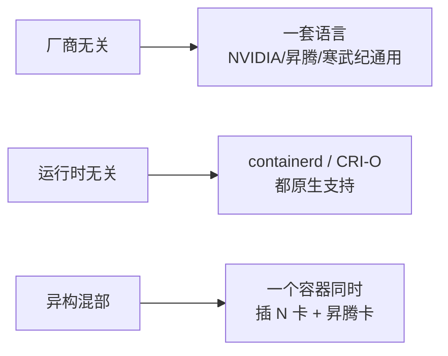

# CDI 容器设备接口 - 小白版

> **一句话理解**: CDI 就像酒店的「标准化入住需求单」——每块 GPU/加速器填一张同样的表，写清自己需要在房间里准备什么，任何酒店（容器运行时）看懂这张表就能把它安顿好。

---

## 🏨 用一个故事讲明白

假设你开了一家 **「AI 酒店」**，专门接待各种「客人」——NVIDIA 显卡、华为昇腾、寒武纪……它们来住店，是为了在「房间」（容器）里干 AI 推理的活儿。

### 旧世界：一团乱麻 😩

每个客人跟酒店沟通的方式都不一样：

| 客人 | 沟通方式 | 问题 |
|------|----------|------|
| NVIDIA | 塞一张叫 `NVIDIA_VISIBLE_DEVICES` 的小纸条给前台，只有跟 NVIDIA 有合作的前台（特制 runtime）才看得懂 | 别家前台完全懵 |
| 昇腾 | 自己带锁匠，要特权模式才能进房间 | 安全隐患大 |
| 寒武纪 | 直接喊「给我 `/dev/foo0` 这个房间号！」，里面啥配置都没有 | 进去了也跑不起来 |

> 结果：每来一个新厂商，酒店就得重新培训前台、改管理流程。**没有统一标准，天下大乱。**

### 新世界：CDI 入住需求单 📋

CDI 规定：**所有客人都填同一张表**（一份 JSON 文件），写清楚：

```json
{
  "kind": "nvidia.com/gpu",     // 我是 NVIDIA 家的 GPU
  "devices": [
    {
      "name": "0",               // 我是 0 号那块
      "containerEdits": {        // 要把我安顿好，房间需要：
        "deviceNodes": ["/dev/nvidia0"],   // 1. 接通这个电源插座
        "mounts": ["libcuda.so"],          // 2. 准备好我的工具箱
        "hooks": ["nvidia-ctk setup"]      // 3. 我进门前先帮我跑个设置脚本
      }
    }
  ]
}
```

前台（容器运行时 containerd）**只认这张表**，不关心你是谁家的——表上写啥就准备啥。天下太平。✨

---

## 🔌 另一个比喻：万能插头标准

把 CDI 想成 **「全球统一电源插头标准」**：

- **以前**: 美标、国标、欧标……每去一个国家要带转换头（=每个厂商写一套私有 runtime）
- **有了 CDI**: 所有插座、所有电器都一个标准（=一份 JSON 描述，任何运行时都认）

---

## 🎯 CDI 解决了哪三件大事



---

## 🤔 我什么时候会碰到 CDI？

**场景 1：在 K8s 上跑 vLLM 推理**

你写了一个 Pod 要 1 张 GPU，背后的流程是：
```
你声明 nvidia.com/gpu: 1
   → K8s 分配 0 号卡给你
   → 翻译成 CDI 设备名 nvidia.com/gpu=0
   → containerd 读 CDI 表，知道该挂哪些设备/库
   → 你的 vLLM 容器里就有一块能用的 GPU 了 ✅
```
**你不用写任何 `NVIDIA_VISIBLE_DEVICES`**——这就是 CDI 的功劳。

**场景 2：公司混插了 NVIDIA 和昇腾**

没有 CDI：两套部署流程，运维头秃。
有了 CDI：只要把 `nvidia.com/gpu` 换成 `huawei.com/ascend`，其余完全一样。国产化替换成本骤降。

---

## ⚠️ 小白避坑指南

1. **CDI 不是 K8s 的东西**: 它是**容器运行时**（containerd/CRI-O）那一层的标准。K8s 是通过设备插件 / DRA「借用」它的。
2. **CDI 不替代设备插件**: 设备插件管「分配」（谁拿哪块卡），CDI 管「注入」（卡怎么塞进容器）。它俩是配合，不是替代。
3. **看到 `/etc/cdi/` 或 `/var/run/cdi/` 目录**: 别删！那是各家厂商放「入住需求单」的地方，删了设备就用不了了。
4. **NVIDIA 用户**: 装 NVIDIA GPU Operator（v23.9+）会自动帮你生成 CDI 表，不用手写。

---

## 🪜 三步上手

| 步骤 | 做什么 | 命令/动作 |
|------|--------|-----------|
| 1️⃣ 生成表 | 让厂商工具写出 CDI JSON | `nvidia-ctk cdi generate --output=/etc/cdi/nvidia.yaml` |
| 2️⃣ 用设备名申请 | 用 `vendor.com/class=name` 格式 | `nerdctl run --device nvidia.com/gpu=0 ...` |
| 3️⃣ 验证 | 进容器看 GPU 在不在 | `nvidia-smi` 应能看到 0 号卡 |

---

## 📚 想深入了解？

入门看懂了，想要 spec 文件结构、MIG 切片、RDMA、与 DRA 的关系等完整内容：

→ [[架构基建/Hardware_Compute/CDI_Deep_Dive|CDI 容器设备接口标准深度解析]]

## Related

- [[架构基建/Hardware_Compute/CDI_Deep_Dive|CDI 深度解析]]
- [[架构基建/Architecture_Infrastructure_for_dummy|架构基础设施 - 小白版]]
- [[架构基建/README|架构与基础设施]]
- [[数学基础/AI_Hardware/Chinese_AI_Chips_Deep_Dive|国产 AI 芯片（CDI 的最大受益者）]]
- [[概念/cdi|CDI 概念卡片]]

## 架构核心组件对比

| 组件层 | 功能 | 关键技术 | 选型考量 |
|--------|------|----------|----------|
| 计算层 | 模型训练/推理 | GPU/TPU/NPU集群 | 算力需求+成本 |
| 存储层 | 数据/模型/检查点 | 分布式存储/对象存储 | 容量+IOPS+成本 |
| 网络层 | 节点间通信 | RDMA/RoCE/InfiniBand | 带宽+延迟 |
| 调度层 | 资源编排 | K8s/Slurm/Ray | 弹性+效率 |
| 服务层 | 模型服务化 | vLLM/TGI/Triton | 吞吐+延迟 |
| 网关层 | 流量管理 | API Gateway/负载均衡 | 可用性+安全 |
| 监控层 | 可观测性 | Prometheus/Grafana/OTel | 全面+实时 |

## 架构设计原则

| 原则 | 说明 | 实践方法 |
|------|------|----------|
| 高可用 | 消除单点故障 | 多副本+故障转移+多AZ |
| 可扩展 | 水平扩展无瓶颈 | 无状态设计+分片 |
| 高性能 | 最小化延迟 | 缓存+并行+异步 |
| 安全性 | 纵深防御 | 加密+认证+审计 |
| 可观测 | 全链路可见 | Trace+Metrics+Logging |
| 成本优化 | 资源利用率最大化 | 弹性伸缩+混合部署 |

## 性能基准参考

| 场景 | 关键指标 | 目标值 | 优化方向 |
|------|----------|--------|----------|
| 模型推理 | 首Token延迟 | <500ms | 模型优化+缓存 |
| 批量推理 | 吞吐量 | >1000 req/s | 批处理+并行 |
| 训练任务 | GPU利用率 | >85% | 数据管道+通信优化 |
| 存储读写 | IOPS | >100K | NVMe+分布式 |
| 网络通信 | 带宽利用率 | >90% | RDMA+拓扑优化 |

## 常见问题与解决方案

| 问题 | 根因分析 | 解决方案 |
|------|----------|----------|
| GPU利用率低 | 数据加载瓶颈 | 预取+多worker+NVMe |
| 推理延迟高 | 模型过大/批处理不当 | 量化+动态batch |
| 存储IO瓶颈 | 检查点写入集中 | 异步写入+分布式存储 |
| 网络拥塞 | AllReduce通信密集 | 梯度压缩+拓扑优化 |
| 资源碎片 | 调度策略不当 | Gang调度+资源预留 |

## 技术选型决策树

| 决策点 | 选项A | 选项B | 选择依据 |
|--------|-------|-------|----------|
| 训练框架 | PyTorch DDP | DeepSpeed/Megatron | 模型规模>10B用后者 |
| 推理引擎 | vLLM | TensorRT-LLM | 灵活性vs极致性能 |
| 存储方案 | 本地NVMe | 分布式存储(Ceph) | 数据规模+共享需求 |
| 网络方案 | 以太网 | InfiniBand | 集群规模+预算 |
| 调度系统 | K8s | Slurm | 云原生vs HPC传统 |

## 学习路径建议

| 阶段 | 内容 | 时间 | 产出 |
|------|------|------|------|
| 入门 | 基础架构概念+组件认知 | 1-2周 | 理解全景图 |
| 基础 | 单一组件深入(存储/网络) | 2-3周 | 掌握核心原理 |
| 进阶 | 系统集成+性能优化 | 3-4周 | 能设计完整方案 |
| 实战 | 生产环境部署运维 | 4-6周 | 独立运维能力 |
| 精通 | 架构演进+前沿探索 | 持续 | 技术领导力 |

## 术语速查表

| 术语 | 含义 |
|------|------|
| RDMA | 远程直接内存访问(绕过CPU) |
| NVLink | GPU间高速互联 |
| InfiniBand | 高性能网络互连技术 |
| Checkpoint | 训练中间状态保存点 |
| Gang Scheduling | 一组Pod同时调度 |
| Data Parallelism | 数据并行(每GPU处理不同数据) |
| Model Parallelism | 模型并行(模型分片到多GPU) |
| Pipeline Parallelism | 流水线并行(层间流水) |
| Tensor Parallelism | 张量并行(层内切分) |
| KV Cache | 推理时缓存注意力键值 |

## 检查清单

- [ ] 理解AI基础设施全景架构
- [ ] 掌握计算/存储/网络核心组件
- [ ] 了解主流框架和工具链
- [ ] 能进行基本的性能分析和优化
- [ ] 熟悉生产环境最佳实践
- [ ] 关注硬件和架构演进趋势
