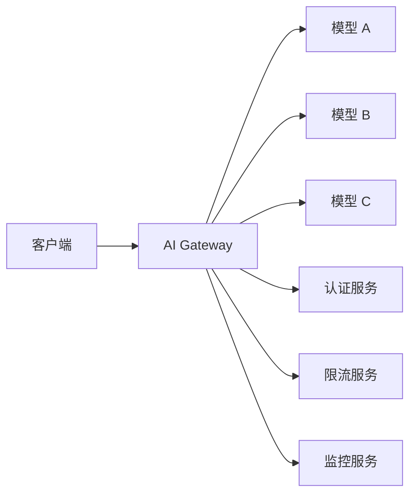

# 14 AI Gateway — 小白版 🚪

> **一句话秒懂**: AI Gateway 就是 AI 系统的"智能路由器"——管理 AI 请求的路由、限流、认证、监控，让多个 AI 模型和服务像一个整体一样高效运行。

## 为什么要学 AI Gateway？

想象一下：
- 🚪 你有多个 AI 服务，怎么统一管理？
- ⚡ 请求太多，AI 服务扛不住怎么办？
- 🔐 怎么控制谁可以用 AI、用多少？

**AI Gateway = AI 的"门卫 + 路由器 + 监控中心"**

## AI Gateway 能做什么？

### 1. 智能路由

```
【场景】你有多个 AI 模型

┌─────────────────────────────────────┐
│            AI Gateway               │
├─────────────────────────────────────┤
│                                     │
│  用户请求 → 路由到合适的 AI         │
│                                     │
│  "翻译" → 翻译专用模型              │
│  "写代码" → Code专用模型            │
│  "聊天" → 通用对话模型              │
│                                     │
└─────────────────────────────────────┘
```

### 2. 限流保护

```
【场景】秒杀活动，海量请求

没有 Gateway:
- AI 服务直接崩溃 ❌

有 Gateway:
- 请求排队，超限拒绝
- 保护 AI 服务不被压垮 ✓

限流策略:
- 每用户 N 次/分钟
- 每 IP N 次/分钟
- 总体 N 次/秒
```

### 3. 认证与安全

```
【功能】
✓ API Key 管理
✓ 访问令牌验证
✓ 敏感词过滤
✓ 防注入攻击
```

### 4. 监控与日志

```
【监控内容】
- 请求量
- 响应时间
- 错误率
- Token 消耗
- 各模型调用量
```

## 核心功能

```
┌─────────────────────────────────────────────────────────┐
│                    AI Gateway 功能                       │
├─────────────────────────────────────────────────────────┤
│                                                         │
│  🚦 路由 ─── 基于路径/参数的智能路由                      │
│  ⚡ 限流 ─── 多维度限流策略                              │
│  🔐 安全 ─── 认证、鉴权、风控                           │
│  📊 监控 ─── 实时指标、日志、告警                        │
│  🔄 降级 ─── AI 服务故障时的保底策略                     │
│  💰 计费 ─── 按用户/项目统计用量                        │
│                                                         │
└─────────────────────────────────────────────────────────┘
```

## 技术架构



## 选型对比

| 产品 | 特点 | 适用场景 |
|------|------|---------|
| Kong | 通用 API 网关 + AI 插件 | 已有 Kong 的团队 |
| Apache APISIX | 高性能 + AI 插件 | 需要高性能 |
| 阿里云 API 网关 | 云服务 + AI 能力 | 国内云用户 |
| 自建 | 完全可控 | 大厂自研 |

## 应用场景

### 1. 多模型统一接入

```
【问题】团队有多个 AI 服务，调用方式各异

【解决】统一通过 Gateway 接入

- 统一 API 格式
- 统一认证鉴权
- 统一监控限流
```

### 2. 模型 A/B 测试

```
【场景】想对比两个模型的效果

Gateway 配置:
- 50% 流量 → 模型 A
- 50% 流量 → 模型 B

自动收集效果数据，对比决策
```

### 3. 成本控制

```
【场景】LLM 调用成本高

Gateway 能力:
- 统计各用户/项目的 token 消耗
- 设置预算上限，超限自动拒绝
- 优化 prompt，减少 token 消耗
```

## 下一步

- 想深入技术？→ 查看子目录具体文档
- 想学架构？→ [12_架构基建/README_for_dummy.md](17_伦理安全/README_for_dummy.md)
- 想学部署？→ [10_部署推理/README_for_dummy.md](17_伦理安全/README_for_dummy.md)

---

*本文是 [README.md](../README.md) 的简化版，适合零基础读者。*

## Related

- [[12_架构基建/11_AI_Gateway/AI_Gateway_2026.md|AI_Gateway_2026]]
- [[12_架构基建/11_AI_Gateway/AI_Gateway_for_dummy.md|AI_Gateway_for_dummy]]
- [[12_架构基建/11_AI_Gateway/Cohere_Deep_Dive.md|Cohere_Deep_Dive]]
- [[12_架构基建/11_AI_Gateway/Gateway-in-nutshell.md|Gateway-in-nutshell]]
- [[12_架构基建/11_AI_Gateway/Kong_AI_Gateway_Deep_Dive.md|Kong_AI_Gateway_Deep_Dive]]

- [[12_架构基建/README|架构与基础设施 (Architecture & Infrastructure)]]

## 架构核心组件对比

| 组件层 | 功能 | 关键技术 | 选型考量 |
|--------|------|----------|----------|
| 计算层 | 07_模型训练/推理 | GPU/TPU/NPU集群 | 算力需求+成本 |
| 存储层 | 数据/模型/检查点 | 分布式存储/对象存储 | 容量+IOPS+成本 |
| 网络层 | 节点间通信 | RDMA/RoCE/InfiniBand | 带宽+延迟 |
| 调度层 | 资源编排 | K8s/Slurm/Ray | 弹性+效率 |
| 服务层 | 模型服务化 | vLLM/TGI/Triton | 吞吐+延迟 |
| 网关层 | 流量管理 | API Gateway/负载均衡 | 可用性+安全 |
| 监控层 | 可观测性 | Prometheus/Grafana/OTel | 全面+实时 |

## 架构设计原则

| 原则 | 说明 | 实践方法 |
|------|------|----------|
| 高可用 | 消除单点故障 | 多副本+故障转移+多AZ |
| 可扩展 | 水平扩展无瓶颈 | 无状态设计+分片 |
| 高性能 | 最小化延迟 | 缓存+并行+异步 |
| 安全性 | 纵深防御 | 加密+认证+审计 |
| 可观测 | 全链路可见 | Trace+Metrics+Logging |
| 成本优化 | 资源利用率最大化 | 弹性伸缩+混合部署 |

## 性能基准参考

| 场景 | 关键指标 | 目标值 | 优化方向 |
|------|----------|--------|----------|
| 模型推理 | 首Token延迟 | <500ms | 模型优化+缓存 |
| 批量推理 | 吞吐量 | >1000 req/s | 批处理+并行 |
| 训练任务 | GPU利用率 | >85% | 数据管道+通信优化 |
| 存储读写 | IOPS | >100K | NVMe+分布式 |
| 网络通信 | 带宽利用率 | >90% | RDMA+拓扑优化 |

## 常见问题与解决方案

| 问题 | 根因分析 | 解决方案 |
|------|----------|----------|
| GPU利用率低 | 数据加载瓶颈 | 预取+多worker+NVMe |
| 推理延迟高 | 模型过大/批处理不当 | 量化+动态batch |
| 存储IO瓶颈 | 检查点写入集中 | 异步写入+分布式存储 |
| 网络拥塞 | AllReduce通信密集 | 梯度压缩+拓扑优化 |
| 资源碎片 | 调度策略不当 | Gang调度+资源预留 |

## 技术选型决策树

| 决策点 | 选项A | 选项B | 选择依据 |
|--------|-------|-------|----------|
| 训练框架 | PyTorch DDP | DeepSpeed/Megatron | 模型规模>10B用后者 |
| 推理引擎 | vLLM | TensorRT-LLM | 灵活性vs极致性能 |
| 存储方案 | 本地NVMe | 分布式存储(Ceph) | 数据规模+共享需求 |
| 网络方案 | 以太网 | InfiniBand | 集群规模+预算 |
| 调度系统 | K8s | Slurm | 云原生vs HPC传统 |

## 学习路径建议

| 阶段 | 内容 | 时间 | 产出 |
|------|------|------|------|
| 入门 | 基础架构概念+组件认知 | 1-2周 | 理解全景图 |
| 基础 | 单一组件深入(存储/网络) | 2-3周 | 掌握核心原理 |
| 进阶 | 系统集成+性能优化 | 3-4周 | 能设计完整方案 |
| 实战 | 生产环境部署运维 | 4-6周 | 独立运维能力 |
| 精通 | 架构演进+前沿探索 | 持续 | 技术领导力 |

## 术语速查表

| 术语 | 含义 |
|------|------|
| RDMA | 远程直接内存访问(绕过CPU) |
| NVLink | GPU间高速互联 |
| InfiniBand | 高性能网络互连技术 |
| Checkpoint | 训练中间状态保存点 |
| Gang Scheduling | 一组Pod同时调度 |
| Data Parallelism | 数据并行(每GPU处理不同数据) |
| Model Parallelism | 模型并行(模型分片到多GPU) |
| Pipeline Parallelism | 流水线并行(层间流水) |
| Tensor Parallelism | 张量并行(层内切分) |
| KV Cache | 推理时缓存注意力键值 |

## 检查清单

- [ ] 理解AI基础设施全景架构
- [ ] 掌握计算/存储/网络核心组件
- [ ] 了解主流框架和工具链
- [ ] 能进行基本的性能分析和优化
- [ ] 熟悉生产环境最佳实践
- [ ] 关注硬件和架构演进趋势
