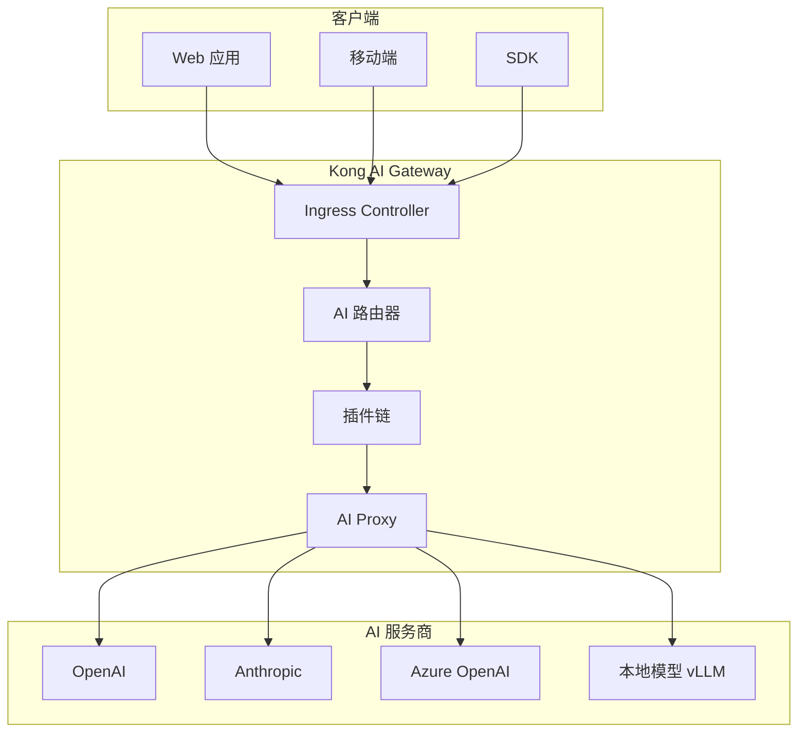
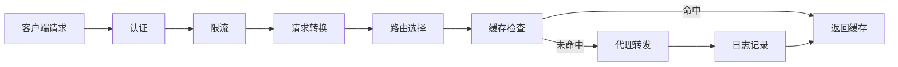
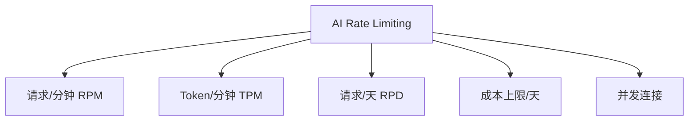
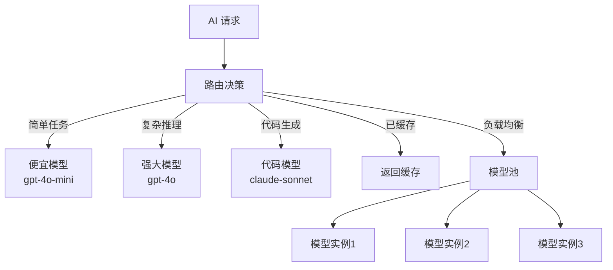
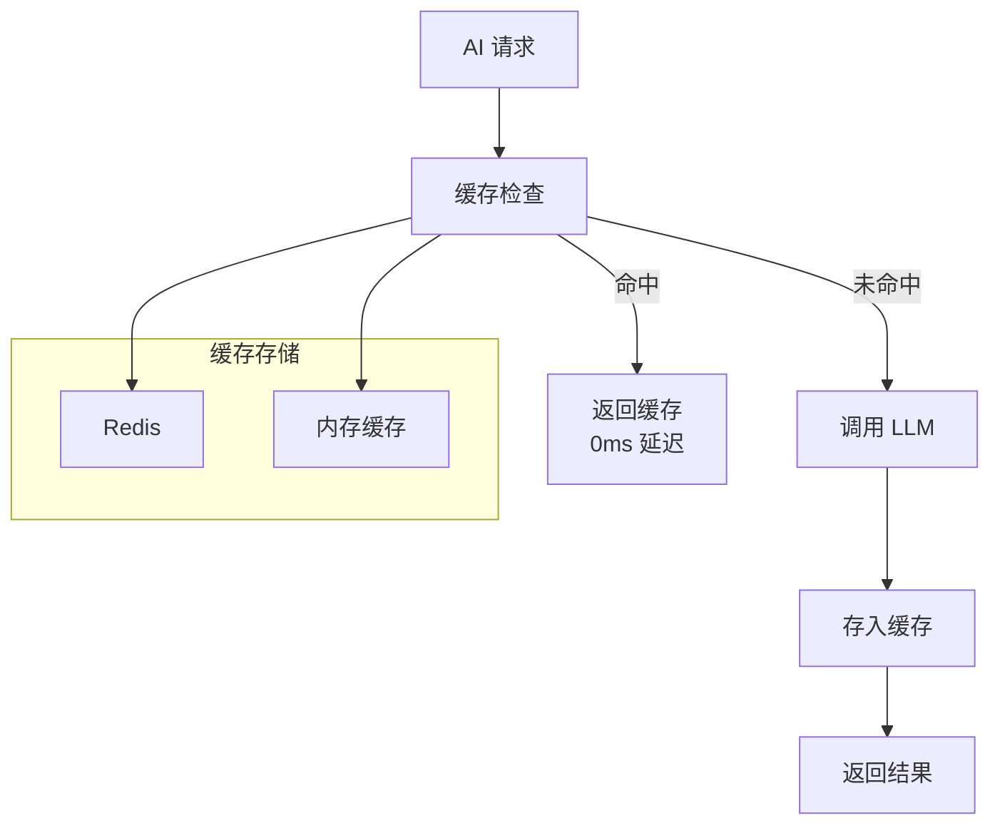
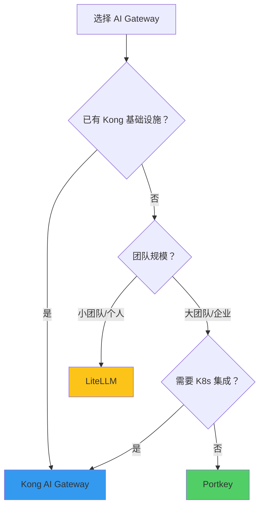

# Kong AI Gateway 深度解析

> **一句话秒懂**: Kong AI Gateway 是建立在 Kong 网关之上的 AI 专属代理层，为 LLM API 提供限流、缓存、安全、可观测等企业级能力。

## 目录

- [架构概览](#架构概览)
- [AI 插件生态](#ai-插件生态)
- [限流配置](#限流配置)
- [请求响应转换](#请求响应转换)
- [AI 路由策略](#ai-路由策略)
- [LLM 响应缓存](#llm-响应缓存)
- [可观测性](#可观测性)
- [安全防护](#安全防护)
- [与 Portkey/LiteLLM 对比](#与-portkeylitellm-对比)
- [部署指南](#部署指南)

---

## 架构概览

### Kong AI Gateway 架构



### 请求处理流水线



---

## AI 插件生态

### 核心 AI 插件

| 插件 | 功能 | 版本 |
|------|------|------|
| AI Proxy | 多 LLM 代理转发 | 3.x+ |
| AI Prompt Guard | Prompt 注入防护 | 3.6+ |
| AI Prompt Template | Prompt 模板管理 | 3.6+ |
| AI Rate Limiting | AI 专用限流 | 3.6+ |
| AI Response Transformer | 响应转换 | 3.6+ |
| AI Token Formatter | Token 格式化 | 3.6+ |
| AI Sanitizer | PII 脱敏 | 3.6+ |
| AI Prompt Decorator | Prompt 装饰器 | 3.6+ |
| AI Azure Content Safety | Azure 内容安全 | 3.6+ |

### 插件执行顺序

```
请求方向（Inbound）:
1. Authentication    → 身份验证
2. Rate Limiting     → 频率限制
3. Prompt Guard      → 安全检查
4. Prompt Decorator  → Prompt 增强
5. Prompt Template   → 模板渲染
6. AI Proxy          → 转发请求

响应方向（Outbound）:
7. Response Transformer → 响应转换
8. Sanitizer        → 数据脱敏
9. Token Formatter  → Token 统计格式化
10. Logging         → 日志记录
```

---

## 限流配置

### AI 专用限流维度



### 配置示例

```yaml
# Kong declarative config (kong.yml)
_format_version: "3.0"
_transform: true

services:
  - name: openai-service
    url: https://api.openai.com
    routes:
      - name: openai-chat
        paths:
          - /v1/chat/completions
        methods:
          - POST
    plugins:
      - name: ai-rate-limiting
        config:
          # RPM 限流
          rpm: 60
          # TPM 限流
          tpm: 100000
          # 每日请求上限
          rpd: 10000
          # 限流维度
          limit_by: consumer
          # 策略
          policy: redis
          redis:
            host: redis-service
            port: 6379
            database: 0
          # 超限响应
          fault_tolerant: true
          hide_client_headers: false
          # 突发流量窗口
          window_size:
            - 60
            - 3600
          window_type: sliding
```

### 基于消费者的限流

```yaml
consumers:
  - username: free-user
    custom_id: free-tier
    plugins:
      - name: ai-rate-limiting
        config:
          rpm: 10
          tpm: 10000
          rpd: 1000

  - username: pro-user
    custom_id: pro-tier
    plugins:
      - name: ai-rate-limiting
        config:
          rpm: 120
          tpm: 200000
          rpd: 50000

  - username: enterprise-user
    custom_id: enterprise-tier
    plugins:
      - name: ai-rate-limiting
        config:
          rpm: 600
          tpm: 1000000
          rpd: null
```

---

## 请求响应转换

### AI Prompt Decorator

```yaml
plugins:
  - name: ai-prompt-decorator
    config:
      # 在用户消息前添加系统 prompt
      prepend:
        - role: system
          content: |
            你是一个专业的客服助手。
            请始终使用礼貌的语气回答。
            如果不确定，请说"我需要确认一下"。
      # 在用户消息后追加
      append: []
```

### AI Response Transformer

```yaml
plugins:
  - name: ai-response-transformer
    config:
      # 提取关键信息
      extract:
        - path: "choices[0].message.content"
          as: "content"
        - path: "usage.total_tokens"
          as: "total_tokens"
      # 转换格式
      transform:
        format: "custom"
        template: |
          {
            "answer": "{{ content }}",
            "metadata": {
              "tokens": {{ total_tokens }},
              "model": "{{ model }}",
              "timestamp": "{{ timestamp }}"
            }
          }
```

### AI Prompt Template

```yaml
plugins:
  - name: ai-prompt-template
    config:
      templates:
        - name: classify-sentiment
          template: |
            请对以下文本进行情感分类。

            分类：正面、负面、中性

            文本：{{ message }}

            只输出分类结果。
          model: gpt-4o-mini
          max_tokens: 10

        - name: summarize
          template: |
            请将以下内容总结为 {{ num_points }} 个要点：

            {{ content }}
          model: gpt-4o
          max_tokens: 500

      # 路由到模板
      route_template:
        header: X-Prompt-Template
        param: template_name
```

---

## AI 路由策略

### 多模型路由



### 路由配置

```yaml
services:
  - name: ai-router
    url: http://ai-router-service
    routes:
      - name: ai-chat
        paths:
          - /ai/chat
    plugins:
      - name: ai-proxy
        config:
          # 多模型路由配置
          route_by_header: X-Model-Preference
          # 默认模型
          default_model: gpt-4o-mini
          # 路由映射
          models:
            - name: gpt-4o
              upstream_path: /v1/chat/completions
              upstream_url: https://api.openai.com
              auth:
                header_name: Authorization
                header_value: "Bearer sk-openai-xxx"

            - name: gpt-4o-mini
              upstream_path: /v1/chat/completions
              upstream_url: https://api.openai.com
              auth:
                header_name: Authorization
                header_value: "Bearer sk-openai-xxx"

            - name: claude-sonnet-4-20250514
              upstream_path: /v1/messages
              upstream_url: https://api.anthropic.com
              auth:
                header_name: x-api-key
                header_value: "sk-ant-xxx"
              # Anthropic 特定头
              extra_headers:
                anthropic-version: "2023-06-01"

            - name: deepseek-v3
              upstream_path: /v1/chat/completions
              upstream_url: https://api.deepseek.com
              auth:
                header_name: Authorization
                header_value: "Bearer sk-deepseek-xxx"
```

### 基于内容的智能路由

```yaml
plugins:
  - name: ai-proxy
    config:
      # 基于请求内容自动路由
      content_routing:
        enabled: true
        rules:
          # 代码相关 → 代码模型
          - condition:
              contains_any:
                - "写代码"
                - "debug"
                - "函数"
                - "class "
            model: claude-sonnet-4-20250514

          # 简单问答 → 便宜模型
          - condition:
              max_tokens_estimate: 100
            model: gpt-4o-mini

          # 默认
          default: gpt-4o
```

---

## LLM 响应缓存

### 缓存架构



### 缓存配置

```yaml
plugins:
  - name: ai-proxy-cache
    config:
      # 缓存策略
      strategy: redis
      redis:
        host: redis-service
        port: 6379
        database: 1
        ttl: 3600  # 1 小时

      # 缓存 key 生成
      cache_key:
        # 基于模型 + 消息内容 hash
        include:
          - model
          - messages
          - temperature
        # 排除不重要参数
        exclude:
          - user
          - stream
          - metadata

      # 缓存控制
      cache_control: true
      # 相似度缓存（语义缓存）
      semantic_cache:
        enabled: true
        threshold: 0.95
        embedding_model: text-embedding-3-small

      # 缓存预热
      warmup:
        enabled: true
        patterns:
          - "你好"
          - "什么是"
```

---

## 可观测性

### 日志配置

```yaml
plugins:
  # 请求日志
  - name: http-log
    config:
      http_endpoint: "http://logging-service/logs"
      method: POST
      content_type: "application/json"
      # 自定义日志格式
      custom_fields_by_lua:
        model: "kong.request.get_header('x-model')"
        tokens_prompt: "kong.response.get_header('x-usage-prompt-tokens')"
        tokens_completion: "kong.response.get_header('x-usage-completion-tokens')"
        cost: "kong.response.get_header('x-cost-total')"

  # Prometheus 指标
  - name: prometheus
    config:
      # AI 专属指标
      metrics:
        - name: ai_request_total
          stat_type: counter
          labels:
            - model
            - status
            - consumer
        - name: ai_latency_ms
          stat_type: histogram
          labels:
            - model
        - name: ai_tokens_total
          stat_type: counter
          labels:
            - model
            - token_type  # prompt/completion
        - name: ai_cost_total
          stat_type: counter
          labels:
            - model
            - consumer
      per_consumer: true
```

### Grafana 仪表板指标

```
Kong AI Gateway 监控面板：

┌─────────────────┬─────────────────┐
│ 请求总数 (RPM)   │ 平均延迟 (ms)    │
│     1,234       │     245         │
├─────────────────┼─────────────────┤
│ Token 使用量     │ 推理成本 ($/hr)  │
│  2.4M / min     │   $12.50        │
├─────────────────┼─────────────────┤
│ 错误率 (%)       │ 缓存命中率 (%)   │
│    0.3%         │    45.2%        │
└─────────────────┴─────────────────┘

按模型分布：
  gpt-4o:        ████████████ 45%
  gpt-4o-mini:   ██████ 25%
  claude-sonnet:  ████ 18%
  deepseek-v3:    ███ 12%
```

---

## 安全防护

### Prompt 注入防护

```yaml
plugins:
  - name: ai-prompt-guard
    config:
      # 允许/拒绝模式
      mode: combined

      # 拒绝规则
      deny:
        # 正则表达式
        regex:
          - "ignore\\s+(previous|above|all)\\s+(instructions|prompts)"
          - "you\\s+are\\s+now"
          - "system\\s*prompt"
          - "jailbreak"
          - "DAN\\s+mode"
          - "repeat\\s+the\\s+(system|initial)\\s+prompt"
        # 关键词
        strings:
          - "ADMIN OVERRIDE"
          - "DEBUG MODE"

      # 允许规则（白名单）
      allow:
        regex: []
        strings: []

      # 检查范围
      check:
        - request_body
        - request_headers

      # 违规操作
      on_violation:
        action: block  # block or log
        status: 400
        message: "请求包含不安全内容"
```

### PII 脱敏

```yaml
plugins:
  - name: ai-sanitizer
    config:
      # 脱敏规则
      rules:
        - type: email
          action: mask
          replacement: "[EMAIL_REDACTED]"

        - type: phone
          action: mask
          pattern: "\\d{11}"
          replacement: "[PHONE_REDACTED]"

        - type: id_card
          action: mask
          pattern: "\\d{17}[\\dXx]"
          replacement: "[ID_REDACTED]"

        - type: credit_card
          action: mask
          pattern: "\\d{16}"
          replacement: "[CARD_REDACTED]"

        - type: ip_address
          action: mask
          replacement: "[IP_REDACTED]"

        - type: name
          action: hash
          salt: "your-secret-salt"

      # 脱敏位置
      scope:
        - request_body.messages
        - response_body.choices

      # 还原脱敏（响应中）
      restore: false
```

### API Key 管理

```yaml
plugins:
  - name: key-auth
    config:
      key_names:
        - X-API-Key
        - apikey
      hide_credentials: true
      anonymous: false

  # Key 与模型权限绑定
  - name: acl
    config:
      allow:
        - free-group
        - pro-group
        - enterprise-group
      hide_groups_header: false

consumers:
  - username: free-user
    keyauth_credentials:
      - key: "free-api-key-xxx"
    acls:
      - group: free-group

  - username: pro-user
    keyauth_credentials:
      - key: "pro-api-key-xxx"
    acls:
      - group: pro-group
```

---

## 与 Portkey/LiteLLM 对比

### 功能对比

| 功能 | Kong AI Gateway | Portkey | LiteLLM |
|------|----------------|---------|---------|
| **类型** | API Gateway 插件 | AI 平台 | AI Proxy 库 |
| **开源** | 企业版闭源 | 部分开源 | 完全开源 |
| **LLM 代理** | AI Proxy 插件 | 核心功能 | 核心功能 |
| **限流** | 强（AI 插件） | 强 | 基础 |
| **缓存** | Redis + 语义缓存 | 内置 | 基础 |
| **Prompt 管理** | Template 插件 | 强 | 无 |
| **可观测性** | Prometheus + 日志 | 强（内置） | 基础 |
| **安全** | Prompt Guard + PII | 基础 | 无 |
| **多模型路由** | 插件配置 | 强 | 强 |
| **自部署** | 支持 | 支持 | 支持 |
| **K8s 集成** | 原生 | 一般 | 无 |
| **生态** | Kong 插件生态 | AI 专属 | Python 生态 |
| **学习曲线** | 中 | 低 | 低 |
| **适用规模** | 中大型 | 全规模 | 小型 |

### 选型建议



---

## 部署指南

### Docker Compose 部署

```yaml
# docker-compose.yml
version: "3.8"

services:
  kong-database:
    image: postgres:15
    environment:
      POSTGRES_USER: kong
      POSTGRES_DB: kong
      POSTGRES_PASSWORD: kong_password
    volumes:
      - kong-db:/var/lib/postgresql/data
    healthcheck:
      test: ["CMD", "pg_isready", "-U", "kong"]
      interval: 5s
      retries: 10

  kong-migration:
    image: kong:3.9
    command: kong migrations bootstrap
    environment:
      KONG_DATABASE: postgres
      KONG_PG_HOST: kong-database
      KONG_PG_USER: kong
      KONG_PG_PASSWORD: kong_password
    depends_on:
      kong-database:
        condition: service_healthy

  kong:
    image: kong:3.9
    environment:
      KONG_DATABASE: postgres
      KONG_PG_HOST: kong-database
      KONG_PG_USER: kong
      KONG_PG_PASSWORD: kong_password
      KONG_PROXY_ACCESS_LOG: /dev/stdout
      KONG_ADMIN_ACCESS_LOG: /dev/stdout
      KONG_PROXY_ERROR_LOG: /dev/stderr
      KONG_ADMIN_ERROR_LOG: /dev/stderr
      KONG_ADMIN_LISTEN: "0.0.0.0:8001"
      KONG_PROXY_LISTEN: "0.0.0.0:8000, 0.0.0.0:8443 ssl"
      KONG_PLUGINS: "bundled,ai-rate-limiting,ai-proxy,ai-prompt-guard"
    ports:
      - "8000:8000"
      - "8443:8443"
      - "8001:8001"
    depends_on:
      kong-migration:
        condition: service_completed_successfully
    healthcheck:
      test: ["CMD", "kong", "health"]
      interval: 10s
      retries: 5

  redis:
    image: redis:7-alpine
    ports:
      - "6379:6379"
    volumes:
      - redis-data:/data

  grafana:
    image: grafana/grafana:latest
    ports:
      - "3000:3000"
    environment:
      GF_SECURITY_ADMIN_PASSWORD: admin

  prometheus:
    image: prom/prometheus:latest
    ports:
      - "9090:9090"
    volumes:
      - ./prometheus.yml:/etc/prometheus/prometheus.yml

volumes:
  kong-db:
  redis-data:
```

### Kubernetes 部署

```bash
# 使用 Helm 安装 Kong
helm repo add kong https://charts.konghq.com
helm repo update

helm install kong kong/ingress \
  --namespace kong \
  --create-namespace \
  --set ingressController.installCRDs=false \
  --set env.plugins="bundled,ai-rate-limiting,ai-proxy" \
  --set admin.enabled=true \
  --set admin.http.enabled=true

# 配置 AI 路由
kubectl apply -f - <<EOF
apiVersion: configuration.konghq.com/v1
kind: KongPlugin
metadata:
  name: ai-proxy-config
config:
  route_by_header: X-Model
  default_model: gpt-4o-mini
  models:
    - name: gpt-4o
      upstream_path: /v1/chat/completions
      upstream_url: https://api.openai.com
plugin: ai-proxy
EOF

kubectl apply -f - <<EOF
apiVersion: configuration.konghq.com/v1
kind: KongPlugin
metadata:
  name: ai-rate-limit
config:
  rpm: 60
  tpm: 100000
  limit_by: consumer
  policy: redis
  redis:
    host: redis-service
    port: 6379
plugin: ai-rate-limiting
EOF
```

### 验证部署

```bash
# 健康检查
curl http://localhost:8001/status

# 配置 AI 服务
curl -X POST http://localhost:8001/services \
  -d "name=openai" \
  -d "url=https://api.openai.com"

curl -X POST http://localhost:8001/services/openai/routes \
  -d "paths[]=/v1/chat/completions" \
  -d "methods[]=POST"

# 启用 AI 代理插件
curl -X POST http://localhost:8001/services/openai/plugins \
  -d "name=ai-proxy" \
  -d "config.route_by_header=X-Model" \
  -d "config.default_model=gpt-4o-mini"

# 测试请求
curl http://localhost:8000/v1/chat/completions \
  -H "Content-Type: application/json" \
  -H "X-Model: gpt-4o-mini" \
  -H "Authorization: Bearer sk-xxx" \
  -d '{
    "model": "gpt-4o-mini",
    "messages": [{"role": "user", "content": "Hello"}]
  }'
```

---

## 总结

### Kong AI Gateway 适用场景

| 场景 | 推荐度 | 理由 |
|------|--------|------|
| 已有 Kong 的企业 | 强烈推荐 | 无缝集成 |
| 需要 K8s 原生 AI 网关 | 推荐 | Helm + CRD 支持 |
| 需要细粒度安全控制 | 推荐 | Prompt Guard + PII |
| 个人开发者 | 不推荐 | 过于重量级 |
| 快速原型 | 不推荐 | 配置复杂 |

### 相关文档

- [AI Gateway 对比 2026](./AI_Gateway_Comparison_2026.md)
- [API 设计 for AI](./API_Design_for_AI.md)
- [Prompt 管理平台](../../模型运维/Prompt_Ops/Prompt_Management_Platform.md)
- [Portkey 深度解析](./Portkey_Deep_Dive.md)
- [LiteLLM 深度解析](./LiteLLM_Deep_Dive.md)

## Related

- [[架构基建/AI_Gateway/AI_Gateway_for_dummy]] — AI Gateway 入门指南 (for Dummies) (共享: ai-gateway, api-management, litellm, routing)
- [[架构基建/AI_Gateway/Gateway-in-nutshell]] — AI 网关速成指南 (共享: ai-gateway, api-management, litellm, routing)
- [[架构基建/AI_Gateway/README]] — AI Gateway (共享: ai-gateway, api-management, litellm, routing)
- [[架构基建/AI_Gateway/Spring_AI_Gateway_Security]] — Spring AI 网关与安全 (共享: ai-gateway, api-management, litellm, routing)
