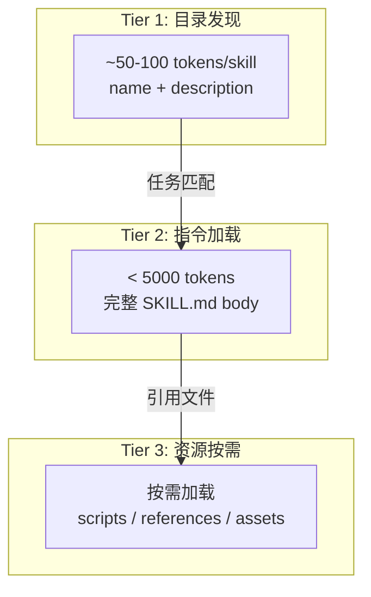
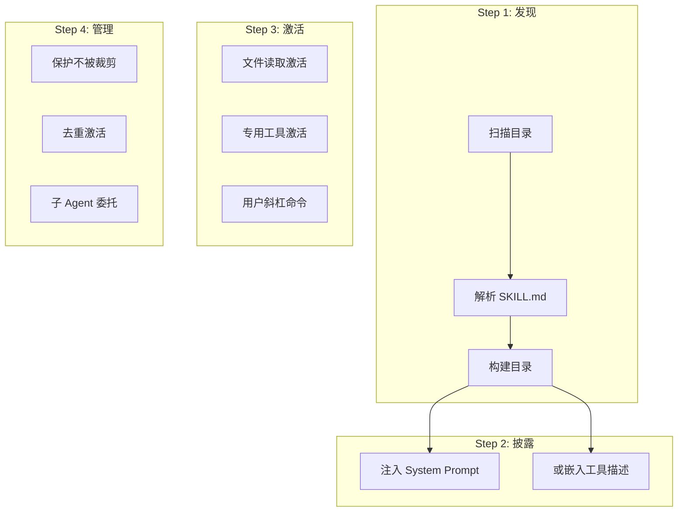

# Agent Skills 深度解析

> 🎯 **目标**：全面掌握 Agent Skills 开放标准 —— 从核心概念、完整规范、最佳实践到评估体系，构建生产级 Skill 的完整知识体系。

---

## 一、Agent Skills 是什么

**Agent Skills** 是一种轻量级开放格式（open format），用于扩展 AI Agent 的能力。它最初由 Anthropic 开发并作为开放标准发布，已被 30+ 主流 Agent 产品采纳。

### 核心理念

```
Agent Skills = 文件夹 + SKILL.md
```

一个 Skill 就是一个包含 `SKILL.md` 文件的目录。这个文件包含元数据（至少 `name` 和 `description`）以及指令，告诉 Agent 如何执行特定任务。Skill 还可以捆绑脚本、模板和参考资料。

### 为什么需要 Agent Skills

| 维度 | 问题 | Agent Skills 的解决方式 |
|------|------|------------------------|
| **上下文不足** | Agent 缺乏领域特定知识 | 按需加载专业化指令 |
| **可复用性** | 每次都要从头教 Agent | 构建一次，到处使用 |
| **跨平台** | 不同 Agent 产品互不兼容 | 同一 Skill 跨多个产品运行 |
| **团队协作** | 组织知识无法共享 | 版本控制、可审计的知识包 |
| **质量一致** | 输出质量不稳定 | 标准化工作流 + 评估循环 |

### 能力矩阵

Agent Skills 能够赋能：

- **领域专长**：将专业知识打包为可复用指令（法律审查、数据分析管线等）
- **新能力**：给 Agent 添加全新能力（创建演示文稿、构建 MCP 服务器、分析数据集）
- **可重复工作流**：将多步骤任务变成一致且可审计的工作流
- **互操作性**：跨不同 Skills 兼容的 Agent 产品复用同一 Skill

---

## 二、核心机制：渐进式披露（Progressive Disclosure）

Agent Skills 的核心设计模式是**渐进式披露** —— 高效管理上下文的分层加载策略：



### 三层加载详细对比

| 层级 | 加载内容 | 加载时机 | Token 开销 |
|------|---------|---------|-----------|
| **1. 目录（Catalog）** | `name` + `description` | 会话启动时 | ~50-100 tokens/skill |
| **2. 指令（Instructions）** | 完整 `SKILL.md` body | Skill 被激活时 | < 5000 tokens（推荐） |
| **3. 资源（Resources）** | scripts、references、assets | 指令中引用时 | 按需变化 |

**关键优势**：即使安装了 20 个 Skill，Agent 也不会一次性支付 20 个完整指令集的 token 成本 —— 只有实际使用的才会被加载。

### 生命周期示例

```
用户: "帮我提取这个 PDF 中的文本"
                     │
                     ▼
        ┌──────────────────────┐
        │  Tier 1: Agent 扫描  │
        │  发现 pdf-processing │
        │  skill 的 name +    │
        │  description        │
        └──────────┬───────────┘
                   │
                   ▼ "匹配！用户需要处理 PDF"
        ┌──────────────────────┐
        │  Tier 2: 加载完整   │
        │  SKILL.md 指令      │
        │  - 使用 pdfplumber  │
        │  - 处理扫描件用 OCR │
        └──────────┬───────────┘
                   │
                   ▼ "需要执行提取脚本"
        ┌──────────────────────┐
        │  Tier 3: 按需加载   │
        │  scripts/extract.py  │
        │  references/...      │
        └──────────────────────┘
```

---

## 三、完整规范（Specification）

### 3.1 目录结构

```
skill-name/
├── SKILL.md          # 必需：元数据 + 指令
├── scripts/          # 可选：可执行代码
├── references/       # 可选：文档参考
├── assets/           # 可选：模板、资源
└── ...               # 任意额外文件或目录
```

### 3.2 SKILL.md 格式

`SKILL.md` 文件必须包含 YAML frontmatter 后跟 Markdown 内容。

#### Frontmatter 字段

| 字段 | 必需 | 约束 |
|------|------|------|
| `name` | ✅ | 最多 64 字符。仅小写字母、数字和连字符。不能以连字符开头或结尾。 |
| `description` | ✅ | 最多 1024 字符。非空。描述 Skill 功能和使用时机。 |
| `license` | ❌ | 许可证名称或捆绑的许可证文件引用。 |
| `compatibility` | ❌ | 最多 500 字符。指示环境要求。 |
| `metadata` | ❌ | 任意键值映射，用于额外元数据。 |
| `allowed-tools` | ❌ | 空格分隔的预批准工具字符串。（实验性） |

#### 最小示例

```markdown
---
name: skill-name
description: A description of what this skill does and when to use it.
---

# Skill Instructions

Instructions here...
```

#### 完整示例

```markdown
---
name: pdf-processing
description: Extract PDF text, fill forms, merge files. Use when handling PDFs.
license: Apache-2.0
compatibility: Requires Python 3.14+ and uv
metadata:
  author: example-org
  version: "1.0"
allowed-tools: Bash(python:*) Read
---

# PDF Processing

## When to use this skill
Use this skill when the user needs to work with PDF files...

## How to extract text
1. Use pdfplumber for text extraction...
```

#### `name` 字段规则

```
✅ 有效：pdf-processing, data-analysis, code-review
❌ 无效：PDF-Processing (大写), -pdf (连字符开头), pdf--processing (连续连字符)
```

**name 必须匹配父目录名称。**

#### `description` 字段最佳实践

```yaml
# 好的描述
description: Extracts text and tables from PDF files, fills PDF forms, and merges multiple PDFs. Use when working with PDF documents or when the user mentions PDFs, forms, or document extraction.

# 差的描述
description: Helps with PDFs.
```

好的 `description` 应该：
- 使用祈使句式（"Use this skill when..."）
- 关注用户意图，而非实现细节
- 包含具体关键词帮助 Agent 识别相关任务
- 宁可过于"主动"也不要遗漏触发场景
- **注意硬性限制**：最多 **1024 字符**

#### 触发测试查询示例

设计 ~20 个查询（10 个应触发 + 10 个不应触发），评估 description 质量：

```json
[
  {
    "query": "I've got a spreadsheet with revenue in col C — can you chart it?",
    "should_trigger": true
  },
  {
    "query": "whats the quickest way to convert this json file to yaml",
    "should_trigger": false
  },
  {
    "query": "my boss wants a report from this data file",
    "should_trigger": true
  },
  {
    "query": "I need to update the formulas in my Excel budget",
    "should_trigger": false
  }
]
```

每个查询运行 3 次，计算触发率。应触发查询 > 0.5 通过，不应触发查询 < 0.5 通过。

### 3.3 Body 内容

Markdown body 包含 Skill 指令，没有格式限制。推荐章节：

- **When to use this skill** — 明确触发条件（虽然 description 已含此信息，body 中可扩展）
- **Workflow** — 分步指令（最核心部分）
- **Gotchas** — 环境特定的陷阱
- **Examples** — 输入/输出示例
- **Output format** — 输出格式模板

#### 推荐的 SKILL.md body 结构模板

```markdown
# Skill 标题

## When to use this skill
[扩展触发条件，比 description 更详细]

## Workflow
1. 步骤 1
2. 步骤 2
3. ...

## Tools / Dependencies
[需要的工具、库、命令]

## Gotchas
[环境特定的非显而易见陷阱]

## Output format
[输出格式模板或示例]

## Examples
### Example 1: [场景描述]
输入: ...
输出: ...
```

> ⚠️ `SKILL.md` 建议保持在 **500 行以内**、**5000 tokens 以内**。将详细参考资料移至 `references/` 目录。

### 3.4 可选目录详解

#### `scripts/` - 可执行脚本

包含 Agent 可运行的代码。脚本应该：
- 自包含或明确记录依赖
- 包含有用的错误消息
- 优雅处理边缘情况

#### `references/` - 参考资料

包含 Agent 需要时可以读取的额外文档：
- `REFERENCE.md` — 详细技术参考
- `FORMS.md` — 表单模板或结构化数据格式
- 领域特定文件（`finance.md`、`legal.md` 等）

#### `assets/` - 静态资源

包含模板、图片、数据文件等静态资源。

### 3.5 文件引用

引用其他文件时，使用**从 Skill 根目录的相对路径**：

```markdown
See [the reference guide](references/REFERENCE.md) for details.

Run the extraction script:
`scripts/extract.py`
```

**保持文件引用一层深度**，避免深度嵌套的引用链。

### 3.6 `allowed-tools` 字段（实验性）

空格分隔的预批准工具字符串，减少 Agent 执行时的权限确认提示：

```yaml
allowed-tools: Bash(git:*) Bash(jq:*) Read Write
```

**语法**：`ToolName` 或 `ToolName(pattern:*)` 其中 pattern 匹配命令前缀。

> ⚠️ 实验性字段，支持程度因 Agent 实现而异。

### 3.7 `evals/` 目录（评估用）

可选目录，存放 Skill 的测试用例和测试数据：

```
my-skill/
├── SKILL.md
└── evals/
    ├── evals.json          # 测试用例定义
    └── files/              # 测试输入文件
        ├── sample1.csv
        └── sample2.csv
```

详见第六节「评估体系」。

### 3.8 验证工具

使用 [skills-ref](https://github.com/agentskills/agentskills/tree/main/skills-ref) 参考库验证 Skills：

```bash
skills-ref validate ./my-skill
```

检查 `SKILL.md` frontmatter 是否有效，命名约定是否遵循。

---

## 四、创建 Skills 的最佳实践

### 4.1 从真实专业知识出发

最常见的陷阱是让 LLM 在没有领域特定上下文的情况下生成 Skill —— 结果是模糊、通用的流程。

#### 方法一：从实际任务中提取

在对话中完成一个真实任务，提供上下文、纠正和偏好。然后提取可复用模式：

- **成功的步骤** — 导致成功的操作序列
- **你做的纠正** — 你引导 Agent 方法的地方
- **输入/输出格式** — 数据长什么样
- **你提供的上下文** — 项目特定事实、约定或约束

#### 方法二：从现有项目制品综合

好的源材料包括：

- 内部文档、运维手册和风格指南
- API 规范、模式定义和配置文件
- 代码审查评论和问题跟踪器
- 版本控制历史（揭示实际改变的模式）
- 真实失败案例及其解决方案

### 4.2 用真实执行来精炼

```
执行 → 审查执行轨迹 → 修订 Skill → 再次执行 → 循环
```

> 💡 阅读执行轨迹（execution traces），而不仅仅是最终输出。如果 Agent 在无用步骤上浪费时间，常见原因是指令太模糊、不适用或选项太多没有明确默认值。

### 4.3 精明地使用上下文

#### 添加 Agent 缺少的，省略 Agent 已知的

```markdown
<!-- 太冗长 — Agent 已经知道 PDF 是什么 -->
PDF (Portable Document Format) 文件是一种常见文件格式，包含文本、
图片和其他内容。要提取文本，你需要使用一个库...

<!-- 更好 — 直接跳到 Agent 不会知道的内容 -->
## 提取 PDF 文本

使用 pdfplumber 进行文本提取。对于扫描文档，回退到 pdf2image + pytesseract。
```

对每段内容问自己："没有这条指令，Agent 会犯错吗？"如果答案是否，就删掉它。

#### 设计连贯的工作单元

决定一个 Skill 应该覆盖什么就像决定一个函数应该做什么：封装一个连贯的工作单元。

- **范围太窄** → 多个 Skill 被加载处理单个任务，增加开销和冲突风险
- **范围太宽** → 难以精确激活

#### 追求适度详细

过于全面的 Skill 可能弊大于利。简洁的、分步的指导加一个可工作的示例，通常优于详尽的文档。

#### 用渐进式披露组织大型 Skill

```
SKILL.md (< 500 行, < 5000 tokens)
  → references/api-errors.md (只在 API 返回非 200 时加载)
  → references/advanced-patterns.md (只在处理复杂场景时加载)
```

关键是告诉 Agent **何时**加载每个文件。

### 4.4 校准控制程度

#### 将具体程度匹配到任务的脆弱性

**给 Agent 自由**当多种方法有效且任务容忍变化时：
```markdown
## 代码审查过程
1. 检查所有数据库查询的 SQL 注入
2. 验证每个端点的认证检查
3. 寻找并发代码路径中的竞态条件
```

**精确指定**当操作脆弱、一致性重要或必须遵循特定序列时：
```markdown
## 数据库迁移
运行确切的这个序列：
python scripts/migrate.py --verify --backup
不要修改命令或添加额外标志。
```

#### 提供默认值，而非菜单

```markdown
<!-- 太多选项 -->
你可以使用 pypdf、pdfplumber、PyMuPDF 或 pdf2image...

<!-- 清晰的默认值 + 逃生舱 -->
使用 pdfplumber 进行文本提取。
对于需要 OCR 的扫描 PDF，改用 pdf2image + pytesseract。
```

#### 偏好过程而非声明

```markdown
<!-- 特定答案 — 仅对这个确切任务有用 -->
将 orders 表连接到 customers 表...

<!-- 可复用方法 — 适用于任何分析查询 -->
1. 从 references/schema.yaml 读取模式以找到相关表
2. 使用 _id 外键约定连接表
3. 将用户请求的过滤器应用为 WHERE 子句
4. 按需聚合数值列并格式化为 Markdown 表格
```

### 4.5 有效指令的模式

#### 模式一：陷阱清单（Gotchas）

许多 Skill 中最高价值的内容是陷阱清单 —— 环境特定的事实，违背合理假设：

```markdown
## 陷阱

- `users` 表使用软删除。查询必须包含 `WHERE deleted_at IS NULL`
  否则结果将包含已停用的账户。
- 用户 ID 在数据库中是 `user_id`，在认证服务中是 `uid`，
  在账单 API 中是 `accountId`。三个都指同一个值。
- `/health` 端点只要 Web 服务器在运行就返回 200，
  即使数据库连接断了。用 `/ready` 检查完整服务健康。
```

#### 模式二：输出格式模板

当需要特定格式输出时，提供模板比用散文描述更可靠：

```markdown
## 报告结构

# [分析标题]

## 执行摘要
[一段关键发现概述]

## 关键发现
- 发现 1 + 支持数据
- 发现 2 + 支持数据

## 建议
1. 具体可执行的建议
2. 具体可执行的建议
```

#### 模式三：多步骤工作流的检查清单

```markdown
## 表单处理工作流

进度：
- [ ] 步骤 1：分析表单（运行 `scripts/analyze_form.py`）
- [ ] 步骤 2：创建字段映射（编辑 `fields.json`）
- [ ] 步骤 3：验证映射（运行 `scripts/validate_fields.py`）
- [ ] 步骤 4：填写表单（运行 `scripts/fill_form.py`）
- [ ] 步骤 5：验证输出（运行 `scripts/verify_output.py`）
```

#### 模式四：验证循环

```markdown
## 编辑工作流

1. 进行编辑
2. 运行验证：`python scripts/validate.py output/`
3. 如果验证失败：
   - 查看错误消息
   - 修复问题
   - 再次运行验证
4. 只有验证通过后才继续
```

#### 模式五：计划-验证-执行

```markdown
## PDF 表单填写

1. 提取表单字段：`python scripts/analyze_form.py input.pdf` → `form_fields.json`
2. 创建 `field_values.json` 映射每个字段名到其预期值
3. 验证：`python scripts/validate_fields.py form_fields.json field_values.json`
4. 如果验证失败，修订 `field_values.json` 并重新验证
5. 填写表单：`python scripts/fill_form.py input.pdf field_values.json output.pdf`
```

---

## 五、脚本使用指南

### 5.1 一次性命令

当现有包已经满足需求时，直接在 `SKILL.md` 中引用，不需要 `scripts/` 目录：

| 工具 | 运行器 | 示例 |
|------|--------|------|
| **uvx** | `uv run` | `uvx ruff@0.8.0 check .` |
| **npx** | Node.js 自带 | `npx eslint@9 --fix .` |
| **bunx** | Bun 自带 | `bunx eslint@9 --fix .` |
| **pipx** | 需独立安装 | `pipx run 'ruff==0.8.0' check .` |
| **deno run** | Deno 自带 | `deno run npm:eslint@9 -- --fix .` |
| **go run** | Go 自带 | `go run golang.org/x/tools/cmd/goimports@v0.28.0 .` |

**关键技巧**：
- **固定版本**（如 `npx eslint@9.0.0`）确保行为一致
- **声明前提条件**（如 "Requires Node.js 18+"）
- **复杂命令移入脚本**

### 5.2 自包含脚本

多种语言支持内联依赖声明：

#### Python（PEP 723）

```python
# /// script
# dependencies = [
#   "beautifulsoup4",
# ]
# ///

from bs4 import BeautifulSoup
html = '<html><body><h1>Welcome</h1></body></html>'
print(BeautifulSoup(html, "html.parser").select_one("h1").get_text())
```

运行：`uv run scripts/extract.py`

#### Deno

```typescript
#!/usr/bin/env -S deno run
import * as cheerio from "npm:cheerio@1.0.0";
const $ = cheerio.load("<h1>Hello</h1>");
console.log($("h1").text());
```

运行：`deno run scripts/extract.ts`

#### Bun

```typescript
#!/usr/bin/env bun
import * as cheerio from "cheerio@1.0.0";
const $ = cheerio.load("<h1>Hello</h1>");
console.log($("h1").text());
```

运行：`bun run scripts/extract.ts`

#### Ruby

```ruby
require 'bundler/inline'
gemfile do
  source 'https://rubygems.org'
  gem 'nokogiri'
end
doc = Nokogiri::HTML('<h1>Hello</h1>')
puts doc.at_css('h1').text
```

运行：`ruby scripts/extract.rb`

### 5.3 为 Agent 设计脚本的准则

#### 1. 避免交互式提示（硬性要求）

Agent 在非交互式 shell 中运行，**无法**响应 TTY 提示。

```
❌ 差：脚本阻塞等待输入
$ python scripts/deploy.py
Target environment: _

✅ 好：清晰的错误 + 引导
$ python scripts/deploy.py
Error: --env is required. Options: development, staging, production.
Usage: python scripts/deploy.py --env staging --tag v1.2.3
```

#### 2. 用 `--help` 记录用法

```
Usage: scripts/process.py [OPTIONS] INPUT_FILE

Process input data and produce a summary report.

Options:
  --format FORMAT    Output format: json, csv, table (default: json)
  --output FILE      Write output to FILE instead of stdout

Examples:
  scripts/process.py data.csv
  scripts/process.py --format csv --output report.csv data.csv
```

#### 3. 写有用的错误消息

```
Error: --format must be one of: json, csv, table.
       Received: "xml"
```

#### 4. 使用结构化输出

优先 JSON、CSV、TSV 等结构化格式。

**分离数据和诊断**：结构化数据发到 stdout，进度/警告发到 stderr。

#### 5. 更多考虑

- **幂等性**：Agent 可能重试命令。"不存在则创建"比"创建并在重复时报错"更安全
- **输入约束**：用枚举拒绝歧义输入
- **干跑支持**：对破坏性操作提供 `--dry-run` 标志
- **有意义的退出码**：不同失败类型使用不同退出码
- **可预测的输出大小**：Agent 工具输出通常在 10-30K 字符截断

---

## 六、评估体系

### 6.1 测试用例设计

一个测试用例有三个部分：
- **Prompt**：真实用户消息
- **Expected output**：成功的人类可读描述
- **Input files**（可选）：Skill 需要的文件

```json
{
  "skill_name": "csv-analyzer",
  "evals": [
    {
      "id": 1,
      "prompt": "I have a CSV of monthly sales data in data/sales_2025.csv. Can you find the top 3 months by revenue and make a bar chart?",
      "expected_output": "A bar chart image showing the top 3 months by revenue, with labeled axes and values.",
      "files": ["evals/files/sales_2025.csv"],
      "assertions": [
        "The output includes a bar chart image file",
        "The chart shows exactly 3 months",
        "Both axes are labeled",
        "The chart title or caption mentions revenue"
      ]
    }
  ]
}
```

### 6.2 评估工作空间结构

```
csv-analyzer/
├── SKILL.md
└── evals/
    └── evals.json

csv-analyzer-workspace/
└── iteration-1/
    ├── eval-top-months-chart/
    │   ├── with_skill/
    │   │   ├── outputs/
    │   │   ├── timing.json
    │   │   └── grading.json
    │   └── without_skill/
    │       ├── outputs/
    │       ├── timing.json
    │       └── grading.json
    └── benchmark.json
```

### 6.3 核心评估循环

每个测试用例运行**两次**：一次**带 Skill**，一次**不带**（基线对比）。

```
┌──────────────┐     ┌──────────────┐     ┌──────────────┐
│  运行测试    │────▶│  评分断言    │────▶│  人工审查    │
│  (with/without)│     │  (grading)   │     │  (feedback)  │
└──────────────┘     └──────────────┘     └──────────────┘
        │                                         │
        ▼                                         ▼
┌──────────────┐     ┌──────────────┐     ┌──────────────┐
│  聚合结果    │────▶│  分析模式    │────▶│  迭代改进    │
│  (benchmark) │     │  (patterns)  │     │  (iterate)   │
└──────────────┘     └──────────────┘     └──────────────┘
```

### 6.4 断言设计原则

**好的断言**：
- `"输出文件是有效的 JSON"` — 可编程验证
- `"条形图有标签化的坐标轴"` — 具体且可观察
- `"报告包含至少 3 条建议"` — 可计数

**弱的断言**：
- `"输出是好的"` — 太模糊
- `"输出使用确切短语 'Total Revenue: $X'"` — 太脆弱

### 6.5 评分（Grading）

```json
{
  "assertion_results": [
    {
      "text": "The output includes a bar chart image file",
      "passed": true,
      "evidence": "Found chart.png (45KB) in outputs directory"
    },
    {
      "text": "Both axes are labeled",
      "passed": false,
      "evidence": "Y-axis is labeled 'Revenue ($)' but X-axis has no label"
    }
  ],
  "summary": {
    "passed": 3,
    "failed": 1,
    "total": 4,
    "pass_rate": 0.75
  }
}
```

### 6.6 基准聚合（benchmark.json）

所有测试用例评分完毕后，计算汇总统计：

```json
{
  "run_summary": {
    "with_skill": {
      "pass_rate": { "mean": 0.83, "stddev": 0.06 },
      "time_seconds": { "mean": 45.0, "stddev": 12.0 },
      "tokens": { "mean": 3800, "stddev": 400 }
    },
    "without_skill": {
      "pass_rate": { "mean": 0.33, "stddev": 0.10 },
      "time_seconds": { "mean": 32.0, "stddev": 8.0 },
      "tokens": { "mean": 2100, "stddev": 300 }
    },
    "delta": {
      "pass_rate": 0.50,
      "time_seconds": 13.0,
      "tokens": 1700
    }
  }
}
```

`delta` 告诉你 Skill 的成本（更多时间/Token）和收益（更高通过率）。

### 6.7 迭代优化信号来源

| 信号 | 来源 | 行动 |
|------|------|------|
| 失败的断言 | grading.json | 修复特定缺口 |
| 人工反馈 | feedback.json | 修复整体质量问题 |
| 执行轨迹 | Agent 完整日志 | 找到"为什么"出错 |
| 总是通过的断言 | benchmark 分析 | 删除，不提供有用信息 |
| 总是失败的断言 | benchmark 分析 | 修复断言或 Skill |
| 高 stddev | 多次运行 | 指令太模糊，增加具体性 |
```

### 6.6 描述优化（触发准确性）

#### 评估触发率的方法

1. 设计 ~20 个查询：8-10 个应该触发，8-10 个不应触发
2. 每个查询运行 3 次，计算**触发率**
3. 触发率 > 0.5 → 通过（应触发查询），< 0.5 → 通过（不应触发查询）

#### 避免过拟合

- **训练集（~60%）**：用于指导改进
- **验证集（~40%）**：仅用于检查泛化能力
- 选择验证集通过率最高的迭代版本

#### Before & After 对比

```yaml
# Before
description: Process CSV files.

# After
description: >
  Analyze CSV and tabular data files — compute summary statistics,
  add derived columns, generate charts, and clean messy data. Use this
  skill when the user has a CSV, TSV, or Excel file and wants to
  explore, transform, or visualize the data, even if they don't
  explicitly mention "CSV" or "analysis."
```

---

## 七、客户端集成指南

### 7.1 集成架构



### 7.2 扫描路径

| 范围 | 路径 | 用途 |
|------|------|------|
| 项目级 | `<project>/.<client>/skills/` | 客户端原生位置 |
| 项目级 | `<project>/.agents/skills/` | 跨客户端互操作 |
| 用户级 | `~/.<client>/skills/` | 客户端原生位置 |
| 用户级 | `~/.agents/skills/` | 跨客户端互操作 |

`.agents/skills/` 已成为跨客户端 Skill 共享的广泛采纳约定。

### 7.3 激活机制

#### 文件读取激活

最简单的方案 —— 模型使用标准文件读取工具加载 `SKILL.md`。

#### 专用工具激活

注册 `activate_skill` 工具，返回内容：
- 可以剥离 YAML frontmatter
- 用结构化标签包装内容
- 列出捆绑资源
- 执行权限检查

#### 结构化包装示例

```xml
<skill_content name="pdf-processing">
# PDF Processing
...

Skill directory: /home/user/.agents/skills/pdf-processing
Relative paths in this skill are relative to the skill directory.

<skill_resources>
  <file>scripts/extract.py</file>
  <file>scripts/merge.py</file>
  <file>references/pdf-spec-summary.md</file>
</skill_resources>
</skill_content>
```

### 7.4 上下文管理

- **保护 Skill 内容不被裁剪**：标记 Skill 工具输出为受保护
- **去重激活**：跟踪已激活的 Skill，避免重复注入
- **子 Agent 委托**（高级模式）：在独立子 Agent 会话中运行 Skill

### 7.5 安全与信任考虑

#### 项目级 Skill 的信任检查

项目级 Skills 来自代码仓库，可能不受信任（如刚克隆的开源项目）。建议：

- 仅在用户标记项目文件夹为**受信任**后才加载项目级 Skills
- 防止不受信任的仓库静默注入指令到 Agent 上下文

#### 畸形 YAML 处理

为其他客户端编写的 Skill 文件可能包含技术上的无效 YAML。最常见的问题是未引用值中的冒号：

```yaml
# 技术上无效的 YAML — 冒号破坏解析
description: Use this skill when: the user asks about PDFs
```

建议使用**宽松验证**：警告但仍然加载 Skill：
- name 不匹配父目录名 → 警告，继续加载
- name 超过 64 字符 → 警告，继续加载
- description 缺失或为空 → 跳过该 Skill，记录错误
- YAML 完全无法解析 → 跳过，记录错误

#### 云端/沙箱 Agent 的考虑

如果 Agent 运行在容器或远程服务器上：
- **项目级 Skills**：随代码仓库克隆，可在 repo 目录树中扫描
- **用户级/组织级 Skills**：需要从外部来源配置（如克隆配置仓库、接受 Skill URL）
- **内置 Skills**：可打包为 Agent 部署产物的静态资产

### 7.6 不同 Agent 客户端的路径差异

| 客户端 | 项目级路径 | 用户级路径 |
|--------|-----------|-----------|
| **Claude Code** | `.claude/skills/` 或 `.agents/skills/` | `~/.claude/skills/` 或 `~/.agents/skills/` |
| **VS Code / Copilot** | `.agents/skills/` | `~/.agents/skills/` |
| **Cursor** | `.agents/skills/` | `~/.agents/skills/` |
| **OpenAI Codex** | `.agents/skills/` | `~/.agents/skills/` |
| **Gemini CLI** | `.agents/skills/` | `~/.agents/skills/` |
| **OpenCode** | `.agents/skills/` | `~/.agents/skills/` |

> `.agents/skills/` 是跨客户端互操作的通用约定。部分客户端额外扫描自身专属目录。

---

## 八、生态全景

### 8.1 生态总览（2026-04 最新数据）

```
┌─────────────────────────────────────────────────┐
│  Agent Skills 生态快照                           │
│                                                   │
│  📦 总 Skills 数量：451+                          │
│  🏢 官方 Skills：307 | 🌍 社区 Skills：144       │
│  👥 开发团队：38 家                               │
│  📂 分类：11 个类别                               │
│  🔌 兼容 Agent 产品：30+                          │
│  ⭐ 最大仓库：vercel-labs/agent-skills (24.9k★)  │
│  ⭐ 精选合集：VoltAgent/awesome-agent-skills      │
│            (15.1k★, 1060+ skills)                │
└─────────────────────────────────────────────────┘
```

### 8.2 已采纳 Agent Skills 的产品（30+）

| 产品 | 类型 | 特点 |
|------|------|------|
| **Claude Code** | CLI/IDE/Desktop | Anthropic 官方，最早支持 |
| **GitHub Copilot** | IDE 插件 | VS Code 中 Agent 模式 |
| **VS Code** | IDE | 原生 Agent Skills 支持 |
| **Cursor** | AI IDE | 理解代码库的 AI 编辑器 |
| **OpenAI Codex** | CLI | OpenAI 的编程 Agent |
| **Gemini CLI** | CLI | Google 的终端 AI Agent |
| **Amp** | CLI | 多模型编程 Agent |
| **Roo Code** | IDE 插件 | 多步 Agent 编码 |
| **OpenCode** | CLI/IDE/Desktop | 开源 Agent |
| **OpenHands** | 云平台 | 云端编码 Agent |
| **Kiro** | IDE | Spec 驱动开发 |
| **TRAE** | IDE | 字节跳动 AI IDE |
| **Factory** | 平台 | AI 原生开发平台 |
| **Databricks** | 数据平台 | 数据工程 Agent |
| **Snowflake** | 数据平台 | Cortex Code Agent |
| **Spring AI** | 框架 | Java AI 应用框架 → [深度解析](./Spring_AI_Deep_Dive.md) |
| **Goose** | CLI | Block 开源 Agent |
| **Letta** | 平台 | 有状态记忆 Agent |
| **Laravel Boost** | 框架 | Laravel 最佳实践 |
| **Mistral Vibe** | CLI | Mistral 模型编程助手 |
| **Junie** | IDE | JetBrains 平台 Agent |
| **Firebender** | IDE | Android 原生编码 Agent |
| **Mux** | 桌面/Web | 并行 Agent 工作区 |
| **Emdash** | 桌面 | 多 Agent 并行隔离 |
| **Piebald** | 桌面/Web | 完全控制的 Agent 开发 |

### 8.3 官方 Skills 按开发团队（38 家，307 个官方 Skills）

#### Anthropic（17 Skills）

文档处理、创意设计、开发工具：

| Skill | 功能 |
|-------|------|
| `docx` | 创建、编辑和分析 Word 文档 |
| `doc-coauthoring` | 协作式文档编辑和共同创作 |
| `pptx` | 创建、编辑和分析 PowerPoint 演示文稿 |
| `xlsx` | 创建、编辑和分析 Excel 电子表格 |
| `pdf` | 提取文本、创建 PDF、处理表单 |
| `algorithmic-art` | 使用 p5.js + 种子随机数生成艺术 |
| `canvas-design` | 以 PNG/PDF 格式设计视觉艺术 |
| `frontend-design` | 高质量前端界面设计与 UI/UX |
| `slack-gif-creator` | 创建适配 Slack 大小的 GIF 动画 |
| `theme-factory` | 专业主题样式化或自定义主题生成 |
| `web-artifacts-builder` | 用 React + Tailwind 构建 claude.ai HTML artifacts |
| `mcp-builder` | 创建 MCP 服务器集成外部 API |
| `webapp-testing` | 使用 Playwright 测试本地 Web 应用 |
| `brand-guidelines` | 应用 Anthropic 品牌色彩和排版 |
| `internal-comms` | 编写状态报告、新闻简报和 FAQ |
| `skill-creator` | 创建 Agent Skills 的指导工具 |
| `template` | 创建新 Skill 的基础模板 |

#### Vercel Engineering（6+ Skills）

React/Next.js 性能优化和部署：

| Skill | 功能 | 优先级 |
|-------|------|--------|
| `react-best-practices` | React + Next.js 性能优化，40+ 规则覆盖 8 个类别 | Critical |
| `web-design-guidelines` | UI 代码审查，100+ 规则覆盖可访问性/性能/UX | High |
| `react-native-guidelines` | React Native 最佳实践，16 规则覆盖 7 个领域 | High |
| `react-view-transitions` | React View Transition API 动画实现 | Medium |
| `composition-patterns` | React 组件组合模式，避免 boolean prop 扩散 | Medium |
| `vercel-deploy-claimable` | 一键部署到 Vercel，自动检测 40+ 框架 | — |

> ⭐ 仓库：[vercel-labs/agent-skills](https://github.com/vercel-labs/agent-skills) — 24.9k stars, 2.3k forks

#### Trail of Bits（21+ Security Skills）

安全审计和密码学专用：

| Skill | 功能 |
|-------|------|
| `ask-questions-if-underspecified` | 歧义需求澄清提示 |
| `audit-context-building` | 超细粒度代码分析的深度架构上下文 |
| `building-secure-contracts` | 6 条链的智能合约安全工具包 |
| `constant-time-analysis` | 检测密码代码中的编译器时序侧信道 |
| `differential-review` | 基于 git 历史的安全聚焦 diff 审查 |
| `dwarf-expert` | DWARF 调试格式专长 |
| `entry-point-analyzer` | 识别智能合约中状态更改的入口点 |
| `firebase-apk-scanner` | 扫描 Android APK 的 Firebase 配置错误 |
| `insecure-defaults` | 检测不安全的默认配置 |
| `modern-python` | 现代Python 工具链（uv/ruff/ty/pytest） |
| `property-based-testing` | 多语言和智能合约的属性测试 |
| `semgrep-rule-creator` | 创建漏洞检测 Semgrep 规则 |
| `sharp-edges` | 识别容易出错的 API 和危险配置 |
| `spec-to-code-compliance` | 区块链审计的规格到代码合规检查 |
| `static-analysis` | CodeQL/Semgrep/SARIF 静态分析工具包 |
| `variant-analysis` | 基于模式分析的相似漏洞发现 |

#### Microsoft（133 Skills）

Azure 全栈 SDK 覆盖（Python/Java/TypeScript/.NET/Rust）：

- **AI 服务**：Azure AI Foundry、OpenAI、Content Safety、Vision、Speech
- **数据**：Cosmos DB、Blob Storage、Data Lake、Tables
- **消息**：Event Hubs、Service Bus、Web PubSub
- **安全**：Key Vault、Identity、Entra Agent ID
- **监控**：Monitor Query、OpenTelemetry Exporter
- **搜索**：AI Search（向量/语义/全文）
- **其他**：Cloud Solution Architect、Continual Learning、Copilot SDK

#### OpenAI（42 Skills）

- **Web 开发**：`aspnet-core`、`cloudflare-deploy`、`develop-web-game`
- **文档处理**：`doc`（Word 创建/编辑）
- **平台集成**：`chatgpt-apps`（MCP + Widget UI）
- **全栈覆盖**：6 种语言的 Azure SDK 技能

#### Cloudflare（8 Skills）

| Skill | 功能 |
|-------|------|
| `agents-sdk` | 有状态 AI Agent（调度/RPC/MCP） |
| `building-ai-agent-on-cloudflare` | Agent + WebSocket 状态管理 |
| `building-mcp-server-on-cloudflare` | 远程 MCP 服务器 + OAuth |
| `durable-objects` | 有状态协调（RPC/SQLite/WebSocket） |
| `web-perf` | Core Web Vitals 审计 |
| `wrangler` | Workers/KV/R2/D1/Vectorize 部署 |

#### Hugging Face（13 Skills）

ML 工作流全链路：

| Skill | 功能 |
|-------|------|
| `hugging-face-model-trainer` | TRL 训练：SFT/DPO/GRPO/GGUF |
| `hugging-face-evaluation` | vLLM/lighteval 模型评估 |
| `hugging-face-jobs` | HF 基础设施上运行计算任务 |
| `huggingface-gradio` | 构建 Gradio 应用部署到 Spaces |
| `transformers.js` | 浏览器端 ML 推理 |
| `hugging-face-dataset-viewer` | Dataset Viewer API 数据浏览 |
| `hugging-face-trackio` | ML 实验追踪仪表板 |

#### 其他重要团队

| 团队 | Skills 数量 | 重点领域 |
|------|------------|---------|
| **Google Workspace** | 17 | Drive/Gmail/Calendar/Docs/Sheets/Slides/Chat |
| **HashiCorp** | 11 | Terraform Provider 开发/测试/模块化 |
| **Expo** | 11 | 原生 UI/API 路由/CI-CD/部署 |
| **Netlify** | 12 | Functions/Edge/Blobs/DB/Image CDN/Forms |
| **Better Auth** | 7 | 认证最佳实践/错误解释/OAuth/2FA |
| **Tinybird** | 4 | 数据源/Pipes/Endpoints/SQL |
| **Sanity** | 4 | Studio/GROQ/内容建模/SEO/A-B 测试 |
| **Firecrawl** | 8 | CLI/Agent/Browser/Crawl/Scrape/Search |
| **Neon** | 3 | Serverless Postgres/Claimable DB |
| **Figma** | 7 | 设计系统集成 |
| **fal.ai** | 15 | 3D/音频/图像/视频/实时生成 |
| **GSAP** | 8 | 动画和动效 |
| **Binance** | 7 | Web3/Crypto 市场数据 |
| **MiniMax** | 10 | Android 原生开发/GIF 贴纸 |
| **DuckDB** | 6 | 数据库分析/文档搜索 |
| **VoltAgent** | 4 | TypeScript Agent 框架 |
| **Supabase** | 1 | PostgreSQL 最佳实践 |
| **Stripe** | 2 | 集成最佳实践/SDK 升级 |
| **Sentry** | 7 | AGENTS.md/代码审查/PR/Commit |
| **Garry Tan (gstack)** | 27 | 全栈开发/设计/安全/部署 |
| **Remotion** | 1 | React 编程式视频创建 |
| **Replicate** | 1 | AI 模型发现和运行 |
| **Notion** | 4 | Notion 集成 |
| **Resend** | — | 邮件发送 |
| **WordPress** | — | WordPress 设计系统 |

### 8.4 Skill 发现与安装

```bash
# 方式 1：npx skills（推荐）
npx skills add https://github.com/anthropics/skills --skill frontend-design
npx skills add vercel-labs/agent-skills

# 方式 2：手动安装
git clone https://github.com/someone/their-skills
cp -r their-skills/skills/my-skill ~/.agents/skills/

# 方式 3：让编程助手安装
# 粘贴链接：https://github.com/anthropics/skills/tree/main/skills/frontend-design
```

### 8.5 社区生态资源

| 资源 | 链接 | Stars | 说明 |
|------|------|-------|------|
| 官方文档 | [agentskills.io](https://agentskills.io) | — | 完整规范 + 最佳实践 |
| Skills 标准 | [agentskills/agentskills](https://github.com/agentskills/agentskills) | — | 标准开发 + 验证工具 |
| 精选合集 | [VoltAgent/awesome-agent-skills](https://github.com/VoltAgent/awesome-agent-skills) | 15.1k⭐ | 1060+ Skills 精选，人工审核 |
| Vercel Skills | [vercel-labs/agent-skills](https://github.com/vercel-labs/agent-skills) | 24.9k⭐ | React/Next.js 最佳实践 |
| 官方展示 | [officialskills.sh](https://officialskills.sh) | — | 451 Skills 在线浏览 |
| Anthropic Skills | [anthropics/skills](https://github.com/anthropics/skills) | — | 17 个官方 Skills |
| Discord | [Agent Skills Discord](https://discord.gg/MKPE9g8aUy) | — | 社区讨论 |
| 验证工具 | [skills-ref](https://github.com/agentskills/agentskills/tree/main/skills-ref) | — | Skill 格式验证 |

---

## 九、案例分析

### 案例一：Anthropic frontend-design Skill

这是 Anthropic 官方发布的高质量 Skill，展示了 Agent Skills 的设计能力。

#### 设计哲学

> "在写一行代码之前，先承诺一个大胆的美学方向。"

#### 指令设计亮点

1. **设计思维框架**：编码前理解上下文并承诺大胆美学方向
   - Purpose（目的）→ Tone（调性）→ Constraints（约束）→ Differentiation（差异化）
2. **美学准则**：排版（独特字体）、色彩（CSS 变量）、动效（CSS 优先）、空间构图（非对称/重叠）
3. **明确禁止**：❌ Inter/Roboto/Arial ❌ 紫色渐变+白背景 ❌ 千篇一律布局 ❌ 收敛到相同选择

### 案例二：Vercel react-best-practices Skill

Vercel 工程团队出品的 React/Next.js 性能优化 Skill，展示了**按优先级分层**的指令设计模式。

#### 设计模式：优先级分层

```
Critical:  消除瀑布流 + Bundle 大小优化        → 必须修复
High:      服务端性能                           → 强烈建议
Medium-High: 客户端数据获取                     → 推荐
Medium:    重渲染优化 + 渲染性能                 → 视情况
Low-Medium: JavaScript 微优化                   → 最后考虑
```

#### 覆盖 8 大类别，40+ 规则

这种设计让 Agent 能根据任务紧急程度**聚焦高影响操作**，而非试图一次应用所有规则。

### 案例三：Vercel web-design-guidelines Skill

100+ 规则的 UI 审计 Skill，展示了**检查清单式**的 Skill 设计。

#### 覆盖 11 个审计维度

- 可访问性（aria-labels, semantic HTML, keyboard handlers）
- 焦点状态、表单、动画、排版、图片
- 性能、导航与状态、暗色模式、触控交互、国际化

#### 触发短语设计

```
"Review my UI" | "Check accessibility" | "Audit design" | "Review UX"
```

简洁的触发短语覆盖了多种用户意图，让 Agent 容易匹配。

### 案例四：Vercel vercel-deploy-claimable Skill

展示了 Skill 如何**捆绑自动化脚本**实现端到端工作流。

#### 工作流

```
打包项目 → 检测框架（40+ 种）→ 上传到部署服务 → 返回预览 URL + 认领 URL
```

#### 输出格式

```
Deployment successful!
Preview URL: https://skill-deploy-abc123.vercel.app
Claim URL:   https://vercel.com/claim-deployment?code=...
```

这是"脚本捆绑 + 清晰输出格式"模式的典范实现。

### 案例五：Trail of Bits 安全 Skills 套件

21+ 个安全审计 Skills，展示了**领域专业化**的 Skill 设计。

#### 关键设计特征

- **窄范围**：每个 Skill 只做一件事（如 `constant-time-analysis` 只检测时序侧信道）
- **组合使用**：`audit-context-building` → `differential-review` → `static-analysis` 形成审计流水线
- **脚本捆绑**：`semgrep-rule-creator` 和 `semgrep-rule-variant-creator` 含可执行验证脚本

---

## 十、与现有 AI Skills 概念的关系

### 传统 Skills（编程实现）vs Agent Skills（开放标准）

| 维度 | 传统 Skills（Python/代码） | Agent Skills（开放标准） |
|------|---------------------------|------------------------|
| **定义方式** | Python 类/函数 | SKILL.md Markdown 文件 |
| **发现机制** | 代码注册表 | 文件系统扫描 |
| **执行方式** | 直接调用 Python | Agent 按指令操作 |
| **可移植性** | 绑定语言和框架 | 跨所有兼容 Agent |
| **适用场景** | 自建 Agent 系统 | 通用 Agent 产品 |
| **技术门槛** | 需要编程 | Markdown 即可 |

### 互补关系

```
传统 Skills（代码实现）
    ↕ 可以互相补充
Agent Skills（开放标准）
```

- 传统 Skills 适合**构建底层 Agent 基础设施**
- Agent Skills 适合**给现有 Agent 产品添加能力**
- 两者可以共存：用传统 Skills 实现 Agent 框架，用 Agent Skills 填充领域知识

### 与 AGENTS.md 的关系

**AGENTS.md**（或 `CLAUDE.md`）是 Agent 上下文文件，提供项目级指令（编码规范、架构约束等）。它和 Agent Skills 的关系：

| 维度 | AGENTS.md / CLAUDE.md | Agent Skills |
|------|----------------------|-------------|
| **加载方式** | 始终加载到上下文 | 按需激活 |
| **作用域** | 整个项目的通用指令 | 特定任务的专项能力 |
| **Token 开销** | 固定开销 | 按需付费 |
| **管理方式** | 单文件 | 独立目录 |

**最佳实践**：用 AGENTS.md 定义项目通用约定，用 Skills 添加专项能力（如 "review my UI" 触发 web-design-guidelines Skill）。

### 与 MCP（Model Context Protocol）的关系

**MCP** 是 Agent 连接外部工具和数据源的协议。Agent Skills 和 MCP 互补：

```
Agent Skills = 知识和指令（告诉 Agent 怎么做）
MCP = 工具和数据（给 Agent 操作的手段）
```

- Skills 可以**指导 Agent 如何使用 MCP 工具**（如 `mcp-builder` Skill 帮助创建 MCP 服务器）
- Skills 可以**引用 MCP 提供的工具**（如 `allowed-tools: Bash(git:*)`）
- 两者协同：Skill 提供专业知识，MCP 提供执行通道

---

## 十一、快速参考卡

### 创建一个 Skill 的最小步骤

```bash
# 1. 创建目录
mkdir -p .agents/skills/my-skill

# 2. 编写 SKILL.md
cat > .agents/skills/my-skill/SKILL.md << 'EOF'
---
name: my-skill
description: What this skill does and when to use it.
---

# My Skill Instructions

Step-by-step instructions here...
EOF

# 3. 验证
skills-ref validate .agents/skills/my-skill
```

### 关键约束速查

| 项目 | 限制 |
|------|------|
| `name` 长度 | 1-64 字符 |
| `name` 字符集 | a-z, 0-9, - |
| `description` 长度 | 1-1024 字符 |
| `compatibility` 长度 | 1-500 字符 |
| SKILL.md body | < 500 行，< 5000 tokens |
| 文件引用深度 | 一层 |
| 每个技能在目录中的 token 开销 | ~50-100 tokens |

---

## 🔗 相关主题

- [Agent Skills 生态目录](./Agent_Skills_Ecosystem_Catalog.md) — 451+ Skills 按团队和领域完整索引
- [Agent Skills 实战指南](./Agent_Skills_Practical_Guide.md) — 创建、测试、优化和发布
- [Agent Skills 多角色全景分析](./Agent_Skills_Multi_Role_Analysis.md) — 五角色视角深度解析完整生命周期
- [AI Skills 速成](./Skills-in-nutshell.md) — 传统 Skill 编程实现
- [AI Agents](../../06_Reinforcement_Learning/AI_Agents/Agent-in-nutshell.md) — Agent 基础概念
- [AI Workflow](../Agent_Workflow/) — 工作流编排
- [官方文档](https://agentskills.io) — Agent Skills 官方文档
- [官方目录](https://officialskills.sh) — 451+ Skills 在线浏览
- [Vercel Skills](https://github.com/vercel-labs/agent-skills) — React/Next.js 最佳实践（24.9k⭐）
- [精选合集](https://github.com/VoltAgent/awesome-agent-skills) — 1060+ Skills（15.1k⭐）

---

> 📅 **最后更新**：2026-04-11 | **来源**：[agentskills.io](https://agentskills.io), [github.com/anthropics/skills](https://github.com/anthropics/skills), [officialskills.sh](https://officialskills.sh), [vercel-labs/agent-skills](https://github.com/vercel-labs/agent-skills), [VoltAgent/awesome-agent-skills](https://github.com/VoltAgent/awesome-agent-skills)
