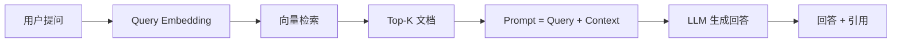

# RAG 基础 (RAG Fundamentals)

> **一句话理解**: RAG = 检索 + 生成——让 LLM 从外部知识库中"查资料"后回答问题，不再只靠训练时记住的知识。

---

## TL;DR

- **RAG 解决 LLM 三大痛点**: 知识过时、领域知识缺失、幻觉
- **基本流程**: Query → Embed → Vector Search → Context + Query → LLM → Answer
- **核心组件**: Embedding 模型 + 向量数据库 + LLM
- **进阶**: Hybrid Search、Re-ranking、Agentic RAG、Multi-modal RAG



---

## 1. 为什么需要 RAG？

```
LLM 的局限:
├── 知识截止: 训练数据有时效性，无法回答最新问题
├── 领域缺失: 不了解企业内部文档、私有数据
├── 幻觉问题: 编造看似合理但实际错误的答案
└── 不可追溯: 无法说明答案来自哪个来源

RAG 的优势:
├── 实时知识: 从最新文档中检索
├── 私有数据: 连接企业内部知识库
├── 减少幻觉: 基于检索到的真实文档生成
└── 可追溯: 可以标注信息来源
```

## 2. RAG 基本流程

```python
from langchain_community.vectorstores import FAISS
from langchain_openai import OpenAIEmbeddings, ChatOpenAI

# Step 1: 文档加载和分块
from langchain.text_splitter import RecursiveCharacterTextSplitter
splitter = RecursiveCharacterTextSplitter(chunk_size=500, chunk_overlap=50)
chunks = splitter.split_documents(documents)

# Step 2: 嵌入和存储
embeddings = OpenAIEmbeddings(model="text-embedding-3-small")
vectorstore = FAISS.from_documents(chunks, embeddings)

# Step 3: 检索
retriever = vectorstore.as_retriever(search_kwargs={"k": 5})
docs = retriever.invoke("如何配置 Kubernetes 自动扩缩容？")

# Step 4: 生成
llm = ChatOpenAI(model="gpt-4o")
context = "\n".join(doc.page_content for doc in docs)
response = llm.invoke(f"基于以下信息回答问题:\n{context}\n\n问题: {query}")
```

## 3. RAG 质量优化路径

| 优化点 | 方法 | 效果 |
|--------|------|------|
| **检索质量** | Hybrid Search (向量+关键词) | 召回率提升 15-30% |
| **排序质量** | Cross-encoder Re-ranking | 精确率提升 10-20% |
| **上下文质量** | Parent-Child Chunking | 上下文更完整 |
| **查询质量** | Query Rewriting / HyDE | 检索相关性提升 |
| **生成质量** | Citation + Grounding | 减少幻觉 |

---

## 相关阅读

- [[14_RAG_Systems/RAG_Systems]] — RAG 系统全景
- [[14_RAG_Systems/Vector_Database_for_dummy]] — 向量数据库入门
- [[14_RAG_Systems/Data_Ingestion_Pipeline]] — 数据摄入管道
- [[14_RAG_Systems/RAG_Advanced_2026]] — RAG 高级实践
- [[14_RAG_Systems/Advanced_RAG_DLAI_Practices]] — RAG 高级实践 (DLAI)
