# RAG (检索增强生成) 速成指南

> 🎯 **目标**：理解如何让 AI 模型访问你自己的数据，而无需重新训练。

---

## 🤔 什么是 RAG？

**问题**：大模型知道很多，但不知道**你的**数据（公司文档、最新信息、私有知识）。

**解决方案**：RAG = 在模型回答之前，先给它相关文档。

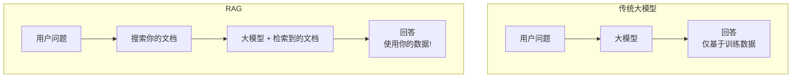

**类比**：
- 传统大模型 = 学生闭卷考试（只能靠记忆）
- RAG = 学生开卷考试（可以查阅资料！）

---

## 🧩 核心组件

### 系统架构

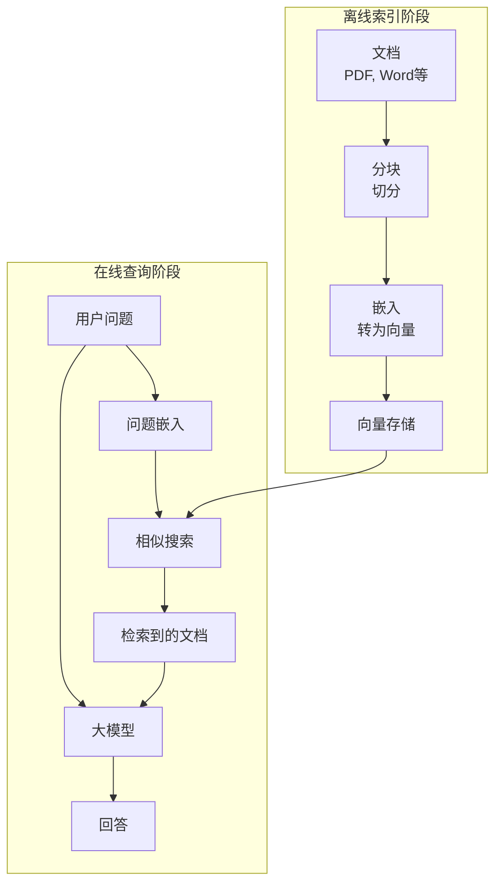

### 1. 文档摄入（离线）
将文档转换为可搜索的格式。

```python
# 步骤 1: 加载文档
from langchain.document_loaders import PyPDFLoader, TextLoader

loader = PyPDFLoader("company_handbook.pdf")
documents = loader.load()
```

### 2. 分块
将文档切分成小片段。

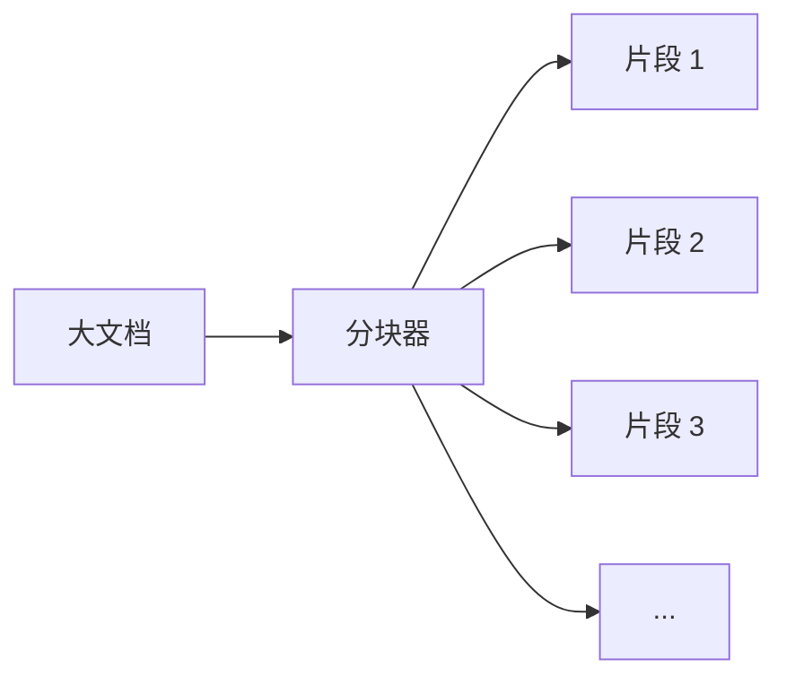

```python
# 步骤 2: 切分成块
from langchain.text_splitter import RecursiveCharacterTextSplitter

splitter = RecursiveCharacterTextSplitter(
    chunk_size=500,      # 每块字符数
    chunk_overlap=50     # 重叠以保留上下文
)
chunks = splitter.split_documents(documents)

# 示例结果:
# "公司成立于 2010 年..." → 片段 1
# "我们的使命是..." → 片段 2
# 等等
```

### 3. 嵌入
将文本转换为数字（向量）用于相似搜索。

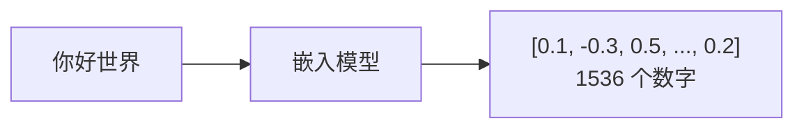

```python
# 步骤 3: 创建嵌入
from langchain.embeddings import OpenAIEmbeddings

embeddings = OpenAIEmbeddings()
# "你好世界" → [0.1, -0.3, 0.5, ..., 0.2]  (1536 个数字)
```

### 4. 向量存储
存储嵌入以便快速检索。

```python
# 步骤 4: 存入向量数据库
from langchain.vectorstores import Chroma

vectorstore = Chroma.from_documents(
    documents=chunks,
    embedding=embeddings,
    persist_directory="./chroma_db"
)
```

### 5. 检索（在线）
为用户查询找到相关文档。

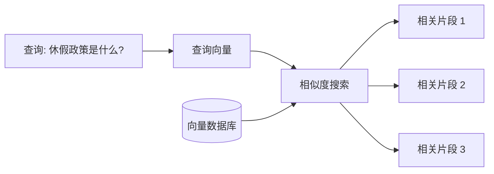

```python
# 步骤 5: 搜索相关片段
query = "休假政策是什么？"
relevant_docs = vectorstore.similarity_search(query, k=3)

# 返回最相似的 3 个片段
```

### 6. 生成
将查询 + 上下文组合发送给大模型。

```python
# 步骤 6: 带上下文生成回答
from langchain.chat_models import ChatOpenAI
from langchain.chains import RetrievalQA

llm = ChatOpenAI(model="gpt-4")
qa_chain = RetrievalQA.from_chain_type(
    llm=llm,
    retriever=vectorstore.as_retriever()
)

answer = qa_chain.run("休假政策是什么？")
```

---

## 📋 完整 RAG 流水线

### 完整工作示例

```python
# 一个文件中的完整 RAG 系统
from langchain.document_loaders import DirectoryLoader
from langchain.text_splitter import RecursiveCharacterTextSplitter
from langchain.embeddings import OpenAIEmbeddings
from langchain.vectorstores import Chroma
from langchain.chat_models import ChatOpenAI
from langchain.chains import RetrievalQA
import os

os.environ["OPENAI_API_KEY"] = "your-api-key"

# ========== 索引阶段（运行一次）==========
def build_index(docs_folder: str, db_path: str):
    # 1. 加载文档
    loader = DirectoryLoader(docs_folder, glob="**/*.txt")
    documents = loader.load()
    print(f"已加载 {len(documents)} 个文档")
    
    # 2. 切分成块
    splitter = RecursiveCharacterTextSplitter(
        chunk_size=500,
        chunk_overlap=50
    )
    chunks = splitter.split_documents(documents)
    print(f"已创建 {len(chunks)} 个片段")
    
    # 3. 创建嵌入并存储
    embeddings = OpenAIEmbeddings()
    vectorstore = Chroma.from_documents(
        documents=chunks,
        embedding=embeddings,
        persist_directory=db_path
    )
    vectorstore.persist()
    print(f"索引已保存到 {db_path}")
    
    return vectorstore

# ========== 查询阶段（运行多次）==========
def query_rag(question: str, db_path: str):
    # 加载已有索引
    embeddings = OpenAIEmbeddings()
    vectorstore = Chroma(
        persist_directory=db_path,
        embedding_function=embeddings
    )
    
    # 创建 QA 链
    llm = ChatOpenAI(model="gpt-4", temperature=0)
    qa = RetrievalQA.from_chain_type(
        llm=llm,
        chain_type="stuff",  # 将所有文档放入一个提示
        retriever=vectorstore.as_retriever(search_kwargs={"k": 3}),
        return_source_documents=True
    )
    
    # 获取回答
    result = qa({"query": question})
    
    return {
        "answer": result["result"],
        "sources": [doc.metadata for doc in result["source_documents"]]
    }

# ========== 使用 ==========
if __name__ == "__main__":
    # 建立索引（仅一次）
    # build_index("./company_docs", "./vector_db")
    
    # 查询
    result = query_rag("退款政策是什么？", "./vector_db")
    print(f"回答: {result['answer']}")
    print(f"来源: {result['sources']}")
```

---

## 🔧 关键配置选择

### 分块大小选择

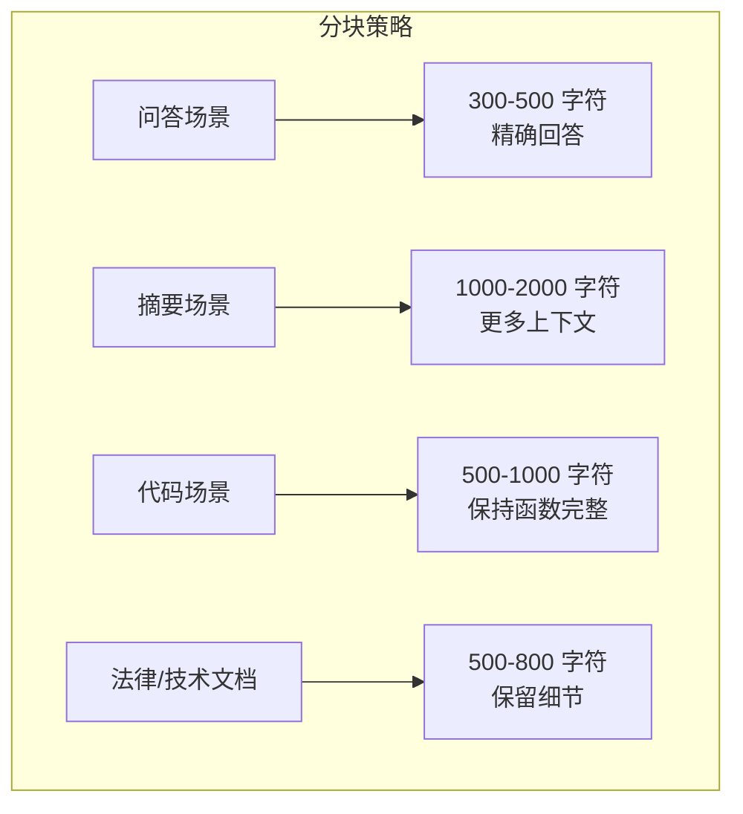

| 场景 | 分块大小 | 重叠 | 原因 |
|------|----------|------|------|
| **问答** | 300-500 | 50 | 精确回答 |
| **摘要** | 1000-2000 | 100 | 更多上下文 |
| **代码** | 500-1000 | 100 | 保持函数完整 |
| **法律/技术** | 500-800 | 100 | 保留细节 |

### 嵌入模型选择

| 模型 | 维度 | 成本 | 质量 | 最适合 |
|------|------|------|------|--------|
| **OpenAI text-embedding-3-small** | 1536 | $ | 好 | 通用 |
| **OpenAI text-embedding-3-large** | 3072 | $$ | 更好 | 高精度需求 |
| **Cohere embed-v3** | 1024 | $ | 好 | 多语言 |
| **BGE-large** | 1024 | 免费 | 好 | 自托管 |
| **all-MiniLM-L6-v2** | 384 | 免费 | 一般 | 低资源 |

### 向量数据库选择

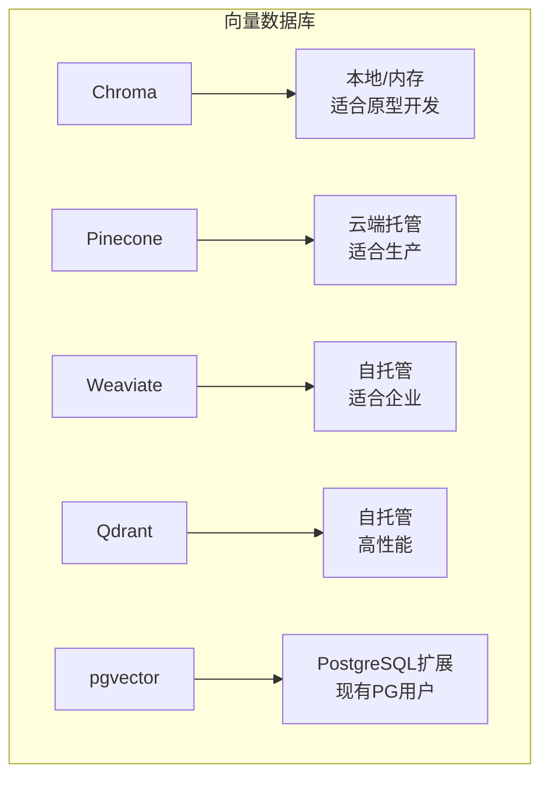

---

## ⚡ 优化技术

### 1. 混合搜索
结合语义搜索 + 关键词搜索。

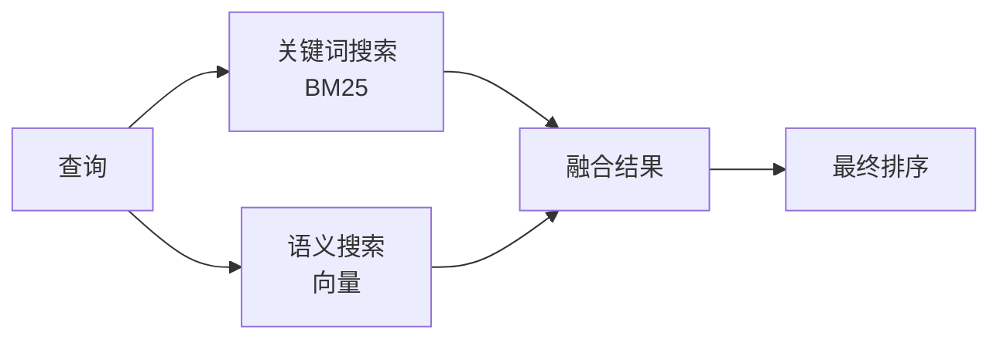

```python
from langchain.retrievers import BM25Retriever, EnsembleRetriever

# 关键词搜索
bm25 = BM25Retriever.from_documents(chunks)
bm25.k = 3

# 语义搜索
semantic = vectorstore.as_retriever(search_kwargs={"k": 3})

# 组合两者
hybrid = EnsembleRetriever(
    retrievers=[bm25, semantic],
    weights=[0.3, 0.7]  # 30% 关键词, 70% 语义
)
```

### 2. 重排序
重新排列结果以获得更好的相关性。

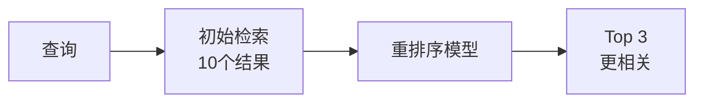

```python
from langchain.retrievers import ContextualCompressionRetriever
from langchain.retrievers.document_compressors import CohereRerank

# 初始检索获取更多文档
base_retriever = vectorstore.as_retriever(search_kwargs={"k": 10})

# 重排序器筛选出 top 3
reranker = CohereRerank(top_n=3)
retriever = ContextualCompressionRetriever(
    base_compressor=reranker,
    base_retriever=base_retriever
)
```

### 3. 查询扩展
生成多个搜索查询。

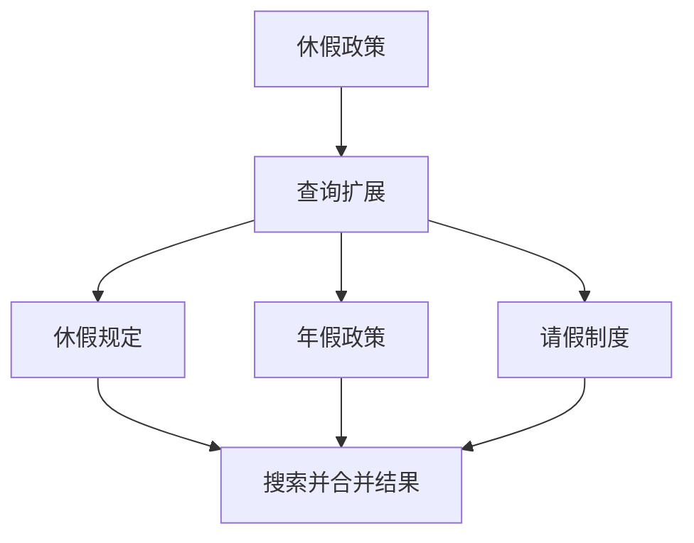

```python
from langchain.retrievers import MultiQueryRetriever

# LLM 生成 3 个查询变体
multi_query = MultiQueryRetriever.from_llm(
    retriever=vectorstore.as_retriever(),
    llm=llm
)

# "休假政策" → 
#   "休假规定"
#   "年假政策"
#   "请假制度"
```

### 4. 元数据过滤
按文档属性过滤。

```python
# 索引时添加元数据
chunks[0].metadata = {
    "source": "hr_handbook.pdf",
    "department": "HR",
    "year": 2024
}

# 搜索时过滤
results = vectorstore.similarity_search(
    "休假政策",
    k=3,
    filter={"department": "HR", "year": 2024}
)
```

---

## 📊 评估指标

### RAG 质量指标

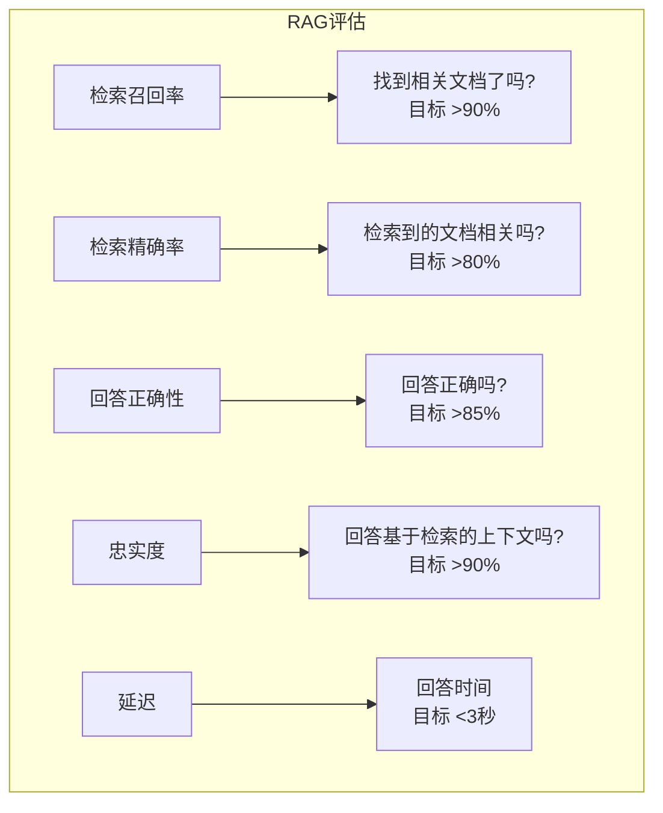

| 指标 | 衡量内容 | 目标 |
|------|----------|------|
| **检索召回率** | 是否找到相关文档？ | >90% |
| **检索精确率** | 检索到的文档是否相关？ | >80% |
| **回答正确性** | 回答是否正确？ | >85% |
| **忠实度** | 回答是否使用检索到的上下文？ | >90% |
| **延迟** | 回答时间 | <3s |

---

## 🛠️ 运维指南

### 设置 RAG

```bash
# 1. 安装依赖
pip install langchain chromadb openai tiktoken

# 2. 设置 API 密钥
export OPENAI_API_KEY="sk-..."

# 3. 创建项目结构
mkdir -p rag_project/{docs,db,scripts}

# 4. 运行索引
python scripts/index_documents.py --input ./docs --output ./db

# 5. 启动 API 服务
python scripts/server.py --db ./db --port 8000

# 6. 测试查询
curl -X POST http://localhost:8000/query \
  -H "Content-Type: application/json" \
  -d '{"question": "休假政策是什么？"}'
```

### 监控清单

```bash
# 检查向量数据库大小
du -sh ./chroma_db/

# 监控嵌入 API 使用量
# （检查 OpenAI 仪表板）

# 测试检索质量
python scripts/eval_retrieval.py --test_set ./test_queries.json

# 检查延迟
time curl http://localhost:8000/query -d '{"q": "测试"}'
```

---

## ⚠️ 常见问题与解决方案

```mermaid
flowchart TB
    subgraph 问题诊断
        P1[回答错误] --> S1[改进分块<br/>使用混合搜索]
        P2[幻觉] --> S2[降低temperature<br/>添加"仅使用提供的上下文"]
        P3[信息缺失] --> S3[增加k值<br/>使用查询扩展]
        P4[响应慢] --> S4[缓存嵌入<br/>使用更小的LLM]
        P5[成本高] --> S5[使用本地嵌入<br/>缓存结果]
        P6[信息过时] --> S6[添加日期元数据<br/>按日期过滤]
    end
```

| 问题 | 症状 | 解决方案 |
|------|------|----------|
| **回答错误** | 检索到不相关的上下文 | 改进分块，使用混合搜索 |
| **幻觉** | 回答不在文档中 | 降低 temperature，添加"仅使用提供的上下文" |
| **信息缺失** | 相关文档未找到 | 增加 k，使用查询扩展 |
| **响应慢** | >5s 延迟 | 缓存嵌入，使用更小的 LLM |
| **成本高** | API 账单太高 | 使用本地嵌入，缓存结果 |
| **信息过时** | 检索到旧文档 | 添加日期元数据，按日期过滤 |

---

## 💡 最佳实践

### 1. RAG 提示工程

```python
RAG_PROMPT = """仅根据以下上下文回答问题。
如果上下文中没有答案，请说"我没有关于这个问题的信息。"

上下文:
{context}

问题: {question}

回答:"""
```

### 2. 处理"不知道"

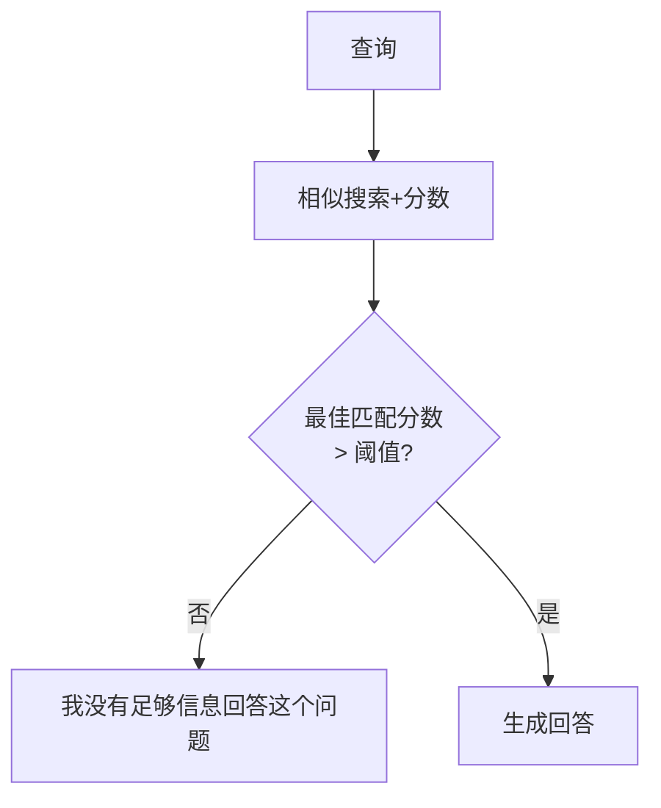

```python
def safe_rag_query(question, threshold=0.7):
    # 获取带分数的文档
    docs_with_scores = vectorstore.similarity_search_with_score(question, k=3)
    
    # 检查最佳匹配是否足够好
    if docs_with_scores[0][1] > threshold:  # 低分 = 差匹配
        return "我没有足够信息回答这个问题。"
    
    # 继续生成
    return generate_answer(question, [d[0] for d in docs_with_scores])
```

### 3. 来源引用

```python
def query_with_sources(question):
    result = qa_chain({"query": question})
    
    answer = result["result"]
    sources = []
    for doc in result["source_documents"]:
        sources.append({
            "file": doc.metadata.get("source", "未知"),
            "page": doc.metadata.get("page", "N/A"),
            "excerpt": doc.page_content[:100] + "..."
        })
    
    return {
        "answer": answer,
        "sources": sources,
        "confidence": calculate_confidence(result)
    }
```

---

## 📚 核心要点

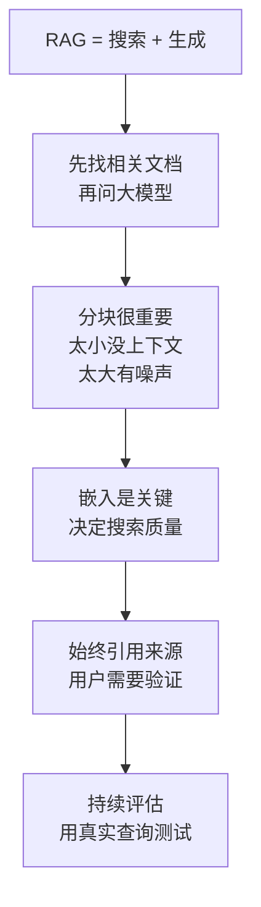

---

## 🔗 相关主题

- [推理](部署推理/Deployment_Fundamentals/Inference-in-nutshell.md) - 运行大模型部分
- [智能体](智能体/Agent_Foundations/Agent-in-nutshell.md) - RAG + 动作
- [工作流](智能体/Agent_Workflow/Workflow-in-nutshell.md) - 生产环境中的 RAG

## Related

- [[RAG系统/RAG_Systems]] — RAG 系统 (RAG Systems) (共享: embedding, rag, retrieval, vector-database)
- [[RAG系统/README_Advanced]] — RAG高级实践 2026 (共享: embedding, rag, retrieval, vector-database)
- [[RAG系统/RAG_Frameworks/Spring_AI_RAG_Deep_Dive]] — Spring AI RAG 深度解析 (共享: embedding, rag, retrieval, vector-database)
- [[治理/rag-vector-database]] — RAG 系统 × 向量数据库 (共享: embedding, rag, retrieval, vector-database)
- [[RAG系统/RAG_Frameworks/Haystack_Deep_Dive.md|Haystack_Deep_Dive]]
- [[RAG系统/Vector_Databases/Milvus_Deep_Dive.md|Milvus_Deep_Dive]]
- [[RAG系统/Vector_Databases/Typesense_Deep_Dive.md|Typesense_Deep_Dive]]
- [[RAG系统/RAG_Frameworks/LlamaIndex_Deep_Dive.md|LlamaIndex_Deep_Dive]]
- [[RAG系统/Embeddings/Sentence_Transformers_Deep_Dive.md|Sentence_Transformers_Deep_Dive]]
