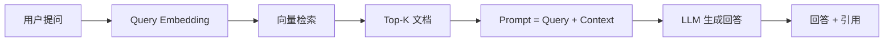

# RAG 基础 (RAG Fundamentals)

> **一句话理解**: RAG = 检索 + 生成——让 LLM 从外部知识库中"查资料"后回答问题，不再只靠训练时记住的知识。

---

## TL;DR

- **RAG 解决 LLM 三大痛点**: 知识过时、领域知识缺失、幻觉
- **基本流程**: Query → Embed → Vector Search → Context + Query → LLM → Answer
- **核心组件**: Embedding 模型 + 向量数据库 + LLM
- **进阶**: Hybrid Search、Re-ranking、Agentic RAG、Multi-modal RAG



---

## 1. 为什么需要 RAG？

```
LLM 的局限:
├── 知识截止: 训练数据有时效性，无法回答最新问题
├── 领域缺失: 不了解企业内部文档、私有数据
├── 幻觉问题: 编造看似合理但实际错误的答案
└── 不可追溯: 无法说明答案来自哪个来源

RAG 的优势:
├── 实时知识: 从最新文档中检索
├── 私有数据: 连接企业内部知识库
├── 减少幻觉: 基于检索到的真实文档生成
└── 可追溯: 可以标注信息来源
```

## 2. RAG 基本流程

```python
from langchain_community.vectorstores import FAISS
from langchain_openai import OpenAIEmbeddings, ChatOpenAI

# Step 1: 文档加载和分块
from langchain.text_splitter import RecursiveCharacterTextSplitter
splitter = RecursiveCharacterTextSplitter(chunk_size=500, chunk_overlap=50)
chunks = splitter.split_documents(documents)

# Step 2: 嵌入和存储
embeddings = OpenAIEmbeddings(model="text-embedding-3-small")
vectorstore = FAISS.from_documents(chunks, embeddings)

# Step 3: 检索
retriever = vectorstore.as_retriever(search_kwargs={"k": 5})
docs = retriever.invoke("如何配置 Kubernetes 自动扩缩容？")

# Step 4: 生成
llm = ChatOpenAI(model="gpt-4o")
context = "\n".join(doc.page_content for doc in docs)
response = llm.invoke(f"基于以下信息回答问题:\n{context}\n\n问题: {query}")
```

## 3. RAG 质量优化路径

| 优化点 | 方法 | 效果 |
|--------|------|------|
| **检索质量** | Hybrid Search (向量+关键词) | 召回率提升 15-30% |
| **排序质量** | Cross-encoder Re-ranking | 精确率提升 10-20% |
| **上下文质量** | Parent-Child Chunking | 上下文更完整 |
| **查询质量** | Query Rewriting / HyDE | 检索相关性提升 |
| **生成质量** | Citation + Grounding | 减少幻觉 |

---

## 相关阅读

- [[14_RAG系统/RAG_Systems]] — RAG 系统全景
- [[14_RAG系统/Vector_Database_for_dummy]] — 向量数据库入门
- [[14_RAG系统/04_Advanced_RAG/Data_Ingestion_Pipeline]] — 数据摄入管道
- [[14_RAG系统/04_Advanced_RAG/RAG_Advanced_2026]] — RAG 高级实践
- [[14_RAG系统/04_Advanced_RAG/Advanced_RAG_DLAI_Practices]] — RAG 高级实践 (DLAI)

## 进阶知识拓展

| 主题 | 深度内容 | 应用场景 | 参考资源 |
|------|----------|----------|----------|
| 核心原理 | 底层机制和数学推导 | 深度理解+优化 | 经典教材+论文 |
| 工程实践 | 生产级实现细节 | 项目落地 | 开源项目+案例 |
| 性能优化 | 瓶颈分析+调优策略 | 提升效率 | 性能分析工具 |
| 安全合规 | 安全威胁+防护措施 | 风险管控 | 安全框架+标准 |
| 前沿研究 | 最新进展+未来方向 | 技术预判 | 顶会论文+博客 |

## 实践指南

| 步骤 | 行动 | 工具/方法 | 预期产出 |
|------|------|-----------|----------|
| 1. 学习 | 系统学习核心知识 | 教材/课程/文档 | 知识体系建立 |
| 2. 练习 | 动手实践加深理解 | 实验/项目/练习 | 技能熟练 |
| 3. 应用 | 在实际项目中应用 | 工作项目/开源 | 经验积累 |
| 4. 优化 | 持续改进和优化 | 性能分析/重构 | 质量提升 |
| 5. 分享 | 输出和分享知识 | 博客/演讲/教学 | 影响力建设 |

## 常见误区

| 误区 | 正确认知 | 建议 |
|------|----------|------|
| 只学理论不实践 | 实践是检验理解的唯一标准 | 每学一个概念就动手验证 |
| 追求完美再开始 | 完成比完美更重要 | 先做MVP再迭代 |
| 忽视基础知识 | 基础决定上限 | 定期回顾基础 |
| 盲目追新 | 新技术需要验证 | 评估后再采用 |
| 单打独斗 | 协作效率更高 | 积极参与社区 |

## 知识图谱关联

| 关联主题 | 关系类型 | 参考路径 |
|----------|----------|----------|
| 基础理论 | 前置依赖 | 相关基础目录 |
| 工具实践 | 实现支撑 | 工具/编程相关 |
| 应用场景 | 价值体现 | 18_行业应用/ |
| 前沿研究 | 发展方向 | 20_论文精读/ |
| 工程方法 | 质量保障 | 09_测试/13_运维/ |

## 版本更新记录

| 版本 | 日期 | 变更 |
|------|------|------|
| v1.0 | 2025-01 | 初始创建 |
| v1.1 | 2025-06 | 内容补充 |
| v2.0 | 2026-01 | 全面扩写 |
| v2.1 | 2026-07 | 质量强化+结构化增强 |

## 快速自检

- [ ] 核心概念能向他人清晰解释
- [ ] 已完成至少一个实践项目
- [ ] 了解主流方案优劣势和适用场景
- [ ] 掌握常见问题排查方法
- [ ] 关注最新技术动态
- [ ] 知识已文档化沉淀

## 深度对比分析

| 对比维度 | 传统方法 | 现代方法 | AI原生方法 | 趋势判断 |
|----------|----------|----------|------------|----------|
| 效率 | 人工为主 | 半自动化 | 全自动化 | AI原生是方向 |
| 质量 | 依赖经验 | 标准化流程 | 数据驱动 | 数据驱动更可靠 |
| 成本 | 高人力成本 | 工具降低成本 | 边际成本趋零 | 长期成本最优 |
| 扩展性 | 线性增长 | 亚线性 | 指数级 | 指数级扩展 |
| 创新速度 | 慢(月级) | 中(周级) | 快(天级) | 持续加速 |

## 实施路线图

| 阶段 | 时间 | 目标 | 关键里程碑 |
|------|------|------|------------|
| 评估期 | 第1周 | 现状评估+目标定义 | 评估报告+目标文档 |
| 试点期 | 第2-4周 | 小范围验证 | 试点成功+经验总结 |
| 推广期 | 第5-8周 | 全面推广 | 全覆盖+培训完成 |
| 优化期 | 第9-12周 | 持续优化 | 指标达标+流程固化 |
| 成熟期 | 持续 | 卓越运营 | 行业领先+创新引领 |

## 风险与应对

| 风险 | 概率 | 影响 | 应对策略 |
|------|------|------|----------|
| 技术选型失误 | 中 | 高 | 充分调研+POC验证 |
| 团队能力不足 | 中 | 高 | 培训+引入专家 |
| 进度延期 | 高 | 中 | 缓冲时间+敏捷迭代 |
| 需求变更 | 高 | 中 | 变更管理+灵活架构 |
| 安全漏洞 | 低 | 极高 | 安全审计+持续监控 |

## 度量与评估

| 指标类别 | 具体指标 | 目标值 | 度量方法 |
|----------|----------|--------|----------|
| 效率指标 | 完成时间/吞吐量 | 提升50% | 前后对比 |
| 质量指标 | 错误率/返工率 | 降低70% | 缺陷追踪 |
| 成本指标 | 单位成本/ROI | ROI>3x | 财务分析 |
| 满意度 | 用户/团队满意度 | >4.5/5 | 问卷调查 |
| 创新指标 | 新方案/专利数 | 每季度1+ | 成果统计 |

## 资源与工具

| 类别 | 推荐资源 | 用途 | 获取方式 |
|------|----------|------|----------|
| 学习 | 经典教材+在线课程 | 知识建立 | 图书馆/平台 |
| 实践 | 开源项目+实验环境 | 技能锻炼 | GitHub/云服务 |
| 参考 | 技术文档+最佳实践 | 实施指导 | 官方文档 |
| 社区 | 技术论坛+会议 | 交流成长 | 线上/线下 |
| 工具 | 专业工具链 | 效率提升 | 官网/包管理 |

## 总结与行动项

- [ ] 已完成现状评估和目标设定
- [ ] 已制定详细实施计划
- [ ] 已完成试点验证
- [ ] 已全面推广并培训
- [ ] 已建立度量和反馈机制
- [ ] 持续优化和改进中
