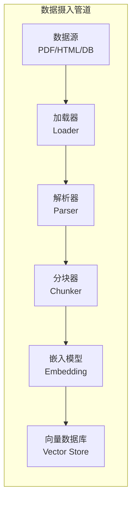

# 数据摄入管道 (Data Ingestion Pipeline)

> 中文简称：数据摄入管道

> **一句话理解**: 数据摄入管道就像图书馆的"新书处理流水线"——从采购（抓取数据）、拆包（解析内容）、编目（分块+嵌入）到上架（存入向量数据库），一气呵成。

---

## TL;DR

- **RAG 摄入 = 加载 → 解析 → 分块 → 嵌入 → 存储**: 五步把原始数据变成可检索的知识
- **加载器**: PyPDF、Unstructured、LangChain Loaders、LlamaIndex Readers
- **分块策略**: Fixed-size / Recursive / Semantic / Document-aware
- **嵌入模型**: OpenAI text-embedding-3-small/large、BGE、E5、Jina
- **存储**: 向量数据库 (Pinecone/Weaviate/Qdrant) + 元数据存储
- **增量更新**: Hash 去重 + 版本管理，避免重复嵌入



---

## 1. 数据加载 (Loading)

### 1.1 常见数据源与加载器

| 数据源 | 推荐工具 | 注意事项 |
|--------|----------|----------|
| PDF | PyMuPDF / Unstructured | 表格和图片需要特殊处理 |
| HTML | BeautifulSoup / Trafilatura | 去除导航、广告等噪声 |
| Markdown | 直接读取 | 保留结构信息 |
| 数据库 | SQL/ORM 查询 | 增量同步需 CDC |
| API | requests/httpx | 处理分页和限速 |
| S3/OSS | boto3/oss2 | 大文件流式处理 |

### 1.2 Unstructured 统一加载

```python
from unstructured.partition.auto import partition

# 自动检测文件类型并解析
elements = partition(
    filename="report.pdf",
    strategy="hi_res",           # 高精度模式（使用 OCR）
    include_page_breaks=True,    # 保留页码信息
    extract_images_in_pdf=True   # 提取嵌入图片
)

# 返回结构化元素
for elem in elements:
    print(f"[{type(elem).__name__}] {elem.text[:100]}")
    # [Title] 第一章 引言
    # [NarrativeText] 本报告分析了...
    # [Table] | 指标 | 数值 |
    # [Image] <image description>
```

---

## 2. 文档分块 (Chunking)

### 2.1 分块策略对比

| 策略 | 原理 | 优点 | 缺点 |
|------|------|------|------|
| **固定大小** | 每 N 个 token 一块 | 简单快速 | 可能在句子中间截断 |
| **递归分割** | 按段落→句子→字符递归 | 保持语义完整 | 块大小不均匀 |
| **语义分块** | 按语义相似度边界 | 语义一致性最好 | 计算成本高 |
| **文档感知** | 按标题/章节结构 | 保留文档层次 | 依赖文档格式 |

### 2.2 递归分块实现

```python
from langchain.text_splitter import RecursiveCharacterTextSplitter

splitter = RecursiveCharacterTextSplitter(
    chunk_size=512,          # 目标块大小（token 数）
    chunk_overlap=64,        # 块之间重叠 64 token
    separators=["\n\n", "\n", "。", ".", " ", ""],  # 按优先级分割
    length_function=len
)

chunks = splitter.split_text(document_text)
# 块之间保留重叠，确保上下文不丢失
```

### 2.3 分块最佳实践

```
推荐参数（2026）：
├── chunk_size: 256-1024 tokens（取决于嵌入模型上下文）
├── chunk_overlap: chunk_size × 10-15%
├── 保留元数据: 来源文件、页码、章节标题
└── 父子关系: 小块用于检索，大块用于上下文

Parent-Child 策略（推荐）：
1. 创建大块（parent, ~2000 tokens）用于提供上下文
2. 创建小块（child, ~200 tokens）用于精确检索
3. 检索时匹配 child，返回对应 parent
```

---

## 3. 文本嵌入 (Embedding)

### 3.1 主流嵌入模型（2026）

| 模型 | 维度 | 上下文 | 特点 |
|------|------|--------|------|
| **OpenAI text-embedding-3-large** | 3072 | 8191 | 商业最强 |
| **BGE-M3** | 1024 | 8192 | 开源多语言 |
| **Jina v3** | 1024 | 8192 | 支持晚交互 |
| **E5-Mistral-7B** | 4096 | 32768 | LLM 级嵌入 |
| **Cohere embed-v3** | 1024 | 512 | 企业级 |

### 3.2 嵌入计算

```python
from sentence_transformers import SentenceTransformer

model = SentenceTransformer('BAAI/bge-m3')

# 批量嵌入
texts = [chunk.text for chunk in chunks]
embeddings = model.encode(
    texts,
    batch_size=64,
    normalize_embeddings=True,  # L2 归一化
    show_progress_bar=True
)

# 存储嵌入
for chunk, embedding in zip(chunks, embeddings):
    vector_store.upsert(
        id=chunk.id,
        vector=embedding,
        metadata={
            "text": chunk.text,
            "source": chunk.source,
            "page": chunk.page,
            "chunk_index": chunk.index
        }
    )
```

---

## 4. 存储与索引 (Storage)

### 4.1 向量数据库选择

```
选型决策：
├── 快速原型 → ChromaDB / FAISS（本地、零配置）
├── 中小规模（<100万向量）→ Qdrant / Weaviate
├── 大规模（>100万向量）→ Pinecone / Milvus
├── 已有 PostgreSQL → pgvector
└── 边缘/离线 → SQLite-VSS / LanceDB
```

### 4.2 元数据设计

```python
# 良好的元数据设计提升检索精度
metadata_schema = {
    "source": str,           # 来源文件/URL
    "title": str,            # 文档标题
    "section": str,          # 所属章节
    "page": int,             # 页码
    "created_at": datetime,  # 创建时间
    "updated_at": datetime,  # 更新时间
    "content_type": str,     # text/table/image
    "language": str,         # 语言
    "tags": list             # 标签
}

# 检索时用元数据过滤
results = vector_store.search(
    query_embedding,
    k=10,
    filter={"language": "zh", "content_type": "text"}
)
```

---

## 5. 增量更新与去重

### 5.1 增量摄入策略

```python
import hashlib

def content_hash(text):
    return hashlib.sha256(text.encode()).hexdigest()[:16]

def incremental_ingest(new_documents, vector_store):
    # 1. 获取已有文档的 hash 集合
    existing_hashes = vector_store.get_metadata_values("content_hash")
    
    new_chunks = []
    for doc in new_documents:
        doc_hash = content_hash(doc.text)
        
        # 2. 跳过已存在的文档
        if doc_hash in existing_hashes:
            continue
        
        # 3. 分块 + 嵌入
        chunks = splitter.split_text(doc.text)
        for chunk in chunks:
            chunk.metadata["content_hash"] = doc_hash
            chunk.metadata["source"] = doc.source
            new_chunks.append(chunk)
    
    # 4. 批量嵌入和存储
    if new_chunks:
        embeddings = embed_model.encode([c.text for c in new_chunks])
        vector_store.batch_upsert(new_chunks, embeddings)
    
    return len(new_chunks)
```

### 5.2 数据版本管理

```
最佳实践：
1. 每个数据源维护版本号
2. 数据更新时：删除旧版本向量 → 插入新版本
3. 保留摄入日志：记录每次处理了哪些文件
4. 定期清理：删除孤立向量（没有对应源文件的）
```

---

## 6. 完整管道示例

```python
class RAGIngestionPipeline:
    def __init__(self, embed_model, vector_store, splitter):
        self.embed_model = embed_model
        self.vector_store = vector_store
        self.splitter = splitter
    
    def ingest(self, file_paths: list[str]):
        """完整的摄入流程"""
        all_chunks = []
        
        # Step 1: 加载
        for path in file_paths:
            elements = partition(filename=path)
            text = "\n".join(e.text for e in elements)
            
            # Step 2: 分块
            chunks = self.splitter.split_text(text)
            for i, chunk in enumerate(chunks):
                all_chunks.append({
                    "text": chunk,
                    "source": path,
                    "chunk_index": i,
                    "content_hash": content_hash(chunk)
                })
        
        # Step 3: 去重
        new_chunks = self._deduplicate(all_chunks)
        
        # Step 4: 嵌入
        texts = [c["text"] for c in new_chunks]
        embeddings = self.embed_model.encode(texts, batch_size=128)
        
        # Step 5: 存储
        self.vector_store.batch_upsert(
            ids=[f"{c['source']}_{c['chunk_index']}" for c in new_chunks],
            vectors=embeddings,
            metadatas=new_chunks
        )
        
        return {"ingested": len(new_chunks), "skipped": len(all_chunks) - len(new_chunks)}
```

---

## 相关阅读

- [[14_RAG系统/01_RAG基础/07_RAG_系统]] — RAG 系统全景
- [[14_RAG系统/03_向量数据库/05_rag_vector_database]] — 向量数据库入门
- [[14_RAG系统/02_嵌入技术/HF_Datasets_Streaming]] — HuggingFace 数据集流式处理
- [[14_RAG系统/04_高级RAG/01_高级RAG_DLAI_实践]] — RAG 高级实践
- [[14_RAG系统/06_RAG框架/06_LlamaIndex_深入分析]] — LlamaIndex 深度解读
