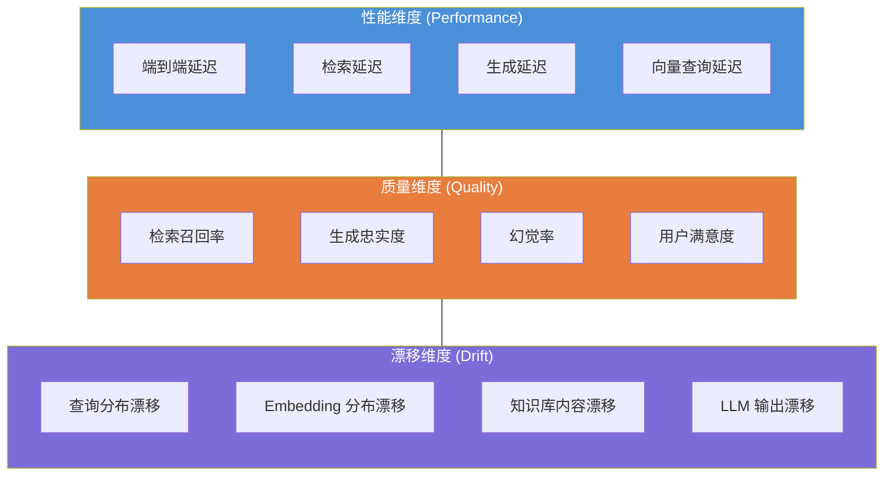
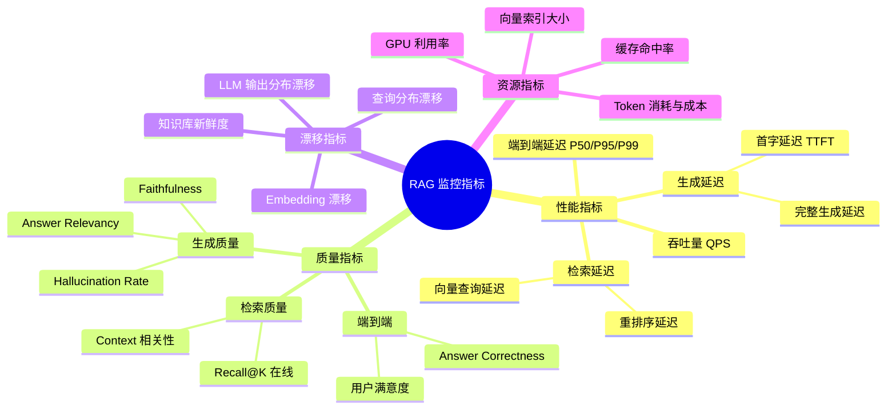
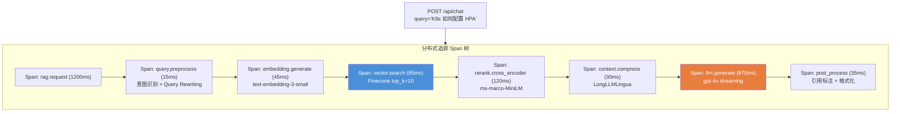
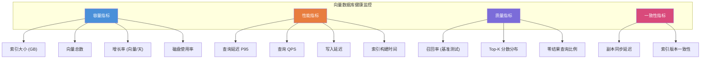
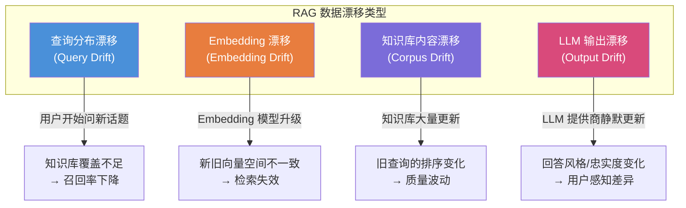
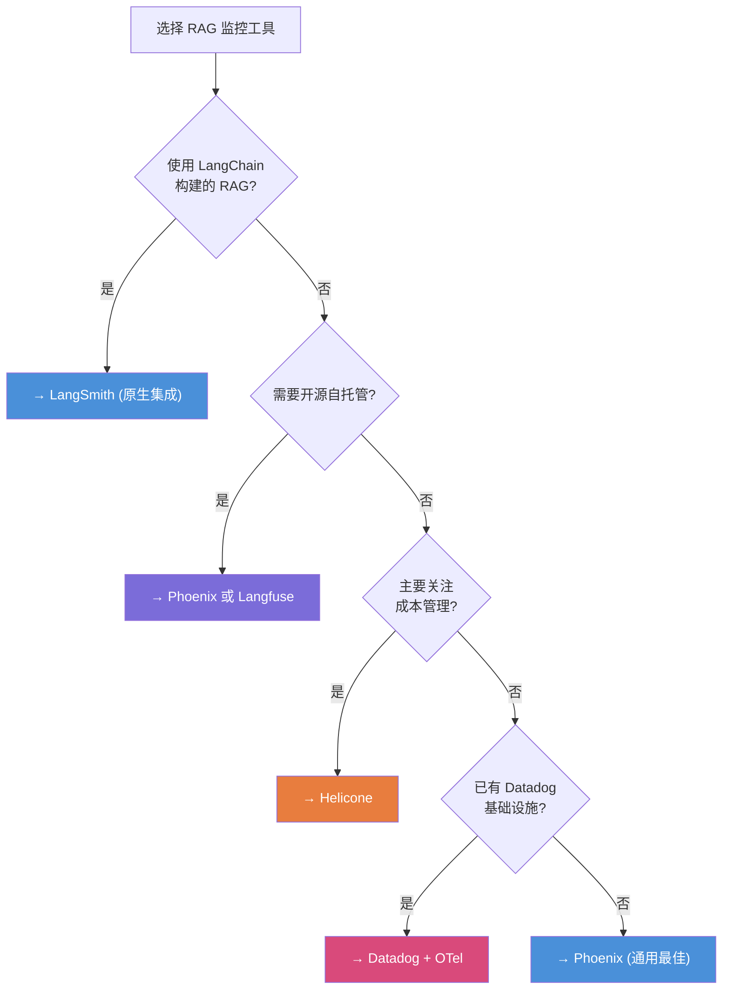
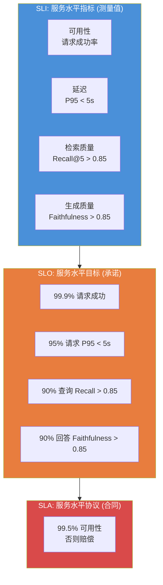
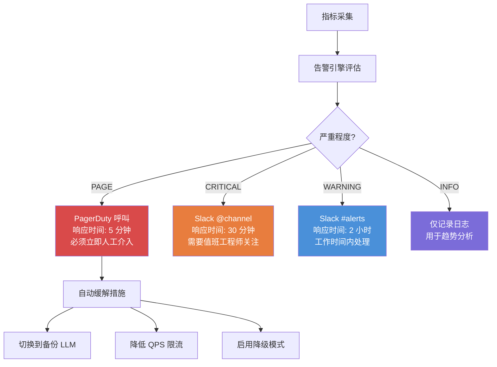

# RAG 监控与可观测性完全指南 (RAG Monitoring and Observability)

> 中文简称：RAG 监控与可观测性完全指南

> **一句话理解**: RAG 系统的可观测性不只是"响应慢不慢"——它要追踪从查询到回答的全链路，监控向量索引健康、检测 Embedding 漂移、预警检索质量退化，并用分布式追踪把检索延迟、生成延迟、数据漂移编织成一张完整的运维视图。

---

## 目录

1. [RAG 系统特有的监控挑战](#1-rag-系统特有的监控挑战)
2. [关键监控指标体系](#2-关键监控指标体系)
3. [分布式追踪：全链路观测](#3-分布式追踪全链路观测)
4. [向量数据库健康检查](#4-向量数据库健康检查)
5. [数据漂移检测](#5-数据漂移检测)
6. [监控工具集成](#6-监控工具集成)
7. [告警策略与 SLO 设计](#7-告警策略与-slo-设计)
8. [生产上线 Checklist](#8-生产上线-checklist)
9. [Related](#related)

---

## 1. RAG 系统特有的监控挑战

### 1.1 为什么传统 API 监控不够用

传统 Web 应用的监控关注"三大黄金信号"：延迟 (Latency)、流量 (Traffic)、错误率 (Errors)。但对于 RAG 系统，这套体系远远不够——因为 RAG 的"正确"是一个模糊概念，且系统状态会随数据变化而漂移。

```
传统 API 监控:
├── 延迟: P50/P95/P99 响应时间
├── 错误率: HTTP 5xx 比例
├── 吞吐量: QPS
└── 资源使用: CPU / 内存 / 磁盘

RAG 系统还需要:
├── 检索质量: 召回率是否在退化?
├── 生成质量: 幻觉率是否在上升?
├── 向量索引健康: 索引是否碎片化?
├── Embedding 漂移: 新数据是否偏离分布?
├── 知识库新鲜度: 最近多久没更新?
├── 用户查询分布变化: 新话题是否未被覆盖?
└── LLM 提供商稳定性: API 是否降级?
```

### 1.2 RAG 监控的三个维度



### 1.3 RAG 系统的"静默失败"

RAG 系统最危险的不是崩溃（那是可见的），而是**静默退化**：系统照常返回 200 OK，但检索结果已经不再相关，或者 LLM 开始产生更多幻觉。这类问题不会触发任何传统告警，只有通过专门的质量监控才能发现。

| 静默失败类型 | 根因 | 表现 | 传统监控能否发现 |
|-------------|------|------|:---:|
| 检索召回退化 | 知识库新增文档未被索引 | 相关文档排不上 Top-K | ❌ |
| Embedding 漂移 | Embedding 模型版本升级 | 新旧向量不在同一空间 | ❌ |
| 幻觉率上升 | LLM 提供商静默更新模型 | 回答不再忠于上下文 | ❌ |
| 查询分布偏移 | 新产品上线带来新话题 | 知识库没有覆盖新内容 | ❌ |
| 上下文窗口溢出 | 检索返回过多文档 | LLM 截断关键上下文 | ❌ |
| 索引碎片化 | 大量删除/更新操作 | 查询延迟逐渐上升 | ⚠️ 可能 |

> **关键认知**: RAG 监控的核心目标不是"系统是否在运行"，而是"系统是否还在给出好答案"。

---

## 2. 关键监控指标体系

### 2.1 指标全景图



### 2.2 性能指标基准

| 指标 | 定义 | 可接受 | 良好 | 优秀 | 备注 |
|------|------|--------|------|------|------|
| **端到端延迟 P50** | 用户从提问到收到完整回答 | < 5s | < 3s | < 2s | 含流式首字 |
| **端到端延迟 P95** | 95 分位延迟 | < 10s | < 7s | < 5s | 关注长尾 |
| **首字延迟 (TTFT)** | 流式输出的第一个 Token | < 2s | < 1s | < 0.5s | 用户体验关键 |
| **检索延迟** | 向量查询 + 重排序 | < 500ms | < 200ms | < 100ms | 含网络开销 |
| **向量查询延迟** | 纯向量数据库查询 | < 100ms | < 50ms | < 20ms | 取决于索引大小 |
| **QPS** | 每秒查询数 | 视容量 | — | — | 关注峰值承载 |

### 2.3 质量指标基准

| 指标 | 定义 | 警戒线 | 正常 | 优秀 | 监控方式 |
|------|------|--------|------|------|----------|
| **在线 Recall@K** | Shadow 评估的召回率 | < 0.70 | 0.80+ | 0.90+ | 异步 LLM-as-Judge |
| **Faithfulness** | 线上回答忠实度 | < 0.75 | 0.85+ | 0.92+ | 采样评估 |
| **Hallucination Rate** | 幻觉陈述比例 | > 15% | < 8% | < 3% | 1 - Faithfulness |
| **用户满意度** | 点赞率或 CSAT | < 70% | 80%+ | 90%+ | 显式反馈 |
| **首次解决率** | 一次回答解决问题的比例 | < 50% | 65%+ | 80%+ | 隐式信号 |

### 2.4 指标采集实现

```python
"""
RAG 指标采集器: 自动记录每次请求的性能和质量指标
"""
import time
import statistics
from dataclasses import dataclass, field
from datetime import datetime
from typing import Optional
from collections import defaultdict
import asyncio

@dataclass
class RAGRequestMetrics:
    """单次 RAG 请求的完整指标"""
    request_id: str
    query: str
    timestamp: str = field(default_factory=lambda: datetime.now().isoformat())

    # 性能指标
    retrieval_latency_ms: float = 0.0
    rerank_latency_ms: float = 0.0
    generation_latency_ms: float = 0.0
    total_latency_ms: float = 0.0
    ttft_ms: float = 0.0  # Time To First Token

    # 检索指标
    num_chunks_retrieved: int = 0
    context_total_tokens: int = 0
    retrieval_scores: list = field(default_factory=list)

    # 生成指标
    answer_tokens: int = 0
    finish_reason: str = ""

    # 质量指标 (异步评估后填充)
    faithfulness: Optional[float] = None
    answer_relevancy: Optional[float] = None
    user_feedback: Optional[str] = None  # "up" / "down" / None

    # 资源指标
    llm_model: str = ""
    embedding_model: str = ""
    cost_usd: float = 0.0


class RAGMetricsCollector:
    """指标收集器: 线程安全的指标聚合"""

    def __init__(self, window_size: int = 10000):
        self.window_size = window_size
        self._metrics: list[RAGRequestMetrics] = []
        self._lock = asyncio.Lock()

    async def record(self, metrics: RAGRequestMetrics):
        async with self._lock:
            self._metrics.append(metrics)
            if len(self._metrics) > self.window_size:
                self._metrics = self._metrics[-self.window_size:]

    def get_summary(self, last_n: int = 1000) -> dict:
        """获取最近 N 条请求的聚合指标"""
        recent = self._metrics[-last_n:]
        if not recent:
            return {}

        latencies = [m.total_latency_ms for m in recent]
        retrieval_lats = [m.retrieval_latency_ms for m in recent]
        gen_lats = [m.generation_latency_ms for m in recent]
        faith_scores = [m.faithfulness for m in recent if m.faithfulness]
        feedbacks = [m.user_feedback for m in recent if m.user_feedback]

        def percentile(data, p):
            if not data:
                return 0
            sorted_data = sorted(data)
            idx = int(len(sorted_data) * p / 100)
            return sorted_data[min(idx, len(sorted_data) - 1)]

        return {
            "latency_p50": percentile(latencies, 50),
            "latency_p95": percentile(latencies, 95),
            "latency_p99": percentile(latencies, 99),
            "retrieval_latency_avg": statistics.mean(retrieval_lats),
            "generation_latency_avg": statistics.mean(gen_lats),
            "faithfulness_avg": statistics.mean(faith_scores) if faith_scores else None,
            "satisfaction_rate": (
                sum(1 for f in feedbacks if f == "up") / len(feedbacks)
                if feedbacks else None
            ),
            "total_requests": len(recent),
            "avg_cost_usd": statistics.mean([m.cost_usd for m in recent]),
        }


# ── 使用示例 ──
collector = RAGMetricsCollector()

async def rag_handler(query: str):
    """RAG 请求处理器，自动采集指标"""
    req_id = f"req_{int(time.time()*1000)}"
    metrics = RAGRequestMetrics(request_id=req_id, query=query, llm_model="gpt-4o")

    # 检索阶段
    t0 = time.time()
    contexts = await retrieve(query)
    metrics.retrieval_latency_ms = (time.time() - t0) * 1000
    metrics.num_chunks_retrieved = len(contexts)

    # 重排序阶段
    if USE_RERANKER:
        t0 = time.time()
        contexts = await rerank(query, contexts)
        metrics.rerank_latency_ms = (time.time() - t0) * 1000

    # 生成阶段
    t0 = time.time()
    answer = await generate(query, contexts)
    metrics.generation_latency_ms = (time.time() - t0) * 1000

    metrics.total_latency_ms = (
        metrics.retrieval_latency_ms +
        metrics.rerank_latency_ms +
        metrics.generation_latency_ms
    )

    await collector.record(metrics)
    return answer
```

---

## 3. 分布式追踪：全链路观测

### 3.1 为什么需要分布式追踪

一次 RAG 请求可能经过 5-10 个微服务：API 网关 → Query 预处理 → Embedding 服务 → 向量数据库 → 重排序服务 → LLM 推理 → 后处理 → 响应。任何一个环节的延迟或失败都会影响整体体验。分布式追踪能把这条链路可视化，精确定位瓶颈。

### 3.2 RAG 请求的完整 Trace



### 3.3 OpenTelemetry 追踪实现

```python
"""
使用 OpenTelemetry 对 RAG 请求进行全链路追踪
依赖: pip install opentelemetry-api opentelemetry-sdk \
         opentelemetry-exporter-otlp
"""
from opentelemetry import trace
from opentelemetry.sdk.trace import TracerProvider
from opentelemetry.sdk.trace.export import BatchSpanProcessor
from opentelemetry.exporter.otlp.proto.grpc.trace_exporter import (
    OTLPSpanExporter,
)
from opentelemetry.sdk.resources import Resource

# 初始化 Tracer
resource = Resource.create({
    "service.name": "rag-service",
    "service.version": "1.0.0",
    "deployment.environment": "production",
})

provider = TracerProvider(resource=resource)
provider.add_span_processor(
    BatchSpanProcessor(
        OTLPSpanExporter(
            endpoint="http://otel-collector:4317",
        )
    )
)
trace.set_tracer_provider(provider)
tracer = trace.get_tracer(__name__)


async def traced_rag_pipeline(query: str) -> str:
    """带完整追踪的 RAG 管道"""
    with tracer.start_as_current_span("rag.request") as root_span:
        root_span.set_attribute("rag.query", query)
        root_span.set_attribute("rag.user_id", get_current_user_id())

        # ── Step 1: Query 预处理 ──
        with tracer.start_as_current_span("query.preprocess") as span:
            processed_query = await preprocess_query(query)
            span.set_attribute("query.original", query)
            span.set_attribute("query.rewritten", processed_query)
            span.set_attribute("query.intent", classify_intent(query))

        # ── Step 2: Embedding 生成 ──
        with tracer.start_as_current_span("embedding.generate") as span:
            t0 = time.time()
            query_embedding = await embed(processed_query)
            span.set_attribute("embedding.model", "text-embedding-3-small")
            span.set_attribute("embedding.latency_ms", (time.time() - t0) * 1000)
            span.set_attribute("embedding.dim", len(query_embedding))

        # ── Step 3: 向量检索 ──
        with tracer.start_as_current_span("vector.search") as span:
            t0 = time.time()
            results = await vector_db.search(
                query_embedding, top_k=10
            )
            span.set_attribute("vector.db", "pinecone")
            span.set_attribute("vector.top_k", 10)
            span.set_attribute("vector.results_count", len(results))
            span.set_attribute("vector.latency_ms", (time.time() - t0) * 1000)
            span.set_attribute(
                "vector.top_score", results[0].score if results else 0
            )

        # ── Step 4: 重排序 ──
        with tracer.start_as_current_span("rerank.cross_encoder") as span:
            t0 = time.time()
            reranked = await rerank(query, results, top_k=5)
            span.set_attribute("rerank.model", "ms-marco-MiniLM-L-12-v2")
            span.set_attribute("rerank.input_count", len(results))
            span.set_attribute("rerank.output_count", len(reranked))
            span.set_attribute("rerank.latency_ms", (time.time() - t0) * 1000)

        # ── Step 5: 上下文压缩 ──
        with tracer.start_as_current_span("context.compress") as span:
            compressed = await compress_context(query, reranked)
            span.set_attribute("context.original_tokens", count_tokens(reranked))
            span.set_attribute("context.compressed_tokens", count_tokens(compressed))
            span.set_attribute("context.compression_ratio",
                             count_tokens(compressed) / max(count_tokens(reranked), 1))

        # ── Step 6: LLM 生成 ──
        with tracer.start_as_current_span("llm.generate") as span:
            t0 = time.time()
            ttft = None
            answer_chunks = []
            async for chunk in llm_stream(query, compressed):
                if ttft is None:
                    ttft = (time.time() - t0) * 1000
                answer_chunks.append(chunk)

            answer = "".join(answer_chunks)
            span.set_attribute("llm.model", "gpt-4o")
            span.set_attribute("llm.ttft_ms", ttft or 0)
            span.set_attribute("llm.total_latency_ms", (time.time() - t0) * 1000)
            span.set_attribute("llm.output_tokens", count_tokens(answer))
            span.set_attribute("llm.finish_reason", "stop")

        # ── 记录根 Span 汇总 ──
        root_span.set_attribute("rag.answer_length", len(answer))
        root_span.set_attribute("rag.total_context_tokens", count_tokens(compressed))

        return answer
```

### 3.4 关键 Span 属性标准

为了让追踪数据具有跨服务可比性，建议遵循 OpenTelemetry LLM Semantic Conventions：

| 属性 | 类型 | 说明 | 示例 |
|------|------|------|------|
| `gen_ai.system` | string | LLM 提供商 | `"openai"` |
| `gen_ai.request.model` | string | 请求的模型名 | `"gpt-4o"` |
| `gen_ai.usage.prompt_tokens` | int | 输入 Token 数 | `1523` |
| `gen_ai.usage.completion_tokens` | int | 输出 Token 数 | `450` |
| `rag.query` | string | 用户原始查询 | `"如何配置 HPA?"` |
| `rag.retrieval.context_count` | int | 检索到的文档数 | `10` |
| `rag.retrieval.top_score` | float | 最高相关性分数 | `0.892` |
| `rag.embedding.model` | string | Embedding 模型 | `"text-embedding-3-small"` |
| `rag.vector_db.name` | string | 向量数据库名 | `"pinecone"` |

---

## 4. 向量数据库健康检查

### 4.1 向量数据库监控维度



### 4.2 关键指标与告警阈值

| 指标 | 定义 | 告警阈值 | 严重阈值 | 检查频率 |
|------|------|----------|----------|----------|
| **索引大小增长率** | 每日新增向量数 | 日增 > 预期 200% | 日增 > 500% | 每日 |
| **查询延迟 P95** | 95% 查询的响应时间 | > 100ms | > 500ms | 实时 |
| **零结果查询率** | 返回 0 个结果的查询比例 | > 5% | > 15% | 每小时 |
| **Top-1 分数下降** | 最高相关性分数的均值下降 | 下降 > 0.1 | 下降 > 0.2 | 每小时 |
| **召回率回归** | 基准测试集的 Recall@10 | < 0.85 | < 0.70 | 每日 |
| **索引碎片化率** | 已删除向量占比 | > 10% | > 25% | 每周 |
| **磁盘使用率** | 磁盘空间占比 | > 75% | > 90% | 实时 |

### 4.3 向量数据库健康检查脚本

```python
"""
向量数据库健康检查工具
支持 Pinecone / Milvus / Weaviate / Qdrant
"""
import time
import statistics
from dataclasses import dataclass
from typing import List, Optional

@dataclass
class VectorDBHealthReport:
    """向量数据库健康报告"""
    # 容量
    total_vectors: int
    index_size_gb: float
    daily_growth: int
    disk_usage_pct: float

    # 性能
    query_latency_p50_ms: float
    query_latency_p95_ms: float
    query_latency_p99_ms: float
    current_qps: float

    # 质量
    zero_result_rate: float          # 零结果查询比例
    avg_top1_score: float            # 平均 Top-1 分数
    benchmark_recall_at_10: float    # 基准召回率

    # 一致性
    fragmentation_rate: float        # 碎片化率
    replica_lag_ms: Optional[float]  # 副本同步延迟

    # 诊断
    healthy: bool
    warnings: List[str]
    criticals: List[str]


class VectorDBHealthChecker:
    """向量数据库健康检查器"""

    ALERT_THRESHOLDS = {
        "query_latency_p95_ms": (100, 500),       # (warn, critical)
        "zero_result_rate": (0.05, 0.15),
        "fragmentation_rate": (0.10, 0.25),
        "disk_usage_pct": (75, 90),
        "benchmark_recall_at_10": (0.85, 0.70),   # 反向: 低于此值告警
    }

    def __init__(self, vector_db_client, benchmark_dataset=None):
        self.client = vector_db_client
        self.benchmark = benchmark_dataset  # [(query_vec, relevant_ids), ...]

    async def check_all(self) -> VectorDBHealthReport:
        """执行全面健康检查"""
        warnings = []
        criticals = []

        # ── 1. 容量检查 ──
        stats = await self.client.describe_index()
        total_vectors = stats.vector_count
        index_size = stats.index_size_gb
        disk_usage = stats.disk_usage_pct

        if disk_usage > self.ALERT_THRESHOLDS["disk_usage_pct"][1]:
            criticals.append(f"磁盘使用率 {disk_usage:.1f}% 超过临界值")
        elif disk_usage > self.ALERT_THRESHOLDS["disk_usage_pct"][0]:
            warnings.append(f"磁盘使用率 {disk_usage:.1f}% 偏高")

        # ── 2. 性能基准测试 ──
        latencies = []
        zero_results = 0
        top1_scores = []

        test_queries = self._get_test_queries(n=100)
        for query_vec in test_queries:
            t0 = time.time()
            results = await self.client.query(
                vector=query_vec, top_k=10, include_metadata=True
            )
            latency = (time.time() - t0) * 1000
            latencies.append(latency)

            if not results:
                zero_results += 1
            else:
                top1_scores.append(results[0].score)

        p50 = percentile(latencies, 50)
        p95 = percentile(latencies, 95)
        p99 = percentile(latencies, 99)
        zero_rate = zero_results / len(test_queries)
        avg_top1 = statistics.mean(top1_scores) if top1_scores else 0

        if p95 > self.ALERT_THRESHOLDS["query_latency_p95_ms"][1]:
            criticals.append(f"查询延迟 P95 {p95:.0f}ms 超过临界值")
        elif p95 > self.ALERT_THRESHOLDS["query_latency_p95_ms"][0]:
            warnings.append(f"查询延迟 P95 {p95:.0f}ms 偏高")

        if zero_rate > self.ALERT_THRESHOLDS["zero_result_rate"][1]:
            criticals.append(f"零结果查询率 {zero_rate:.1%} 过高")

        # ── 3. 召回率基准测试 ──
        recall = await self._benchmark_recall() if self.benchmark else 1.0

        if recall < self.ALERT_THRESHOLDS["benchmark_recall_at_10"][1]:
            criticals.append(f"基准 Recall@10 {recall:.2%} 严重退化")
        elif recall < self.ALERT_THRESHOLDS["benchmark_recall_at_10"][0]:
            warnings.append(f"基准 Recall@10 {recall:.2%} 有所下降")

        # ── 4. 碎片化检查 ──
        fragmentation = await self._check_fragmentation()

        if fragmentation > self.ALERT_THRESHOLDS["fragmentation_rate"][1]:
            criticals.append(f"索引碎片化率 {fragmentation:.1%} 过高，需要重建")
        elif fragmentation > self.ALERT_THRESHOLDS["fragmentation_rate"][0]:
            warnings.append(f"索引碎片化率 {fragmentation:.1%} 偏高")

        return VectorDBHealthReport(
            total_vectors=total_vectors,
            index_size_gb=index_size,
            daily_growth=0,  # 需要历史数据
            disk_usage_pct=disk_usage,
            query_latency_p50_ms=p50,
            query_latency_p95_ms=p95,
            query_latency_p99_ms=p99,
            current_qps=stats.qps,
            zero_result_rate=zero_rate,
            avg_top1_score=avg_top1,
            benchmark_recall_at_10=recall,
            fragmentation_rate=fragmentation,
            replica_lag_ms=stats.replica_lag_ms,
            healthy=len(criticals) == 0,
            warnings=warnings,
            criticals=criticals,
        )

    async def _benchmark_recall(self) -> float:
        """使用基准数据集测试 Recall@10"""
        if not self.benchmark:
            return 1.0

        total_recall = 0
        for query_vec, relevant_ids in self.benchmark:
            results = await self.client.query(
                vector=query_vec, top_k=10
            )
            retrieved_ids = {r.id for r in results}
            hits = len(retrieved_ids & set(relevant_ids))
            total_recall += hits / max(len(relevant_ids), 1)

        return total_recall / len(self.benchmark)

    async def _check_fragmentation(self) -> float:
        """检查索引碎片化率 (已删除但未回收的空间比例)"""
        # 实现取决于具体的向量数据库
        stats = await self.client.get_index_stats()
        if stats.total_slots == 0:
            return 0
        return 1.0 - (stats.active_vectors / stats.total_slots)

    def _get_test_queries(self, n: int = 100) -> list:
        """获取测试查询向量"""
        # 实际实现中从预置数据加载
        return [self._random_unit_vector(1536) for _ in range(n)]

    @staticmethod
    def _random_unit_vector(dim: int) -> list:
        import random
        vec = [random.gauss(0, 1) for _ in range(dim)]
        norm = sum(x * x for x in vec) ** 0.5
        return [x / norm for x in vec]


def percentile(data: list, p: float) -> float:
    if not data:
        return 0
    sorted_data = sorted(data)
    idx = int(len(sorted_data) * p / 100)
    return sorted_data[min(idx, len(sorted_data) - 1)]
```

### 4.4 索引维护策略

| 场景 | 策略 | 频率 | 影响 |
|------|------|------|------|
| **定期重建** | 全量重建索引消除碎片化 | 每月/每季度 | 需要停机或蓝绿切换 |
| **增量更新** | 实时写入新向量 | 实时 | 无 |
| **TTL 过期** | 自动删除过时文档 | 每日 | 释放空间 |
| **版本迁移** | Embedding 模型升级时全量重嵌 | 按需 | 大规模计算 |
| **分片扩容** | 索引超过单节点容量时分片 | 按需 | 需要重新路由 |

---

## 5. 数据漂移检测

### 5.1 RAG 系统中的四类漂移



### 5.2 查询分布漂移检测

```python
"""
检测用户查询分布的变化
当用户开始大量询问知识库未覆盖的新话题时触发告警
"""
import numpy as np
from collections import deque
from datetime import datetime, timedelta
from scipy import stats

class QueryDriftDetector:
    """查询分布漂移检测器"""

    def __init__(
        self,
        embedding_fn,
        reference_window_days: int = 30,
        detection_window_hours: int = 24,
        threshold: float = 0.05,  # KS 检验的 p 值阈值
    ):
        self.embedding_fn = embedding_fn
        self.reference_days = reference_window_days
        self.detection_hours = detection_window_hours
        self.threshold = threshold

        # 存储参考窗口和检测窗口的查询嵌入
        self.reference_embeddings: list[np.ndarray] = []
        self.query_log: deque = deque()  # [(timestamp, query_text), ...]

    async def record_query(self, query: str):
        """记录一条用户查询"""
        self.query_log.append({
            "timestamp": datetime.now(),
            "query": query,
        })
        # 清理过期数据
        cutoff = datetime.now() - timedelta(days=self.reference_days + 1)
        while self.query_log and self.query_log[0]["timestamp"] < cutoff:
            self.query_log.popleft()

    async def detect_drift(self) -> dict:
        """执行漂移检测"""
        now = datetime.now()

        # 划分参考窗口和检测窗口
        ref_cutoff = now - timedelta(days=self.reference_days)
        det_cutoff = now - timedelta(hours=self.detection_hours)

        ref_queries = [
            q["query"] for q in self.query_log
            if q["timestamp"] < det_cutoff
        ]
        det_queries = [
            q["query"] for q in self.query_log
            if q["timestamp"] >= det_cutoff
        ]

        if len(ref_queries) < 100 or len(det_queries) < 20:
            return {"drifted": False, "reason": "insufficient_data"}

        # 计算嵌入
        ref_embeddings = await self._batch_embed(ref_queries)
        det_embeddings = await self._batch_embed(det_queries)

        # 方法1: 使用质心距离
        ref_centroid = np.mean(ref_embeddings, axis=0)
        det_centroid = np.mean(det_embeddings, axis=0)
        centroid_distance = np.linalg.norm(ref_centroid - det_centroid)

        # 方法2: 使用最近邻距离 (检测新话题)
        # 对检测窗口的每个查询，找参考窗口中最近的查询
        from sklearn.metrics.pairwise import cosine_similarity
        sim_matrix = cosine_similarity(det_embeddings, ref_embeddings)
        max_similarities = np.max(sim_matrix, axis=1)
        novelty_ratio = np.mean(max_similarities < 0.7)  # 相似度低于 0.7 视为新话题

        # 方法3: KS 检验 (分布差异)
        ref_norms = np.linalg.norm(ref_embeddings, axis=1)
        det_norms = np.linalg.norm(det_embeddings, axis=1)
        ks_stat, ks_pvalue = stats.ks_2samp(ref_norms, det_norms)

        drifted = (
            centroid_distance > 0.5 or
            novelty_ratio > 0.3 or
            ks_pvalue < self.threshold
        )

        return {
            "drifted": drifted,
            "centroid_distance": float(centroid_distance),
            "novelty_ratio": float(novelty_ratio),
            "ks_statistic": float(ks_stat),
            "ks_pvalue": float(ks_pvalue),
            "reference_count": len(ref_queries),
            "detection_count": len(det_queries),
            "new_topic_examples": [
                det_queries[i] for i in np.argsort(max_similarities)[:5]
            ],
        }

    async def _batch_embed(self, texts: list[str]) -> np.ndarray:
        """批量计算嵌入"""
        embeddings = []
        batch_size = 100
        for i in range(0, len(texts), batch_size):
            batch = texts[i:i + batch_size]
            vecs = await self.embedding_fn(batch)
            embeddings.extend(vecs)
        return np.array(embeddings)
```

### 5.3 Embedding 漂移检测

当 Embedding 模型升级或更换时，旧向量和新查询的嵌入可能不在同一空间，导致检索质量断崖式下降。

```python
"""
Embedding 漂移检测: 检测模型升级前后的向量空间一致性
"""
import numpy as np
from scipy import stats

class EmbeddingDriftDetector:
    """检测 Embedding 模型升级导致的向量空间漂移"""

    def __init__(self, probe_dataset: list[str]):
        """
        Args:
            probe_dataset: 探针数据集 (固定的一组文本)
                           用于检测前后嵌入的一致性
        """
        self.probe_texts = probe_dataset
        self.baseline_embeddings: np.ndarray | None = None

    def set_baseline(self, embedding_fn):
        """使用当前 Embedding 模型建立基线"""
        self.baseline_embeddings = np.array([
            embedding_fn(text) for text in self.probe_texts
        ])

    def check_drift(self, new_embedding_fn) -> dict:
        """
        使用新的 Embedding 函数检测漂移
        """
        if self.baseline_embeddings is None:
            raise RuntimeError("未建立基线，请先调用 set_baseline()")

        new_embeddings = np.array([
            new_embedding_fn(text) for text in self.probe_texts
        ])

        # ── 检测1: 余弦相似度分布 ──
        from sklearn.metrics.pairwise import cosine_similarity
        cosine_sims = np.array([
            cosine_similarity(
                self.baseline_embeddings[i:i + 1],
                new_embeddings[i:i + 1],
            )[0, 0]
            for i in range(len(self.probe_texts))
        ])

        avg_similarity = float(np.mean(cosine_sims))
        min_similarity = float(np.min(cosine_sims))

        # ── 检测2: 向量范数变化 ──
        old_norms = np.linalg.norm(self.baseline_embeddings, axis=1)
        new_norms = np.linalg.norm(new_embeddings, axis=1)
        norm_ratio = new_norms / old_norms

        # ── 检测3: 最近邻排名一致性 ──
        # 对每个探针文本，检查在新旧空间中的最近邻是否一致
        old_sim = cosine_similarity(self.baseline_embeddings)
        new_sim = cosine_similarity(new_embeddings)
        np.fill_diagonal(old_sim, -1)
        np.fill_diagonal(new_sim, -1)

        old_nn = np.argmax(old_sim, axis=1)
        new_nn = np.argmax(new_sim, axis=1)
        nn_consistency = np.mean(old_nn == new_nn)

        drifted = avg_similarity < 0.95 or nn_consistency < 0.80

        return {
            "drifted": drifted,
            "avg_cosine_similarity": avg_similarity,
            "min_cosine_similarity": min_similarity,
            "norm_ratio_mean": float(np.mean(norm_ratio)),
            "nearest_neighbor_consistency": float(nn_consistency),
            "recommendation": (
                "需要全量重新嵌入知识库" if drifted
                else "向量空间一致，可安全切换"
            ),
        }


# ── 使用示例 ──
probe_dataset = [
    "如何配置 Kubernetes HorizontalPodAutoscaler",
    "Python 单例模式的实现方式",
    "RAG 系统的检索质量评估方法",
    # ... 100 条覆盖知识库主要主题的探针文本
] * 25  # 确保有足够样本

detector = EmbeddingDriftDetector(probe_dataset)
detector.set_baseline(old_embedding_fn)
result = detector.check_drift(new_embedding_fn)
# 如果 drifted=True，需要执行全量重新嵌入
```

### 5.4 知识库内容漂移检测

```python
"""
检测知识库内容更新对 RAG 质量的影响
当大量新文档加入或旧文档更新时，评估对检索质量的影响
"""
from dataclasses import dataclass
from datetime import datetime, timedelta

@dataclass
class CorpusChangeImpact:
    """知识库变更影响评估"""
    new_docs_count: int
    updated_docs_count: int
    deleted_docs_count: int
    affected_queries_pct: float    # 受影响查询比例
    quality_delta: float           # 质量变化 (-1 ~ +1)
    recommendation: str


async def assess_corpus_change(
    baseline_test_set: list[dict],
    vector_db,
    embedding_fn,
) -> CorpusChangeImpact:
    """
    评估知识库变更对检索质量的影响
    """
    improvements = 0
    degradations = 0
    unaffected = 0

    for sample in baseline_test_set:
        query = sample["query"]
        old_results = sample.get("previous_top_k", [])
        relevant_docs = set(sample.get("relevant_docs", []))

        # 用更新后的索引重新检索
        query_vec = embedding_fn(query)
        new_results = await vector_db.query(vector=query_vec, top_k=10)
        new_doc_ids = {r.id for r in new_results}

        old_recall = len(set(old_results) & relevant_docs) / max(len(relevant_docs), 1)
        new_recall = len(new_doc_ids & relevant_docs) / max(len(relevant_docs), 1)

        if new_recall > old_recall + 0.05:
            improvements += 1
        elif new_recall < old_recall - 0.05:
            degradations += 1
        else:
            unaffected += 1

    total = len(baseline_test_set)
    affected_pct = (improvements + degradations) / total
    quality_delta = (improvements - degradations) / total

    if quality_delta < -0.1:
        recommendation = "知识库更新导致质量退化，建议回滚或排查新文档质量"
    elif quality_delta > 0.1:
        recommendation = "知识库更新带来正面影响，可以放心发布"
    else:
        recommendation = "知识库更新影响中性，按正常流程发布"

    return CorpusChangeImpact(
        new_docs_count=0,
        updated_docs_count=0,
        deleted_docs_count=0,
        affected_queries_pct=affected_pct,
        quality_delta=quality_delta,
        recommendation=recommendation,
    )
```

### 5.5 漂移检测仪表盘

| 检测项 | 检测方法 | 频率 | 可视化 | 告警条件 |
|--------|----------|------|--------|----------|
| 查询分布 | 质心距离 + KS 检验 | 每日 | 时序折线图 | 距离 > 0.5 或 p < 0.05 |
| 新话题比例 | 最近邻相似度 | 每日 | 堆叠柱状图 | 新话题 > 30% |
| Embedding 一致性 | 探针数据集余弦相似度 | 模型变更时 | 热力图 | 相似度 < 0.95 |
| 召回率趋势 | 基准测试集 Recall@K | 每日 | 时序折线图 | 周环比下降 > 5% |
| 幻觉率趋势 | Shadow 评估 Faithfulness | 每日 | 时序折线图 | 连续 3 天上升 |

---

## 6. 监控工具集成

### 6.1 工具对比矩阵

| 工具 | 核心定位 | RAG 专项支持 | 追踪能力 | 评估能力 | 成本模型 | 适用场景 |
|------|----------|:---:|------|------|------|------|
| **LangSmith** | LangChain 生态监控 | ✅ 强 | 完整 Trace | RAGAS 集成 | 按 Trace 计费 | LangChain 用户首选 |
| **Phoenix (Arize)** | 开源 LLM 可观测性 | ✅ 强 | OpenTelemetry | 内置 + 自定义 | 开源 / SaaS | 需要灵活定制 |
| **Helicone** | LLM 代理与监控 | ✅ 中 | API 层追踪 | 基础 | 按请求计费 | 快速接入、成本管理 |
| **Langfuse** | 开源 LLM 工程平台 | ✅ 强 | 完整 Trace | 评分系统 | 开源 / Cloud | 需要自托管 |
| **Datadog + OTel** | 通用 APM + 自定义 | ⚠️ 需配置 | 分布式追踪 | 自定义构建 | 按主机/Trace | 已有 Datadog 基础设施 |
| **Prometheus + Grafana** | 指标监控经典栈 | ❌ 需自建 | 仅指标 | 无 | 开源 | 基础设施监控补充 |

### 6.2 LangSmith 集成

```python
"""
LangSmith 集成: LangChain 原生 RAG 追踪与评估
依赖: pip install langsmith langchain langchain-openai
"""
import os

os.environ["LANGCHAIN_TRACING_V2"] = "true"
os.environ["LANGCHAIN_API_KEY"] = "ls__xxxxx"
os.environ["LANGCHAIN_PROJECT"] = "rag-production"

from langchain_openai import ChatOpenAI, OpenAIEmbeddings
from langchain_community.vectorstores import Pinecone
from langchain.chains import RetrievalQA
from langchain.callbacks.tracers import LangChainTracer

# ── 构建 RAG Chain (自动被 LangSmith 追踪) ──
llm = ChatOpenAI(model="gpt-4o", temperature=0)
embeddings = OpenAIEmbeddings(model="text-embedding-3-small")
vectorstore = Pinecone.from_existing_index("prod-index", embeddings)

qa_chain = RetrievalQA.from_chain_type(
    llm=llm,
    chain_type="stuff",
    retriever=vectorstore.as_retriever(search_kwargs={"k": 5}),
    return_source_documents=True,
)

# 每次调用自动记录到 LangSmith
result = qa_chain.invoke({"query": "如何配置 Kubernetes HPA?"})
# 在 LangSmith UI 中可以看到完整的 Trace:
# - 检索了哪些文档
# - 每步的延迟
# - LLM 的完整输入输出
# - Token 消耗和成本
```

```python
"""
LangSmith 在线评估: 对生产 Trace 自动评分
"""
from langsmith import Client

client = Client()

# 创建评估数据集
dataset = client.create_dataset("rag-eval-prod", data_type="kv")

# 添加测试用例
client.create_examples(
    dataset_id=dataset.id,
    inputs=[
        {"question": "如何配置 HPA?"},
        {"question": "RAG 的检索质量怎么评估?"},
    ],
    outputs=[
        {"answer": "HPA 配置需要...", "relevant_docs": ["doc1", "doc2"]},
        {"answer": "检索质量可以用 Recall@K...", "relevant_docs": ["doc3"]},
    ],
)

# 在线评估: 对最近的线上 Trace 批量评分
from langsmith.evaluation import evaluate as ls_evaluate
from langsmith.evaluation.evaluators import (
    LabeledCriteriaEvaluator,
    RunEvaluator,
)

# 自定义评估器: 检查回答是否引用了来源
class CitationChecker(RunEvaluator):
    def evaluate_run(self, run, example):
        output = run.outputs.get("output", "")
        sources = run.outputs.get("source_documents", [])
        has_citation = any(
            src.metadata.get("source") in output
            for src in sources
        )
        return {
            "key": "citation_present",
            "score": 1.0 if has_citation else 0.0,
            "comment": "回答包含来源引用" if has_citation else "缺少来源引用",
        }

# 执行批量评估
ls_evaluate(
    dataset_name="rag-eval-prod",
    llm_or_chain_factory=qa_chain,
    evaluators=[
        LabeledCriteriaEvaluator(criteria="helpfulness"),
        LabeledCriteriaEvaluator(criteria="relevance"),
        CitationChecker(),
    ],
)
```

### 6.3 Phoenix (Arize) 集成

```python
"""
Arize Phoenix 集成: 开源 LLM 可观测性
依赖: pip install arize-phoenix openinference-instrumentation-openai
"""
import phoenix as px
from openinference.instrumentation.openai import OpenAIInstrumentor

# ── 启动 Phoenix 服务 ──
px.launch_app()  # 本地模式: http://localhost:6006

# ── 自动 Instrument OpenAI 调用 ──
OpenAIInstrumentor().instrument()

# 现在所有 OpenAI 调用都会自动被 Phoenix 追踪
import openai
client = openai.OpenAI()

response = client.chat.completions.create(
    model="gpt-4o",
    messages=[
        {"role": "system", "content": "你是一个知识库助手。"},
        {"role": "user", "content": "什么是 RAG?"},
    ],
)
# 在 Phoenix UI 中可以看到:
# - LLM 调用的完整 prompt 和 response
# - Token 使用量和延迟
# - 调用链路 (如果有多个 LLM 调用)
```

```python
"""
Phoenix + RAG 自定义 Span: 追踪检索步骤
"""
from openinference.semconv.trace import SpanAttributes
from opentelemetry import trace

tracer = trace.get_tracer(__name__)

async def traced_rag_query(query: str) -> str:
    with tracer.start_as_current_span("rag_query") as span:
        span.set_attribute(SpanAttributes.OPENINFERENCE_SPAN_KIND, "CHAIN")
        span.set_attribute(SpanAttributes.INPUT_VALUE, query)

        # 检索 Span
        with tracer.start_as_current_span("retrieval") as ret_span:
            ret_span.set_attribute(
                SpanAttributes.OPENINFERENCE_SPAN_KIND, "RETRIEVER"
            )
            docs = await vector_db.search(query, top_k=5)
            ret_span.set_attribute("retrieval.count", len(docs))
            for i, doc in enumerate(docs):
                ret_span.set_attribute(
                    f"retrieval.documents.{i}.content", doc.content[:200]
                )
                ret_span.set_attribute(
                    f"retrieval.documents.{i}.score", doc.score
                )

        # LLM 生成 Span
        with tracer.start_as_current_span("generation") as gen_span:
            gen_span.set_attribute(
                SpanAttributes.OPENINFERENCE_SPAN_KIND, "LLM"
            )
            gen_span.set_attribute(
                SpanAttributes.LLM_MODEL_NAME, "gpt-4o"
            )
            context = "\n".join(d.content for d in docs)
            response = await llm.generate(query, context)
            gen_span.set_attribute(SpanAttributes.OUTPUT_VALUE, response)

        span.set_attribute(SpanAttributes.OUTPUT_VALUE, response)
        return response
```

### 6.4 Helicone 集成

```python
"""
Helicone 集成: LLM API 代理监控
依赖: pip install helicone
特点: 零代码改动，只需替换 base_url
"""
import openai
import helicone

# ── 方式1: 作为 OpenAI 代理 (零改动) ──
client = openai.OpenAI(
    api_key="your-openai-key",
    base_url=helicone.get_base_url(
        api_key="helicone-key",
        properties={
            "app": "rag-production",
            "environment": "prod",
        },
    ),
)

# 所有 OpenAI 调用自动被 Helicone 追踪
response = client.chat.completions.create(
    model="gpt-4o",
    messages=[{"role": "user", "content": "什么是 RAG?"}],
)
# Helicone Dashboard 提供:
# - 请求量 / 延迟 / 成本 / 错误率
# - 按模型/用户/路由分组
# - 缓存命中率
# - 异常请求检测
```

### 6.5 工具选型建议



---

## 7. 告警策略与 SLO 设计

### 7.1 SLO 定义

SLO (Service Level Objective) 是对服务质量的量化承诺。RAG 系统的 SLO 需要同时覆盖性能和质量两个维度。



### 7.2 RAG 系统 SLO 模板

| SLI | 测量方法 | SLO 目标 | 测量窗口 | 错误预算 |
|-----|----------|----------|----------|----------|
| **可用性** | 非错误响应 / 总请求 | 99.9% | 30 天滚动 | 0.1% (≈43 分钟/月) |
| **延迟 P95** | 第 95 百分位延迟 | < 5s | 24 小时滚动 | 5% 请求可超时 |
| **延迟 P99** | 第 99 百分位延迟 | < 10s | 24 小时滚动 | 1% 请求可超时 |
| **检索召回** | 基准集 Recall@5 | > 85% | 7 天滚动 | 15% 查询可低于阈值 |
| **生成忠实度** | Shadow 评估 Faithfulness | > 0.85 | 7 天滚动 | 15% 回答可低于阈值 |
| **首字延迟** | 流式 TTFT P95 | < 1.5s | 24 小时滚动 | 5% 请求可超时 |

### 7.3 告警规则设计

```python
"""
RAG 告警规则引擎: 基于 SLO 的多级告警
"""
from dataclasses import dataclass
from enum import Enum
from typing import Callable

class AlertSeverity(Enum):
    INFO = "info"
    WARNING = "warning"
    CRITICAL = "critical"
    PAGE = "page"  # 需要立即人工介入

@dataclass
class AlertRule:
    name: str
    description: str
    severity: AlertSeverity
    condition: Callable[[dict], bool]
    message_template: str
    cooldown_minutes: int  # 冷却期，避免告警风暴
    runbook_url: str       # 处置手册链接


# ── 告警规则定义 ──
ALERT_RULES: list[AlertRule] = [

    # ═══ 性能告警 ═══
    AlertRule(
        name="latency_p95_critical",
        description="端到端延迟 P95 超过 10s",
        severity=AlertSeverity.PAGE,
        condition=lambda m: m.get("latency_p95", 0) > 10000,
        message_template="🚨 延迟 P95 = {latency_p95}ms (阈值: 10000ms)",
        cooldown_minutes=15,
        runbook_url="https://wiki/runbooks/rag-latency",
    ),
    AlertRule(
        name="latency_p95_warning",
        description="端到端延迟 P95 超过 7s",
        severity=AlertSeverity.WARNING,
        condition=lambda m: m.get("latency_p95", 0) > 7000,
        message_template="⚠️ 延迟 P95 = {latency_p95}ms (阈值: 7000ms)",
        cooldown_minutes=30,
        runbook_url="https://wiki/runbooks/rag-latency",
    ),

    # ═══ 检索质量告警 ═══
    AlertRule(
        name="retrieval_recall_drop",
        description="基准 Recall@10 降至 0.80 以下",
        severity=AlertSeverity.CRITICAL,
        condition=lambda m: m.get("benchmark_recall", 1.0) < 0.80,
        message_template="🚨 基准 Recall@10 = {benchmark_recall} (阈值: 0.80)",
        cooldown_minutes=60,
        runbook_url="https://wiki/runbooks/rag-retrieval-degradation",
    ),
    AlertRule(
        name="zero_result_spike",
        description="零结果查询比例超过 10%",
        severity=AlertSeverity.WARNING,
        condition=lambda m: m.get("zero_result_rate", 0) > 0.10,
        message_template="⚠️ 零结果查询率 = {zero_result_rate} (阈值: 10%)",
        cooldown_minutes=60,
        runbook_url="https://wiki/runbooks/rag-zero-results",
    ),

    # ═══ 生成质量告警 ═══
    AlertRule(
        name="faithfulness_drop",
        description="在线 Faithfulness 降至 0.75 以下",
        severity=AlertSeverity.CRITICAL,
        condition=lambda m: m.get("faithfulness_avg", 1.0) < 0.75,
        message_template="🚨 在线 Faithfulness = {faithfulness_avg} (阈值: 0.75)",
        cooldown_minutes=120,
        runbook_url="https://wiki/runbooks/rag-hallucination",
    ),

    # ═══ 漂移告警 ═══
    AlertRule(
        name="query_drift_detected",
        description="查询分布漂移: 新话题比例 > 30%",
        severity=AlertSeverity.WARNING,
        condition=lambda m: m.get("novelty_ratio", 0) > 0.30,
        message_template="⚠️ 查询分布漂移: 新话题比例 = {novelty_ratio}",
        cooldown_minutes=360,
        runbook_url="https://wiki/runbooks/rag-query-drift",
    ),
    AlertRule(
        name="embedding_drift_detected",
        description="Embedding 漂移: 余弦相似度 < 0.95",
        severity=AlertSeverity.PAGE,
        condition=lambda m: m.get("embedding_cosine_sim", 1.0) < 0.95,
        message_template="🚨 Embedding 空间漂移! 余弦相似度 = {embedding_cosine_sim}",
        cooldown_minutes=1440,
        runbook_url="https://wiki/runbooks/rag-embedding-drift",
    ),

    # ═══ 成本告警 ═══
    AlertRule(
        name="cost_spike",
        description="日 LLM 成本超过预算 150%",
        severity=AlertSeverity.WARNING,
        condition=lambda m: m.get("daily_cost_usd", 0) > m.get("daily_budget_usd", 999999) * 1.5,
        message_template="⚠️ 日成本 ${daily_cost_usd} 超过预算 ${daily_budget_usd} 的 150%",
        cooldown_minutes=360,
        runbook_url="https://wiki/runbooks/rag-cost",
    ),

    # ═══ 依赖告警 ═══
    AlertRule(
        name="llm_provider_error_rate",
        description="LLM API 错误率超过 5%",
        severity=AlertSeverity.CRITICAL,
        condition=lambda m: m.get("llm_error_rate", 0) > 0.05,
        message_template="🚨 LLM API 错误率 = {llm_error_rate} (阈值: 5%)",
        cooldown_minutes=15,
        runbook_url="https://wiki/runbooks/llm-provider-down",
    ),
]


class AlertEngine:
    """告警引擎"""

    def __init__(self, rules: list[AlertRule]):
        self.rules = rules
        self._last_fired: dict[str, float] = {}  # rule_name -> timestamp

    def evaluate(self, metrics: dict) -> list[dict]:
        """评估所有规则，返回触发的告警"""
        import time
        now = time.time()
        triggered = []

        for rule in self.rules:
            # 冷却期检查
            last = self._last_fired.get(rule.name, 0)
            if now - last < rule.cooldown_minutes * 60:
                continue

            if rule.condition(metrics):
                self._last_fired[rule.name] = now
                alert = {
                    "rule": rule.name,
                    "severity": rule.severity.value,
                    "message": rule.message_template.format(**metrics),
                    "runbook": rule.runbook_url,
                    "timestamp": now,
                    "metrics_snapshot": {k: v for k, v in metrics.items()},
                }
                triggered.append(alert)
                self._dispatch(alert)

        return triggered

    def _dispatch(self, alert: dict):
        """分发告警到不同渠道"""
        sev = alert["severity"]
        if sev == "page":
            self._send_pagerduty(alert)
            self._send_slack(alert)
        elif sev == "critical":
            self._send_slack(alert)
        elif sev == "warning":
            self._send_slack(alert, channel="#rag-alerts-warn")
        else:
            self._log_only(alert)

    def _send_pagerduty(self, alert):
        print(f"[PagerDuty] {alert['message']}")

    def _send_slack(self, alert, channel="#rag-alerts"):
        print(f"[Slack {channel}] {alert['message']}")

    def _log_only(self, alert):
        print(f"[LOG] {alert['message']}")
```

### 7.4 告警分级与响应



---

## 8. 生产上线 Checklist

### 8.1 监控系统部署 Checklist

```
RAG 生产监控 Checklist
═══════════════════════════════════════════════

[基础可观测性 —— 必须]
□ 分布式追踪已部署 (OpenTelemetry / LangSmith)
□ 所有 RAG 组件有 Span 覆盖 (检索/重排/生成)
□ 请求日志结构化存储 (含 query/contexts/answer)
□ 端到端延迟 P50/P95/P99 监控大盘
□ LLM API 错误率和重试监控

[质量监控 —— 必须]
□ 基准评估数据集 (>= 100 条)
□ 每日 Recall@K 自动回归测试
□ Shadow 评估采样 (1-5% 生产流量)
□ Faithfulness 在线追踪
□ 用户反馈采集 (点赞/点踩)

[漂移检测 —— 推荐]
□ 查询分布漂移检测 (每日)
□ Embedding 版本一致性检查
□ 知识库变更影响评估
□ 幻觉率趋势监控

[向量数据库 —— 必须]
□ 索引大小和增长率监控
□ 查询延迟 P95 告警
□ 零结果查询率监控
□ 磁盘使用率告警
□ 定期碎片化检查

[告警 —— 必须]
□ SLO 已定义并文档化
□ 告警规则覆盖性能 + 质量
□ PagerDuty / 值班排班已配置
□ 每条告警有 Runbook 链接
□ 告警冷却期已设置
□ 告警演练已完成 (GameDay)

[成本管理 —— 推荐]
□ Token 消耗实时监控
□ 按用户/路由/模型分维度成本
□ 日/月成本预算告警
□ 缓存命中率监控

[应急 —— 必须]
□ LLM 降级方案 (主备模型切换)
□ 向量数据库故障预案
□ 知识库回滚流程
□ 限流和熔断机制
□ 应急联系人列表更新

[文档 —— 推荐]
□ Runbook 覆盖所有 PAGE 级告警
□ 架构图和依赖关系图
□ 值班手册和交接流程
□ 事故复盘模板
```

### 8.2 监控仪表盘设计

```mermaid
flowchart TB
    subgraph Dashboard["RAG 监控仪表盘布局"]
        direction TB

        Row1["第一行: 系统总览"]
        R1A["请求量 / 错误率"]
        R1B["端到端延迟"]
        R1C["用户满意度"]
        R1D["日成本"]

        Row2["第二行: 性能分解"]
        R2A["检索延迟趋势"]
        R2B["生成延迟趋势"]
        R2C["首字延迟 TTFT"]
        R2D["QPS vs 容量"]

        Row3["第三行: 质量指标"]
        R3A["Recall@K 趋势"]
        R3B["Faithfulness 趋势"]
        R3C["幻觉率趋势"]
        R3D["零结果查询率"]

        Row4["第四行: 漂移与告警"]
        R4A["查询分布热力图"]
        R4B["新话题比例"]
        R4C["告警历史"]
        R4D["SLO 达成率"]

        Row1 --> R1A & R1B & R1C & R1D
        Row2 --> R2A & R2B & R2C & R2D
        Row3 --> R3A & R3B & R3C & R3D
        Row4 --> R4A & R4B & R4C & R4D
    end

    style Row1 fill:#4a90d9,color:#fff
    style Row2 fill:#4a90d9,color:#fff
    style Row3 fill:#e87d3e,color:#fff
    style Row4 fill:#7b6cd9,color:#fff
```



### 8.3 Runbook 模板

每条 PAGE/CRITICAL 级告警都应有对应的 Runbook：

```markdown
# Runbook: RAG 检索质量退化 (retrieval_recall_drop)

## 告警描述
基准测试集的 Recall@10 降至 0.80 以下。

## 影响评估
- 用户可能搜不到相关文档
- 端到端答案质量受影响
- 预计影响范围: 所有新查询

## 排查步骤

### Step 1: 确认告警有效性
- 检查 Phoenix/Grafana 仪表盘确认趋势
- 排除基准测试集本身的错误

### Step 2: 检查最近变更
- 最近 24 小时是否有知识库更新?
- Embedding 模型是否被更换?
- 向量数据库是否有索引重建?

### Step 3: 定位根因
- 如果是知识库更新: 检查新文档质量和分块策略
- 如果是 Embedding 变更: 执行 Embedding 漂移检测
- 如果是索引问题: 检查碎片化率和索引版本

### Step 4: 缓解措施
- 回滚最近的变更
- 切换到备份索引版本
- 降低服务流量

### Step 5: 根因修复
- 修复后重新运行基准测试
- 确认 Recall@10 恢复到 0.85+
- 记录事故并更新此 Runbook

## 联系人
- 主值班: @oncall-eng
- 后备: @rag-team-lead
```

---

## Related

- [[../RAG_Evaluation/RAG_Evaluation_Framework|RAG 评估框架完全指南]] — 评估是监控的基础，离线评估方法论
- [[../RAG_Evaluation/index|RAG 评估目录]] — 评估相关文档导航
- [[14_RAG系统/04_高级RAG/12_RAG_高级_2026|RAG高级实践 2026年完全指南]] — 高级 RAG 架构影响监控策略设计
- [[14_RAG系统/01_RAG基础/06_RAG基础|RAG 基础]] — 理解 RAG 基本流程是设计监控的前提
- [[08_模型评估/03_LLM评估/05_RAG评估_深入分析|RAG评估深度解析]] — 深入的评估理论
- [[index|RAG 监控目录]] — 本目录导航
