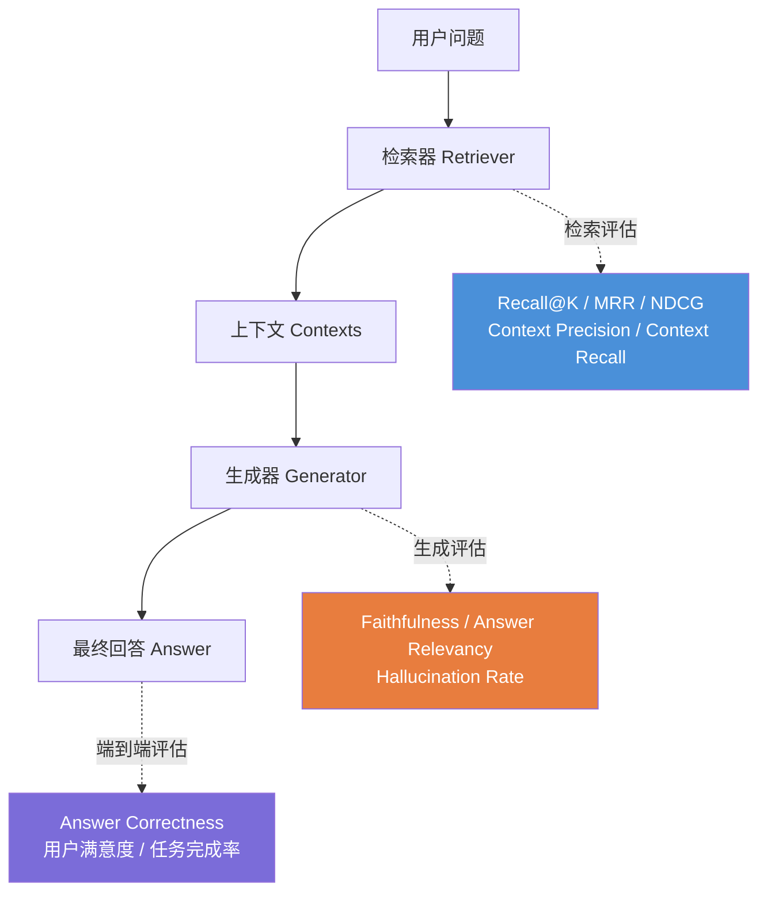
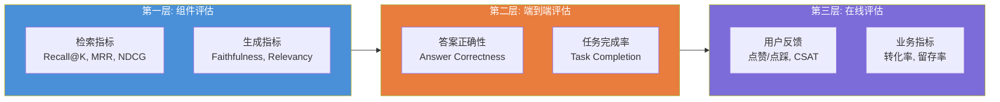
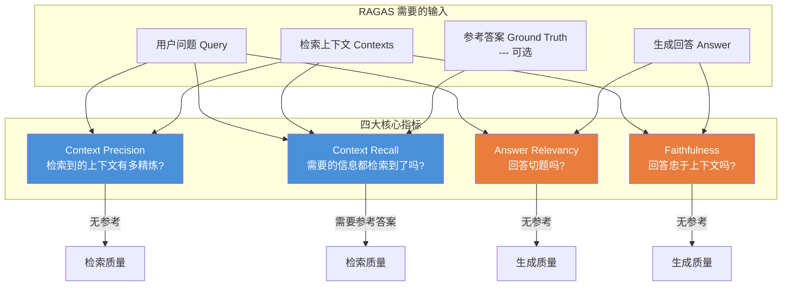
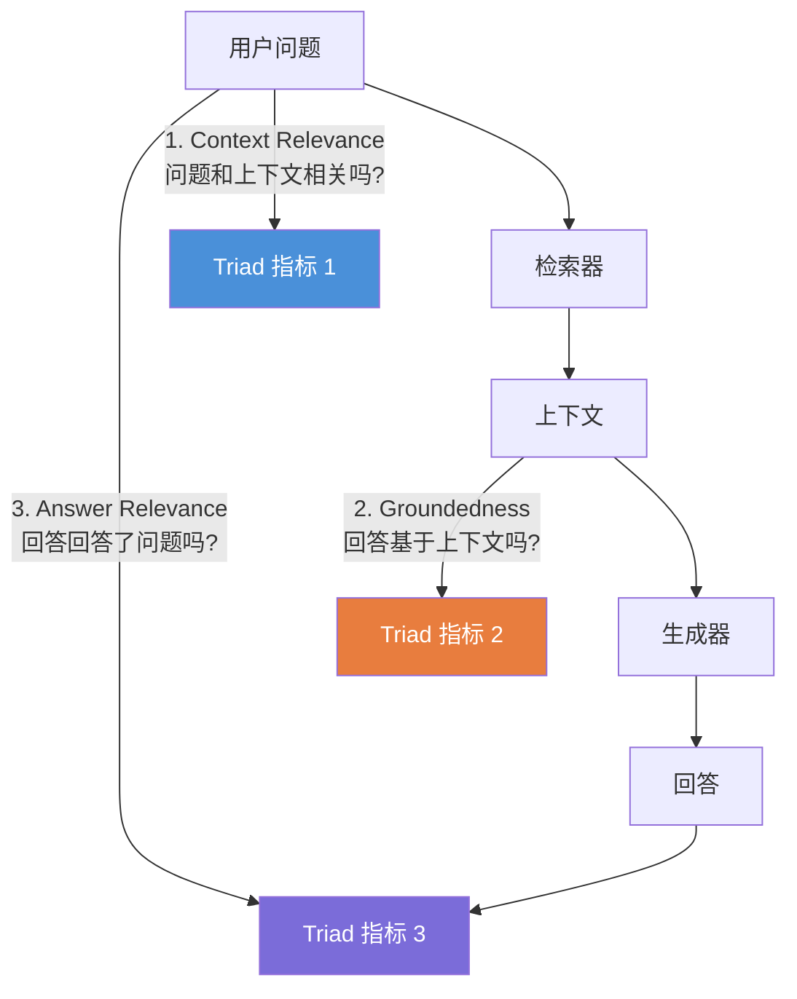
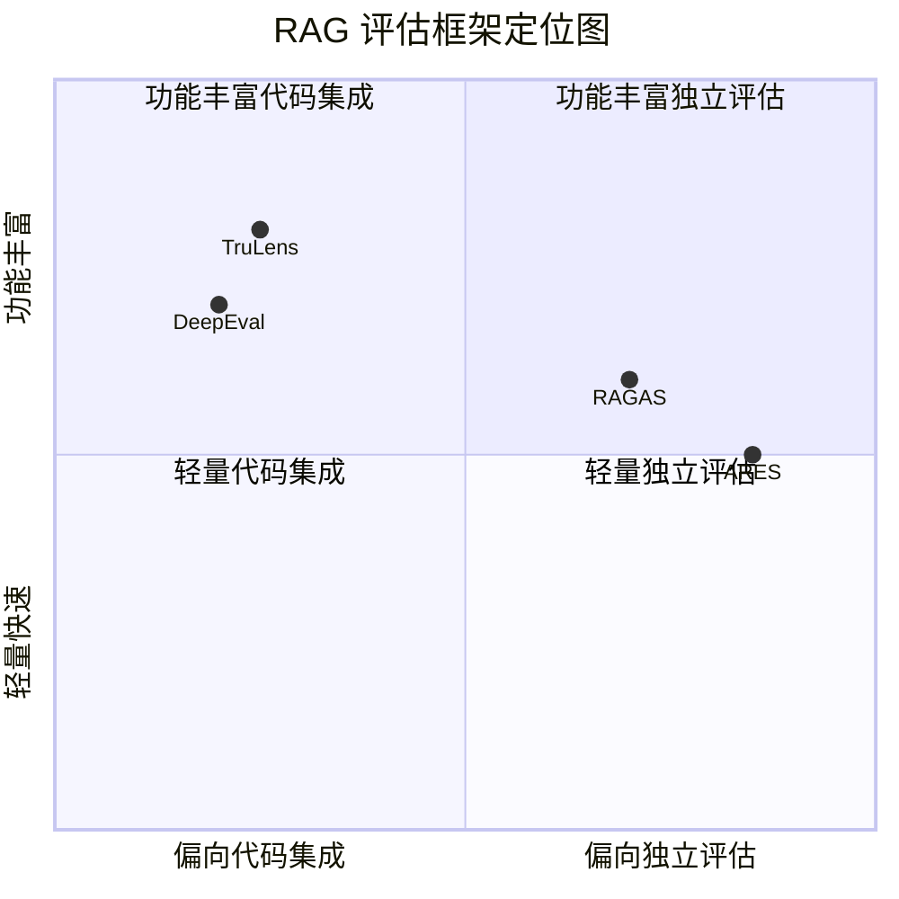
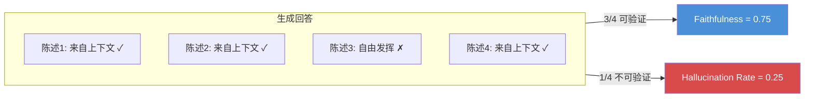
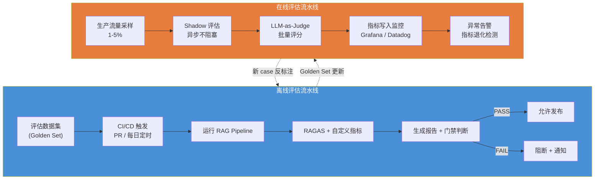
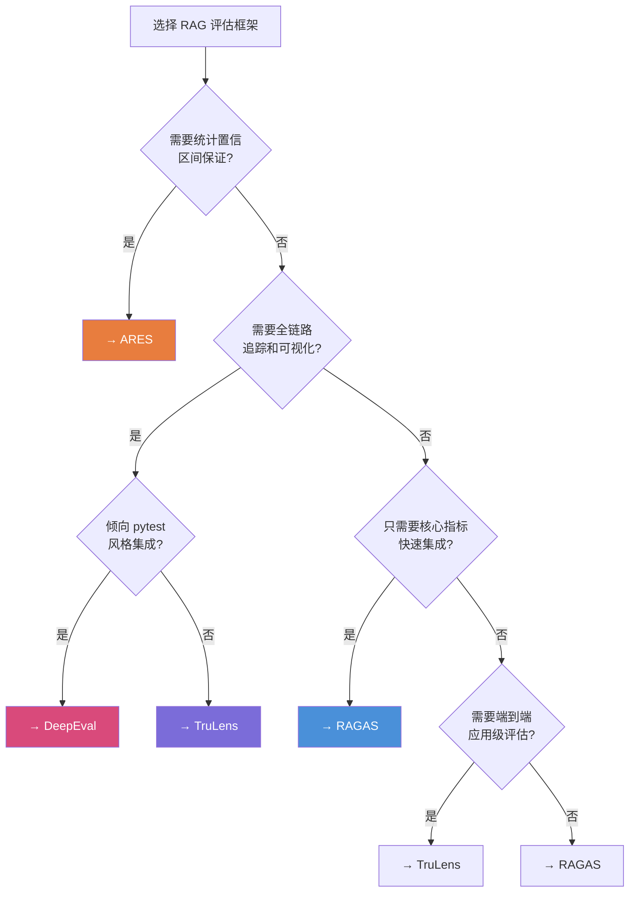
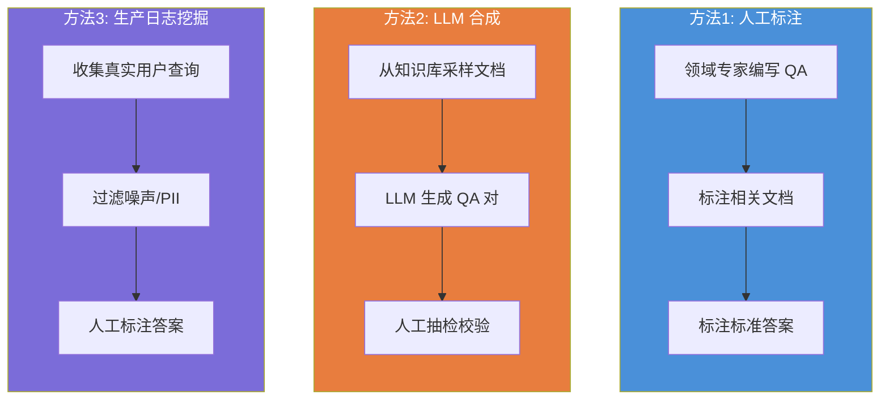

# RAG 评估框架完全指南 (RAG Evaluation Framework)

> **一句话理解**: RAG 评估的核心在于把检索和生成拆开测量——用 RAGAS 的四大指标量化两个环节的表现，再通过 ARES、TruLens、DeepEval 等框架构建从离线评估到线上监控的完整闭环。

---

## 目录

1. [RAG 评估的核心挑战](#1-rag-评估的核心挑战)
2. [RAGAS 框架详解](#2-ragas-框架详解)
3. [其他主流评估框架](#3-其他主流评估框架)
4. [检索质量指标体系](#4-检索质量指标体系)
5. [生成质量指标体系](#5-生成质量指标体系)
6. [端到端评估](#6-端到端评估)
7. [生产级评估流水线](#7-生产级评估流水线)
8. [评估框架横向对比与选型](#8-评估框架横向对比与选型)
9. [评估数据集构建策略](#9-评估数据集构建策略)
10. [常见陷阱与最佳实践](#10-常见陷阱与最佳实践)
11. [Related](#related)

---

## 1. RAG 评估的核心挑战

### 1.1 为什么传统评估方法不够用

传统 NLP 任务（如机器翻译、文本分类）有标准答案，直接用 BLEU、ROUGE 或准确率就能衡量。但 RAG 系统引入了"检索"这一中间环节，使得评估变得复杂：一个糟糕的回答可能源于检索失败（没找到正确文档），也可能源于生成失败（找到了但没用上）。如果你只看最终回答的质量，就会陷入"猜病因"的困境。

```
传统 QA 评估:
  Question → Model → Answer  ⟷  Ground Truth    ✅ 简单

RAG 评估:
  Question → Retriever → Contexts → Generator → Answer
               ↑                          ↑
          检索质量                   生成质量
         (能不能找到)             (能不能用好)
```

### 1.2 检索 vs 生成：拆分评估的必要性



拆分评估的三个核心价值：

| 价值 | 说明 | 例子 |
|------|------|------|
| **故障定位** | 精准找到是哪个环节出了问题 | Faithfulness 低但 Context Recall 高 → 生成器有幻觉 |
| **独立优化** | 对检索和生成分别调参不互相干扰 | 换 Embedding 模型时只关注检索指标 |
| **成本归因** | 计算不同环节的 ROI | 检索改进带来 20% 提升 vs 重排带来 5% 提升 |

### 1.3 评估的三层架构



> **深入阅读**: 关于 RAG 评估的理论基础，参见 [[../08_模型评估/03_LLM_Evaluation/RAG_Evaluation_Deep_Dive|RAG评估深度解析]]，该文档对评估分层和 LLM-as-Judge 有更深入的讨论。

---

## 2. RAGAS 框架详解

RAGAS (Retrieval Augmented Generation Assessment) 是目前最广泛使用的 RAG 评估框架，由 Akshay Sunil Es 等人在 2023 年提出。其核心思想是：**不需要人工标注，仅利用 LLM 自身来评估 RAG 系统的各个环节**。

### 2.1 RAGAS 四大核心指标



#### 2.1.1 Faithfulness（忠实度）

**定义**: 回答中的每一个陈述是否都能从检索到的上下文中找到支撑。

**计算逻辑**:
1. 将回答拆解为多个原子陈述（atomic statements）
2. 对每个陈述，判断是否能从上下文中推导出来
3. `Faithfulness = 可验证的陈述数 / 总陈述数`

```python
from ragas import evaluate
from ragas.metrics import faithfulness
from datasets import Dataset

eval_data = {
    "question": ["什么是 Kubernetes 的 HPA?"],
    "answer": ["HPA 是 Kubernetes 的水平 Pod 自动扩缩容控制器，它根据 CPU 利用率自动调整 Pod 数量。HPA 也支持基于自定义指标的扩缩容。"],
    "contexts": [[
        "HorizontalPodAutoscaler (HPA) 是 Kubernetes 中自动扩缩容 Pod 数量的控制器。"
        "它根据 CPU 利用率、内存利用率或自定义指标来决定目标 Pod 副本数。"
    ]],
}

dataset = Dataset.from_dict(eval_data)
result = evaluate(dataset, metrics=[faithfulness])
print(result)  # {'faithfulness': 0.85}
```

> **解读**: Faithfulness = 1.0 意味着回答完全忠于上下文（无幻觉）；低于 0.5 通常意味着 LLM 在大量"自由发挥"。

#### 2.1.2 Answer Relevancy（回答相关性）

**定义**: 回答是否直接回应了用户的问题，没有偏题或冗余。

**计算逻辑**:
1. 从回答反向生成 N 个"可能的问题"
2. 计算这些生成问题与原始问题的语义相似度（余弦相似度）
3. 取平均作为 Answer Relevancy 分数

```python
from ragas.metrics import answer_relevancy

result = evaluate(dataset, metrics=[answer_relevancy])
# 原理: 如果回答切题，从回答生成的"问题"应该和原问题高度相似
```

> **注意**: Answer Relevancy 高不代表答案正确——它只衡量"是否切题"。需要配合 Faithfulness 一起看。

#### 2.1.3 Context Precision（上下文精确度）

**定义**: 检索到的上下文中，真正相关的文档是否排在了前面。

**计算逻辑**:
1. 对每个检索到的上下文片段，用 LLM 判断它与问题是否相关
2. 计算加权排序：相关文档排越前分数越高
3. 使用 Average Precision 公式

```
检索结果: [Doc_A(相关), Doc_B(无关), Doc_C(相关), Doc_D(无关)]
                                                    ↓
排序加权: AP = (1/1 + 0/2 + 2/3 + 0/4) / 相关文档总数
        = (1.0 + 0 + 0.67 + 0) / 2 = 0.835
```

#### 2.1.4 Context Recall（上下文召回率）

**定义**: 参考答案中的信息是否都被检索到的上下文覆盖了。

**计算逻辑**:
1. 将参考答案拆解为原子陈述
2. 对每个陈述，判断是否能从上下文中推导出来
3. `Context Recall = 可从上下文推导的陈述数 / 参考答案总陈述数`

> **关键区别**: Context Precision 衡量"检索结果中有多少噪声"，Context Recall 衡量"需要的信息是否都找全了"。前者低 → 噪声多浪费 Token，后者低 → 信息缺失导致答不出。

### 2.2 RAGAS 完整评估示例

```python
"""
RAGAS 完整评估示例
依赖: pip install ragas datasets
"""
from ragas import evaluate
from ragas.metrics import (
    faithfulness,
    answer_relevancy,
    context_precision,
    context_recall,
    context_entity_recall,
    answer_similarity,
    answer_correctness,
)
from datasets import Dataset

# ── 构建评估数据集 ──
eval_samples = [
    {
        "question": "如何在 Python 中实现单例模式?",
        "answer": "Python 中可以通过 __new__ 方法重写或使用模块级变量来实现单例模式。模块本身就是单例的，因为 Python 模块在第一次导入时加载，之后都引用同一个实例。",
        "contexts": [
            "Python 单例模式实现方式包括：使用 __new__ 方法、使用装饰器、使用模块、使用元类。"
            "最简单的方式是利用模块——Python 模块在首次导入时初始化，之后的导入返回缓存对象。"
        ],
        "ground_truth": "Python 实现单例模式有多种方式：__new__ 方法、装饰器、模块级变量、元类。模块方式最简单，因为 Python 的模块系统天然保证单例。"
    },
]

dataset = Dataset.from_dict({
    k: [d[k] for d in eval_samples] for k in eval_samples[0]
})

# ── 执行评估 ──
results = evaluate(
    dataset,
    metrics=[
        faithfulness,           # 生成指标: 忠实度
        answer_relevancy,       # 生成指标: 回答相关性
        context_precision,      # 检索指标: 上下文精确度
        context_recall,         # 检索指标: 上下文召回率
        answer_correctness,     # 端到端: 答案正确性 (需要 ground_truth)
    ],
)

print(results)
# 输出示例:
# {
#   'faithfulness': 0.92,
#   'answer_relevancy': 0.88,
#   'context_precision': 1.0,
#   'context_recall': 0.85,
#   'answer_correctness': 0.90,
# }
```

### 2.3 RAGAS 的优势与局限

| 维度 | 优势 | 局限 |
|------|------|------|
| **标注成本** | 无需人工标注，自动评估 | LLM-as-Judge 有固有偏差 |
| **指标覆盖** | 检索 + 生成分离评估 | 缺少端到端业务指标 |
| **可扩展性** | 支持自定义 LLM 和 Embedding | 大规模评估的 API 成本高 |
| **可解释性** | 返回子陈述级别的推理 | 复杂查询时推理链可读性差 |
| **语言支持** | 支持多语言 | 非英语场景准确率有折扣 |

---

## 3. 其他主流评估框架

### 3.1 ARES (Automated RAG Evaluation System)

ARES 由 Stanford NLP 团队提出，核心创新是使用**少量人工标注 + 预测模型**来评估 RAG 系统，大幅降低评估成本。

**核心机制**:
1. 人工标注少量样本（约 150 条）作为种子集
2. 训练一个轻量级分类器预测检索和生成的"好坏"
3. 使用置信区间给出统计保证

```python
"""
ARES 评估示例
pip install ares-ai
"""
from ares import ARES

ares_config = {
    "document_directory": "./data/docs/",
    "questions_directory": "./data/questions/",
    "gold_answer_directory": "./data/answers/",
    "labels": ["relevant", "irrelevant"],
    "few_shot_prompt_filename": "./data/few_shot_examples.jsonl",
    "synthetic_query_prompt_filename": "./data/synthetic_query_prompt.txt",
}

ares = ARES(ares_config)
results = ares.evaluate_rag(
    retrieval_system=your_rag_pipeline,
    llm_for_evaluation="gpt-4o",
)
# 返回带置信区间的评估结果:
# Context Recall: 0.82 (95% CI: [0.78, 0.86])
# Answer Relevance: 0.91 (95% CI: [0.88, 0.94])
```

### 3.2 TruLens

TruLens 专注于 RAG 应用的可观测性和评估，提供丰富的追踪和可视化能力。其核心是 **RAG Triad**（三合一评估）。



```python
"""
TruLens RAG 三合一评估
pip install trulens-core trulens-providers-openai
"""
from trulens.core import TruSession, Feedback
from trulens.providers.openai import OpenAI
from trulens.core import TruBasicApp

session = TruSession()
provider = OpenAI(model="gpt-4o")

# 定义 RAG Triad 反馈函数
context_relevance = Feedback(provider.context_relevance_with_cot_reasons,
                             name="Context Relevance").on_input().on(context)
groundedness = Feedback(provider.groundedness_measure_with_cot_reasons,
                        name="Groundedness").on(context).on_output()
answer_relevance = Feedback(provider.relevance,
                            name="Answer Relevance").on_input().on_output()

# 包装你的 RAG 应用
tru_recorder = TruBasicApp(
    your_rag_function,
    app_id="my-rag-v1",
    feedbacks=[context_relevance, groundedness, answer_relevance],
)

with tru_recorder as recording:
    response = tru_recacer.main_call("什么是 RAG?")

# 查看评估结果仪表盘
session.get_leaderboard(app_ids=["my-rag-v1"])
```

### 3.3 DeepEval

DeepEval 采用类 pytest 的 API 风格，将 RAG 评估集成到测试流水线中。

```python
"""
DeepEval 评估示例 —— 类 pytest 风格
pip install deepeval
"""
from deepeval import assert_test
from deepeval.metrics import (
    FaithfulnessMetric,
    AnswerRelevancyMetric,
    ContextualPrecisionMetric,
    ContextualRecallMetric,
    HallucinationMetric,
)
from deepeval.test_case import LLMTestCase
from deepeval.dataset import EvaluationDataset

# 定义评估指标
faithfulness = FaithfulnessMetric(threshold=0.7)
relevancy = AnswerRelevancyMetric(threshold=0.7)
precision = ContextualPrecisionMetric(threshold=0.7)
recall = ContextualRecallMetric(threshold=0.7)

test_case = LLMTestCase(
    input="如何防止 SQL 注入?",
    actual_output="使用参数化查询、输入验证和 ORM 框架可以有效防止 SQL 注入攻击。",
    expected_output="防止 SQL 注入的方法包括参数化查询、输入验证、使用 ORM、最小权限原则。",
    retrieval_context=[
        "SQL 注入防护最佳实践：使用参数化查询而非字符串拼接、对用户输入进行验证和过滤、"
        "使用 ORM 框架（如 SQLAlchemy）自动处理参数化、为数据库用户分配最小权限。"
    ],
)

# 运行评估
faithfulness.measure(test_case)
relevancy.measure(test_case)
precision.measure(test_case)
recall.measure(test_case)

print(f"Faithfulness: {faithfulness.score}")
print(f"Answer Relevancy: {relevancy.score}")
print(f"Context Precision: {precision.score}")
print(f"Context Recall: {recall.score}")
assert_test(test_case, [faithfulness, relevancy, precision, recall])
```

### 3.4 框架定位对比



---

## 4. 检索质量指标体系

检索是 RAG 系统的天花板——检索不到的文档，LLM 无从生成。检索质量评估是整个评估体系的基石。

### 4.1 经典信息检索指标

| 指标 | 定义 | 公式 | RAG 适用场景 |
|------|------|------|-------------|
| **Hit Rate@K** | 前 K 个结果中是否命中相关文档 | `1 if hit else 0` | 快速 sanity check |
| **Recall@K** | 前 K 个结果覆盖了多少相关文档 | `命中相关数 / 总相关数` | **RAG 核心红线** |
| **Precision@K** | 前 K 个结果中有多少是相关的 | `相关数 / K` | 上下文 Token 成本控制 |
| **MRR** | 首个相关结果排名的倒数 | `mean(1/rank_first)` | 单一答案 QA |
| **NDCG@K** | 考虑位置折扣的排序质量 | `DCG@K / IDCG@K` | 细粒度排序评估 |
| **MAP** | 平均精度的均值 | 各位置 Precision 的平均 | 多相关文档场景 |

### 4.2 Recall@K 详解——RAG 的第一道红线

```python
"""
Recall@K 计算
"""
from typing import List

def recall_at_k(
    retrieved_docs: List[str],
    relevant_docs: List[str],
    k: int = 5,
) -> float:
    """
    计算 Recall@K
    Args:
        retrieved_docs: 检索返回的文档列表（按相关性排序）
        relevant_docs: 标准答案认为相关的文档列表
        k: 取前 K 个结果
    Returns:
        recall 分数 [0, 1]
    """
    top_k = retrieved_docs[:k]
    relevant_set = set(relevant_docs)
    retrieved_relevant = set(top_k) & relevant_set
    if len(relevant_set) == 0:
        return 0.0
    return len(retrieved_relevant) / len(relevant_set)


# 示例
retrieved = ["doc_a", "doc_b", "doc_c", "doc_d", "doc_e", "doc_f"]
relevant = ["doc_a", "doc_c", "doc_x"]

print(f"Recall@3: {recall_at_k(retrieved, relevant, k=3):.2f}")  # 0.67 (doc_a, doc_c / 3)
print(f"Recall@5: {recall_at_k(retrieved, relevant, k=5):.2f}")  # 0.67 (doc_a, doc_c / 3)
print(f"Recall@10: {recall_at_k(retrieved, relevant, k=10):.2f}")  # 0.67
```

### 4.3 NDCG@K 详解——位置感知的排序质量

```python
"""
NDCG@K 计算 —— 惩罚相关文档排得靠后的情况
"""
import math

def dcg_at_k(relevances: List[float], k: int) -> float:
    """Discounted Cumulative Gain"""
    return sum(
        rel / math.log2(i + 2)  # i+2 因为 log2(1) = 0
        for i, rel in enumerate(relevances[:k])
    )

def ndcg_at_k(
    retrieved_relevances: List[float],
    ideal_relevances: List[float],
    k: int = 5,
) -> float:
    """
    Args:
        retrieved_relevances: 检索结果的相关度分数列表
        ideal_relevances: 理想排序下的相关度分数列表
    """
    dcg = dcg_at_k(retrieved_relevances, k)
    idcg = dcg_at_k(sorted(ideal_relevances, reverse=True), k)
    return dcg / idcg if idcg > 0 else 0.0


# 示例: 检索返回了 5 个结果，相关度标注为 [3, 0, 2, 3, 1]
retrieved_rel = [3, 0, 2, 3, 1]
ideal_rel = [3, 3, 2, 1, 0]  # 理想排序: 最相关的排最前面

print(f"NDCG@5: {ndcg_at_k(retrieved_rel, ideal_rel, k=5):.4f}")
# NDCG@5: 0.7854 —— 因为一个相关度3的文档排在了第4位
```

### 4.4 检索指标基准参考

| 指标 | 及格线 | 良好 | 优秀 | 备注 |
|------|--------|------|------|------|
| **Recall@5** | 0.70 | 0.85 | 0.95+ | RAG 最低门槛 |
| **Recall@10** | 0.80 | 0.90 | 0.97+ | 增大 K 总能提升 |
| **MRR** | 0.50 | 0.70 | 0.85+ | 期望第一个相关结果在前 2 位 |
| **NDCG@5** | 0.65 | 0.80 | 0.90+ | 反映整体排序质量 |
| **Context Precision** | 0.60 | 0.75 | 0.85+ | RAGAS 风格的精确度 |

> **实践建议**: 生产环境建议同时跟踪 Recall@5 和 NDCG@5。前者确保"找得到"，后者确保"排得好"。

---

## 5. 生成质量指标体系

### 5.1 核心生成指标

| 指标 | 衡量什么 | 计算方式 | 目标值 |
|------|----------|----------|--------|
| **Faithfulness** | 回答是否忠于检索到的上下文 | 可验证陈述 / 总陈述 | > 0.85 |
| **Answer Relevancy** | 回答是否切题 | 反向生成问题的语义相似度 | > 0.80 |
| **Hallucination Rate** | 回答中幻觉陈述的比例 | 1 - Faithfulness | < 0.10 |
| **Helpfulness** | 回答对用户是否有实际帮助 | LLM-as-Judge + 人工抽检 | > 0.80 |
| **Answer Correctness** | 与标准答案的语义一致性 | 语义相似度 + 事实匹配 | > 0.85 |
| **Citation Accuracy** | 引用的来源是否正确 | 引用上下文匹配 | > 0.90 |

### 5.2 Faithfulness 与 Hallucination Rate 的关系



### 5.3 多维度生成评估实现

```python
"""
综合生成质量评估: Faithfulness + Relevancy + Hallucination + Helpfulness
"""
from dataclasses import dataclass
from typing import List

@dataclass
class GenerationMetrics:
    faithfulness: float          # 忠实度
    answer_relevancy: float      # 回答相关性
    hallucination_rate: float    # 幻觉率 = 1 - faithfulness
    helpfulness: float           # 有用性
    citation_accuracy: float     # 引用准确性
    overall_score: float         # 综合分数

def evaluate_generation(
    query: str,
    answer: str,
    contexts: List[str],
    ground_truth: str = None,
    citations: List[str] = None,
) -> GenerationMetrics:
    """
    多维度评估生成质量
    """
    # 1. Faithfulness (使用 RAGAS)
    from ragas.metrics import faithfulness
    # ... 评估逻辑 ...

    # 2. Hallucination Rate
    hallucination_rate = 1.0 - faithfulness_score

    # 3. Helpfulness (LLM-as-Judge)
    helpfulness_prompt = f"""
    评估以下回答对用户问题的有用性（1-5分）：
    问题: {query}
    回答: {answer}

    评分标准:
    5 = 完全解决了用户的问题，信息准确且充分
    4 = 基本解决了问题，有小瑕疵
    3 = 部分解决，有重要信息缺失
    2 = 几乎没有帮助
    1 = 完全无用或误导
    只返回数字。
    """

    # 4. Citation Accuracy
    if citations:
        citation_accuracy = sum(
            1 for c in citations if c in "\n".join(contexts)
        ) / len(citations)
    else:
        citation_accuracy = 0.0

    # 5. Overall Score (加权平均)
    overall = (
        0.30 * faithfulness_score +
        0.25 * answer_relevancy_score +
        0.20 * helpfulness_score +
        0.15 * (1 - hallucination_rate) +
        0.10 * citation_accuracy
    )

    return GenerationMetrics(
        faithfulness=faithfulness_score,
        answer_relevancy=answer_relevancy_score,
        hallucination_rate=hallucination_rate,
        helpfulness=helpfulness_score,
        citation_accuracy=citation_accuracy,
        overall_score=overall,
    )
```

### 5.4 生成指标诊断矩阵

当生成指标出现异常时，可以通过以下矩阵快速定位问题：

| Faithfulness | Answer Relevancy | 诊断 | 可能原因 | 解决方案 |
|:---:|:---:|------|------|------|
| 高 | 高 | 健康状态 ✅ | — | 维持现状 |
| 低 | 高 | 幻觉严重 | LLM 过度生成 / Prompt 不够约束 | 强化约束 Prompt、降低 temperature |
| 高 | 低 | 答非所问 | 检索质量差 / 问题理解失败 | 改进检索、添加 Query Rewriting |
| 低 | 低 | 全面失败 | 级联故障 | 先修检索再修生成 |
| 中 | 高 | 轻微幻觉 | 部分陈述缺乏支撑 | 增加 Reranking、Context 压缩 |

---

## 6. 端到端评估

### 6.1 超越组件指标：用户视角

组件指标（Faithfulness、Recall@K 等）衡量的是"技术质量"，但用户最终关心的是"这个回答有没有解决我的问题"。端到端评估弥合了技术指标和用户感知之间的鸿沟。

```mermaid
flowchart TB
    subgraph Tech["技术指标层"]
        T1[Recall@K]
        T2[NDCG]
        T3[Faithfulness]
        T4[Answer Relevancy]
    end

    subgraph E2E["端到端指标层"]
        E1[Answer Correctness]
        E2[任务完成率]
        E3[首次回答解决率]
        E4[用户满意度 CSAT]
    end

    subgraph Biz["业务指标层"]
        B1[转化率]
        B2[留存率]
        B3[客服工单减少率]
        B4[平均会话轮数]
    end

    Tech --> E2E --> Biz

    style Tech fill:#4a90d9,color:#fff
    style E2E fill:#e87d3e,color:#fff
    style Biz fill:#7b6cd9,color:#fff
```

### 6.2 核心端到端指标

#### 任务完成率 (Task Completion Rate)

```python
"""
任务完成率评估: 用户的问题是否被真正解决
"""
def measure_task_completion(
    query: str,
    answer: str,
    follow_up_count: int = 0,
    user_feedback: str = None,
    llm_judge=None,
) -> dict:
    """
    综合判断任务是否完成
    - follow_up_count: 用户追问次数 (0 = 一次解决)
    - user_feedback: 用户显式反馈 ("helpful" / "not_helpful")
    """
    signals = {
        "no_followup": follow_up_count == 0,
        "positive_feedback": user_feedback == "helpful",
        "no_complaint": user_feedback != "not_helpful",
    }

    # LLM 判断回答是否完整回答了问题
    if llm_judge:
        completion_verdict = llm_judge(query, answer)  # 返回 0-1
        signals["llm_complete"] = completion_verdict > 0.8

    completed = sum(signals.values()) / len(signals) >= 0.75
    return {
        "completed": completed,
        "confidence": sum(signals.values()) / len(signals),
        "signals": signals,
    }
```

#### 用户满意度 (CSAT / Thumbs Up-Down)

| 反馈机制 | 优点 | 缺点 | 采纳率 |
|----------|------|------|--------|
| 点赞/点踩按钮 | 快速、低摩擦 | 信息量少 | 5-15% |
| 1-5 星评分 | 有梯度 | 用户疲劳 | 2-8% |
| "回答有帮助吗?"弹窗 | 直白 | 打断体验 | 3-10% |
| 隐式信号（复制/分享/追问） | 无摩擦 | 需要大量数据建模 | 100% |

### 6.3 端到端评估基准

| 指标 | 定义 | 行业平均 | 优秀水平 |
|------|------|----------|----------|
| **Answer Correctness** | 答案与标准答案的语义一致度 | 0.75 | 0.90+ |
| **首次解决率 (FCR)** | 用户一次交互就解决问题的比例 | 55-65% | 80%+ |
| **平均会话轮数** | 解决一个问题需要几轮对话 | 2.5-3.5 | < 2.0 |
| **CSAT** | 用户满意度评分 | 3.8/5 | 4.5+/5 |
| **幻觉投诉率** | 用户明确指出答案错误的比例 | 5-8% | < 2% |

---

## 7. 生产级评估流水线

### 7.1 流水线架构



### 7.2 离线评估流水线实现

```python
"""
生产级离线评估流水线
集成到 CI/CD，每次 PR 自动运行
"""
import json
from pathlib import Path
from dataclasses import dataclass, asdict
from typing import List, Optional
from datetime import datetime

# 这些依赖按需安装:
# pip install ragas datasets

@dataclass
class EvalResult:
    test_name: str
    faithfulness: float
    answer_relevancy: float
    context_precision: float
    context_recall: float
    answer_correctness: Optional[float]
    passed: bool
    timestamp: str

# ── 门禁阈值 ──
THRESHOLDS = {
    "faithfulness": 0.80,
    "answer_relevancy": 0.75,
    "context_precision": 0.70,
    "context_recall": 0.75,
    "answer_correctness": 0.80,
}

def load_golden_dataset(path: str) -> List[dict]:
    """加载评估数据集"""
    with open(path) as f:
        return [json.loads(line) for line in f]

def run_rag_pipeline(query: str) -> tuple[str, list[str]]:
    """
    你的 RAG Pipeline —— 替换为实际实现
    返回: (answer, contexts)
    """
    from your_app.rag import rag_search
    result = rag_search(query)
    return result.answer, result.contexts

def evaluate_single(sample: dict) -> EvalResult:
    """评估单条样本"""
    query = sample["question"]
    ground_truth = sample.get("answer")
    expected_contexts = sample.get("relevant_docs", [])

    # 运行 RAG
    answer, contexts = run_rag_pipeline(query)

    # 构建评估数据
    eval_input = {
        "question": [query],
        "answer": [answer],
        "contexts": [contexts],
        "ground_truth": [ground_truth] if ground_truth else [""],
    }

    from datasets import Dataset
    from ragas import evaluate
    from ragas.metrics import (
        faithfulness, answer_relevancy,
        context_precision, context_recall,
        answer_correctness,
    )

    dataset = Dataset.from_dict(eval_input)
    metrics = [
        faithfulness, answer_relevancy,
        context_precision, context_recall,
    ]
    if ground_truth:
        metrics.append(answer_correctness)

    result = evaluate(dataset, metrics=metrics)

    scores = {k: float(v) for k, v in result.items()}
    passed = all(scores.get(k, 1.0) >= THRESHOLDS.get(k, 0) for k in THRESHOLDS)

    return EvalResult(
        test_name=sample.get("name", query[:50]),
        faithfulness=scores.get("faithfulness", 0),
        answer_relevancy=scores.get("answer_relevancy", 0),
        context_precision=scores.get("context_precision", 0),
        context_recall=scores.get("context_recall", 0),
        answer_correctness=scores.get("answer_correctness"),
        passed=passed,
        timestamp=datetime.now().isoformat(),
    )

def run_eval_pipeline(dataset_path: str, output_path: str):
    """运行完整评估流水线"""
    samples = load_golden_dataset(dataset_path)
    results = []

    for sample in samples:
        try:
            result = evaluate_single(sample)
            results.append(result)
        except Exception as e:
            print(f"评估失败: {sample.get('name', '?')} -> {e}")

    # 生成报告
    total = len(results)
    passed = sum(1 for r in results if r.passed)
    pass_rate = passed / total if total > 0 else 0

    report = {
        "summary": {
            "total": total,
            "passed": passed,
            "failed": total - passed,
            "pass_rate": f"{pass_rate:.1%}",
            "timestamp": datetime.now().isoformat(),
        },
        "thresholds": THRESHOLDS,
        "results": [asdict(r) for r in results],
    }

    Path(output_path).parent.mkdir(parents=True, exist_ok=True)
    with open(output_path, "w") as f:
        json.dump(report, f, indent=2, ensure_ascii=False)

    # CI/CD 门禁: 通过率必须 >= 90%
    if pass_rate < 0.90:
        print(f"❌ 评估未通过: {pass_rate:.1%} (要求 >= 90%)")
        return False

    print(f"✅ 评估通过: {pass_rate:.1%}")
    return True

if __name__ == "__main__":
    import sys
    success = run_eval_pipeline(
        dataset_path="eval/golden_set.jsonl",
        output_path="eval/reports/latest.json",
    )
    sys.exit(0 if success else 1)
```

### 7.3 在线影子评估

```python
"""
在线影子评估: 对生产流量异步评估，不影响用户体验
"""
import asyncio
from collections import deque
from datetime import datetime, timedelta

class ShadowEvaluator:
    """异步采样评估生产流量"""

    def __init__(self, sample_rate: float = 0.05, batch_size: int = 20):
        self.sample_rate = sample_rate
        self.batch_size = batch_size
        self.buffer = deque(maxlen=1000)
        self.metrics_window = deque(maxlen=10000)

    async def maybe_evaluate(self, query: str, answer: str, contexts: list):
        """按采样率决定是否评估"""
        import random
        if random.random() > self.sample_rate:
            return

        self.buffer.append({
            "query": query,
            "answer": answer,
            "contexts": contexts,
            "timestamp": datetime.now().isoformat(),
        })

        if len(self.buffer) >= self.batch_size:
            await self._flush()

    async def _flush(self):
        """批量评估缓冲区数据"""
        batch = list(self.buffer)
        self.buffer.clear()

        # 异步调用 LLM-as-Judge
        results = await self._batch_judge(batch)

        for item, result in zip(batch, results):
            self.metrics_window.append({
                "timestamp": item["timestamp"],
                "faithfulness": result["faithfulness"],
                "relevancy": result["relevancy"],
            })

        # 检测异常退化
        self._check_regression()

    def _check_regression(self):
        """检测最近窗口的指标退化"""
        if len(self.metrics_window) < 100:
            return

        recent = list(self.metrics_window)[-100:]
        baseline = list(self.metrics_window)[-200:-100]

        if not baseline:
            return

        recent_faith = sum(r["faithfulness"] for r in recent) / len(recent)
        baseline_faith = sum(r["faithfulness"] for r in baseline) / len(baseline)

        drop = baseline_faith - recent_faith
        if drop > 0.05:  # 下降超过 5%
            self._alert(f"Faithfulness 退化: {baseline_faith:.3f} → {recent_faith:.3f}")

    def _alert(self, message: str):
        """发送告警"""
        print(f"[ALERT] {message}")
        # 集成 Slack / PagerDuty / 邮件等
```

### 7.4 评估流水线 CI/CD 集成

```yaml
# .github/workflows/rag-eval.yml
name: RAG Evaluation Gate

on:
  pull_request:
    paths:
      - 'src/rag/**'
      - 'eval/golden_set.jsonl'
  schedule:
    - cron: '0 2 * * *'  # 每天凌晨 2 点全量评估

jobs:
  rag-evaluation:
    runs-on: ubuntu-latest
    steps:
      - uses: actions/checkout@v4

      - name: Setup Python
        uses: actions/setup-python@v5
        with:
          python-version: '3.11'

      - name: Install dependencies
        run: pip install ragas datasets openai

      - name: Run evaluation pipeline
        env:
          OPENAI_API_KEY: ${{ secrets.OPENAI_API_KEY }}
        run: python eval/run_pipeline.py

      - name: Upload evaluation report
        if: always()
        uses: actions/upload-artifact@v4
        with:
          name: rag-eval-report
          path: eval/reports/latest.json

      - name: Comment PR with results
        if: github.event_name == 'pull_request'
        uses: actions/github-script@v7
        with:
          script: |
            const report = require('./eval/reports/latest.json');
            const s = report.summary;
            github.rest.issues.createComment({
              issue_number: context.issue.number,
              owner: context.repo.owner,
              repo: context.repo.repo,
              body: `## RAG 评估结果\n\n` +
                `| 指标 | 结果 |\n|------|------|\n` +
                `| 通过率 | ${s.pass_rate} (${s.passed}/${s.total}) |\n` +
                `| 门禁 | ${s.pass_rate >= '90%' ? '✅ PASS' : '❌ FAIL'} |`
            });
```

---

## 8. 评估框架横向对比与选型

### 8.1 全面对比表

| 维度 | RAGAS | ARES | TruLens | DeepEval |
|------|-------|------|---------|----------|
| **核心指标** | Faithfulness, Relevancy, Context P/R | Context Relevance, Answer Faithfulness | RAG Triad (3 指标) | 与 RAGAS 类似 + 自定义 |
| **评估方式** | LLM-as-Judge | 少量标注 + 分类器 | LLM-as-Judge | LLM-as-Judge |
| **标注需求** | 零标注 (Context Recall 除外) | ~150 条种子标注 | 零标注 | 零标注 |
| **置信区间** | 无 | 有 (统计保证) | 无 | 无 |
| **追踪能力** | 无 | 无 | 强 (全链路追踪) | 弱 |
| **可视化** | 基础 | 无 | Dashboard 仪表盘 | pytest 报告 |
| **CI/CD 集成** | 脚本化 | 脚本化 | App 包装模式 | pytest 原生 |
| **成本** | 中 (每条需多次 LLM 调用) | 低 (分类器推理) | 中高 | 中 |
| **语言** | Python | Python | Python | Python |
| **社区活跃度** | 高 | 中 | 高 | 高 |
| **适用规模** | 中小型评估集 | 大规模评估 | 应用级监控 | 测试驱动开发 |

### 8.2 选型决策树



### 8.3 混合使用策略

在实际项目中，框架不是互斥的。推荐的混合策略：

```
推荐组合:
├── 离线开发: RAGAS (快速迭代核心指标)
├── CI/CD 门禁: DeepEval (pytest 集成)
├── 大规模回归: ARES (统计置信区间)
└── 在线监控: TruLens (全链路追踪)
```

---

## 9. 评估数据集构建策略

### 9.1 Golden Set 构建方法

评估数据集的质量直接决定评估结果的可信度。以下是三种主流构建方法：



### 9.2 LLM 合成数据集

```python
"""
使用 LLM 从知识库自动生成评估数据集
"""
import json
from pathlib import Path

def generate_eval_dataset_from_docs(
    docs_dir: str,
    num_questions: int = 50,
    output_path: str = "eval/golden_set.jsonl",
):
    """
    从文档目录自动生成评估数据集
    """
    from openai import OpenAI
    import random

    client = OpenAI()
    docs = list(Path(docs_dir).glob("*.md"))
    samples = []

    for doc_path in random.sample(docs, min(num_questions, len(docs))):
        content = doc_path.read_text(encoding="utf-8")[:4000]  # 截取前 4000 字符

        prompt = f"""基于以下文档内容，生成 3 个评估 RAG 系统的问答对。

要求:
1. 问题应该是用户真实可能问的
2. 包含简单、中等、困难各 1 个
3. 答案必须完全基于文档内容
4. 指明答案对应文档中的哪个部分

文档内容:
{content}

以 JSON 数组格式返回，每个元素包含:
{{"question": "...", "answer": "...", "difficulty": "easy|medium|hard", "source_section": "..."}}
"""

        resp = client.chat.completions.create(
            model="gpt-4o",
            messages=[{"role": "user", "content": prompt}],
            response_format={"type": "json_object"},
        )

        try:
            data = json.loads(resp.choices[0].message.content)
            qa_list = data.get("qa_pairs", data) if isinstance(data, dict) else data

            for qa in qa_list:
                samples.append({
                    "question": qa["question"],
                    "answer": qa["answer"],
                    "relevant_docs": [str(doc_path.name)],
                    "difficulty": qa.get("difficulty", "medium"),
                    "source_section": qa.get("source_section", ""),
                    "generated_from": str(doc_path),
                })
        except (json.JSONDecodeError, KeyError) as e:
            print(f"解析失败 {doc_path}: {e}")
            continue

    with open(output_path, "w") as f:
        for s in samples:
            f.write(json.dumps(s, ensure_ascii=False) + "\n")

    print(f"生成 {len(samples)} 条评估数据 → {output_path}")
    return samples
```

### 9.3 评估数据集质量标准

| 维度 | 要求 | 说明 |
|------|------|------|
| **覆盖度** | 覆盖知识库 80%+ 的主题 | 避免评估只测了简单问题 |
| **难度分布** | 简单 30% / 中等 50% / 困难 20% | 避免全简单题虚高分 |
| **问题类型** | 事实型 / 推理型 / 多跳型 / 对比型 | 模拟真实用户查询 |
| **样本量** | 最低 100 条，推荐 300+ | 统计显著性要求 |
| **更新频率** | 每月新增 10-20% | 跟随知识库演进 |
| **数据质量** | 人工抽检准确率 > 95% | 垃圾进 = 垃圾出 |

---

## 10. 常见陷阱与最佳实践

### 10.1 评估陷阱清单

| # | 陷阱 | 后果 | 解决方案 |
|---|------|------|----------|
| 1 | **只看端到端指标** | 无法定位瓶颈 | 必须拆分检索/生成评估 |
| 2 | **LLM-as-Judge 与生成器同模型** | 自己评自己偏差大 | 评估用更强的模型 (如 GPT-4o 评 GPT-3.5) |
| 3 | **评估数据集太小** | 指标波动大不可靠 | 至少 100+ 条样本 |
| 4 | **评估数据全是简单题** | 虚高分数掩盖问题 | 刻意构造困难边界 case |
| 5 | **忽略非英语场景** | 指标失真 | 用目标语言构建数据集 |
| 6 | **不做 A/B 对照** | 不知道改进是否有效 | 每次变更都做 before/after 对比 |
| 7 | **评估数据与训练数据泄露** | 评估结果不可信 | 确保评估集不被索引 |
| 8 | **忽略延迟和成本** | 评估"质量高"但太慢太贵 | 评估时同步记录延迟和 Token 成本 |

### 10.2 LLM-as-Judge 偏见缓解

```python
"""
LLM-as-Judge 常见偏见及缓解策略
"""

# ── 偏见1: 位置偏见 (偏爱第一个出现的答案) ──
# 缓解: 交换 A/B 顺序，取平均

def mitigate_position_bias(judge_fn, query, answer_a, answer_b):
    score_ab = judge_fn(query, answer_a, answer_b)
    score_ba = judge_fn(query, answer_b, answer_a)
    return (score_ab + (1 - score_ba)) / 2

# ── 偏见2: 冗长偏见 (偏爱更长的答案) ──
# 缓解: 在 Prompt 中明确声明忽略长度

JUDGE_PROMPT = """
评估以下回答的质量。注意:
- 忽略回答长度，只关注内容质量
- 简洁的正确回答优于冗长的正确回答
- 给出 1-10 分的整数评分
"""

# ── 偏见3: 自我偏好 (LLM 偏爱自己生成的内容) ──
# 缓解: 评估模型 ≠ 生成模型

EVAL_MODEL = "gpt-4o"      # 评估用强模型
GENERATION_MODEL = "gpt-4o-mini"  # 生成用经济模型
# 或: 用 Claude 评 GPT 的输出
```

### 10.3 最佳实践总结

```
RAG 评估最佳实践 Checklist
═══════════════════════════

[必做]
□ 检索和生成拆分评估 (RAGAS 四指标)
□ 评估模型强于生成模型
□ Golden Set >= 100 条，覆盖多难度
□ CI/CD 集成评估门禁
□ 线上 Shadow 评估 1-5% 采样

[推荐]
□ 多框架交叉验证 (RAGAS + DeepEval)
□ 定期更新评估数据集
□ 同步监控延迟和成本指标
□ 记录每次变更的 before/after 对比
□ 困难 case 专项测试集

[进阶]
□ A/B 测试框架集成
□ 用户隐式反馈建模
□ 分主题/分场景的细粒度评估
□ 评估结果自动归因分析
```

---

## Related

- [[../08_模型评估/03_LLM_Evaluation/RAG_Evaluation_Deep_Dive|RAG评估深度解析]] — 更深入的 RAG 评估理论，LLM-as-Judge 偏见控制
- [[../04_Advanced_RAG/RAG_Advanced_2026|RAG高级实践 2026年完全指南]] — 高级检索策略（混合检索、重排序）直接影响检索质量
- [[../01_RAG_Fundamentals/RAG_Fundamentals|RAG 基础]] — RAG 基本流程理解
- [[../RAG_Monitoring/RAG_Monitoring_and_Observability|RAG 监控与可观测性]] — 线上监控是评估的延伸
- [[../08_模型评估/index|模型评估]] — 更广泛的 LLM 评估方法
- [[index|RAG 评估目录]] — 本目录导航
