# AI 技能速成指南

> 🎯 **目标**：理解如何构建、管理和扩展 AI 智能体和系统的能力（技能）。

---

## 🤔 什么是 AI 技能？

**AI 技能** = AI 智能体可以学习和使用的可复用能力。

把技能想象成智能手机上的应用：
- 没有应用的手机 = 只能打电话
- 有应用的手机 = 无所不能！

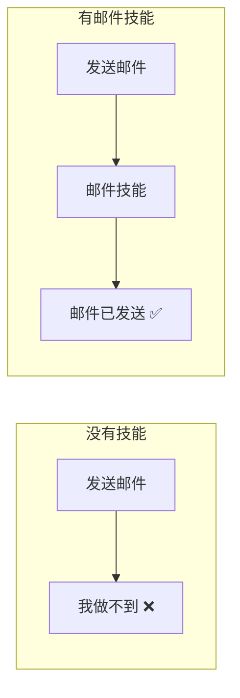

**类比**：
- 技能就像乐高积木 - 每块做一件事
- 组合起来构建复杂能力

---

## 🧩 技能类型

### 技能分类

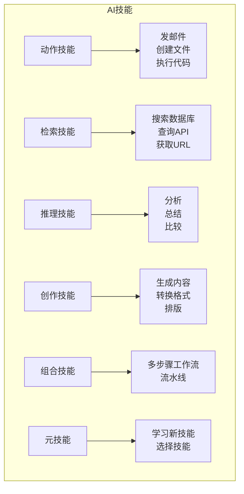

### 按类别示例

| 类别 | 技能名称 | 功能 |
|------|----------|------|
| **动作** | `send_email` | 通过 SMTP 发送邮件 |
| **动作** | `create_jira_ticket` | 在 Jira 创建工单 |
| **动作** | `deploy_service` | 部署到云端 |
| **检索** | `search_docs` | 搜索文档 |
| **检索** | `query_database` | 运行 SQL 查询 |
| **检索** | `fetch_metrics` | 获取系统指标 |
| **推理** | `analyze_logs` | 在日志中找规律 |
| **推理** | `diagnose_error` | 根因分析 |
| **创作** | `generate_report` | 创建报告 |
| **创作** | `write_code` | 生成代码片段 |
| **组合** | `incident_response` | 检测 → 分析 → 修复 → 报告 |

---

## 📋 技能结构

### 标准技能结构

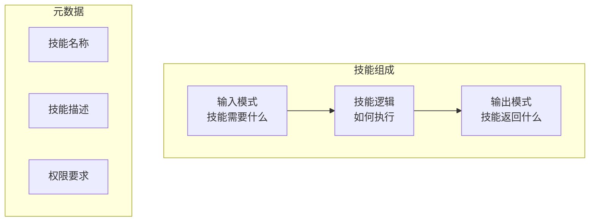

```python
from pydantic import BaseModel, Field
from typing import Optional

# 1. 输入模式 - 技能需要什么
class EmailSkillInput(BaseModel):
    to: str = Field(description="收件人邮箱地址")
    subject: str = Field(description="邮件主题")
    body: str = Field(description="邮件正文")
    cc: Optional[list[str]] = Field(default=None, description="抄送收件人")
    
# 2. 输出模式 - 技能返回什么
class EmailSkillOutput(BaseModel):
    success: bool
    message_id: Optional[str]
    error: Optional[str]

# 3. 技能实现
class EmailSkill:
    """
    通过 SMTP 发送邮件。
    
    使用场景：
    - 向用户发送事件通知
    - 发送报告或摘要
    - 提醒团队成员
    
    要求：
    - SMTP 服务器必须配置
    - 有效的邮箱地址
    """
    
    name = "send_email"
    description = "向一个或多个收件人发送邮件"
    
    def __init__(self, smtp_server: str, smtp_port: int = 587):
        self.smtp_server = smtp_server
        self.smtp_port = smtp_port
    
    def execute(self, input: EmailSkillInput) -> EmailSkillOutput:
        """执行技能。"""
        try:
            message_id = self._send_email(
                to=input.to,
                subject=input.subject,
                body=input.body,
                cc=input.cc
            )
            return EmailSkillOutput(success=True, message_id=message_id)
        except Exception as e:
            return EmailSkillOutput(success=False, error=str(e))
```

---

## 🔧 构建技能

### 步骤 1: 定义接口

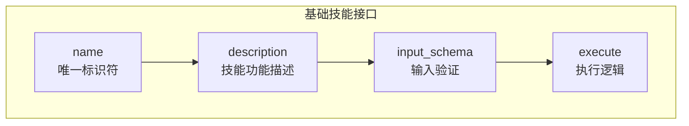

```python
from abc import ABC, abstractmethod
from pydantic import BaseModel

class BaseSkill(ABC):
    """所有技能的基类。"""
    
    @property
    @abstractmethod
    def name(self) -> str:
        """唯一技能标识符。"""
        pass
    
    @property
    @abstractmethod
    def description(self) -> str:
        """技能功能（供 AI 理解）。"""
        pass
    
    @property
    @abstractmethod
    def input_schema(self) -> type[BaseModel]:
        """输入验证的 Pydantic 模型。"""
        pass
    
    @abstractmethod
    def execute(self, input: BaseModel) -> BaseModel:
        """执行技能。"""
        pass
```

### 步骤 2: 实现常用技能

#### 数据库查询技能

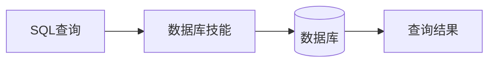

```python
class QueryDatabaseInput(BaseModel):
    query: str = Field(description="要执行的 SQL 查询")
    database: str = Field(default="main", description="数据库名称")
    limit: int = Field(default=100, description="最大返回行数")

class QueryDatabaseOutput(BaseModel):
    success: bool
    data: list[dict]
    row_count: int
    error: Optional[str]

class QueryDatabaseSkill(BaseSkill):
    name = "query_database"
    description = "对数据库执行 SQL 查询。用于数据检索和分析。"
    input_schema = QueryDatabaseInput
    
    def __init__(self, connection_string: str):
        self.conn_string = connection_string
    
    def execute(self, input: QueryDatabaseInput) -> QueryDatabaseOutput:
        import sqlite3
        
        try:
            conn = sqlite3.connect(self.conn_string)
            cursor = conn.execute(input.query)
            columns = [desc[0] for desc in cursor.description]
            rows = cursor.fetchmany(input.limit)
            data = [dict(zip(columns, row)) for row in rows]
            
            return QueryDatabaseOutput(
                success=True,
                data=data,
                row_count=len(data)
            )
        except Exception as e:
            return QueryDatabaseOutput(
                success=False,
                data=[],
                row_count=0,
                error=str(e)
            )
```

#### HTTP 请求技能

```python
class HttpRequestInput(BaseModel):
    method: str = Field(description="HTTP 方法: GET, POST, PUT, DELETE")
    url: str = Field(description="完整的请求 URL")
    headers: dict = Field(default={}, description="请求头")
    body: Optional[dict] = Field(default=None, description="POST/PUT 的请求体")
    timeout: int = Field(default=30, description="请求超时秒数")

class HttpRequestOutput(BaseModel):
    success: bool
    status_code: int
    response_body: Optional[str]
    error: Optional[str]

class HttpRequestSkill(BaseSkill):
    name = "http_request"
    description = "向外部 API 和服务发送 HTTP 请求。"
    input_schema = HttpRequestInput
    
    def execute(self, input: HttpRequestInput) -> HttpRequestOutput:
        import requests
        
        try:
            response = requests.request(
                method=input.method,
                url=input.url,
                headers=input.headers,
                json=input.body,
                timeout=input.timeout
            )
            
            return HttpRequestOutput(
                success=True,
                status_code=response.status_code,
                response_body=response.text
            )
        except Exception as e:
            return HttpRequestOutput(
                success=False,
                status_code=0,
                error=str(e)
            )
```

#### 代码执行技能

```python
class ExecuteCodeInput(BaseModel):
    code: str = Field(description="要执行的 Python 代码")
    timeout: int = Field(default=30, description="执行超时时间")

class ExecuteCodeOutput(BaseModel):
    success: bool
    stdout: str
    stderr: str
    return_value: Optional[str]
    error: Optional[str]

class ExecuteCodeSkill(BaseSkill):
    name = "execute_python"
    description = "安全执行 Python 代码。用于计算、数据处理。"
    input_schema = ExecuteCodeInput
    
    def execute(self, input: ExecuteCodeInput) -> ExecuteCodeOutput:
        import subprocess
        import sys
        
        try:
            result = subprocess.run(
                [sys.executable, "-c", input.code],
                capture_output=True,
                text=True,
                timeout=input.timeout
            )
            
            return ExecuteCodeOutput(
                success=result.returncode == 0,
                stdout=result.stdout,
                stderr=result.stderr
            )
        except subprocess.TimeoutExpired:
            return ExecuteCodeOutput(
                success=False,
                stdout="",
                stderr="",
                error="执行超时"
            )
```

---

## 📦 技能注册表

### 管理多个技能

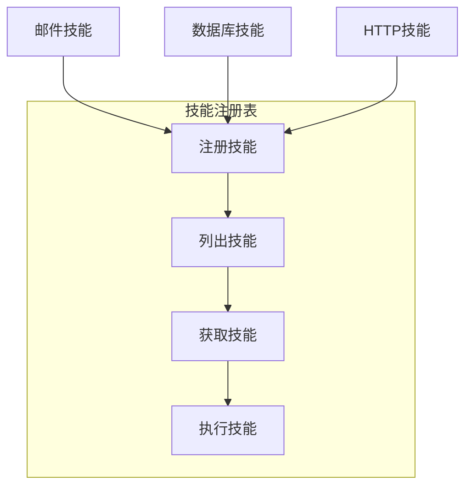

```python
class SkillRegistry:
    """所有可用技能的中央注册表。"""
    
    def __init__(self):
        self._skills: dict[str, BaseSkill] = {}
    
    def register(self, skill: BaseSkill):
        """注册新技能。"""
        if skill.name in self._skills:
            raise ValueError(f"技能 '{skill.name}' 已注册")
        self._skills[skill.name] = skill
        print(f"已注册技能: {skill.name}")
    
    def get(self, name: str) -> BaseSkill:
        """按名称获取技能。"""
        if name not in self._skills:
            raise ValueError(f"未知技能: {name}")
        return self._skills[name]
    
    def list_skills(self) -> list[dict]:
        """列出所有可用技能及描述。"""
        return [
            {
                "name": skill.name,
                "description": skill.description,
                "input_schema": skill.input_schema.schema()
            }
            for skill in self._skills.values()
        ]
    
    def execute(self, skill_name: str, input_data: dict):
        """按名称执行技能。"""
        skill = self.get(skill_name)
        validated_input = skill.input_schema(**input_data)
        return skill.execute(validated_input)

# 使用
registry = SkillRegistry()
registry.register(EmailSkill(smtp_server="smtp.example.com"))
registry.register(QueryDatabaseSkill(connection_string="./data.db"))
registry.register(HttpRequestSkill())

# 列出可用技能（对智能体提示有用）
print(registry.list_skills())

# 执行技能
result = registry.execute("send_email", {
    "to": "user@example.com",
    "subject": "你好",
    "body": "这是一个测试"
})
```

---

## 🔄 技能组合

### 从简单技能构建复杂技能

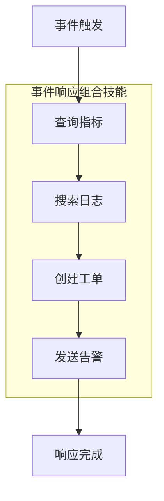

```python
class IncidentResponseSkill(BaseSkill):
    """
    组合技能，结合多个技能处理事件。
    
    流程：
    1. 查询指标检测问题
    2. 搜索日志找根因
    3. 创建 Jira 工单
    4. 发送告警邮件
    """
    
    name = "incident_response"
    description = "检测、诊断和响应系统事件"
    
    def __init__(self, registry: SkillRegistry):
        self.registry = registry
    
    def execute(self, input: IncidentInput) -> IncidentOutput:
        # 步骤 1: 获取指标
        metrics = self.registry.execute("fetch_metrics", {
            "service": input.service_name,
            "time_range": "1h"
        })
        
        # 步骤 2: 如果指标有异常，分析日志
        if self._has_anomaly(metrics):
            logs = self.registry.execute("search_logs", {
                "service": input.service_name,
                "level": "ERROR",
                "time_range": "1h"
            })
            
            # 步骤 3: 创建工单
            ticket = self.registry.execute("create_jira_ticket", {
                "title": f"事件: {input.service_name}",
                "description": self._format_diagnosis(metrics, logs),
                "priority": "High"
            })
            
            # 步骤 4: 发送告警
            self.registry.execute("send_email", {
                "to": input.alert_email,
                "subject": f"告警: {input.service_name} 事件",
                "body": f"已创建工单: {ticket.ticket_id}"
            })
            
            return IncidentOutput(
                detected=True,
                ticket_id=ticket.ticket_id,
                diagnosis=self._format_diagnosis(metrics, logs)
            )
        
        return IncidentOutput(detected=False)
```

---

## 🛡️ 技能安全与权限

### 权限系统

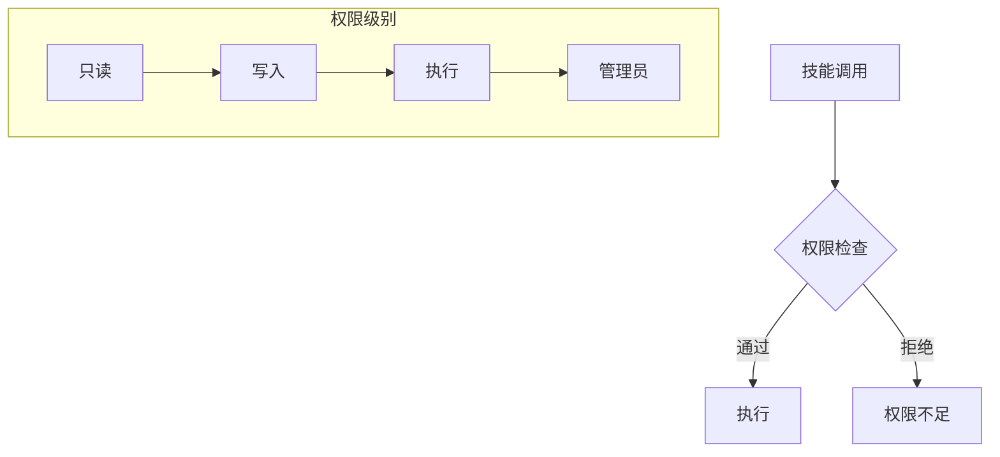

```python
from enum import Enum

class PermissionLevel(Enum):
    READ_ONLY = "read_only"      # 只能读取数据
    WRITE = "write"              # 可以修改数据
    EXECUTE = "execute"          # 可以运行代码/命令
    ADMIN = "admin"              # 完全访问

class SecureSkillRegistry(SkillRegistry):
    """带权限检查的注册表。"""
    
    def __init__(self):
        super().__init__()
        self._permissions: dict[str, PermissionLevel] = {}
    
    def register(self, skill: BaseSkill, permission: PermissionLevel):
        super().register(skill)
        self._permissions[skill.name] = permission
    
    def execute(self, skill_name: str, input_data: dict, 
                user_permission: PermissionLevel):
        """如果用户有权限则执行技能。"""
        required = self._permissions[skill_name]
        
        if not self._has_permission(user_permission, required):
            raise PermissionError(
                f"技能 '{skill_name}' 需要 {required.value} 权限"
            )
        
        return super().execute(skill_name, input_data)

# 使用
secure_registry = SecureSkillRegistry()
secure_registry.register(
    QueryDatabaseSkill("./data.db"), 
    PermissionLevel.READ_ONLY
)
secure_registry.register(
    ExecuteCodeSkill(), 
    PermissionLevel.EXECUTE  # 需要更高权限
)
```

### 输入验证与清洗

```python
class SafeQueryDatabaseInput(BaseModel):
    query: str = Field(description="SQL 查询")
    
    @validator('query')
    def validate_query(cls, v):
        # 阻止危险操作
        dangerous = ['DROP', 'DELETE', 'TRUNCATE', 'ALTER', 'CREATE']
        query_upper = v.upper()
        
        for word in dangerous:
            if word in query_upper:
                raise ValueError(f"查询包含禁止的关键字: {word}")
        
        # 只允许 SELECT
        if not query_upper.strip().startswith('SELECT'):
            raise ValueError("只允许 SELECT 查询")
        
        return v
```

---

## 📊 技能监控

### 跟踪技能使用

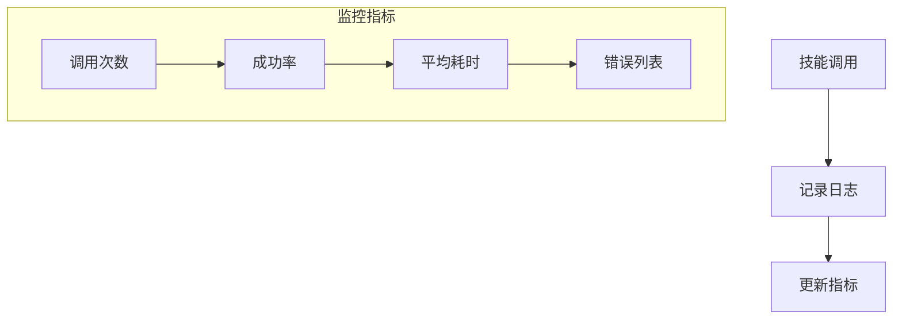

```python
import time
from datetime import datetime
from dataclasses import dataclass
from typing import List

@dataclass
class SkillExecution:
    skill_name: str
    timestamp: datetime
    duration_ms: float
    success: bool
    input_summary: str
    output_summary: str
    error: Optional[str]

class MonitoredSkillRegistry(SkillRegistry):
    """带内置监控的注册表。"""
    
    def __init__(self):
        super().__init__()
        self.executions: List[SkillExecution] = []
    
    def execute(self, skill_name: str, input_data: dict):
        start = time.time()
        error = None
        success = True
        
        try:
            result = super().execute(skill_name, input_data)
        except Exception as e:
            error = str(e)
            success = False
            raise
        finally:
            duration = (time.time() - start) * 1000
            
            self.executions.append(SkillExecution(
                skill_name=skill_name,
                timestamp=datetime.now(),
                duration_ms=duration,
                success=success,
                input_summary=str(input_data)[:100],
                output_summary=str(result)[:100] if success else "",
                error=error
            ))
        
        return result
    
    def get_metrics(self) -> dict:
        """获取技能使用指标。"""
        from collections import defaultdict
        
        by_skill = defaultdict(list)
        for ex in self.executions:
            by_skill[ex.skill_name].append(ex)
        
        metrics = {}
        for skill_name, execs in by_skill.items():
            metrics[skill_name] = {
                "total_calls": len(execs),
                "success_rate": sum(e.success for e in execs) / len(execs),
                "avg_duration_ms": sum(e.duration_ms for e in execs) / len(execs),
                "errors": [e.error for e in execs if e.error]
            }
        
        return metrics
```

---

## 🛠️ 运维指南

### 技能部署


```bash
# 项目结构
skills/
├── __init__.py
├── base.py              # 基类
├── registry.py          # 技能注册表
├── communication/
│   ├── email.py
│   └── slack.py
├── data/
│   ├── database.py
│   └── api.py
├── execution/
│   └── code.py
└── composite/
    └── incident.py

# 安装技能包
pip install -e ./skills

# 配置技能
export SMTP_SERVER="smtp.example.com"
export DATABASE_URL="postgresql://..."
export SLACK_TOKEN="xoxb-..."

# 运行技能测试
pytest skills/tests/

# 部署智能体
python agent_server.py --skills-config ./skills_config.yaml
```

### 配置文件

```yaml
# skills_config.yaml
skills:
  email:
    enabled: true
    smtp_server: ${SMTP_SERVER}
    smtp_port: 587
    permission: write
    
  database:
    enabled: true
    connection_string: ${DATABASE_URL}
    permission: read_only
    max_rows: 1000
    
  code_execution:
    enabled: false  # 默认禁用以确保安全
    timeout: 30
    permission: admin

monitoring:
  enabled: true
  log_level: INFO
  metrics_endpoint: /metrics

rate_limits:
  email: 10/minute
  database: 100/minute
  http_request: 50/minute
```

### 测试技能

```python
# tests/test_skills.py
import pytest
from skills import EmailSkill, QueryDatabaseSkill

class TestEmailSkill:
    def test_valid_email(self, mock_smtp):
        skill = EmailSkill(smtp_server="test.smtp.com")
        result = skill.execute(EmailSkillInput(
            to="test@example.com",
            subject="测试",
            body="你好"
        ))
        assert result.success
        
    def test_invalid_email(self):
        skill = EmailSkill(smtp_server="test.smtp.com")
        with pytest.raises(ValidationError):
            skill.execute(EmailSkillInput(
                to="not-an-email",  # 无效
                subject="测试",
                body="你好"
            ))

class TestDatabaseSkill:
    def test_select_query(self, test_db):
        skill = QueryDatabaseSkill(connection_string=test_db)
        result = skill.execute(QueryDatabaseInput(
            query="SELECT * FROM users LIMIT 5"
        ))
        assert result.success
        assert len(result.data) <= 5
        
    def test_dangerous_query_blocked(self, test_db):
        skill = QueryDatabaseSkill(connection_string=test_db)
        with pytest.raises(ValueError):
            skill.execute(QueryDatabaseInput(
                query="DROP TABLE users"  # 应该被阻止
            ))
```

---

## 💡 最佳实践

### 1. 单一职责

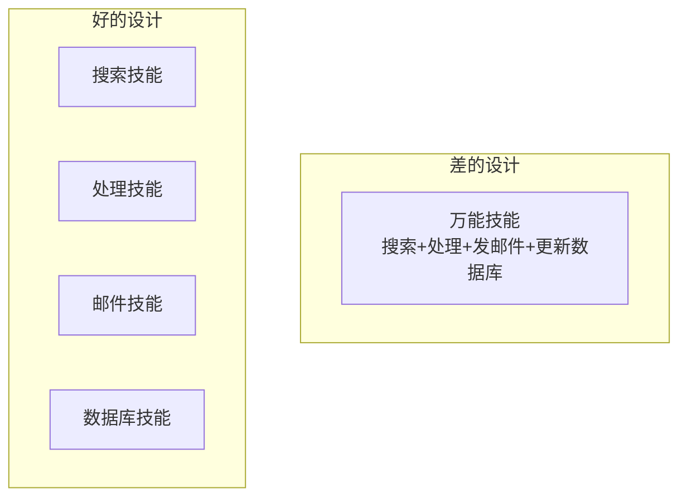

### 2. 清晰的文档

```python
class MySkill(BaseSkill):
    """
    技能功能的简短描述。
    
    使用场景：
    - 条件 1
    - 条件 2
    
    不要使用的场景：
    - 条件 3
    
    示例：
    - "发送摘要邮件" -> 使用这个
    - "计算指标" -> 使用 calculate_skill
    """
```

### 3. 优雅的错误处理

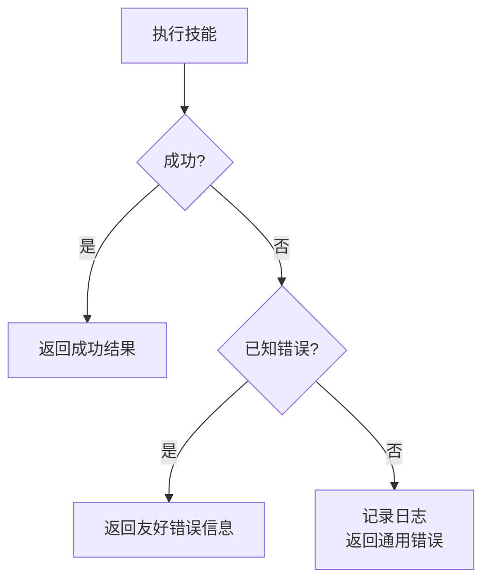

```python
def execute(self, input: MyInput) -> MyOutput:
    try:
        result = self._do_work(input)
        return MyOutput(success=True, data=result)
    except ConnectionError as e:
        return MyOutput(success=False, error=f"连接失败: {e}")
    except TimeoutError:
        return MyOutput(success=False, error="操作超时")
    except Exception as e:
        # 记录意外错误
        logger.exception("技能中出现意外错误")
        return MyOutput(success=False, error="内部错误")
```

---

## 📚 核心要点

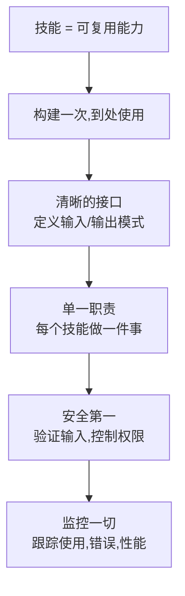

---

## 🔗 相关主题

- [智能体](../../06_Reinforcement_Learning/AI_Agents/Agent-in-nutshell.md) - 在智能体中使用技能
- [工作流](../AI_Workflow/Workflow-in-nutshell.md) - 编排技能
- [RAG](../RAG_Systems/RAG-in-nutshell.md) - 知识检索技能

---

## 🆕 Agent Skills 开放标准

以上内容描述的是**编程实现的 Skills**（Python 代码）。2025 年起，一个名为 **Agent Skills** 的开放标准被广泛采纳（30+ 主流 Agent 产品支持），它使用 `SKILL.md` Markdown 文件定义 Skill，而非代码类。

**两种方式的对比**：

| 维度 | 编程实现（本文档） | Agent Skills 开放标准 |
|------|-------------------|---------------------|
| 定义方式 | Python 类 | SKILL.md Markdown |
| 可移植性 | 绑定 Python | 跨所有兼容 Agent |
| 技术门槛 | 需要编程 | Markdown 即可 |
| 适用场景 | 自建 Agent 框架 | 通用 Agent 产品 |

**深入了解 Agent Skills 开放标准**：
- [Agent Skills 深度解析](./Agent_Skills_Deep_Dive.md) — 完整规范、最佳实践、评估体系
- [Agent Skills 实战指南](./Agent_Skills_Practical_Guide.md) — 从零创建、测试、优化和发布
- [Agent Skills 生态目录](./Agent_Skills_Ecosystem_Catalog.md) — 451+ Skills 按团队和领域索引
- [官方文档](https://agentskills.io) — Agent Skills 标准文档站
- [官方目录](https://officialskills.sh) — 在线浏览全部 451+ Skills
