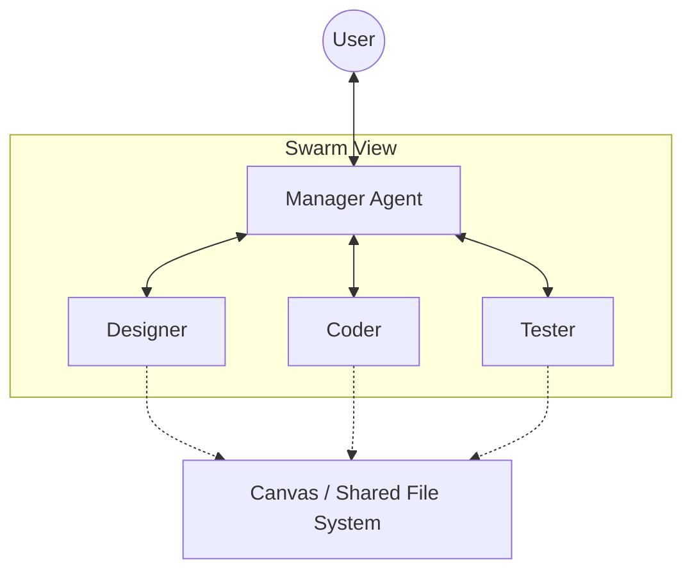

# Agentic UI/UX Design 2026: Designing for AI Agents

> **一句话理解**: 好的智能体 UI 不仅仅是一个聊天框，而是一个让“人”与“AI”能够像同事一样协作的数字化动态空间。

---

## 目录

| 章节 | 内容 | 难度 |
|------|------|------|
| [从 Chat 到 Workspace](#1-从-chat-到-workspace) | 聊天框的局限、画布 (Canvas) 的兴起 | 入门 |
| [Artifacts：可交互的智能工件](#2-artifacts可交互的智能工件) | 代码预览、图表生成、文档同步编辑 | 进阶 |
| [Human-in-the-Loop 交互设计](#3-human-in-the-loop-交互设计) | 关键节点审核、纠错机制、多选方案比较 | 进阶 |
| [智能体的状态可视化](#4-智能体的状态可视化) | 思考链展示、工具调用轨迹、置信度反馈 | 进阶 |
| [多智能体系统的协作界面](#5-多智能体系统的协作界面) | 群聊模式、任务看板、冲突解决视图 | 前沿 |
| [2026 设计模式总结](#6-2026-设计模式总结) | 渐进式披露、预测性输入、多模态融合 | 洞察 |

---

## 1. 从 Chat 到 Workspace

2022-2024 年，AI 交互主要局限于文本输入输出 (Chatbot)。
2025-2026 年，交互范式向 **Shared Workspace (共享协作空间)** 转型。

### 1.1 聊天框的局限性
- **线性且不可追溯**: 重要的产出容易被淹没在冗长的对话流中。
- **低反馈密度**: 用户难以在同一个界面内预览、运行和修改结果。
- **缺乏上下文空间**: 屏幕空间利用率低，难以展示复杂的结构化数据。

### 1.2 画布 (Canvas) 模式的崛起
类似 Claude Artifacts、ChatGPT Canvas 和 Cursor。
- **左侧对话，右侧产出**: 对话用于指令，右侧画布用于展示结果（代码、文档、原型）。
- **直接编辑**: 用户可以直接在画布上修改 AI 的产出，AI 也可以根据用户的修改进行增量更新。

---

## 2. Artifacts：可交互的智能工件

Artifacts 是指 AI 生成的、独立于对话流的、具有特定功能的组件。

| 类型 | 功能设计 | 2026 实践 |
|------|---------|----------|
| **代码工件** | 在线运行环境、热重载预览 | 支持前端组件、后端 API 模拟、甚至是 Docker 容器预览 |
| **视觉工件** | Mermaid 流程图、SVG 矢量图、3D 模型 | 支持拖拽式修改、实时渲染 |
| **文档工件** | 格式化文档、PPT 演示文稿 | 多人协作模式、AI 辅助排版建议 |
| **交互应用** | 动态表单、小型 Web 应用 | “即生成即使用”，无需部署即可测试业务逻辑 |

---

## 3. Human-in-the-Loop 交互设计

随着智能体自主性 (Autonomy) 的提高，用户不再是操作者，而是**监考员 (Supervisor)**。

### 3.1 关键节点拦截 (Approval Gates)
- **风险操作**: 删除文件、发送邮件、支付操作必须请求人类点击“确认”。
- **不确定性提示**: 当智能体置信度低于阈值时，主动弹出选项请用户决策。

### 3.2 方案竞选 (Multi-option Selection)
AI 不是给出一个“最终答案”，而是给出 A/B/C 三个不同倾向的方案，并标注优缺点，请用户挑选或混合。

### 3.3 回溯与分支 (Branching & Undo)
- **版本控制**: 用户可以随时点击“回退到 3 步以前”，并尝试另一个推理分支。
- **显式回思**: 允许用户修改 AI 之前的推理步骤 (Internal CoT)，从而改变最终结果。

---

## 4. 智能体的状态可视化

如何让用户“信任”一个不可见的算法？核心在于**透明度**。

- **思考过程 (Inner Monologue)**: 通过折叠面板展示智能体的内部逻辑步骤 (Chain-of-Thought)，减少“黑盒感”。
- **工具调用可视化 (Tool Call Trace)**: 实时展示智能体正在使用的工具（如：🔍 搜索 Google、💾 读取数据库、🐍 运行 Python）。
- **进度条 2.0**: 不再是百分比，而是“正在分析财务报表...”、“正在对比市场竞争对手...”的具体任务描述。

---

## 5. 多智能体系统的协作界面

当屏幕后面有 10 个智能体在合作时，界面变得更加复杂。

- **任务看板 (Task Board)**: 展示哪些智能体正在处理哪些子任务，哪些任务阻塞。
- **角色切换**: 用户可以一键切换对话对象（如：专门咨询“测试专家”关于覆盖率的问题）。

---

## 6. 2026 设计模式总结

### 6.1 渐进式披露 (Progressive Disclosure)
默认展示简洁结果，深度用户可以展开查看详细的推理链路和元数据。

### 6.2 预测性输入 (Predictive Prototyping)
根据当前的 Workspace 上下文，在用户输入前就推荐最可能的下一步操作（类似智能快捷键）。

### 6.3 多模态对等 (Multimodal Parity)
输入可以是语音、涂鸦、手势或屏幕截图，AI 的反馈也根据内容选择最合适的载体（如：用语音解释复杂逻辑，用图表展示数据趋势）。

---

## Related

- [[15_Agent_Production/README]] — 智能体生产全景图
- [[16_AI_Coding/Tools/Cursor_Guide]] — 典型的 Canvas 模式应用
- [[15_Agent_Production/Agent_Workflow/Agentic_Workflow_Design_Patterns_2026]] — 后端工作流与前端界面的衔接
- [[05_NLP_LLMs/Reasoning_Models/o1_Class_Reasoning_Models]] — 隐式思维链的 UI 处理
- [[_concepts/human-ai-interaction]] — 人机交互基础理论

---

*Last updated: 2026-06-04*
