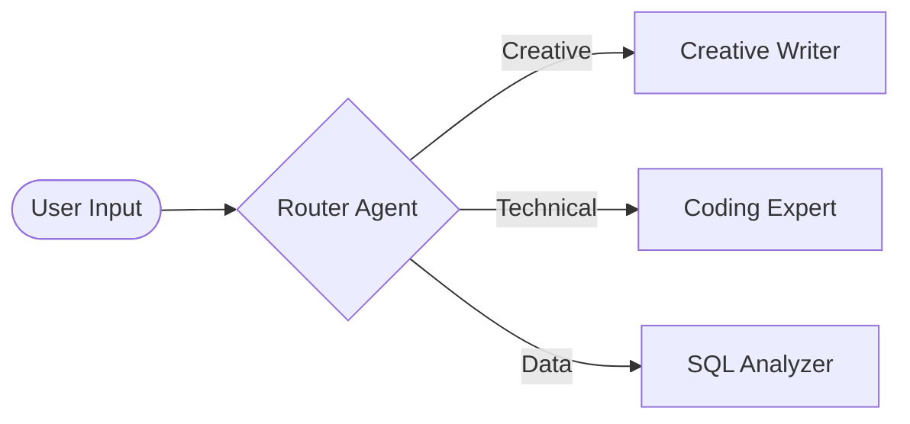
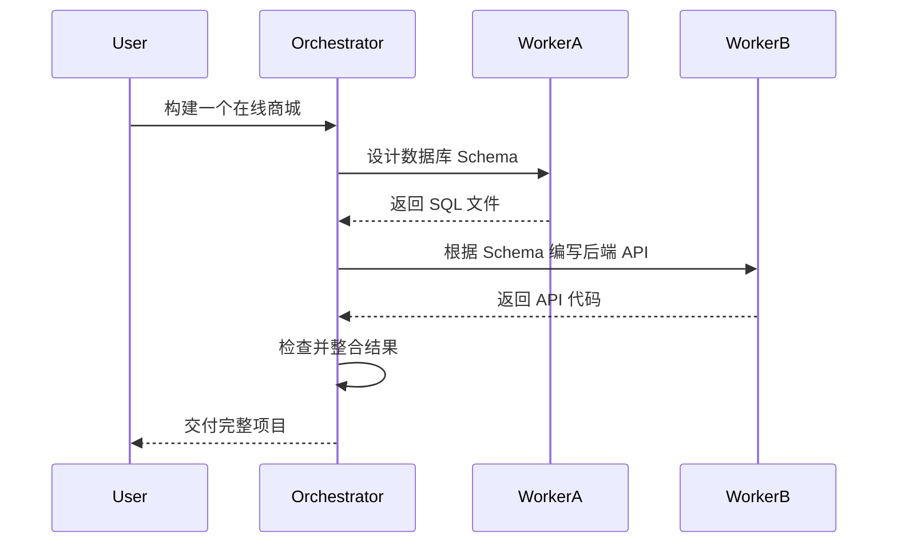

# Agentic Workflow Design Patterns 2026: Beyond Simple Chains

> **一句话理解**: 2026 年的智能体开发不再是堆叠 Prompt，而是像设计“分布式软件架构”一样，通过成熟的工作流模式来解决 LLM 的不确定性问题。

---

## 目录

| 模式名称 | 核心理念 | 适用场景 |
|----------|---------|----------|
| [1. 路由模式 (Routing)](#1-路由模式-routing) | 分而治之，按需分配模型 | 任务分类、多语言处理 |
| [2. 并行模式 (Parallelism)](#2-并行模式-parallelism) | 并发处理，横向扩展 | 方案竞选、多维度搜索 |
| [3. 编排者-执行者 (Orchestrator-Workers)](#3-编排者-执行者-orchestrator-workers) | 动态分解与汇总 | 复杂项目开发、长文撰写 |
| [4. 评估者-优化者 (Evaluator-Optimizer)](#4-评估者-优化者-evaluator-optimizer) | 内部循环与自我修正 | 代码调优、创意写作 |
| [5. 蜂群模式 (Swarms)](#5-蜂群模式-swarms) | 去中心化协作、动态移交 | 实时客户支持、全栈开发 |
| [模式选型决策树](#6-模式选型决策树) | 快速决策指南 | 实践建议 |

---

## 1. 路由模式 (Routing)

路由模式是所有复杂智能体系统的起点。它就像一个前台，根据用户的输入决定将其交给哪一个专门的子系统。

### 1.1 架构图

### 1.2 2026 实践建议
- **低成本路由**: 优先使用小模型（如 Qwen-1.5B/SmolLM）作为分类路由，节省成本。
- **语义路由 (Semantic Router)**: 利用 Embedding 向量空间进行余弦相似度匹配，无需 LLM 推理即可实现微秒级路由。

---

## 2. 并行模式 (Parallelism)

当任务可以被拆解为多个互不依赖的子任务，或需要从多个角度同时验证时使用。

### 2.1 拆分-合并 (Sectioning)
将长文档拆分为 10 个章节，同时交给 10 个 Agent 总结，最后汇总。

### 2.2 投票机制 (Voting / N-of-M)
针对同一个逻辑难题，同时启动 3 个模型推理，通过“少数服从多数”降低幻觉率。

---

## 3. 编排者-执行者 (Orchestrator-Workers)

这是处理**不可预测任务**的核心模式。Orchestrator 不知道任务会有多复杂，它根据 Worker 的反馈动态调整计划。

---

## 4. 评估者-优化者 (Evaluator-Optimizer)

这是一种迭代闭环模式，类似于 RLHF 的内部模拟。

1. **Optimizer**: 生成初始草案。
2. **Evaluator**: 针对预设指标（如代码覆盖率、文风严谨性）进行挑刺。
3. **Loop**: Optimizer 根据反馈进行修改，直到 Evaluator 给出“通过”。

> **关键**: Evaluator 的 Prompt 必须与 Optimizer 隔离，最好使用更高阶的模型（如用 Claude 3.5 Sonnet 评估 Llama 3 产出的代码）。

---

## 5. 蜂群模式 (Swarms)

蜂群模式强调**动态移交 (Handoffs)**。每个 Agent 都有权决定将当前的上下文转交给另一个更适合的 Agent。

- **去中心化**: 没有一个全局的“上帝 Agent”。
- **上下文透明**: 移交时带上所有的对话历史和工具调用状态。
- **应用**: 经典的 `OpenAI Swarms` 或 `Anthropic Computer Use` 流程。

---

## 6. 模式选型决策树 (2026)

1. **任务是否是线性的且完全可预测？**
   - 是 → 使用 **简单的 Chain**。
2. **任务是否需要不同领域的专门专家？**
   - 是 → 使用 **Routing**。
3. **任务是否非常庞大，且子任务互不干扰？**
   - 是 → 使用 **Parallelism**。
4. **任务是否需要高质量产出且伴随明确的对错准则？**
   - 是 → 使用 **Evaluator-Optimizer**。
5. **任务是否具有极高的复杂性、不确定性且需要多步动态拆解？**
   - 是 → 使用 **Orchestrator-Workers** 或 **Swarms**。

---

## Related

- [[15_Agent_Production/Agent_Frameworks/README]] — 框架对这些模式的支持程度
- [[15_Agent_Production/Agent_Workflow/Workflow-in-nutshell]] — 基础工作流概念
- [[06_Reinforcement_Learning/AI_Agents/Agent_State_Management]] — 如何在复杂模式中保持状态一致性
- [[15_Agent_Production/Agent_Evaluation/Assessment/Production_Assessment]] — 针对复杂流的评估方法

---

*Last updated: 2026-06-04*
