# AI 工作流速成指南

> 🎯 **目标**：理解如何将 AI 组件编排成可靠运行的生产流水线和自动化工作流。

---

## 🤔 什么是 AI 工作流？

**AI 工作流** = 将 AI 组件连接成自动运行的流水线。

把它想象成流水线：
- 每个工位做一项工作
- 部件自动在工位间移动
- 整个系统平稳运行

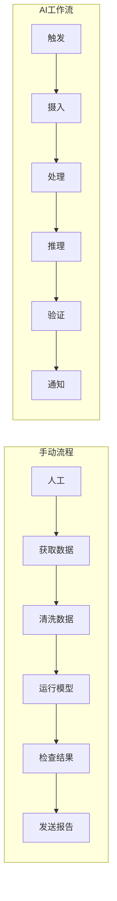

---

## 🧩 工作流组件

### 整体架构

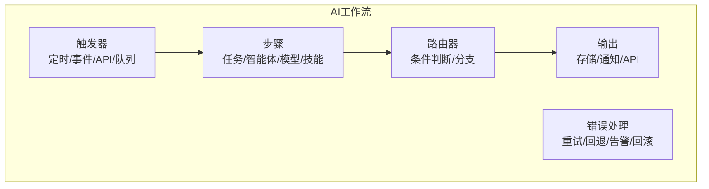

---

## 📋 工作流模式

### 模式 1: 顺序流水线

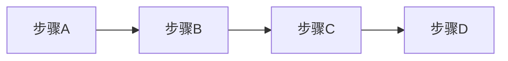

```python
# 简单顺序工作流
def document_processing_workflow(document_path: str):
    # 步骤 1: 提取文本
    text = extract_text(document_path)
    
    # 步骤 2: 清洗和预处理
    cleaned = preprocess_text(text)
    
    # 步骤 3: 运行 AI 模型
    result = model.predict(cleaned)
    
    # 步骤 4: 存储结果
    save_to_database(result)
    
    return result
```

### 模式 2: 并行执行

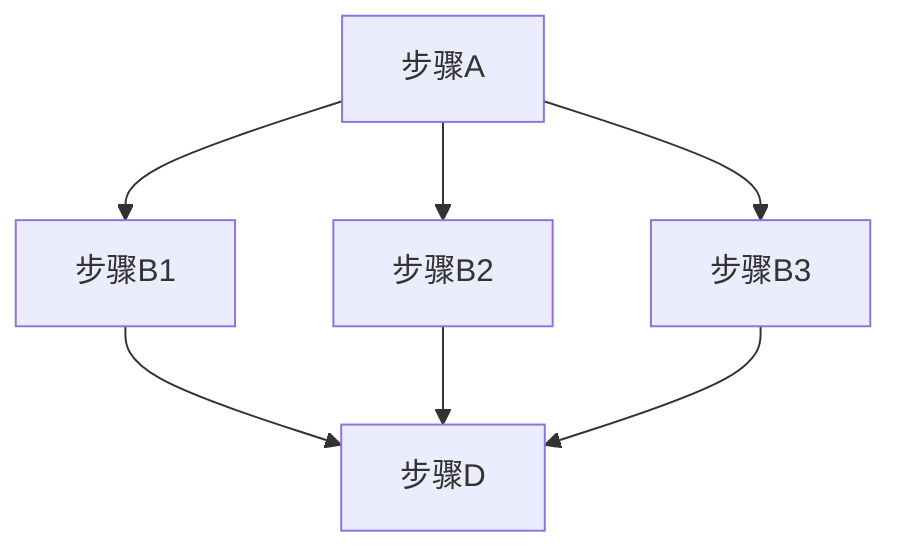

```python
import asyncio

async def parallel_analysis_workflow(data):
    # 步骤 1: 开始
    processed = preprocess(data)
    
    # 步骤 2: 并行运行
    sentiment_task = asyncio.create_task(analyze_sentiment(processed))
    entity_task = asyncio.create_task(extract_entities(processed))
    summary_task = asyncio.create_task(summarize(processed))
    
    # 等待所有完成
    sentiment, entities, summary = await asyncio.gather(
        sentiment_task, entity_task, summary_task
    )
    
    # 步骤 3: 合并结果
    return {
        "sentiment": sentiment,
        "entities": entities,
        "summary": summary
    }
```

### 模式 3: 条件分支

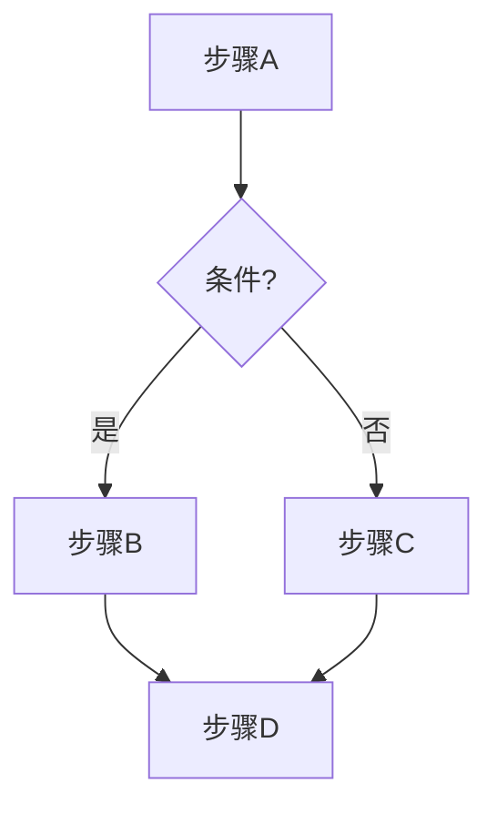

```python
def content_moderation_workflow(content: str):
    # 步骤 1: 初始分类
    classification = classify_content(content)
    
    # 步骤 2: 根据结果分支
    if classification.is_safe:
        # 安全内容路径
        processed = enhance_content(content)
        publish(processed)
        return {"status": "published", "content": processed}
    else:
        # 不安全内容路径
        log_violation(content, classification)
        notify_moderators(content)
        return {"status": "flagged", "reason": classification.reason}
```

### 模式 4: 循环/重试

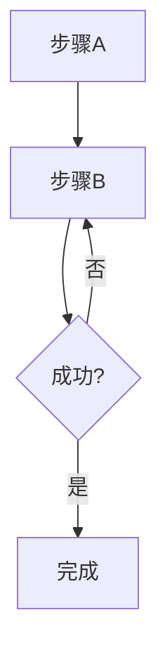

```python
from tenacity import retry, stop_after_attempt, wait_exponential

@retry(
    stop=stop_after_attempt(3),
    wait=wait_exponential(multiplier=1, min=4, max=60)
)
def resilient_api_call(data):
    response = external_api.call(data)
    if response.status_code != 200:
        raise Exception("API 调用失败")
    return response.json()

def retry_workflow(data):
    try:
        result = resilient_api_call(data)
        return {"status": "success", "data": result}
    except Exception as e:
        return {"status": "failed", "error": str(e)}
```

### 模式 5: 扇出/扇入

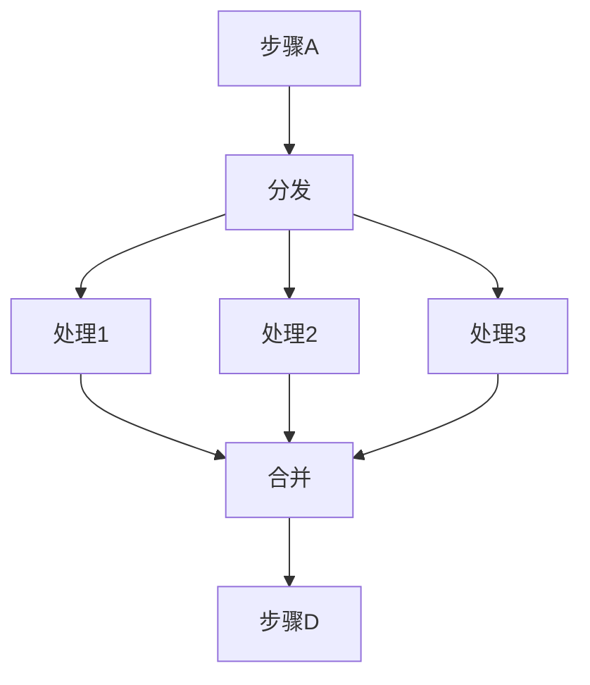

```python
async def batch_processing_workflow(items: list):
    # 扇出: 并行处理项目
    tasks = [process_item(item) for item in items]
    results = await asyncio.gather(*tasks)
    
    # 扇入: 合并结果
    combined = merge_results(results)
    
    # 继续处理合并结果
    final = post_process(combined)
    return final
```

---

## 🔧 构建工作流

### 使用 Prefect

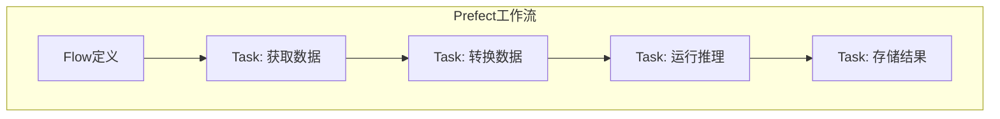

```python
from prefect import flow, task
from prefect.tasks import task_input_hash
from datetime import timedelta

@task(
    retries=3,
    retry_delay_seconds=60,
    cache_key_fn=task_input_hash,
    cache_expiration=timedelta(hours=1)
)
def fetch_data(source: str) -> dict:
    """带重试和缓存的数据获取。"""
    return api.get(source)

@task
def transform_data(raw_data: dict) -> dict:
    """清洗和转换数据。"""
    return {
        "cleaned": preprocess(raw_data),
        "metadata": extract_metadata(raw_data)
    }

@task
def run_inference(data: dict) -> dict:
    """运行 AI 模型推理。"""
    return model.predict(data["cleaned"])

@task
def store_results(results: dict, metadata: dict):
    """存储结果到数据库。"""
    database.insert({**results, **metadata})

@flow(name="AI-Data-Pipeline")
def ai_data_pipeline(source: str):
    """主工作流编排。"""
    # 定义工作流
    raw_data = fetch_data(source)
    transformed = transform_data(raw_data)
    predictions = run_inference(transformed)
    store_results(predictions, transformed["metadata"])
    
    return predictions

# 运行工作流
if __name__ == "__main__":
    result = ai_data_pipeline("s3://bucket/data.json")
```

### 使用 Airflow

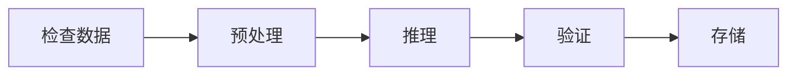

```python
from airflow import DAG
from airflow.operators.python import PythonOperator
from airflow.operators.bash import BashOperator
from datetime import datetime, timedelta

default_args = {
    'owner': 'ai-team',
    'depends_on_past': False,
    'email_on_failure': True,
    'email': ['alerts@company.com'],
    'retries': 3,
    'retry_delay': timedelta(minutes=5),
}

with DAG(
    'ai_inference_pipeline',
    default_args=default_args,
    description='每日 AI 推理工作流',
    schedule_interval='0 6 * * *',  # 每天早上 6 点运行
    start_date=datetime(2024, 1, 1),
    catchup=False,
    tags=['ai', 'inference'],
) as dag:
    
    # 任务 1: 检查数据可用性
    check_data = BashOperator(
        task_id='check_data',
        bash_command='aws s3 ls s3://bucket/input/ | grep -q today.csv'
    )
    
    # 任务 2: 下载和预处理
    def preprocess_fn(**context):
        data = download_from_s3('s3://bucket/input/today.csv')
        processed = preprocess(data)
        context['task_instance'].xcom_push(key='processed_path', value=processed)
    
    preprocess_task = PythonOperator(
        task_id='preprocess',
        python_callable=preprocess_fn,
    )
    
    # 任务 3: 运行推理
    def inference_fn(**context):
        processed_path = context['task_instance'].xcom_pull(
            task_ids='preprocess', key='processed_path'
        )
        results = run_model_inference(processed_path)
        return results
    
    inference_task = PythonOperator(
        task_id='inference',
        python_callable=inference_fn,
    )
    
    # 定义依赖关系
    check_data >> preprocess_task >> inference_task
```

### 使用 LangGraph（智能体工作流）

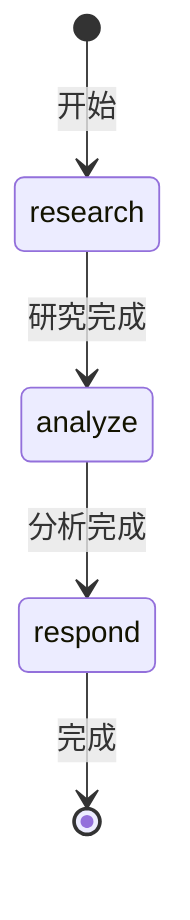

```python
from langgraph.graph import StateGraph, END
from typing import TypedDict, Annotated
from operator import add

class AgentState(TypedDict):
    messages: Annotated[list, add]
    next_action: str
    result: dict

def research_node(state: AgentState) -> AgentState:
    """研究智能体收集信息。"""
    query = state["messages"][-1]
    research_result = search_tool(query)
    return {
        "messages": [f"研究发现: {research_result}"],
        "next_action": "analyze"
    }

def analyze_node(state: AgentState) -> AgentState:
    """分析智能体处理研究结果。"""
    research = state["messages"][-1]
    analysis = analyze_with_llm(research)
    return {
        "messages": [f"分析: {analysis}"],
        "next_action": "respond"
    }

def respond_node(state: AgentState) -> AgentState:
    """响应智能体创建最终答案。"""
    analysis = state["messages"][-1]
    response = generate_response(analysis)
    return {
        "messages": [response],
        "result": {"answer": response}
    }

def router(state: AgentState) -> str:
    """根据状态路由到下一个节点。"""
    return state.get("next_action", END)

# 构建图
workflow = StateGraph(AgentState)

# 添加节点
workflow.add_node("research", research_node)
workflow.add_node("analyze", analyze_node)
workflow.add_node("respond", respond_node)

# 添加边
workflow.set_entry_point("research")
workflow.add_conditional_edges("research", router)
workflow.add_conditional_edges("analyze", router)
workflow.add_edge("respond", END)

# 编译并运行
app = workflow.compile()
result = app.invoke({"messages": ["什么是量子计算？"]})
```

---

## 📊 工作流监控

### 关键指标

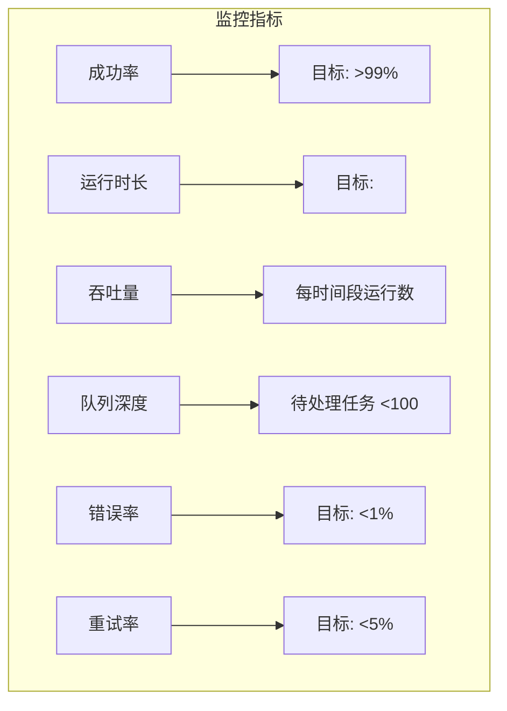

| 指标 | 描述 | 目标 |
|------|------|------|
| **成功率** | 完成的运行百分比 | >99% |
| **运行时长** | 完成所需时间 | <SLA |
| **吞吐量** | 每时间段运行数 | 因情况而异 |
| **队列深度** | 待处理任务 | <100 |
| **错误率** | 每次运行的失败数 | <1% |
| **重试率** | 需要重试的任务 | <5% |

### 监控仪表板

```python
from prometheus_client import Counter, Histogram, Gauge, start_http_server

# 定义指标
workflow_runs = Counter(
    'workflow_runs_total', 
    '总工作流运行数',
    ['workflow_name', 'status']
)

workflow_duration = Histogram(
    'workflow_duration_seconds',
    '工作流运行时长（秒）',
    ['workflow_name'],
    buckets=[1, 5, 10, 30, 60, 120, 300, 600]
)

active_workflows = Gauge(
    'active_workflows',
    '当前运行中的工作流',
    ['workflow_name']
)

# 带监控的工作流
import time
from contextlib import contextmanager

@contextmanager
def track_workflow(name: str):
    """跟踪工作流指标的上下文管理器。"""
    active_workflows.labels(workflow_name=name).inc()
    start = time.time()
    status = "success"
    
    try:
        yield
    except Exception as e:
        status = "error"
        raise
    finally:
        duration = time.time() - start
        workflow_runs.labels(workflow_name=name, status=status).inc()
        workflow_duration.labels(workflow_name=name).observe(duration)
        active_workflows.labels(workflow_name=name).dec()

# 使用
def my_workflow():
    with track_workflow("ai_inference"):
        # 工作流步骤
        result = run_inference(data)
        return result

# 启动指标服务器
start_http_server(8000)  # Prometheus 从 :8000/metrics 抓取
```

---

## ⚠️ 错误处理模式

### 1. 指数退避重试

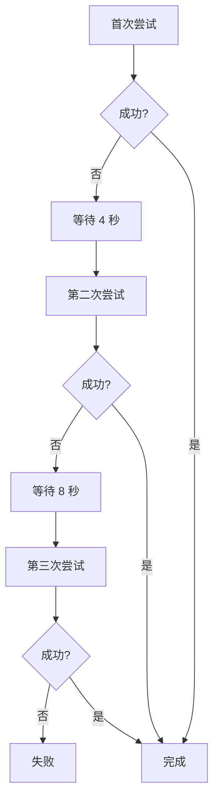

```python
from tenacity import (
    retry, 
    stop_after_attempt, 
    wait_exponential,
    retry_if_exception_type
)

@retry(
    stop=stop_after_attempt(3),
    wait=wait_exponential(multiplier=2, min=4, max=60),
    retry=retry_if_exception_type((ConnectionError, TimeoutError))
)
def flaky_operation():
    return external_service.call()
```

### 2. 熔断器

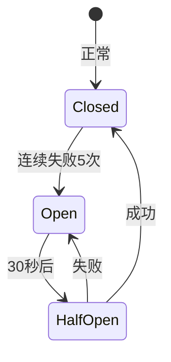

```python
import pybreaker

# 熔断器防止级联故障
breaker = pybreaker.CircuitBreaker(
    fail_max=5,           # 5 次失败后打开
    reset_timeout=30,     # 30 秒后重试
    exclude=[ValueError]  # 这些不算失败
)

@breaker
def protected_call():
    return external_api.call()

# 使用
try:
    result = protected_call()
except pybreaker.CircuitBreakerError:
    # 熔断器打开，使用回退
    result = get_cached_result()
```

### 3. 死信队列

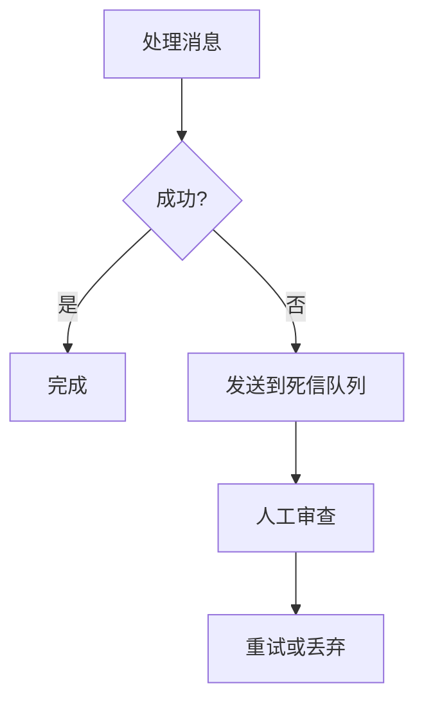

```python
from collections import deque

class WorkflowWithDLQ:
    def __init__(self):
        self.dlq = deque()  # 死信队列
    
    def process(self, item):
        try:
            return self._do_process(item)
        except Exception as e:
            # 发送到 DLQ 等待人工审查
            self.dlq.append({
                "item": item,
                "error": str(e),
                "timestamp": datetime.now()
            })
            logger.error(f"项目已发送到 DLQ: {item}")
    
    def retry_dlq(self):
        """重试 DLQ 中的项目。"""
        while self.dlq:
            record = self.dlq.popleft()
            try:
                self._do_process(record["item"])
            except:
                # 放回 DLQ 末尾
                self.dlq.append(record)
```

### 4. 补偿操作（Saga 模式）

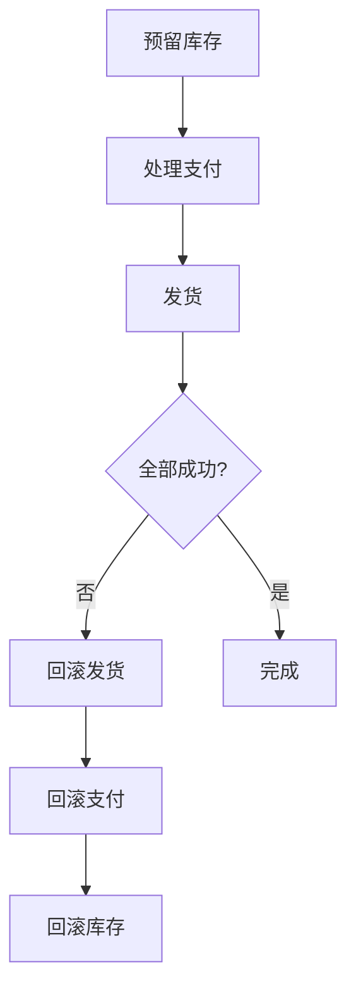

```python
class WorkflowSaga:
    """带回滚的分布式工作流 Saga 模式。"""
    
    def __init__(self):
        self.completed_steps = []
    
    def execute(self, order):
        try:
            # 步骤 1: 预留库存
            self._reserve_inventory(order)
            
            # 步骤 2: 处理支付
            self._process_payment(order)
            
            # 步骤 3: 发货
            self._ship_order(order)
            
        except Exception as e:
            # 回滚所有已完成步骤
            self._rollback()
            raise
    
    def _reserve_inventory(self, order):
        inventory_service.reserve(order.items)
        self.completed_steps.append(
            ("inventory", lambda: inventory_service.release(order.items))
        )
    
    def _process_payment(self, order):
        payment_service.charge(order.total)
        self.completed_steps.append(
            ("payment", lambda: payment_service.refund(order.total))
        )
    
    def _rollback(self):
        """按相反顺序执行补偿操作。"""
        for step_name, compensate in reversed(self.completed_steps):
            try:
                compensate()
                logger.info(f"已回滚: {step_name}")
            except Exception as e:
                logger.error(f"{step_name} 回滚失败: {e}")
```

---

## 🛠️ 运维指南

### 工作流部署

```yaml
# docker-compose.yml 工作流基础设施
version: '3.8'

services:
  # 工作流编排器
  prefect-server:
    image: prefecthq/prefect:2-latest
    ports:
      - "4200:4200"
    environment:
      - PREFECT_SERVER_API_HOST=0.0.0.0
    
  # 执行流程的 Worker
  prefect-worker:
    image: prefecthq/prefect:2-latest
    command: prefect worker start --pool default-agent-pool
    depends_on:
      - prefect-server
    environment:
      - PREFECT_API_URL=http://prefect-server:4200/api
    volumes:
      - ./flows:/flows
  
  # 异步工作流的消息队列
  redis:
    image: redis:7
    ports:
      - "6379:6379"
  
  # 指标监控
  prometheus:
    image: prom/prometheus
    ports:
      - "9090:9090"
    volumes:
      - ./prometheus.yml:/etc/prometheus/prometheus.yml
```

### 调度配置

```python
# 用 cron 表达式调度工作流
from prefect import flow
from prefect.deployments import Deployment
from prefect.server.schemas.schedules import CronSchedule

# 创建带调度的部署
deployment = Deployment.build_from_flow(
    flow=ai_data_pipeline,
    name="daily-inference",
    work_pool_name="default-agent-pool",
    schedule=CronSchedule(cron="0 6 * * *", timezone="UTC"),  # 每天早上 6 点
    parameters={"source": "s3://bucket/data/"},
    tags=["production", "ai"],
)
deployment.apply()
```

### CLI 命令

```bash
# Prefect
prefect deployment run 'AI-Data-Pipeline/daily-inference'  # 触发运行
prefect flow-run inspect <run-id>                           # 检查状态
prefect deployment ls                                        # 列出部署

# Airflow
airflow dags trigger ai_inference_pipeline                  # 触发 DAG
airflow tasks test ai_inference_pipeline inference 2024-01-01  # 测试任务
airflow dags list                                           # 列出 DAG

# 通用监控
curl http://localhost:4200/api/health                       # 健康检查
curl http://localhost:8000/metrics                          # Prometheus 指标
```

---

## 💡 最佳实践

### 1. 幂等性

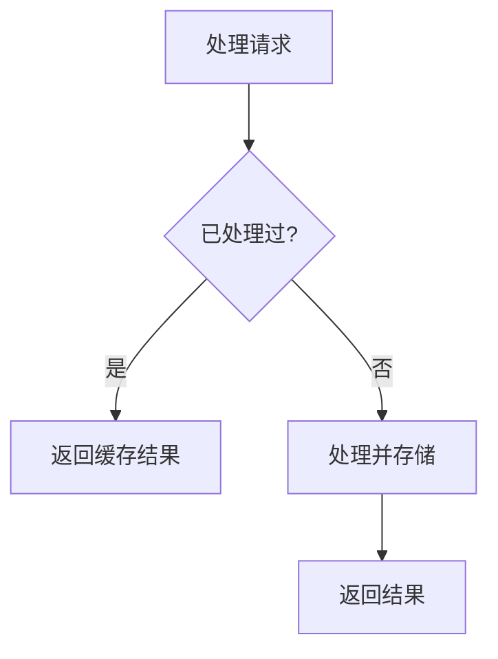

```python
def idempotent_task(item_id: str):
    """可以安全重试的任务。"""
    # 检查是否已处理
    if database.exists(item_id):
        logger.info(f"已处理过: {item_id}")
        return database.get(item_id)
    
    # 原子处理并存储
    result = process(item_id)
    database.upsert(item_id, result)  # upsert 而非 insert
    return result
```

### 2. 可观测性

```python
import structlog

logger = structlog.get_logger()

def observable_workflow(input_data):
    """带结构化日志的工作流。"""
    run_id = generate_run_id()
    
    logger.info("workflow_started", 
                run_id=run_id, 
                input_size=len(input_data))
    
    try:
        result = process(input_data)
        logger.info("workflow_completed",
                   run_id=run_id,
                   result_size=len(result))
        return result
    except Exception as e:
        logger.error("workflow_failed",
                    run_id=run_id,
                    error=str(e))
        raise
```

### 3. 配置管理

```yaml
# workflow_config.yaml
workflows:
  ai_inference:
    schedule: "0 6 * * *"
    timeout_seconds: 3600
    retries: 3
    
    steps:
      - name: preprocess
        timeout: 300
        retries: 2
        
      - name: inference
        timeout: 1800
        resources:
          gpu: 1
          memory: 16Gi
        
      - name: postprocess
        timeout: 300

alerts:
  on_failure:
    - slack: "#ai-alerts"
    - email: "oncall@company.com"
```

---

## 🔌 2026 协议驱动工作流

> **一句话**: 2026年的工作流基于MCP和A2A协议构建，实现跨框架、跨厂商的Agent协作。

### 协议驱动 vs 传统工作流

| 特性 | 传统工作流 | 协议驱动工作流 (2026) |
|------|-----------|---------------------|
| **组件连接** | 代码耦合 | 协议松耦合 |
| **工具集成** | 定制Connector | MCP标准接口 |
| **Agent协作** | 同框架内 | A2A跨框架 |
| **可替换性** | 困难 | 即插即用 |
| **治理** | 自定义 | AAIF标准 |

### MCP工具调用工作流

```python
# 基于MCP的工具调用工作流
from mcp import ClientSession

async def mcp_tool_workflow():
    """使用MCP Server的工作流"""
    
    # 连接多个MCP Servers
    async with ClientSession(server_params) as session:
        
        # 步骤1: 从数据库获取数据
        data = await session.call_tool(
            "query_database",
            {"sql": "SELECT * FROM sales WHERE date > '2026-01-01'"}
        )
        
        # 步骤2: 使用LLM分析
        analysis = await session.call_tool(
            "llm_analyze",
            {"data": data, "prompt": "分析销售趋势"}
        )
        
        # 步骤3: 生成报告并发送邮件
        await session.call_tool(
            "send_email",
            {"to": "manager@company.com", "content": analysis}
        )
```

### A2A多Agent协作工作流

```python
# 基于A2A的多Agent协作工作流
async def a2a_collaboration_workflow():
    """多个Agent通过A2A协议协作"""
    
    # 发现可用Agents
    agents = await a2a_discover_agents("https://agent-registry.company.com")
    
    # 步骤1: 研究Agent收集信息
    research_task = await a2a_send_task(
        agent_url=agents["researcher"].url,
        message={"content": "研究AI行业2026趋势"}
    )
    research_result = await a2a_wait_completion(research_task.id)
    
    # 步骤2: 写作Agent生成报告
    writing_task = await a2a_send_task(
        agent_url=agents["writer"].url,
        message={"content": f"基于以下研究撰写报告: {research_result}"}
    )
    report = await a2a_wait_completion(writing_task.id)
    
    # 步骤3: 审核Agent检查质量
    review_task = await a2a_send_task(
        agent_url=agents["reviewer"].url,
        message={"content": f"审核这份报告: {report}"}
    )
    final_report = await a2a_wait_completion(review_task.id)
    
    return final_report
```

### 协议组合工作流

```python
# MCP + A2A 组合工作流
async def hybrid_protocol_workflow():
    """MCP工具 + A2A Agent协作"""
    
    # A2A: 协调Agent分配任务
    coordinator = await a2a_connect("coordinator-agent.company.com")
    
    # MCP: 获取外部数据
    async with mcp_client("data-server") as data_conn:
        raw_data = await data_conn.call_tool("fetch_data", {"source": "api"})
    
    # A2A: 委托处理Agent
    processing_agent = await a2a_discover_by_skill("data-processing")
    task = await a2a_send_task(
        processing_agent.url,
        message={"content": f"处理数据: {raw_data}"}
    )
    processed = await a2a_wait_completion(task.id)
    
    # MCP: 存储结果
    async with mcp_client("storage-server") as storage_conn:
        await storage_conn.call_tool("save_result", {"data": processed})
```

### 企业级治理工作流

```python
# 带AAIF治理的工作流
@require_authentication
@enforce_policy("data-privacy")
@audit_log(action="workflow_execute")
async def governed_workflow(user_request):
    """受治理的工作流执行"""
    
    # 1. 策略检查
    policy_check = await aaif_check_policy(
        user=user_request.user,
        action="access_sensitive_data",
        context=user_request.context
    )
    if not policy_check.allowed:
        raise PolicyViolation(policy_check.reason)
    
    # 2. 执行工作流
    result = await execute_core_workflow(user_request)
    
    # 3. 审计记录
    await aaif_audit_log.record({
        "action": "workflow_complete",
        "user": user_request.user.id,
        "resources_accessed": result.accessed_resources,
        "timestamp": datetime.utcnow()
    })
    
    return result
```

### 选型参考

| 工作流类型 | 推荐协议 | 说明 |
|-----------|---------|------|
| 单Agent + 多工具 | MCP | 简单高效 |
| 多Agent协作 | A2A | 松耦合协作 |
| 复杂业务流程 | MCP + A2A | 完整能力 |
| 企业级生产 | All + AAIF | 安全合规 |

**详细参考**: [Agent Protocols 2026](../Agent_Foundations/Agent_Protocols_2026.md)

---

## 📚 核心要点

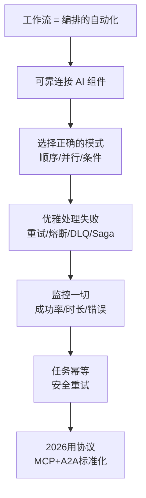

---

## 🔗 相关主题

- [智能体](../Agent_Foundations/Agent-in-nutshell.md) - 智能体工作流
- [技能](../Agent_Skills/Skills-in-nutshell.md) - 构建工作流组件
- [MLOps](../../11_MLOps_Pipeline/) - ML 专用流水线
- [模型训练](../../07_Model_Training/Model-Training-in-nutshell.md) - 训练工作流

## Related

- [[15_Agent_Production/Agent_Evaluation/Agent_Harness_Complete_2026]] — Agent Harness 完整指南：生产级 Agent 评估框架 (共享: agent-framework, ai-agents, langgraph, production)
- [[15_Agent_Production/Agent_Evaluation/Agent_Red_Teaming_2026]] — Agent Red Teaming Framework 2026 (共享: agent-framework, ai-agents, langgraph, production)
- [[15_Agent_Production/Agent_Evaluation/Assessment/Evaluation_Workflow]] — Evaluation Workflow (共享: agent-framework, ai-agents, langgraph, production)
- [[15_Agent_Production/Agent_Evaluation/Assessment/Production_Assessment]] — Production Assessment (共享: agent-framework, ai-agents, langgraph, production)
