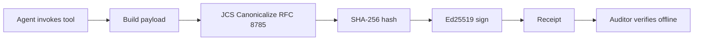

# L18 加密审计收据：Ed25519 + JCS + 哈希链

> 来源：[Microsoft AI Agents for Beginners / 18-securing-ai-agents](https://github.com/microsoft/ai-agents-for-beginners/tree/main/18-securing-ai-agents)

## 学习目标

完成本课后，你将能够：

- 识别需要加密 provenance 的 Agent 失败模式
- 用 Ed25519 对 canonical JSON payload 签名产出收据
- 仅用签名者公钥**离线验证**收据
- 通过重跑验证检测篡改
- 构建哈希链，移除/重排即断链
- 厘清"收据证明了什么"与"收据不证明什么"的边界

---

## 一、问题：Agent 审计跟踪的信任难题

设想 Contoso Travel 的 Agent 上季度处理了 50,000 次订票。审计员问：**"你怎么证明这些日志没被改过？"**

现有方案都依赖**信任某方**：

| 方案 | 问题 |
|------|------|
| 应用日志 | 任何有文件系统权限的人都能改 |
| 云日志服务 | 平台级 tamper-evident，但审计员要信任云厂商 |
| 数据库事务日志 | 适合 DB 变更，不适合任意工具调用 |

**对金融/医疗/EU AI Act 监管场景，"信任"是不够的。** 加密收据让审计员**不需要信任你**——只需要你的公钥。

---

## 二、什么是加密收据

收据是记录 Agent 行为并签名过的 JSON 对象。三个性质共同起作用：



### 收据示例

```json
{
  "type": "agent.tool_call.v1",
  "agent_id": "contoso-travel-bot",
  "tool_name": "lookup_flights",
  "tool_args_hash": "sha256:a3f9c1...",
  "result_hash": "sha256:7b2e1d...",
  "policy_id": "contoso-travel-policy-v3",
  "timestamp": "2026-04-25T14:30:00Z",
  "sequence": 47,
  "previous_receipt_hash": "sha256:9d4e6a...",
  "signature": {
    "alg": "EdDSA",
    "sig": "c5af83...",
    "public_key": "8f3b2c..."
  }
}
```

### 三大保障性质

| 性质 | 来源 |
|------|------|
| **Attribution（归属）** | Ed25519 签名——此 key 签了此内容 |
| **Integrity（完整性）** | 任何字段被改 → 签名失效 |
| **Ordering（顺序）** | `previous_receipt_hash` 形成链——前后顺序不可改 |

### 三大设计要点

1. **Ed25519 签名** —— 离线可验，公钥即可
2. **JCS 规范化（RFC 8785）** —— 同一逻辑 receipt 跨实现产生字节级一致输出，否则不同 JSON 序列化器签名不同
3. **Hash chaining** —— 移除/重排任一 receipt，其后的所有 receipt 都失效

---

## 三、Python 实现（≈50 行）

```python
import json, hashlib, base64
from nacl import signing
from jcs import canonicalize

def sha256_canonical(obj) -> str:
    return f"sha256:{hashlib.sha256(canonicalize(obj)).hexdigest()}"

signing_key = signing.SigningKey.generate()  # 生产环境用 Key Vault
verify_key  = signing_key.verify_key

payload = {
    "type": "agent.tool_call.v1",
    "agent_id": "contoso-travel-bot",
    "tool_name": "lookup_flights",
    "tool_args_hash": sha256_canonical({"origin": "SYD", "destination": "LAX"}),
    "result_hash":    sha256_canonical([{"flight": "QF11", "price": 1850}]),
    "policy_id": "contoso-travel-policy-v3",
    "timestamp": "2026-04-25T14:30:00Z",
    "sequence": 0,
    "previous_receipt_hash": None,
}

canonical_bytes = canonicalize(payload)
message_hash    = hashlib.sha256(canonical_bytes).digest()
signature_bytes = signing_key.sign(message_hash).signature

receipt = {**payload, "signature": {
    "alg": "EdDSA",
    "sig": base64.urlsafe_b64encode(signature_bytes).decode().rstrip("="),
    "public_key": base64.urlsafe_b64encode(bytes(verify_key)).decode().rstrip("="),
}}
```

### 验证（离线、无第三方依赖）

```python
def verify_receipt(receipt: dict) -> bool:
    sig_obj = receipt.get("signature", {})
    if sig_obj.get("alg") != "EdDSA": return False
    payload = {k: v for k, v in receipt.items() if k != "signature"}
    canonical_bytes = canonicalize(payload)
    message_hash    = hashlib.sha256(canonical_bytes).digest()
    try:
        vk = signing.VerifyKey(b64url_decode(sig_obj["public_key"]))
        vk.verify(message_hash, b64url_decode(sig_obj["sig"]))
        return True
    except BadSignatureError:
        return False
```

---

## 四、哈希链：保护动作序列

单 receipt 保护一次动作。**链**保护整个序列：

```
R0 → R1 → R2 → R3
       ↑ previous_receipt_hash
       └── 每条 receipt 记录前一条的 hash
```

攻击者想 silently 删除 R2？两条路都走不通：

- 改 R3 的 `previous_receipt_hash` → 破坏 R3 签名
- 重新签 R3 → 需要私钥（在 HVM/Key Vault 中）

---

## 五、⚠️ 关键边界：收据证明什么 / 不证明什么

### ✅ 收据证明三件事

1. **Attribution** —— 此 key 签了此 payload
2. **Integrity** —— payload 自签名后未变
3. **Ordering** —— 此 receipt 在链中位于彼 receipt 之后

### ❌ 收据**不**证明四件事

1. **Correctness** —— 不证明动作是对的（错答案也能签得很好）
2. **Policy compliance** —— `policy_id` 只是声明，不证明该策略真被评估过
3. **Identity beyond the key** —— "此 key 签了" ≠ "此人授权了"。key ↔ 人/组织映射需要单独的身份基础设施
4. **Truthfulness of inputs** —— Agent 收到被操纵的 prompt 也会忠实地签收据。**收据是输入校验下游，不是替代品**

> **常见错误**：以为"有收据 = 已治理"。❌ 收据只是基础，治理是建在其上的系统。

---

## 六、生产部署 Checklist

- [ ] **私钥离开开发机** —— Azure Key Vault / AWS KMS / HSM；永不入源码或明文机器
- [ ] **公钥公开发布** —— JWK Set at `https://your-org/.well-known/agent-keys.json`（RFC 7517）
- [ ] **链头外部锚定** —— 周期性写最新链头 hash 到 Sigstore Rekor / RFC 3161 时间戳 / 第二内部系统
- [ ] **不可变存储** —— Append-only blob（Azure Storage immutability / S3 Object Lock）
- [ ] **保留策略** —— 多年合规保留；每 receipt ~500 bytes，10K calls/day ≈ 1.8 GB/年
- [ ] **文档化未覆盖范围** —— runbook 明列 receipt 之外的输入校验/策略执行/限流/身份基础设施

---

## 七、进阶模式（合规成熟度提升后）

| 模式 | 用途 |
|------|------|
| **Selective Disclosure（RFC 6962 Merkle）** | 同一 receipt 按字段分别承诺——可向不同审计员暴露不同字段 |
| **Receipt Revocation** | 短期签名 key + 公开撤销列表，或 transparency log |
| **Bilateral / Split-Signature** | pre-execution（authorization）+ post-execution（result）各独立签名 |
| **Payload Composition** | 把 pre-decision reasoning、风险评估、责任链都封进 `result_hash` |
| **Cross-Implementation Conformance** | Python/TypeScript/Rust/Go 互验测试向量 |
| **Post-Quantum Migration** | `signature.alg` 可承载 `ML-DSA-65`（NIST 后量子标准） |

---

## 与其他课的衔接

- 本课是 [[15_Agent_Production/Course_Notes/Microsoft_AI_Agents/Microsoft_AI_Agents_L06_Trustworthy_Agents]] 的**技术深化**——L06 讲威胁建模与 HITL，本课给出**离线可验证的审计基础**
- 输入真实性边界（4）依赖 [[15_Agent_Production/Course_Notes/Microsoft_AI_Agents/Microsoft_AI_Agents_L06_Trustworthy_Agents]] 的输入校验
- 与 [[15_Agent_Production/Course_Notes/Microsoft_AI_Agents/Microsoft_AI_Agents_L10_Production]] 的可观测性互补：OTel traces 偏运行时调试，加密 receipt 偏跨组织审计

---

## 参考资源

- [IETF draft-farley-acta-signed-receipts](https://datatracker.ietf.org/doc/draft-farley-acta-signed-receipts/)
- [RFC 8032: EdDSA](https://datatracker.ietf.org/doc/html/rfc8032)
- [RFC 8785: JSON Canonicalization Scheme](https://datatracker.ietf.org/doc/html/rfc8785)
- [RFC 6962: Certificate Transparency](https://datatracker.ietf.org/doc/html/rfc6962)（选择性披露的 Merkle 基础）
- [Microsoft Agent Governance Toolkit Tutorial 33](https://github.com/microsoft/agent-governance-toolkit/blob/main/docs/tutorials/33-offline-verifiable-receipts.md)
- [PyNaCl docs](https://pynacl.readthedocs.io/)

---

## 关联阅读

- [[15_Agent_Production/Course_Notes/Microsoft_AI_Agents/Microsoft_AI_Agents_L15_Browser_Use]] — 上一课：浏览器 Agent
- [[15_Agent_Production/Course_Notes/Microsoft_AI_Agents/Microsoft_AI_Agents_L06_Trustworthy_Agents]] — L06：威胁建模（输入校验前置）
- [[15_Agent_Production/Course_Notes/Microsoft_AI_Agents/Microsoft_AI_Agents_L10_Production]] — L10：可观测性（OTel）
- [[17_Ethics_Safety/GenAI_L13_Securing_AI_Applications]] — GenAI 安全基础
- [[17_Ethics_Safety/README]] — 伦理与安全主题（如有）
- [[90_Learn/courses/microsoft/microsoft_ai_agents_for_beginners]] — 课程总览
