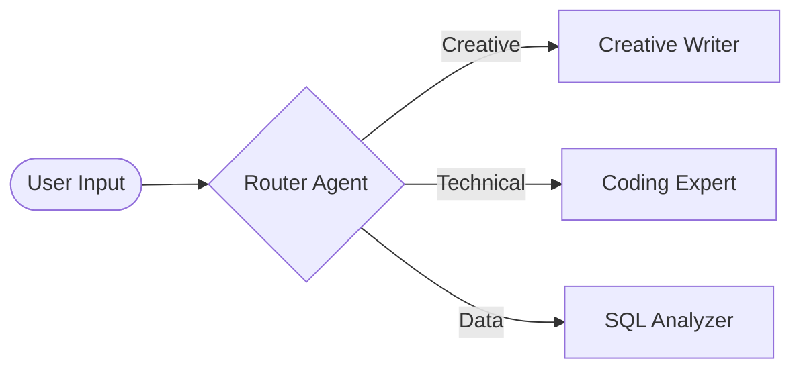
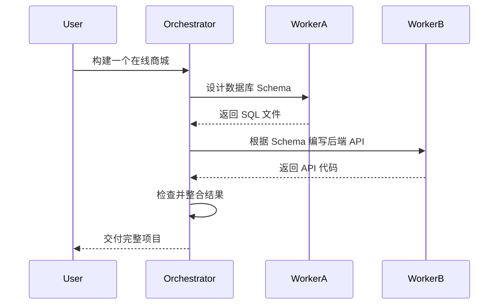

# Agentic Workflow Design Patterns 2026: Beyond Simple Chains

> **一句话理解**: 2026 年的智能体开发不再是堆叠 Prompt，而是像设计“分布式软件架构”一样，通过成熟的工作流模式来解决 LLM 的不确定性问题。

---

## 目录

| 模式名称 | 核心理念 | 适用场景 |
|----------|---------|----------|
| [1. 路由模式 (Routing)](#1-路由模式-routing) | 分而治之，按需分配模型 | 任务分类、多语言处理 |
| [2. 并行模式 (Parallelism)](#2-并行模式-parallelism) | 并发处理，横向扩展 | 方案竞选、多维度搜索 |
| [3. 编排者-执行者 (Orchestrator-Workers)](#3-编排者-执行者-orchestrator-workers) | 动态分解与汇总 | 复杂项目开发、长文撰写 |
| [4. 评估者-优化者 (Evaluator-Optimizer)](#4-评估者-优化者-evaluator-optimizer) | 内部循环与自我修正 | 代码调优、创意写作 |
| [5. 蜂群模式 (Swarms)](#5-蜂群模式-swarms) | 去中心化协作、动态移交 | 实时客户支持、全栈开发 |
| [模式选型决策树](#6-模式选型决策树) | 快速决策指南 | 实践建议 |

---

## 1. 路由模式 (Routing)

路由模式是所有复杂智能体系统的起点。它就像一个前台，根据用户的输入决定将其交给哪一个专门的子系统。

### 1.1 架构图

### 1.2 2026 实践建议
- **低成本路由**: 优先使用小模型（如 Qwen-1.5B/SmolLM）作为分类路由，节省成本。
- **语义路由 (Semantic Router)**: 利用 Embedding 向量空间进行余弦相似度匹配，无需 LLM 推理即可实现微秒级路由。

---

## 2. 并行模式 (Parallelism)

当任务可以被拆解为多个互不依赖的子任务，或需要从多个角度同时验证时使用。

### 2.1 拆分-合并 (Sectioning)
将长文档拆分为 10 个章节，同时交给 10 个 Agent 总结，最后汇总。

### 2.2 投票机制 (Voting / N-of-M)
针对同一个逻辑难题，同时启动 3 个模型推理，通过“少数服从多数”降低幻觉率。

---

## 3. 编排者-执行者 (Orchestrator-Workers)

这是处理**不可预测任务**的核心模式。Orchestrator 不知道任务会有多复杂，它根据 Worker 的反馈动态调整计划。

---

## 4. 评估者-优化者 (Evaluator-Optimizer)

这是一种迭代闭环模式，类似于 RLHF 的内部模拟。

1. **Optimizer**: 生成初始草案。
2. **Evaluator**: 针对预设指标（如代码覆盖率、文风严谨性）进行挑刺。
3. **Loop**: Optimizer 根据反馈进行修改，直到 Evaluator 给出“通过”。

> **关键**: Evaluator 的 Prompt 必须与 Optimizer 隔离，最好使用更高阶的模型（如用 Claude 3.5 Sonnet 评估 Llama 3 产出的代码）。

---

## 5. 蜂群模式 (Swarms)

蜂群模式强调**动态移交 (Handoffs)**。每个 Agent 都有权决定将当前的上下文转交给另一个更适合的 Agent。

- **去中心化**: 没有一个全局的“上帝 Agent”。
- **上下文透明**: 移交时带上所有的对话历史和工具调用状态。
- **应用**: 经典的 `OpenAI Swarms` 或 `Anthropic Computer Use` 流程。

---

## 6. 模式选型决策树 (2026)

1. **任务是否是线性的且完全可预测？**
   - 是 → 使用 **简单的 Chain**。
2. **任务是否需要不同领域的专门专家？**
   - 是 → 使用 **Routing**。
3. **任务是否非常庞大，且子任务互不干扰？**
   - 是 → 使用 **Parallelism**。
4. **任务是否需要高质量产出且伴随明确的对错准则？**
   - 是 → 使用 **Evaluator-Optimizer**。
5. **任务是否具有极高的复杂性、不确定性且需要多步动态拆解？**
   - 是 → 使用 **Orchestrator-Workers** 或 **Swarms**。

---

## Related

- [[智能体/Agent_Frameworks/README]] — 框架对这些模式的支持程度
- [[智能体/Agent_Workflow/Workflow-in-nutshell]] — 基础工作流概念
- [[强化学习/AI_Agents/Agent_State_Management]] — 如何在复杂模式中保持状态一致性
- [[智能体/Agent_Evaluation/Assessment/Production_Assessment]] — 针对复杂流的评估方法

---

*Last updated: 2026-06-04*

## 附录：核心概念速查

| 概念 | 说明 | 应用场景 |
|------|------|----------|
| Agent Loop | 感知-思考-行动循环 | 核心执行流程 |
| Tool Use | 调用外部工具/API | 扩展能力 |
| Memory | 短期/长期记忆 | 上下文维护 |
| Planning | 任务分解与排序 | 复杂任务 |
| Reflection | 自我评估改进 | 质量提升 |
| Multi-Agent | 多Agent协作 | 分布式任务 |

## 附录：技术栈对比

| 框架/工具 | 特点 | 适用场景 | 成熟度 |
|----------|------|----------|--------|
| LangChain | 链式调用 | 通用Agent | ★★★★☆ |
| LangGraph | 图结构编排 | 复杂流程 | ★★★★☆ |
| AutoGen | 多Agent对话 | 协作任务 | ★★★★☆ |
| CrewAI | 角色分工 | 团队模拟 | ★★★☆☆ |
| OpenAI SDK | 官方框架 | 快速原型 | ★★★★☆ |
| Semantic Kernel | 企业级 | .NET/Java | ★★★★☆ |

## 附录：学习路径

| 阶段 | 推荐内容 | 目标 |
|------|----------|------|
| 入门 | 基础概念文档 | 理解Agent |
| 进阶 | 本文档深度内容 | 掌握技术 |
| 实践 | 动手项目 | 构建应用 |
| 前沿 | 最新论文/产品 | 跟踪发展 |

## 附录：常见问题

| 问题 | 解答 |
|------|------|
| Agent和Chatbot的区别？ | Agent能自主决策+使用工具+持续执行 |
| 需要什么前置知识？ | LLM基础+编程+系统设计 |
| 如何评估Agent？ | 任务完成率+效率+安全性 |
| 2026年趋势？ | 多Agent协作/企业级/具身智能 |

## 附录：术语表

| 术语 | 英文 | 说明 |
|------|------|------|
| 智能体 | Agent | 自主决策AI系统 |
| 工具调用 | Tool Use | 使用外部工具 |
| 记忆 | Memory | 上下文/历史 |
| 规划 | Planning | 任务分解 |
| 反思 | Reflection | 自我评估 |
| 编排 | Orchestration | 流程管理 |
| 协议 | Protocol | 通信标准 |
| 护栏 | Guardrails | 安全约束 |

## 附录：检查清单

| 检查项 | 说明 | 状态 |
|--------|------|------|
| 理解核心概念 | Agent架构 | ☐ |
| 掌握工具调用 | MCP/Function Calling | ☐ |
| 了解记忆机制 | 短期/长期 | ☐ |
| 理解规划推理 | CoT/ReAct | ☐ |
| 动手实践 | 构建Agent | ☐ |
| 了解评估方法 | 质量度量 | ☐ |

> 💡 智能体是AI从"对话"走向"行动"的关键跨越。掌握Agent开发，是2026年AI工程师的核心竞争力。

---
*Last updated: 2026-07-21*

## 快速参考

| 维度 | 要点 | 备注 |
|------|------|------|
| 核心概念 | 理解基本原理和设计动机 | 理论基础 |
| 技术选型 | 根据场景选择合适方案 | 实践指导 |
| 最佳实践 | 遵循行业标准做法 | 质量保障 |
| 常见陷阱 | 避免已知问题和反模式 | 经验总结 |
| 发展趋势 | 关注技术演进方向 | 前瞻视野 |

## 延伸阅读

| 资源 | 类型 | 适用阶段 |
|------|------|----------|
| 官方文档 | 参考手册 | 全阶段 |
| 技术博客 | 深度分析 | 进阶 |
| 开源项目 | 代码实践 | 实战 |
| 学术论文 | 前沿研究 | 精通 |
| 社区讨论 | 经验交流 | 全阶段 |

## 检查清单

- [ ] 核心概念已理解并能向他人解释
- [ ] 已完成至少一个实践项目
- [ ] 了解主流方案的优劣势
- [ ] 掌握常见问题排查方法
- [ ] 关注最新技术动态和趋势
