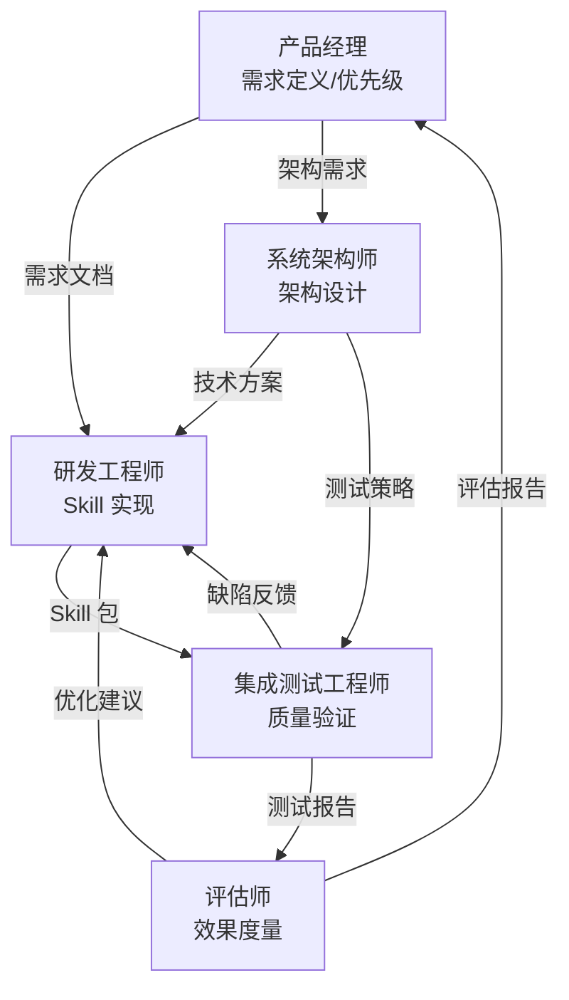
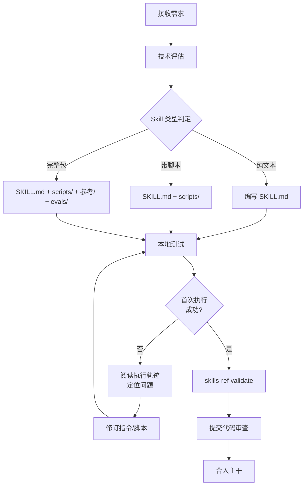
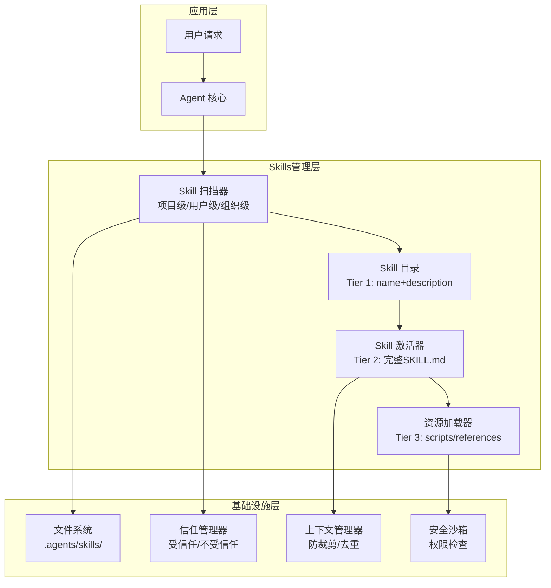
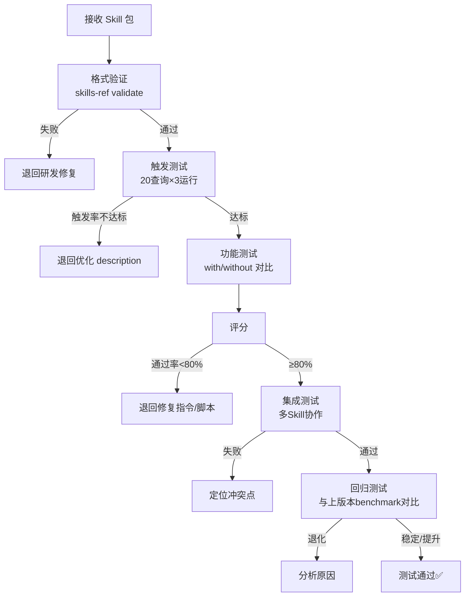
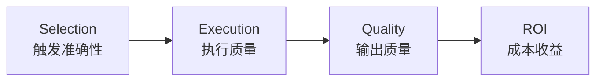
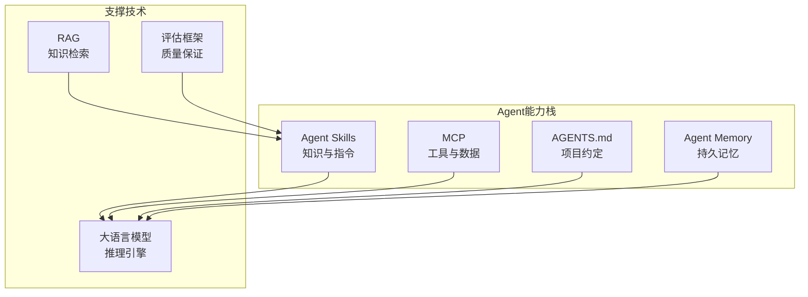

# Agent Skills 多角色全景分析

> 中文简称：Agent Skills 多角色全景分析

> 🎯 **目标**：从 AI Agent 研发工程师、系统架构师、集成测试工程师、评估师、产品经理五个专业角色视角，全面解析 Agent Skills 的内涵外延，覆盖完整生命周期。

---

## 一、五角色视角总览

### 1.1 角色关注点差异矩阵

| 维度 | 研发工程师 | 系统架构师 | 集成测试工程师 | 评估师 | 产品经理 |
|------|-----------|-----------|--------------|--------|---------|
| **核心关注** | 实现质量与可维护性 | 整体架构与可扩展性 | 功能正确与集成稳定 | 效果度量与质量基线 | 用户价值与市场定位 |
| **主要产出** | SKILL.md + scripts/ | 架构设计文档/决策记录 | 测试用例/自动化套件 | 评估报告/基准数据 | 需求文档/路线图 |
| **衡量成功** | 代码质量/Skill 通过率 | 系统稳定性/扩展能力 | 测试覆盖率/缺陷逃逸率 | delta 提升幅度 | 用户采纳率/NPS |
| **关键痛点** | 指令歧义/脚本兼容性 | 上下文膨胀/安全信任 | 非确定性输出/环境依赖 | 断言设计/基线漂移 | Skill 发现/激活成功率 |
| **工具偏好** | skills-ref, uv, npx | 架构决策记录(ADR) | evals.json, grading 框架 | benchmark.json, A/B 对比 | 用户行为分析/触发率 |
| **生命周期重点** | 设计→开发→调试 | 设计→部署→运维 | 开发→测试→回归 | 测试→评估→迭代 | 规划→发布→度量 |

### 1.2 角色协作关系图



### 1.3 生命周期阶段×角色职责分工表

| 阶段 | 研发工程师 | 系统架构师 | 集成测试工程师 | 评估师 | 产品经理 |
|------|-----------|-----------|--------------|--------|---------|
| **需求分析** | 评估技术可行性 | 确认架构约束 | 制定测试策略 | 定义评估基线 | **主导**：定义用户场景 |
| **设计** | 接口设计/脚本设计 | **主导**：架构方案 | 设计测试矩阵 | 设计评估用例 | 审核用户体验 |
| **开发** | **主导**：编码实现 | 代码审查/架构守护 | 开发测试框架 | 准备评估环境 | 验收原型 |
| **测试** | 修复缺陷 | 性能/安全审查 | **主导**：执行测试 | 运行评估套件 | 用户验收测试 |
| **部署** | 部署支持 | **主导**：部署策略 | 验证部署后回归 | 线上评估 | 发布公告 |
| **评估** | 根据反馈优化 | 架构改进 | 补充回归测试 | **主导**：效果分析 | 数据驱动决策 |
| **迭代** | 代码重构 | 架构演进 | 测试增强 | 基准更新 | **主导**：下一版本规划 |

---

## 二、研发工程师视角

### 2.1 核心关注点

研发工程师关注 Skill 的**实现质量**——从 SKILL.md 指令的清晰度到脚本的鲁棒性，从输入校验到错误处理。

#### 关注维度详解

| 维度 | 关注内容 | 质量标准 | 常见问题 |
|------|---------|---------|---------|
| **指令清晰度** | SKILL.md body 的可执行性 | Agent 首次执行成功率 > 80% | 指令歧义导致 Agent 走弯路 |
| **脚本质量** | scripts/ 下脚本的健壮性 | 自包含/非交互/结构化输出 | 依赖缺失/交互式提示阻塞 |
| **输入校验** | frontmatter 字段合规性 | name/description 通过 skills-ref | name 不匹配目录名 |
| **错误处理** | 异常场景的优雅降级 | 有用的错误消息 + 退出码 | 裸 stack trace 输出 |
| **可测试性** | evals/ 目录的完整性 | 每个核心能力至少 1 个测试用例 | 缺少边缘情况覆盖 |
| **可维护性** | 代码组织和文档质量 | 模块化/单一职责 | 万能 Skill 难以维护 |

### 2.2 Skill 开发流程（研发视角）



### 2.3 编码规范速查

| 规范项 | 要求 | 示例 |
|--------|------|------|
| **name 命名** | 小写+连字符, 1-64 字符 | `csv-analyzer` ✅ `CSV_Analyzer` ❌ |
| **description** | 祈使句式, ≤1024 字符, 含触发关键词 | `"Analyze CSV files...Use when..."` |
| **SKILL.md body** | < 500 行, < 5000 tokens | 详细内容移至 参考/ |
| **脚本声明依赖** | PEP 723 / Deno imports / Bun imports | `# /// script` `# dependencies = [...]` |
| **脚本输入** | CLI 参数或环境变量, 禁止交互式提示 | `--format json --output report.csv` |
| **脚本输出** | 结构化(JSON/CSV)到 stdout, 诊断到 stderr | `print(json.dumps(result))` |
| **错误消息** | 说明原因 + 给出修复建议 | `Error: --format must be one of: json, csv` |
| **幂等性** | 重试安全, "不存在则创建" | 避免 "创建并在重复时报错" |

### 2.4 案例：研发工程师如何构建 Incident Response Skill

```
1. 分析需求 → 识别出4个子能力：指标查询、日志搜索、工单创建、告警发送
2. 设计决策 → 组合技能模式：复用已有原子 Skill，编排为流水线
3. 实现 SKILL.md → 5步工作流 + Gotchas + 输出模板
4. 编写脚本 → scripts/check_metrics.py（自包含，PEP 723）
5. 本地测试 → 模拟指标异常场景，验证完整流程
6. 边缘情况 → 添加"指标正常则跳过后续步骤"的条件分支
7. 提交评审 → skills-ref validate + 同行代码审查
```

---

## 三、系统架构师视角

### 3.1 核心关注点

系统架构师关注 Agent Skills 的**整体架构设计**——从渐进式披露的上下文管理到跨客户端互操作，从安全信任模型到规模化部署。

#### 架构设计要素表

| 要素 | 设计决策 | 架构影响 | 权衡取舍 |
|------|---------|---------|---------|
| **渐进式披露** | 三层加载(目录→指令→资源) | Token 效率 vs 加载延迟 | 20 个 Skill 仅需 ~2000 tokens 目录开销 |
| **扫描路径** | 项目级 > 用户级 > 组织级 | 覆盖策略与隔离 | 灵活性 vs 安全风险 |
| **激活机制** | 文件读取 / 专用工具 / 斜杠命令 | 集成复杂度 vs 功能丰富度 | 简单实现 vs 精细控制 |
| **上下文保护** | 防裁剪标记 + 去重激活 | 上下文窗口管理 | 保护过多 → 其他内容被挤压 |
| **安全信任** | 受信任标记 + 宽松验证 | 安全性 vs 可用性 | 严格校验阻碍跨客户端兼容 |
| **子 Agent 委托** | 独立会话运行 Skill | 隔离性 vs 上下文传递 | 完全隔离 vs 共享会话状态 |

### 3.2 架构层次图



### 3.3 跨客户端互操作架构

| 层级 | 路径约定 | 兼容客户端 | 备注 |
|------|---------|-----------|------|
| **通用互操作** | `.agents/skills/` | Claude Code, VS Code, Cursor, Codex, Gemini CLI, OpenCode | 广泛采纳的标准路径 |
| **客户端专属** | `.claude/skills/` | Claude Code | 额外扫描路径 |
| **用户全局** | `~/.agents/skills/` | 所有兼容客户端 | 跨项目共享 |
| **组织级** | 配置仓库或 Skill URL | 云端/沙箱 Agent | 需额外配置 |

### 3.4 安全威胁模型

| 威胁类型 | 攻击向量 | 缓解措施 | 架构影响 |
|---------|---------|---------|---------|
| **指令注入** | 恶意 SKILL.md 注入有害指令 | 项目级 Skill 需信任标记 | 信任管理子系统 |
| **脚本漏洞** | scripts/ 中的代码执行恶意操作 | 沙箱隔离 + allowed-tools 白名单 | 安全沙箱层 |
| **YAML 畸形** | 精心构造的 YAML 导致解析器崩溃 | 宽松验证 + 错误容忍 | 容错解析模块 |
| **上下文投毒** | 超长 Skill 占满上下文窗口 | < 5000 tokens 硬限制 + 裁剪策略 | 上下文管理器 |
| **仓库劫持** | 篡改第三方 Skill 仓库 | 版本固定 + 哈希校验 | 完整性验证 |

### 3.5 可扩展性考量

| 场景 | 挑战 | 架构方案 |
|------|------|---------|
| **50+ Skills 安装** | 目录扫描延迟 | 缓存索引 + 增量扫描 |
| **大型 Skill 包** | Token 预算超标 | 严格分层加载 + references 外置 |
| **多租户** | Skill 隔离与共享 | 命名空间 + 权限矩阵 |
| **CI/CD 集成** | Skill 版本管理 | Git submodule / 包管理器 |
| **离线环境** | 无法下载依赖 | 自包含脚本 + 本地依赖缓存 |

---

## 四、集成测试工程师视角

### 4.1 核心关注点

集成测试工程师关注 Skill 的**功能正确性和集成稳定性**——从单个 Skill 的输入输出验证到多 Skill 协作场景，从确定性输出到边缘情况覆盖。

#### 测试策略矩阵

| 测试类型 | 测试对象 | 工具/方法 | 通过标准 |
|---------|---------|----------|---------|
| **格式验证** | SKILL.md frontmatter | `skills-ref validate` | 零错误零警告 |
| **触发测试** | description 匹配率 | 20 个查询 × 3 次运行 | 应触发 >0.5, 不应触发 <0.5 |
| **功能测试** | Skill 执行结果 | evals.json + 断言 | 断言通过率 ≥ 80% |
| **脚本测试** | scripts/ 可执行性 | `uv run` / `deno run` | 零错误 + 结构化输出 |
| **集成测试** | 多 Skill 协作 | 端到端工作流 | 完整流水线通过 |
| **回归测试** | 修改后的向后兼容 | benchmark.json 对比 | delta ≥ 上一版本 |
| **边缘测试** | 异常输入/环境 | 手动设计边缘用例 | 优雅降级不崩溃 |
| **性能测试** | 执行时间/Token 消耗 | timing.json 分析 | ≤ 基线 × 1.5 |

### 4.2 测试用例设计框架

#### 4.2.1 测试用例结构

```json
{
  "skill_name": "target-skill",
  "evals": [
    {
      "id": "TC-001",
      "category": "happy_path|edge_case|error_handling|integration",
      "priority": "P0|P1|P2",
      "prompt": "真实用户消息",
      "expected_output": "成功的人类可读描述",
      "files": ["evals/files/input.csv"],
      "assertions": [
        "可编程验证的断言",
        "具体可观察的断言",
        "可计数的断言"
      ],
      "negative_assertions": [
        "不应出现的内容"
      ]
    }
  ]
}
```

#### 4.2.2 断言质量分级

| 等级 | 特征 | 示例 | 可维护性 |
|------|------|------|---------|
| **强断言** | 可编程验证 | `"输出文件是有效的 JSON"` | ⭐⭐⭐ |
| **中断言** | 具体可观察 | `"条形图有标签化的坐标轴"` | ⭐⭐ |
| **弱断言** | 模糊主观 | `"输出是好的"` | ⭐ |
| **脆弱断言** | 过于精确 | `"包含确切短语 'Total: $X'"` | ❌ |

### 4.3 测试流程



### 4.4 非确定性输出的测试策略

Agent Skills 的输出天然具有非确定性（LLM 生成），测试策略需要适配：

| 策略 | 方法 | 适用场景 |
|------|------|---------|
| **多次运行取统计** | 每个用例运行 3-5 次，计算通过率 | 所有测试 |
| **语义断言** | 检查语义而非精确文本 | 自然语言输出 |
| **结构断言** | 验证输出结构(JSON schema, 文件类型) | 结构化输出 |
| **范围断言** | 检查数值在合理范围内 | 数据分析类 |
| **否定断言** | 验证不包含禁止内容 | 安全相关 |
| **人工审查** | 对 LLM 打分存疑处人工复核 | 高风险场景 |

### 4.5 集成测试矩阵

| 场景 | 涉及 Skills | 验证重点 | 风险等级 |
|------|------------|---------|---------|
| **数据分析→可视化** | csv-analyzer → frontend-design | 数据传递完整性 | 中 |
| **PDF→数据→报告** | pdf → csv-analyzer → internal-comms | 格式转换链路 | 高 |
| **安全审计流水线** | audit-context-building → differential-review → static-analysis | 上下文传递 | 高 |
| **部署→监控→告警** | vercel-deploy → canary → send-alert | 端到端时效性 | 关键 |
| **Skill 冲突** | 两个 Skill description 重叠 | 触发歧义解消 | 中 |

---

## 五、评估师视角

### 5.1 核心关注点

评估师关注 Skill 的**效果度量与质量基线**——Skill 是否真正提升了 Agent 的任务完成质量，提升幅度是否值得 Token/时间成本。

#### 评估维度全景

| 评估维度 | 核心指标 | 数据来源 | 判定标准 |
|---------|---------|---------|---------|
| **效果提升(delta)** | with_skill vs without_skill 通过率差 | benchmark.json | delta_pass_rate > 0.3 |
| **成本效率** | Token 增加量 / 时间增加量 | timing.json | 成本增幅 < 收益增幅 |
| **触发准确性** | 应触发率 / 误触发率 | 触发测试集 | 精确率 > 0.8, 召回率 > 0.7 |
| **输出质量** | 断言通过率 / 人工评分 | grading.json | pass_rate > 0.8 |
| **一致性** | 多次运行的标准差 | 多次 benchmark | stddev < 0.1 |
| **边缘鲁棒性** | 非典型输入下的表现 | 边缘测试集 | 优雅降级率 100% |

### 5.2 评估框架（SEQR 模型）



#### SEQR 评估对照表

| 阶段 | 评估内容 | 指标 | 方法 | 目标值 |
|------|---------|------|------|--------|
| **S - Selection** | Skill 能否被正确触发 | 精确率/召回率/F1 | 20+查询×3次 | F1 > 0.75 |
| **E - Execution** | 指令是否被正确执行 | 步骤完成率 | 执行轨迹分析 | > 90% |
| **Q - Quality** | 输出是否满足预期 | 断言通过率 | evals + grading | > 80% |
| **R - ROI** | 收益是否超过成本 | delta / cost_increase | benchmark 对比 | ROI > 2.0 |

### 5.3 核心评估循环

```
┌──────────┐    ┌──────────┐    ┌──────────┐    ┌──────────┐
│ 设计用例  │───▶│ 运行评估  │───▶│ 评分分析  │───▶│ 迭代优化  │
│ (evals)  │    │(with/out)│    │(grading) │    │(iterate) │
└──────────┘    └──────────┘    └──────────┘    └──────────┘
      ▲                                               │
      └───────────────────────────────────────────────┘
```

### 5.4 评估报告模板

```markdown
## Skill 评估报告: [skill-name] v[version]

### 概要
| 指标 | with_skill | without_skill | delta |
|------|-----------|--------------|-------|
| 通过率 | 83% | 33% | +50% |
| 平均时间(s) | 45 | 32 | +13 |
| 平均 Tokens | 3800 | 2100 | +1700 |
| ROI | — | — | 2.94 |

### 触发准确性
| 指标 | 值 |
|------|-----|
| 精确率 | 0.85 |
| 召回率 | 0.80 |
| F1 | 0.82 |

### 失败模式分析
| 失败类型 | 频率 | 根因 | 建议修复 |
|---------|------|------|---------|
| 坐标轴未标注 | 2/10 | 指令未明确要求 | 添加 "Always label axes" |
| 格式不一致 | 1/10 | 缺少输出模板 | 添加 Output format 节 |

### 建议
- [ ] 修复: 添加明确的坐标轴标注指令
- [ ] 增强: 添加更多边缘测试用例
- [ ] 监控: 下版本关注标准差变化
```

### 5.5 迭代优化信号来源

| 信号 | 来源 | 对应行动 | 优先级 |
|------|------|---------|--------|
| 断言总是失败 | grading.json | 修复 Skill 或修复断言 | P0 |
| 高标准差 | 多次运行 | 增加指令具体性 | P0 |
| 人工评分低 | feedback.json | 修复整体质量方向 | P1 |
| 断言总是通过 | benchmark 分析 | 删除无信息量断言 | P2 |
| delta 下降 | 版本间对比 | 回滚或修复退化 | P0 |
| Token 成本飙升 | timing.json | 精简 SKILL.md | P1 |

### 5.6 评估成熟度模型

| 级别 | 名称 | 特征 | 评估活动 |
|------|------|------|---------|
| **L1** | 即兴 | 无正式评估 | 主观判断 |
| **L2** | 基础 | 有 evals.json | with/without 对比 |
| **L3** | 系统化 | 完整 SEQR | 触发+执行+质量+ROI |
| **L4** | 持续 | CI 集成评估 | 每次提交自动评估 |
| **L5** | 优化 | 数据驱动迭代 | A/B 测试 + 统计显著性 |

---

## 六、产品经理视角

### 6.1 核心关注点

产品经理关注 Agent Skills 的**用户价值和市场定位**——从用户如何发现和使用 Skill，到 Skill 生态如何增长和变现。

#### 产品维度分析

| 维度 | 关注内容 | 衡量指标 | 行业基准 |
|------|---------|---------|---------|
| **市场规模** | 451+ Skills, 30+ Agent 产品 | 生态增长率 | 月均新增 ~20 Skills |
| **用户画像** | 开发者/13_运维/分析师/设计师 | 按角色分布 | 开发者占 70%+ |
| **激活漏斗** | 发现→安装→触发→成功 | 各步骤转化率 | 触发成功率目标 >80% |
| **留存分析** | 日活 Skill 使用频率 | DAU/MAU 比 | >30% 为健康 |
| **竞品分析** | MCP vs Agent Skills vs 自建 | 功能覆盖/开发效率 | — |

### 6.2 Skill 分类矩阵（产品视角）

#### 按功能×复杂度×应用场景

| 分类 | 代表 Skill | 复杂度 | 目标用户 | 商业价值 |
|------|-----------|--------|---------|---------|
| **文档处理** | docx, pdf, xlsx, pptx | 级别 3-4 | 全员 | ⭐⭐⭐⭐⭐ |
| **前端开发** | react-best-practices, frontend-design | 级别 1-2 | 前端工程师 | ⭐⭐⭐⭐ |
| **安全审计** | static-analysis, building-secure-contracts | 级别 3-4 | 安全工程师 | ⭐⭐⭐⭐⭐ |
| **云平台部署** | vercel-deploy, wrangler, netlify-deploy | 级别 3 | DevOps | ⭐⭐⭐⭐ |
| **AI/ML 工具** | hugging-face-model-trainer, fal-generate | 级别 3-4 | ML 工程师 | ⭐⭐⭐ |
| **数据分析** | csv-analyzer, duckdb-docs | 级别 2-3 | 数据分析师 | ⭐⭐⭐⭐ |
| **代码质量** | modern-python, code-review | 级别 1-2 | 全部工程师 | ⭐⭐⭐ |
| **基础设施** | terraform-*, azure-* | 级别 2-3 | 基础设施工程师 | ⭐⭐⭐⭐ |
| **创意设计** | algorithmic-art, canvas-design | 级别 2-3 | 设计师/创意 | ⭐⭐⭐ |
| **社交内容** | typefully, internal-comms | 级别 1-2 | 市场/运营 | ⭐⭐ |
| **平台集成** | gws-*, chatgpt-apps | 级别 3 | 企业用户 | ⭐⭐⭐⭐⭐ |

### 6.3 用户旅程地图

```mermaid
flowchart LR
    subgraph 发现阶段
        D1[搜索 officialskills.sh] --> D2[浏览 awesome-agent-skills]
        D2 --> D3[同事推荐]
    end
    
    subgraph 安装阶段
        I1[npx skills add] --> I2[手动复制]
        I2 --> I3[让Agent安装]
    end
    
    subgraph 使用阶段
        U1[自然语言触发] --> U2[/skills 确认]
        U2 --> U3[执行任务]
    end
    
    subgraph 评价阶段
        E1[成功体验] --> E2[分享推荐]
        E1 --> E3[提交改进]
    end
    
    D3 --> I1
    I3 --> U1
    U3 --> E1
```

### 6.4 竞品对比（Agent 能力扩展方案）

| 维度 | Agent Skills | MCP (工具协议) | 自建 Python Skills | Prompt Library |
|------|------------|---------------|-------------------|---------------|
| **定义方式** | SKILL.md | JSON-RPC server | Python 类 | 文本片段 |
| **技术门槛** | 低(Markdown) | 中(需写服务) | 高(编程) | 最低 |
| **执行能力** | 指令+脚本 | 完整工具调用 | 代码执行 | 仅提示 |
| **可移植性** | 30+ Agent | 多个 Agent | 绑定框架 | 通用但无标准 |
| **上下文管理** | 渐进式披露 | 工具描述 | 代码注册 | 全量注入 |
| **生态规模** | 451+ | 1000+（MCP servers） | 因项目而异 | 无标准统计 |
| **适用场景** | 知识+流程 | 工具+数据 | 底层框架 | 简单任务 |

### 6.5 产品路线图建议

| 阶段 | 时间线 | 关键里程碑 | 成功标准 |
|------|--------|-----------|---------|
| **MVP** | 1-2 周 | 5 个核心 Skills 可用 | 团队内部日活使用 |
| **增长** | 1-3 月 | 20+ Skills + 评估流程 | 触发成功率 > 80% |
| **成熟** | 3-6 月 | 自动化 CI 评估 + Skill 市场 | NPS > 40 |
| **生态** | 6-12 月 | 社区贡献 + 企业定制 | 月增 10+ 社区 Skills |

---

## 七、技能分类深度矩阵

### 7.1 按功能维度

| 功能类别 | 子类 | Skills 数量 | 代表团队 | 技术特征 |
|---------|------|-----------|---------|---------|
| **动作类** | 部署/发送/创建 | 50+ | Vercel, Netlify, Cloudflare | 需 allowed-tools |
| **检索类** | 查询/搜索/获取 | 40+ | DuckDB, Google, Firecrawl | 结构化输出 |
| **推理类** | 分析/诊断/审计 | 80+ | Trail of Bits, Sentry | 指令密集型 |
| **创作类** | 设计/生成/编写 | 60+ | Anthropic, fal.ai, GSAP | 模板+约束 |
| **组合类** | 工作流/流水线 | 30+ | HashiCorp, Expo | 多步骤编排 |
| **平台集成** | SDK/API 封装 | 180+ | Microsoft, Google, OpenAI | 语言特定 |

### 7.2 按复杂度层级

| 级别 | 结构 | Token 开销 | 开发时间 | 维护成本 | 占比 |
|------|------|-----------|---------|---------|------|
| **L1 纯文本** | SKILL.md only | < 2000 | < 1小时 | 低 | ~30% |
| **L2 带命令** | SKILL.md + 一次性命令 | < 3000 | < 2小时 | 低 | ~25% |
| **L3 带脚本** | SKILL.md + scripts/ | < 5000 | 2-8小时 | 中 | ~30% |
| **L4 完整包** | 全套目录结构 + evals/ | 5000+ | 1-3天 | 高 | ~15% |

### 7.3 按应用场景

| 场景 | 典型工作流 | 关键 Skills | 角色受益者 |
|------|-----------|-----------|-----------|
| **代码审查** | PR 提交 → 审查 → 修复 | code-review, differential-review | 研发 |
| **安全审计** | 扫描 → 分析 → 报告 | static-analysis, variant-analysis | 安全/架构 |
| **前端开发** | 设计 → 实现 → 审计 | frontend-design, web-design-guidelines | 前端研发 |
| **文档处理** | 提取 → 转换 → 生成 | pdf, docx, xlsx | 全员 |
| **部署上线** | 构建 → 部署 → 监控 | vercel-deploy, canary | DevOps |
| **数据分析** | 加载 → 清洗 → 可视化 | csv-analyzer, duckdb-docs | 数据分析 |
| **ML 工作流** | 训练 → 评估 → 部署 | hf-model-trainer, hf-evaluation | ML 工程 |
| **基础设施** | 编写 → 测试 → 部署 | terraform-*, azure-* | SRE/基础设施 |

---

## 八、内涵外延解析

### 8.1 内涵：Agent Skills 的核心本质

#### 核心概念层

| 层次 | 概念 | 本质 | 类比 |
|------|------|------|------|
| **哲学层** | 知识的可执行化 | 将人类专业知识编码为 Agent 可理解的指令 | 操作手册 → 自动化 |
| **设计层** | 渐进式披露 | 按需加载，平衡 Token 效率与能力覆盖 | 懒加载/虚拟化 |
| **格式层** | SKILL.md | Markdown 作为通用知识表达，降低门槛 | HTML 之于 Web |
| **执行层** | Agent 按指令操作 | 不是代码调用，而是指令引导 | 教练 vs 遥控器 |
| **生态层** | 开放标准 | 30+ 产品兼容的互操作格式 | USB 标准 |

#### 技术原理

```
Agent Skills 的技术原理 = 上下文工程 (Context Engineering)

核心机制:
1. 发现 (Discovery)    → 文件系统扫描 + frontmatter 解析
2. 匹配 (Matching)     → description 与用户意图的语义匹配
3. 注入 (Injection)     → 将 SKILL.md 内容注入 Agent 上下文
4. 引导 (Guidance)      → Agent 按指令执行，而非硬编码调用
5. 验证 (Verification)  → 评估循环确保质量
```

#### 实现机制对比

| 机制 | 传统 Skills（代码） | Agent Skills（开放标准） |
|------|-------------------|------------------------|
| **发现** | 代码注册表 `registry.register()` | 文件系统扫描 `.agents/skills/` |
| **匹配** | 程序化路由 `if/else` | LLM 语义理解 description |
| **执行** | `skill.execute(input)` | Agent 解读指令并操作 |
| **输入** | Pydantic schema 强校验 | 自然语言描述 + 脚本参数 |
| **输出** | 结构化 BaseModel | 自然语言 + 文件产出 |
| **扩展** | 继承 BaseSkill 类 | 创建新 SKILL.md 文件 |

### 8.2 外延：应用范围与发展趋势

#### 应用范围拓展

| 领域 | 当前状态 | 发展方向 | 时间预测 |
|------|---------|---------|---------|
| **编程助手** | 成熟（主要场景） | 深度代码库理解 | 已实现 |
| **企业办公** | 增长中（文档/邮件/日程） | 全办公套件覆盖 | 2026 H1 |
| **安全合规** | 专业化（Trail of Bits 等） | 自动化合规审计 | 2026 H1 |
| **数据工程** | 早期（DuckDB, Tinybird） | 端到端数据管线 | 2026 H2 |
| **设计创意** | 早期（Figma, fal.ai） | 设计→代码闭环 | 2026 H2 |
| **运维 SRE** | 概念验证 | 自动化事件响应 | 2027 |
| **教育培训** | 萌芽 | 个性化学习路径 | 2027 |
| **物联网/边缘** | 未涉及 | 嵌入式 Agent Skills | 2028+ |

#### 生态发展趋势

| 趋势 | 描述 | 影响 |
|------|------|------|
| **标准化加速** | `.agents/skills/` 成为事实标准 | 跨客户端互操作成本降低 |
| **Skill 市场** | 类似 App Store 的分发平台 | 发现效率提升，变现渠道 |
| **组合 Skill** | 多 Skill 编排为复杂工作流 | 能力上限大幅提升 |
| **评估驱动** | CI 集成自动评估成为标配 | 质量下限提高 |
| **企业化** | 组织级 Skill 库 + 权限管理 | 企业采纳加速 |
| **MCP 融合** | Skills（知识）+ MCP（工具）协同 | 完整的 Agent 能力栈 |
| **社区治理** | 类似 npm/crates 的质量审核 | 生态健康度提升 |

#### 与周边技术的关系



---

## 九、实践指南：角色协作案例

### 案例：构建企业级 "K8s 故障诊断" Skill

#### 阶段 1：产品经理发起

```markdown
需求文档摘要:
- 目标用户: SRE 团队
- 用户场景: Pod 异常时快速诊断根因
- 成功标准: 诊断时间从 30min 降至 5min
- 优先级: P0
```

#### 阶段 2：系统架构师设计

```markdown
架构决策记录 (ADR):
- Skill 类型: L4 完整包（SKILL.md + scripts/ + 参考/）
- 安全: 需要 kubectl 读权限，禁止写操作
- 子能力: Pod 状态检查 → 日志搜索 → 事件关联 → 根因推断
- allowed-tools: Bash(kubectl:get) Bash(kubectl:describe) Bash(kubectl:logs)
```

#### 阶段 3：研发工程师实现

```markdown
交付物:
├── SKILL.md          # 诊断工作流 5 步 + Gotchas
├── scripts/
│   ├── check_pod.sh  # kubectl get/describe 封装
│   └── analyze_logs.py  # 日志模式匹配
├── 参考/
│   └── common_errors.md  # K8s 常见错误码速查
└── evals/
    ├── evals.json    # 8 个测试用例
    └── files/        # 模拟日志和事件数据
```

#### 阶段 4：集成测试工程师验证

```markdown
测试报告:
- 格式验证: ✅ skills-ref validate 通过
- 触发测试: 精确率 0.90, 召回率 0.85, F1=0.87
- 功能测试: 8/8 用例通过, 平均通过率 87.5%
- 集成测试: 与 incident-response Skill 协作正常
- 回归风险: 无（新 Skill, 首版）
```

#### 阶段 5：评估师度量

```markdown
评估报告:
| 指标 | with_skill | without_skill | delta |
|------|-----------|--------------|-------|
| 通过率 | 87.5% | 25.0% | +62.5% |
| 平均时间 | 120s | 85s | +35s |
| Token | 4200 | 1800 | +2400 |
| ROI | — | — | 2.60 |

结论: delta 显著, ROI > 2.0, 建议发布。
优化建议: 添加"网络策略排查"子步骤。
```

#### 阶段 6：产品经理发布决策

```markdown
发布决策:
- 结果: 批准发布 ✅
- 版本: v1.0
- 安装方式: npx skills add internal/k8s-diagnosis
- 下一迭代: 添加网络策略和存储卷诊断
- 度量计划: 跟踪团队实际使用频率和诊断成功率
```

---

## 十、最佳实践汇总

### 10.1 各角色 Top 3 最佳实践

| 角色 | #1 | #2 | #3 |
|------|-----|-----|-----|
| **研发工程师** | 单一职责：一个 Skill 做一件事 | 阅读执行轨迹而非仅看输出 | 脚本必须非交互+有用错误消息 |
| **系统架构师** | 坚持渐进式披露三层架构 | 安全信任前置：不受信项目不加载 | 规划跨客户端互操作路径 |
| **集成测试工程师** | 每个核心能力至少 1 个测试用例 | 多次运行取统计应对非确定性 | 维护 with/without 基线对比 |
| **评估师** | 关注 delta 而非绝对值 | 用 SEQR 模型系统化评估 | 定期更新基准防止漂移 |
| **产品经理** | description 决定激活成功率 | 监控激活漏斗每步转化 | 用户反馈驱动迭代优先级 |

### 10.2 跨角色协作原则

| 原则 | 描述 | 违反后果 |
|------|------|---------|
| **评估先行** | 先定义测试用例，再开发 Skill | 无法衡量效果 |
| **安全左移** | 架构设计阶段就确定安全边界 | 上线后补安全成本 ×10 |
| **渐进交付** | 从 L1 纯文本开始，按需升级 | 过度工程延误交付 |
| **数据说话** | 用 benchmark.json 而非主观判断 | 决策缺乏依据 |
| **持续反馈** | 执行轨迹→评估→优化循环不停 | Skill 质量停滞 |

---

## 🔗 相关主题

- [Agent Skills 深度解析](./Agent_Skills_Deep_Dive.md) — 完整规范、核心机制与案例分析
- [Agent Skills 实战指南](./Agent_Skills_Practical_Guide.md) — 从零创建、测试、优化和发布
- [Agent Skills 生态目录](./Agent_Skills_Ecosystem_Catalog.md) — 451+ Skills 按团队和领域索引
- [Agent Skills 书写速览](./Skills-in-nutshell.md) — Agent Skills 快速入门与书写精要
- [官方文档](https://agentskills.io) — Agent Skills 标准文档站
- [官方目录](https://officialskills.sh) — 在线浏览全部 451+ Skills

---

> 📅 **最后更新**：2026-04-14 | **分析视角**：AI Agent 研发工程师、系统架构师、集成测试工程师、评估师、产品经理

## Related

- [[15_智能体/07_Agent_Evaluation/Agent_Harness_Complete_2026]] — Agent Harness 完整指南：生产级 Agent 评估框架 (共享: agent-framework, ai-agents, langgraph, production)
- [[15_智能体/07_Agent_Evaluation/Agent_Red_Teaming_2026]] — Agent Red Teaming Framework 2026 (共享: agent-framework, ai-agents, langgraph, production)
- [[15_智能体/07_Agent_Evaluation/Assessment/Evaluation_Workflow]] — Evaluation Workflow (共享: agent-framework, ai-agents, langgraph, production)
- [[15_智能体/07_Agent_Evaluation/Assessment/Production_Assessment]] — Production Assessment (共享: agent-framework, ai-agents, langgraph, production)
