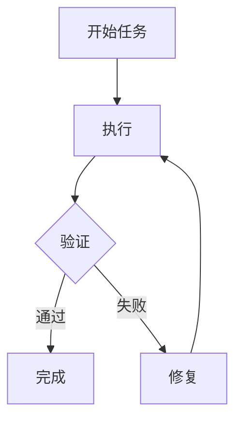

> [!warning] 生产安全提示 · Production Safety
> 本文档含可执行命令/操作步骤。执行前请核对风险等级（🟢低/🔶中/🔴高），高危命令必须 dry-run 并确认回滚方案。完整策略见 [生产安全策略](治理/Production_Safety_Policy.md)。
<!-- op-safety-banner v1 -->
# Agent Skills 实战指南

> 🎯 **目标**：通过手把手教程和真实案例，从零创建、测试、优化和发布一个生产级 Agent Skill。

---

## 一、5 分钟 Quickstart

### 创建你的第一个 Skill

一个 Skill = 一个包含 `SKILL.md` 的文件夹。

```bash
# 创建目录
mkdir -p .agents/skills/roll-dice

# 编写 SKILL.md
cat > .agents/skills/roll-dice/SKILL.md << 'EOF'
---
name: roll-dice
description: Roll dice using a random number generator. Use when asked to roll a die (d6, d20, etc.), roll dice, or generate a random dice roll.
---

To roll a die, use the following command that generates a random number from 1
to the given number of sides:

```bash
echo $((RANDOM % <sides> + 1))
```

Replace `<sides>` with the number of sides on the die (e.g., 6 for a standard
die, 20 for a d20).
EOF
```

### 在 VS Code 中测试

1. 打开项目，打开 Copilot Chat
2. 选择 **Agent** 模式
3. 输入 `/skills` 确认 `roll-dice` 出现在列表中
4. 问：**"Roll a d20"**
5. Agent 应该激活 `roll-dice` Skill 并运行命令

### 背后发生了什么

```
会话启动
    │
    ▼
Tier 1: Agent 扫描 .agents/skills/
    → 发现 roll-dice 的 name + description
    │
    ▼
用户: "Roll a d20"
    │
    ▼
Tier 2: Agent 匹配到 roll-dice skill
    → 加载完整 SKILL.md body
    │
    ▼
Tier 3: Agent 跟随指令
    → 运行: echo $((RANDOM % 20 + 1))
    → 返回: 14
```

---

## 二、实战案例：构建 CSV 分析 Skill

让我们构建一个真实的、有用的 Skill，走完整个创建流程。

### 步骤 1：创建基础结构

```bash
mkdir -p .agents/skills/csv-analyzer/{scripts,references,evals/files,assets}
```

### 步骤 2：编写 SKILL.md

```markdown
---
name: csv-analyzer
description: >
  Analyze CSV and tabular data files — compute summary statistics,
  add derived columns, generate charts, and clean messy data. Use this
  skill when the user has a CSV, TSV, or Excel file and wants to
  explore, transform, or visualize the data, even if they don't
  explicitly mention "CSV" or "analysis."
---

# CSV Data Analysis

## When to use this skill
When the user has a tabular data file (CSV, TSV, Excel) and wants to analyze,
transform, visualize, or clean it.

## Workflow

1. **Understand the data**: Read the file, show column names, types, and row count
2. **Clarify the task**: Confirm what analysis or transformation the user wants
3. **Execute**: Use pandas for data manipulation, matplotlib/plotly for charts
4. **Present results**: Show key findings as markdown tables or charts

## Tools
- Use pandas for data manipulation
- Use matplotlib for static charts
- Use plotly for interactive charts when available

## Gotchas
- Always check encoding — try utf-8 first, fall back to latin-1
- Large files (>100MB): use chunked reading or sampling
- Date columns: try `parse_dates` in `pd.read_csv()`
- Missing values: report count before dropping

## Output format
For summary statistics, use this format:

| Metric | Value |
|--------|-------|
| Total rows | X |
| Columns | X |
| Missing values | X% |

For charts, save to a file and provide the path.
```

### 步骤 3：添加辅助脚本

```python
# scripts/quick_summary.py
# /// script
# dependencies = [
#   "pandas",
# ]
# ///

import pandas as pd
import sys
import json

if len(sys.argv) < 2:
    print("Error: File path required.", file=sys.stderr)
    print("Usage: python scripts/quick_summary.py <file_path>", file=sys.stderr)
    sys.exit(1)

file_path = sys.argv[1]

try:
    encodings = ['utf-8', 'latin-1', 'cp1252']
    df = None
    for enc in encodings:
        try:
            df = pd.read_csv(file_path, encoding=enc, nrows=1000)
            break
        except UnicodeDecodeError:
            continue
    
    if df is None:
        print(json.dumps({"error": "Could not decode file with any encoding"}))
        sys.exit(1)

    summary = {
        "rows": len(df),
        "columns": list(df.columns),
        "dtypes": {col: str(dt) for col, dt in df.dtypes.items()},
        "missing_pct": {col: f"{pct:.1f}%" for col, pct in (df.isnull().mean() * 100).items()},
        "sample": df.head(3).to_dict(orient="records")
    }
    print(json.dumps(summary, indent=2, default=str))
except Exception as e:
    print(json.dumps({"error": str(e)}), file=sys.stderr)
    sys.exit(1)
```

### 步骤 4：创建测试数据

```csv
# evals/files/sales_2025.csv
month,revenue,expenses,region
January,45000,32000,North
February,52000,35000,South
March,48000,31000,East
April,61000,38000,West
May,55000,36000,North
June,67000,42000,South
July,72000,45000,East
August,69000,41000,West
September,58000,37000,North
October,63000,39000,South
November,71000,44000,East
December,85000,52000,West
```

### 步骤 5：设置评估

```json
// evals/evals.json
{
  "skill_name": "csv-analyzer",
  "evals": [
    {
      "id": 1,
      "prompt": "I have a CSV of monthly sales data in data/sales_2025.csv. Can you find the top 3 months by revenue and make a bar chart?",
      "expected_output": "A bar chart image showing the top 3 months by revenue, with labeled axes and values.",
      "files": ["evals/files/sales_2025.csv"],
      "assertions": [
        "The output includes a bar chart image file",
        "The chart shows exactly 3 months",
        "Both axes are labeled",
        "The chart title or caption mentions revenue"
      ]
    },
    {
      "id": 2,
      "prompt": "there's a csv in my downloads called customers.csv, some rows have missing emails — can you clean it up and tell me how many were missing?",
      "expected_output": "A cleaned CSV with missing emails handled, plus a count of how many were missing.",
      "files": ["evals/files/customers.csv"],
      "assertions": [
        "The output reports how many rows had missing emails",
        "The cleaned data no longer has missing email values",
        "The result is saved as a CSV file"
      ]
    }
  ]
}
```

---

## 三、Skill 类型谱系

Agent Skills 的复杂度可以从简单到复杂连续变化：

### 级别 1：纯文本指令（最简单）

```
my-skill/
└── SKILL.md    # 只包含 Markdown 指令
```

适用场景：编码风格指南、审查检查清单、简单工作流指导。

### 级别 2：指令 + 一次性命令

```
my-skill/
└── SKILL.md    # 指令中引用系统工具（uvx、npx 等）
```

适用场景：使用现有工具链执行特定任务。

### 级别 3：指令 + 捆绑脚本

```
my-skill/
├── SKILL.md
└── scripts/
    ├── analyze.py
    └── validate.sh
```

适用场景：需要自定义逻辑的复杂工作流。

### 级别 4：完整 Skill 包

```
my-skill/
├── SKILL.md
├── scripts/
│   ├── extract.py
│   └── validate.py
├── 参考/
│   ├── api-errors.md
│   └── schema.yaml
├── assets/
│   ├── template.html
│   └── config.json
└── evals/
    ├── evals.json
    └── files/
```

适用场景：生产级、可评估、可分发的完整 Skill。

---

## 三（续）、完整案例：L1 纯文本 Skill

一个最简的编码风格审查 Skill，仅用 SKILL.md 实现。

### 目录结构

```
review-checklist/
└── SKILL.md
```

### SKILL.md

```markdown
---
name: review-checklist
description: >
  Check code changes against team review checklist before submitting PR.
  Use when asked to review code, check a PR, or verify changes meet team standards.
---

# Code Review Checklist

## When to use this skill
When reviewing code changes (PR, diff, or commit) before approval.

## Workflow

1. Read the diff or PR description
2. Check each item below
3. Report findings as a checklist with ✅ or ❌

## Checklist

- [ ] **Naming**: Variables/functions describe their purpose
- [ ] **Tests**: New code has unit tests (if applicable)
- [ ] **Error handling**: Edge cases and errors are handled
- [ ] **No secrets**: No API keys, passwords, or tokens in code
- [ ] **Documentation**: Public APIs have doc comments
- [ ] **Performance**: No obvious N+1 queries or heavy loops

## Output format

```markdown
## Review: [PR Title]

| Check | Status | Notes |
|-------|--------|-------|
| Naming | ✅/❌ | ... |
| Tests | ✅/❌ | ... |
| Error handling | ✅/❌ | ... |
| No secrets | ✅/❌ | ... |
| Documentation | ✅/❌ | ... |
| Performance | ✅/❌ | ... |

### Summary
[Overall assessment: Approve / Request changes / Needs discussion]
```

## Examples

### Example 1: Missing tests
Input: PR adds a new API endpoint but no tests.
Output: Tests = ❌, recommend adding at least one happy path test.

### Example 2: Secret leaked
Input: Diff contains `API_KEY = "sk-live-..."`.
Output: No secrets = ❌, flag immediately and request removal.
```

### 为什么这是 L1

- 无脚本、无外部依赖
- 纯 Markdown 指令，Agent 按清单逐条检查
- 适用于任何代码库，零配置即可使用

---

## 三（续）、完整案例：L4 生产级 Skill

一个完整的 PDF 表单处理 Skill，包含脚本、参考文档、测试数据和评估用例。

### 目录结构

```
pdf-form-processor/
├── SKILL.md
├── scripts/
│   ├── analyze_form.py      # 提取表单字段
│   ├── validate_fields.py   # 验证字段映射
│   └── fill_form.py         # 填写并生成 PDF
├── 参考/
│   ├── pdf-form-spec.md     # PDF 表单技术规范
│   └── common-field-types.md # 常见字段类型说明
├── assets/
│   └── sample-form.pdf      # 示例空白表单
└── evals/
    ├── evals.json           # 测试用例
    └── files/
        ├── tax-form-2025.pdf
        └── field-values.json
```

### SKILL.md

```markdown
---
name: pdf-form-processor
description: >
  Extract fields from PDF forms, validate field mappings, and fill PDF forms
  with provided data. Use when working with fillable PDFs, tax forms,
  applications, or any document that requires structured data entry.
---

# PDF Form Processing

## When to use this skill
- Filling out PDF forms (tax, application, registration)
- Extracting field names from a PDF to prepare data
- Validating that all required fields have values before filling

## Workflow

1. **Analyze**: Extract form fields
   ```bash
   python scripts/analyze_form.py <input.pdf> --output form_fields.json
   ```

2. **Map**: Create `field_values.json` mapping each field to its value

3. **Validate**: Check mappings are correct
   ```bash
   python scripts/validate_fields.py form_fields.json field_values.json
   ```
   If validation fails, revise `field_values.json` and re-validate.

4. **Fill**: Generate the completed PDF
   ```bash
   python scripts/fill_form.py <input.pdf> field_values.json <output.pdf>
   ```

## Tools
- Python 3.10+ with `pypdf` and `pdfrw`
- See [Common Field Types](智能体/Agent_Skills/Common_Field_Types.md) for field naming conventions

## Gotchas
- Checkbox fields use export values like `"Yes"` / `"Off"`, not booleans
- Multi-page forms may have duplicate field names — always use full field path
- Some PDFs are scanned images, not fillable forms — check with `analyze_form.py` first

## Output format
For field extraction, output a Markdown table:

| Field Name | Type | Page | Required |
|-----------|------|------|----------|
| ... | ... | ... | ... |

For filled forms, return the output file path.

## Examples

### Example 1: Tax form
Input: `tax-form-2025.pdf` + taxpayer data
Output: `tax-form-2025-filled.pdf`

### Example 2: Registration form with missing fields
Input: `registration.pdf` + partial data
Output: Validation error listing missing required fields
```

### 核心脚本示例

```python
# scripts/analyze_form.py
# /// script
# dependencies = ["pypdf>=4.0"]
# ///

import json
import sys
from pypdf import PdfReader

def extract_fields(pdf_path):
    reader = PdfReader(pdf_path)
    fields = []
    for page_num, page in enumerate(reader.pages, 1):
        if "/Annots" not in page:
            continue
        for annot in page["/Annots"]:
            field = annot.get_object()
            if field.get("/Subtype") == "/Widget":
                fields.append({
                    "name": str(field.get("/T", "")),
                    "type": field.get("/FT", "/Tx"),
                    "page": page_num,
                    "required": "/Req" in str(field.get("/Ff", 0))
                })
    return fields

if __name__ == "__main__":
    if len(sys.argv) < 2:
        print("Usage: python analyze_form.py <input.pdf> [--output fields.json]")
        sys.exit(1)
    
    fields = extract_fields(sys.argv[1])
    print(json.dumps(fields, indent=2))
```

### evals/evals.json

```json
{
  "skill_name": "pdf-form-processor",
  "evals": [
    {
      "id": 1,
      "prompt": "I have a W-9 tax form (evals/files/tax-form-2025.pdf). Extract all fields and tell me which ones are required.",
      "expected_output": "A list of all form fields with their types and required status.",
      "files": ["evals/files/tax-form-2025.pdf"],
      "assertions": [
        "Output contains a table or list of fields",
        "Required fields are clearly marked",
        "Field names match the actual PDF form fields"
      ]
    },
    {
      "id": 2,
      "prompt": "Fill the tax form with the data in evals/files/field-values.json and generate the completed PDF.",
      "expected_output": "A filled PDF file with all provided values correctly entered.",
      "files": ["evals/files/tax-form-2025.pdf", "evals/files/field-values.json"],
      "assertions": [
        "Output file is a valid PDF",
        "Form fields contain the provided values",
        "Required fields are not left empty"
      ]
    }
  ]
}
```

### 为什么这是 L4

- 多脚本协同（分析 → 验证 → 填充）
- 参考文档分离技术细节
- 评估用例覆盖功能正确性
- 测试数据包含真实 PDF 表单
- 验证循环模式确保输出质量

---

## 四、从零到发布的完整工作流

### Phase 1: 提取（Extract）

```
真实任务 → 执行 → 收集成功步骤和纠正 → 提取为 SKILL.md
```

**实践建议**：
- 在 Agent 对话中完成一个真实任务
- 记录所有纠正和偏好
- 注意 Agent 犯错的模式

### Phase 2: 精炼（Refine）

```
SKILL.md 初稿 → 执行 → 阅读轨迹 → 修订 → 循环
```

**关注重点**：
- Agent 浪费时间在无用步骤上？ → 指令太模糊
- Agent 做了不该做的事？ → 添加明确的否定指令
- Agent 跳过了关键步骤？ → 添加检查清单

### Phase 3: 评估（Evaluate）

```
设计测试用例 → 运行 with/without 对比 → 评分 → 分析模式
```

**使用 `skill-creator` Skill 自动化**：
```bash
# Anthropic 提供的自动化工具
npx skills add https://github.com/anthropics/skills --skill skill-creator
```

### Phase 4: 优化（Optimize）

```
训练集/验证集分割 → 优化 description → 防止过拟合 → 选择最佳版本
```

### Phase 5: 发布（Publish）

```bash
# 1. 验证
skills-ref validate ./my-skill

# 2. 提交到 Git
git add .agents/skills/my-skill
git commit -m "Add my-skill agent skill"

# 3. 发布到 GitHub（公开分享）
# 或保留在私有仓库中（团队内部使用）
```

---

## 五、高级模式

### 5.1 多 Skill 协作


### 5.2 条件资源加载

```markdown
## 高级分析

对于需要统计建模的任务，加载：
- [统计方法参考](数学基础/Probability_Statistics/Skill_Statistics_Cheatsheet.md)

对于需要地理可视化的任务，加载：
- [地图绘制指南](智能体/Agent_Skills/Skill_Mapping_Guide.md)
```

### 5.3 Skill 模板

创建新 Skill 的 Skill：

```markdown
---
name: skill-template
description: Template for creating new agent skills.
---

# Create a New Skill

## Directory Structure
Create a directory with this structure:
...

## SKILL.md Template
...
```

### 5.4 验证循环模式



在 SKILL.md 中实现：

```markdown
## 工作流

1. 执行分析
2. 运行 `scripts/validate.py output/`
3. 如果失败：
   - 阅读错误消息
   - 修复问题
   - 从步骤 2 重新开始
4. 只有验证通过后才交付
```

---

## 六、常见陷阱与解决方案

| 陷阱 | 症状 | 解决方案 |
|------|------|---------|
| **Description 太宽泛** | Skill 在不相关任务时也被触发 | 添加明确的"不要用于"边界 |
| **Description 太窄** | Skill 在应该触发时不触发 | 包含更多关键词和场景描述 |
| **指令太长** | Agent 丢失重点，输出质量下降 | 保持 < 500 行，用 参考/ 分流 |
| **缺少边缘情况** | 特定输入时 Agent 犯错 | 添加 Gotchas 章节 |
| **脚本交互式** | Agent 运行时挂起 | 所有输入通过 CLI 参数或环境变量 |
| **过度规定** | Agent 无法灵活适应变化 | 只在脆弱操作处精确指定 |
| **缺少示例** | Agent 理解偏了 | 添加具体的输入/输出示例 |

---

## 七、Skill 安装与管理

### 安装方式

```bash
# 方式 1：npx skills（推荐）
npx skills add https://github.com/anthropics/skills --skill frontend-design
npx skills add vercel-labs/agent-skills

# 方式 2：手动复制
git clone https://github.com/someone/their-skills
cp -r their-skills/skills/my-skill ~/.agents/skills/

# 方式 3：项目级安装
mkdir -p .agents/skills/
# 直接创建或复制 SKILL.md 到项目目录

# 方式 4：让编程助手安装
# 粘贴 GitHub 链接并请求安装即可
```

### 各客户端的 Skills 目录

| 客户端 | 项目级路径 | 用户级路径 | 确认命令 |
|--------|-----------|-----------|---------|
| **Claude Code** | `.claude/skills/` 或 `.agents/skills/` | `~/.claude/skills/` | `/skills` |
| **VS Code Copilot** | `.agents/skills/` | `~/.agents/skills/` | `/skills` |
| **Cursor** | `.agents/skills/` | `~/.agents/skills/` | 设置中查看 |
| **OpenAI Codex** | `.agents/skills/` | `~/.agents/skills/` | — |
| **Gemini CLI** | `.agents/skills/` | `~/.agents/skills/` | — |
| **OpenCode** | `.agents/skills/` | `~/.agents/skills/` | — |

### 多客户端共享

```
~/.agents/skills/          ← 用户级，所有兼容客户端可见
├── csv-analyzer/
├── pdf-processing/
└── frontend-design/

project/.agents/skills/    ← 项目级，覆盖用户级
├── custom-linter/
└── deploy-workflow/
```

**优先级**：项目级 > 用户级（同名时项目级覆盖）

---

## 八、调试与排错

### Skill 未被触发

```bash
# 1. 确认目录结构正确
ls .agents/skills/my-skill/SKILL.md

# 2. 确认 name 匹配目录名
# 目录名 my-skill → name: my-skill

# 3. 确认 description 包含触发关键词
# 差："A tool"  好："Use when the user needs to process CSV files"

# 4. 使用客户端命令确认 Skill 已被发现
# Claude Code: /skills
# VS Code Copilot: /skills
```

### Skill 触发但输出差

| 症状 | 可能原因 | 调试方法 |
|------|---------|---------|
| Agent 忽略了某些指令 | 指令太长，超出 Agent 注意力 | 精简 SKILL.md < 500 行 |
| Agent 做了不该做的事 | 指令有歧义 | 添加明确的禁止指令 |
| Agent 跳过关键步骤 | 步骤之间无验证门 | 添加检查清单或验证循环 |
| 输出格式不对 | 无模板参考 | 添加具体的输出模板 |
| 不同运行结果不一致 | 指令太模糊 | 增加示例和具体约束 |

### 脚本执行失败

```bash
# 检查脚本是自包含的
uv run scripts/my-script.py  # Python PEP 723
deno run scripts/my-script.ts  # Deno

# 检查是否非交互式
echo "test" | python scripts/my-script.py --input -
# 如果挂起 = 有交互式提示

# 检查错误消息是否有用
python scripts/my-script.py  # 不带参数
# 应该输出 Usage 而非 stack trace
```

### 验证 Skill 格式

```bash
# 使用 skills-ref 验证
npx skills-ref validate .agents/skills/my-skill

# 手动检查
# - SKILL.md 存在
# - frontmatter 有 --- 分隔符
# - name 字段匹配目录名
# - description 非空且 < 1024 字符
```

---

## 🔗 相关主题

- [Agent Skills 深度解析](./Agent_Skills_Deep_Dive.md) — 完整规范、最佳实践和案例分析
- [Agent Skills 生态目录](./Agent_Skills_Ecosystem_Catalog.md) — 451+ Skills 按团队和领域索引
- [Agent Skills 多角色全景分析](./Agent_Skills_Multi_Role_Analysis.md) — 五角色视角深度解析完整生命周期
- [AI Skills 速成](./Skills-in-nutshell.md) — 传统 Skill 编程实现
- [AI Agents](../Agent_Foundations/Agent-in-nutshell.md) — Agent 基础
- [官方目录](https://officialskills.sh) — 在线浏览全部 Skills
- [Vercel Skills](https://github.com/vercel-labs/agent-skills) — React/Next.js 最佳实践 Skill
- [精选合集](https://github.com/Volt智能体/awesome-agent-skills) — 1060+ Skills 精选列表

> 📅 **最后更新**：2026-04-11 | **来源**：[agentskills.io](https://agentskills.io), [github.com/anthropics/skills](https://github.com/anthropics/skills), [vercel-labs/agent-skills](https://github.com/vercel-labs/agent-skills), [VoltAgent/awesome-agent-skills](https://github.com/Volt智能体/awesome-agent-skills), [officialskills.sh](https://officialskills.sh)

## Related

- [[智能体/Agent_Evaluation/Agent_Harness_Complete_2026]] — Agent Harness 完整指南：生产级 Agent 评估框架 (共享: agent-framework, ai-agents, langgraph, production)
- [[智能体/Agent_Evaluation/Agent_Red_Teaming_2026]] — Agent Red Teaming Framework 2026 (共享: agent-framework, ai-agents, langgraph, production)
- [[智能体/Agent_Evaluation/Assessment/Evaluation_Workflow]] — Evaluation Workflow (共享: agent-framework, ai-agents, langgraph, production)
- [[智能体/Agent_Evaluation/Assessment/Production_Assessment]] — Production Assessment (共享: agent-framework, ai-agents, langgraph, production)
