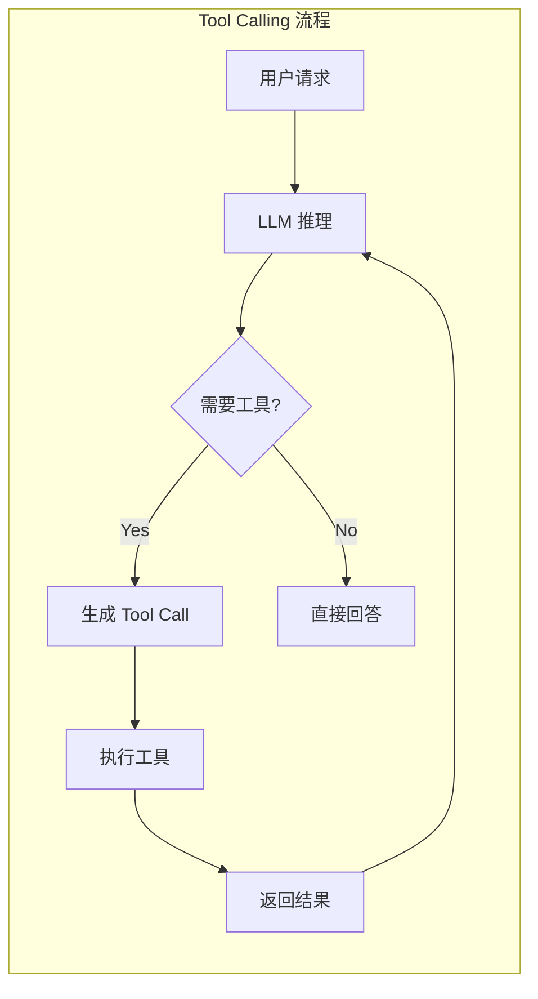

> [!warning] 生产安全提示 · Production Safety
> 本文档含可执行命令/操作步骤。执行前请核对风险等级（🟢低/🔶中/🔴高），高危命令必须 dry-run 并确认回滚方案。完整策略见 [生产安全策略](治理/Production_Safety_Policy.md)。
<!-- op-safety-banner v1 -->
# Tool Calling 最佳实践

> 中文简称：Tool Calling 最佳实践

> **一句话理解**: Tool Calling 就是让 AI 从"只会说话"变成"能动手做事"——通过函数调用连接 LLM 的语言理解能力和外部工具的执行能力。

---

## TL;DR

- **Tool Calling = LLM 输出结构化的函数调用请求**: 模型决定调用什么工具、传什么参数
- **三种范式**: OpenAI Function Calling / Anthropic Tool Use / MCP (Model Context Protocol)
- **关键设计**: 工具描述清晰、参数校验严格、错误处理完善、结果格式统一
- **生产要点**: 超时控制、重试策略、权限隔离、日志审计、成本监控
- **安全原则**: 最小权限、输入过滤、沙箱执行、人类确认高风险操作



---

## 1. 工具定义原则

### 1.1 描述要精确

```json
// 好的工具描述
{
  "name": "search_database",
  "description": "Search the product database by name or category. Returns up to 10 matching products with price and availability.",
  "parameters": {
    "type": "object",
    "properties": {
      "query": {
        "type": "string",
        "description": "Search query - product name or category"
      },
      "max_results": {
        "type": "integer",
        "description": "Maximum number of results to return",
        "default": 10,
        "minimum": 1,
        "maximum": 50
      },
      "in_stock_only": {
        "type": "boolean",
        "description": "If true, only return products currently in stock",
        "default": false
      }
    },
    "required": ["query"]
  }
}
```

```json
// 差的工具描述
{
  "name": "search",
  "description": "Search things",
  "parameters": {
    "type": "object",
    "properties": {
      "q": { "type": "string" }
    }
  }
}
```

### 1.2 工具设计六原则

```
1. 单一职责: 一个工具只做一件事
   ✗ search_and_buy(query) → 搜索+下单混在一起
   ✓ search(query) + place_order(product_id)

2. 参数约束: 用 enum、min/max、pattern 限制输入
   ✓ status: { "enum": ["pending", "active", "closed"] }

3. 返回结构: 统一 JSON Schema，包含 success/error/data
   ✓ { "success": true, "data": {...}, "message": "Found 3 results" }

4. 幂等性: 同一调用多次执行结果一致
   ✓ create_order(idempotency_key, ...) → 重复调用不会创建多个订单

5. 描述详细: description 里说明返回什么、可能出错什么
   ✓ "Returns null if the user doesn't exist"

6. 粒度适中: 太细碎增加调用次数，太粗糙难以组合
   ✓ get_user_profile(user_id) 而不是 get_user_name + get_user_email
```

---

## 2. 执行引擎设计

### 2.1 安全的工具执行器

```python
import asyncio
from typing import Any, Dict
from pydantic import BaseModel, ValidationError

class ToolResult(BaseModel):
    success: bool
    data: Any = None
    error: str | None = None
    duration_ms: float = 0

class ToolExecutor:
    def __init__(self, tools: dict, timeout: float = 30.0):
        self.tools = tools
        self.timeout = timeout
    
    async def execute(self, tool_name: str, arguments: dict) -> ToolResult:
        # 1. 验证工具存在
        if tool_name not in self.tools:
            return ToolResult(success=False, error=f"Unknown tool: {tool_name}")
        
        tool = self.tools[tool_name]
        
        # 2. 验证参数
        try:
            validated_args = tool.validate_params(arguments)
        except ValidationError as e:
            return ToolResult(success=False, error=f"Invalid parameters: {e}")
        
        # 3. 带超时执行
        try:
            start = time.monotonic()
            result = await asyncio.wait_for(
                tool.execute(**validated_args),
                timeout=self.timeout
            )
            duration = (time.monotonic() - start) * 1000
            return ToolResult(success=True, data=result, duration_ms=duration)
        
        except asyncio.TimeoutError:
            return ToolResult(success=False, error=f"Tool {tool_name} timed out after {self.timeout}s")
        except Exception as e:
            return ToolResult(success=False, error=f"Execution error: {str(e)}")
```

### 2.2 多轮 Tool Calling 循环

```python
async def agent_loop(llm, executor, user_message, max_iterations=10):
    messages = [{"role": "user", "content": user_message}]
    
    for i in range(max_iterations):
        response = await llm.chat(messages, tools=tool_schemas)
        
        # 检查是否有 tool calls
        if not response.tool_calls:
            return response.content  # 最终回答
        
        # 执行所有 tool calls
        for tool_call in response.tool_calls:
            result = await executor.execute(
                tool_call.name,
                tool_call.arguments
            )
            
            # 将结果添加到对话
            messages.append({
                "role": "tool",
                "tool_call_id": tool_call.id,
                "content": json.dumps(result.model_dump())
            })
    
    return "Reached maximum iterations without final answer"
```

---

## 3. 错误处理策略

### 3.1 错误分级

```
Level 1 - 参数错误: 让 LLM 修正参数重试
  → "Parameter 'user_id' must be a valid UUID format"

Level 2 - 临时故障: 自动重试 + 指数退避
  → "Database connection timeout, retrying in 2s..."

Level 3 - 权限不足: 请求人类授权
  → "This operation requires admin approval. Proceed?"

Level 4 - 不可恢复: 优雅降级 + 告知用户
  → "I couldn't access the payment system. Please try again later."
```

### 3.2 重试机制

```python
async def execute_with_retry(executor, tool_name, args, max_retries=3):
    for attempt in range(max_retries):
        result = await executor.execute(tool_name, args)
        
        if result.success:
            return result
        
        # 只对可重试错误进行重试
        if not is_retryable(result.error):
            return result
        
        # 指数退避
        wait = 2 ** attempt + random.uniform(0, 1)
        await asyncio.sleep(wait)
    
    return ToolResult(success=False, error=f"Failed after {max_retries} attempts")

def is_retryable(error: str) -> bool:
    retryable_patterns = ["timeout", "rate_limit", "temporary", "503", "429"]
    return any(p in error.lower() for p in retryable_patterns)
```

---

## 4. 安全最佳实践

### 4.1 最小权限原则

```python
# 每个 Agent 只授予必要的工具权限
AGENT_PERMISSIONS = {
    "customer_service": {
        "allowed工具": ["search_faq", "get_order_status", "create_ticket"],
        "denied工具": ["delete_user", "refund_payment", "admin_panel"]
    },
    "data_analyst": {
        "allowed工具": ["query_database", "generate_report", "export_csv"],
        "denied工具": ["drop_table", "delete_records"]
    }
}

class PermissionGuard:
    def __init__(self, agent_role: str):
        self.allowed = AGENT_PERMISSIONS[agent_role]["allowed工具"]
    
    def check(self, tool_name: str) -> bool:
        if tool_name not in self.allowed:
            logger.warning(f"Permission denied: {tool_name} for {self.agent_role}")
            return False
        return True
```

### 4.2 输入过滤

```python
# 防止 Prompt Injection 通过工具参数注入
DANGEROUS_PATTERNS = [
    r";\s*(rm|del|drop|truncate)",    # SQL/Shell 注入  # ⚠️ HIGH-RISK — 清空表数据，不可逆 [回滚：见文档/备份]
    r"\$\{.*\}",                       # 模板注入
    r"<script>",                       # XSS
    r"\.\.\/",                         # 路径遍历
]

def sanitize_arguments(args: dict) -> dict:
    sanitized = {}
    for key, value in args.items():
        if isinstance(value, str):
            for pattern in DANGEROUS_PATTERNS:
                if re.search(pattern, value):
                    raise SecurityError(f"Suspicious input in '{key}': {value[:50]}")
            sanitized[key] = value
        else:
            sanitized[key] = value
    return sanitized
```

### 4.3 高风险操作确认

```python
HIGH_RISK_TOOLS = {"delete_*", "payment_*", "send_email", "deploy_*"}

async def human_confirmation(tool_name: str, args: dict) -> bool:
    """高风险操作需要人类确认"""
    if any(re.match(pattern, tool_name) for pattern in HIGH_RISK_TOOLS):
        confirmation = await prompt_user(
            f"Agent wants to execute: {tool_name}\n"
            f"Arguments: {json.dumps(args, indent=2)}\n"
            f"Approve? (yes/no)"
        )
        return confirmation.lower() == "yes"
    return True
```

---

## 5. 监控与可观测性

### 5.1 关键指标

```python
@dataclass
class ToolCallMetrics:
    tool_name: str
    success: bool
    duration_ms: float
    retry_count: int
    token_cost: int        # LLM 调用 token 消耗
    error_type: str | None

# 监控面板
DASHBOARD_METRICS = {
    "tool_call_success_rate": "各工具成功率",
    "tool_call_latency_p50_p99": "延迟分布",
    "tool_call_frequency": "调用频次（检测异常）",
    "avg_tool_calls_per_query": "每次查询平均调用数",
    "error_distribution": "错误类型分布",
    "cost_per_tool": "每个工具的平均 token 成本"
}
```

---

## 6. MCP 协议集成

### 6.1 MCP Server 实现

```python
# Model Context Protocol - 标准化的工具暴露协议
from mcp.server import Server
from mcp.types import Tool, TextContent

server = Server("my-agent-tools")

@server.tool("get_weather")
async def get_weather(location: str, unit: str = "celsius") -> list[TextContent]:
    """Get current weather for a location."""
    data = await weather_api.fetch(location)
    temp = data.temp if unit == "celsius" else data.temp * 9/5 + 32
    return [TextContent(type="text", text=f"Weather in {location}: {temp}°{unit[0].upper()}")]

@server.tool("search_products")
async def search_products(query: str, limit: int = 10) -> list[TextContent]:
    """Search the product catalog."""
    results = await product_db.search(query, limit=limit)
    return [TextContent(type="text", text=json.dumps([r.to_dict() for r in results]))]
```

---

## 7. Function Call 与 Tool Call 辨析

> **一句话理解**: tool 是"接口"，function 是"其中一种实现"——一切 function 都是 tool，但 tool 不一定是 function。

### 7.1 术语来源

`function_call` 与 `tool_call` 是 Agent 事件流中最容易混淆的一对概念，区别源于各家厂商 API 的命名习惯：

| 术语 | 出处 | 语境 |
|------|------|------|
| **`function_call`** | OpenAI 2023 年 6 月推出的 **Function Calling** API | Chat Completions 中 `tool_calls[].type = "function"` |
| **`tool_call`** | Anthropic **Tool Use**，以及 OpenAI 后来的 Responses/Agents SDK | 更中立的"工具"表述，覆盖所有工具类型 |

不同厂商叫法不同，但语义等价：

| 厂商/协议 | 声明调用 | 返回结果 |
|-----------|---------|---------|
| OpenAI（旧 Chat Completions） | `tool_calls[].type = "function"` | `role: "tool"` 消息 |
| OpenAI（新 Responses API） | `function_call` 事件 | `function_call_output` 事件 |
| Anthropic | `tool_use` 块 | `tool_result` 块 |
| Google Gemini | `functionCall` 消息 | `functionResponse` 消息 |

---

### 7.2 语义范围（核心区别）

```
tool（工具）── 泛指模型可调用的任何外部能力
├── function（函数）── 纯代码逻辑、本地定义的确定性函数
├── API / HTTP 调用
├── MCP 工具（连接外部服务）
├── 代码解释器 / 沙箱执行
├── 检索器 / 数据库查询
└── 浏览器操作、文件系统操作等
```

- **`function_call`**: 特指"调用一个定义好的函数"，强调**代码侧、确定性逻辑**，输入输出都是结构化 JSON
- **`tool_call`**: 泛指"调用一个工具"，除了函数，还包括外部服务、MCP server、环境交互等。**一切 function 都是 tool，但 tool 不一定是 function**

---

### 7.3 事件流中的定位

在 Agent 会话事件流中，`function_call` / `function_call_output` 与 `tool_call` / `tool_call_output` 可能同时出现，对应调用链路的两个视角：

```
模型决定用工具 → tool_call（发起） → 执行器运行 → tool_call_output（返回结果） → 模型继续推理
                └── 若执行的是纯函数，则表现为 function_call → function_call_output
```

- `function_call` → 通常指模型**声明**要调用某个函数的意图（LLM 输出侧的决策）
- `function_call_output` → 对应函数的**返回结果**
- `tool_call` → 工具的实际调用与执行
- `tool_call_output` → 工具执行后的输出

---

### 7.4 实际使用建议

- 如果 Agent 只调用**本地定义的代码函数**（如计算、解析、格式化），用 `function_call` 表述即可
- 如果 Agent 会调用 **MCP server、外部 API、浏览器、代码执行沙箱**等，统一用 `tool_call` 更准确
- 很多框架（如 OpenAI Agents SDK、LangGraph）在事件流里会同时保留两者：`function_call` 是协议层的事件名，`tool_call` 是概念层/执行层的事件名，实际指代同一件事的两个视角

---

## 相关阅读

- [[15_智能体/05_Agent技能/Agent_Skills_Practical_Guide]] — Agent Skills 实战
- [[15_智能体/02_Agent框架/SmolAgents_Practical_Guide]] — SmolAgents 实战
- [[06_强化学习/AI_Agents/MCP_Implementation_Guide]] — MCP 实现指南
- [[概念/Agent/agent-protocols]] — Agent 协议对比
- [[15_智能体/03_Agent工作流/02_Agentic_工作流_设计_模式_2026]] — Agent 工作流设计模式
