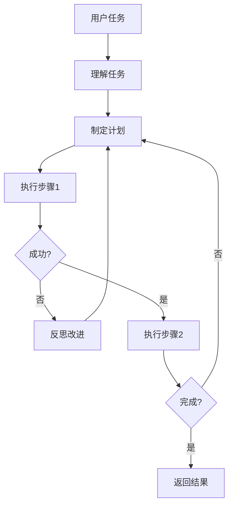

# 13 Agent 生产部署 — 小白版 🤖

> **一句话秒懂**: Agent 就是能"自主行动"的 AI——不只是回答问题，还能规划任务、使用工具、记忆信息、和其他 Agent 协作，就像一个能干的员工，能帮你完成复杂的工作！

## 为什么要学 Agent？

想象一下：
- 💼 以前：你让 AI 做一件事，它只能做一步
- 💼 现在：AI 能自主规划多步，还能调用各种工具
- 🚀 以前：AI 只能回答问题
- 🚀 现在：AI 能帮你完成任务

**Agent = 有脑子 + 有手脚 + 有记忆的 AI**

## Agent vs 普通 AI

```
【普通 AI = 只会说话的书】
你问："帮我写一篇作文"
AI 答："好的，这是作文..." ✓
AI 做不了别的

【Agent = 能干的助理】
你让："帮我发布一篇文章到公众号"
Agent:
1. 写文章 ✓
2. 配图 ✓
3. 登录公众号后台 ✓
4. 发布 ✓
5. 告诉你发布成功 ✓
```

## Agent 的核心能力

```
┌─────────────────────────────────────────────────────────┐
│                  Agent 五大核心能力                        │
├─────────────────────────────────────────────────────────┤
│                                                         │
│  🧠 规划 ─── 分解任务，制定步骤                          │
│     "写文章" → 1.写内容 2.配图 3.发布                  │
│                                                         │
│  🔧 工具 ─── 调用外部工具/API                           │
│     搜索、计算、发送邮件、操作数据库                     │
│                                                         │
│  📝 记忆 ─── 记住之前的对话和信息                       │
│     用户偏好、历史经验                                   │
│                                                         │
│  🔄 反思 ─── 检查自己的行为，改进                        │
│     做错了就调整                                       │
│                                                         │
│  👥 协作 ─── 和其他 Agent 配合                          │
│     多个 Agent 分工合作                                 │
│                                                         │
└─────────────────────────────────────────────────────────┘
```

## Agent 工作流程



## ReAct 框架

```
【ReAct = Reasoning + Acting】

思考 → 行动 → 观察 → 思考 → ...

例子: "帮我查北京明天天气"

1. Thought: 我需要先查天气
2. Action: 调用天气 API
3. Observation: 明天晴天，20-28度
4. Thought: 天气不错，我可以推荐户外活动
5. Action: 搜索北京户外活动
6. Observation: 故宫、颐和园推荐
7. Response: "明天晴天20-28度，推荐去故宫或颐和园"
```

## 工具调用

```
【Agent 能用的工具】

🔍 搜索 ─── Google、百度
🧮 计算 ─── Python 代码执行
📧 邮件 ─── 发送/读取邮件
📊 数据 ─── 查询数据库
💻 代码 ─── 运行代码
🌐 网页 ─── 获取网页内容

Agent 决定:
- 什么任务需要什么工具
- 怎么调用工具
- 如何处理结果
```

## 记忆系统

```
【三层记忆架构】

工作记忆 ─── 当前任务
            "我现在在写代码"

短期记忆 ─── 对话历史
            "用户刚才说要翻译"

长期记忆 ─── 持久存储
            "用户叫小明，喜欢简洁回答"

检索:
用户问 → 查短期记忆 → 查长期记忆 → 综合回答
```

## Multi-Agent 协作

```
【单个 Agent】
一个人干所有活
→ 什么都做，但什么都不精

【多个 Agent 协作】
专业分工，团队合作

例如: 开发网站

Manager Agent ─── 分配任务
    │
    ├── Coder Agent ─── 写代码
    ├── Tester Agent ─── 写测试
    └── Reviewer Agent ─── 检查代码

→ 效率更高，质量更好
```

## 主流框架

| 框架 | 特点 | 适用场景 |
|------|------|---------|
| LangGraph | 可视化工作流 | 复杂多步骤任务 |
| AutoGen | 多 Agent 协作 | 对话和协作场景 |
| CrewAI | 角色扮演 Agent | 团队协作场景 |
| LlamaIndex | 数据连接 | RAG + Agent |

## 下一步

- 想深入技术？→ 查看子目录具体文档
- 想学 Agent 评估？→ [Agent_Evaluation/README_for_dummy.md](./Agent_Evaluation/README_for_dummy.md)
- 想学 RAG？→ [14_RAG系统/README_for_dummy.md](../14_RAG系统/README_for_dummy.md)

---

*本文是 [README.md](README.md) 的简化版，适合零基础读者。*

## Related

- [[15_智能体/07_Agent_Evaluation/Agent_Harness_Complete_2026.md|Agent_Harness_Complete_2026]]
- [[15_智能体/07_Agent_Evaluation/Agent_Red_Teaming_2026.md|Agent_Red_Teaming_2026]]
- [[15_智能体/07_Agent_Evaluation/Assessment/Evaluation_Workflow.md|Evaluation_Workflow]]
- [[15_智能体/07_Agent_Evaluation/Assessment/Production_Assessment.md|Production_Assessment]]
- [[15_智能体/07_Agent_Evaluation/Benchmarking/Benchmarking_Criteria.md|Benchmarking_Criteria]]

## 附录：核心概念速查

| 概念 | 说明 | 应用场景 |
|------|------|----------|
| Agent Loop | 感知-思考-行动循环 | 核心执行流程 |
| Tool Use | 调用外部工具/API | 扩展能力 |
| Memory | 短期/长期记忆 | 上下文维护 |
| Planning | 任务分解与排序 | 复杂任务 |
| Reflection | 自我评估改进 | 质量提升 |
| Multi-Agent | 多Agent协作 | 分布式任务 |

## 附录：技术栈对比

| 框架/工具 | 特点 | 适用场景 | 成熟度 |
|----------|------|----------|--------|
| LangChain | 链式调用 | 通用Agent | ★★★★☆ |
| LangGraph | 图结构编排 | 复杂流程 | ★★★★☆ |
| AutoGen | 多Agent对话 | 协作任务 | ★★★★☆ |
| CrewAI | 角色分工 | 团队模拟 | ★★★☆☆ |
| OpenAI SDK | 官方框架 | 快速原型 | ★★★★☆ |
| Semantic Kernel | 企业级 | .NET/Java | ★★★★☆ |

## 附录：学习路径

| 阶段 | 推荐内容 | 目标 |
|------|----------|------|
| 入门 | 基础概念文档 | 理解Agent |
| 进阶 | 本文档深度内容 | 掌握技术 |
| 实践 | 动手项目 | 构建应用 |
| 前沿 | 最新论文/产品 | 跟踪发展 |

## 附录：常见问题

| 问题 | 解答 |
|------|------|
| Agent和Chatbot的区别？ | Agent能自主决策+使用工具+持续执行 |
| 需要什么前置知识？ | LLM基础+编程+系统设计 |
| 如何评估Agent？ | 任务完成率+效率+安全性 |
| 2026年趋势？ | 多Agent协作/企业级/具身智能 |

## 附录：术语表

| 术语 | 英文 | 说明 |
|------|------|------|
| 智能体 | Agent | 自主决策AI系统 |
| 工具调用 | Tool Use | 使用外部工具 |
| 记忆 | Memory | 上下文/历史 |
| 规划 | Planning | 任务分解 |
| 反思 | Reflection | 自我评估 |
| 编排 | Orchestration | 流程管理 |
| 协议 | Protocol | 通信标准 |
| 护栏 | Guardrails | 安全约束 |

## 附录：检查清单

| 检查项 | 说明 | 状态 |
|--------|------|------|
| 理解核心概念 | Agent架构 | ☐ |
| 掌握工具调用 | MCP/Function Calling | ☐ |
| 了解记忆机制 | 短期/长期 | ☐ |
| 理解规划推理 | CoT/ReAct | ☐ |
| 动手实践 | 构建Agent | ☐ |
| 了解评估方法 | 质量度量 | ☐ |

> 💡 智能体是AI从"对话"走向"行动"的关键跨越。掌握Agent开发，是2026年AI工程师的核心竞争力。

---
*Last updated: 2026-07-21*
