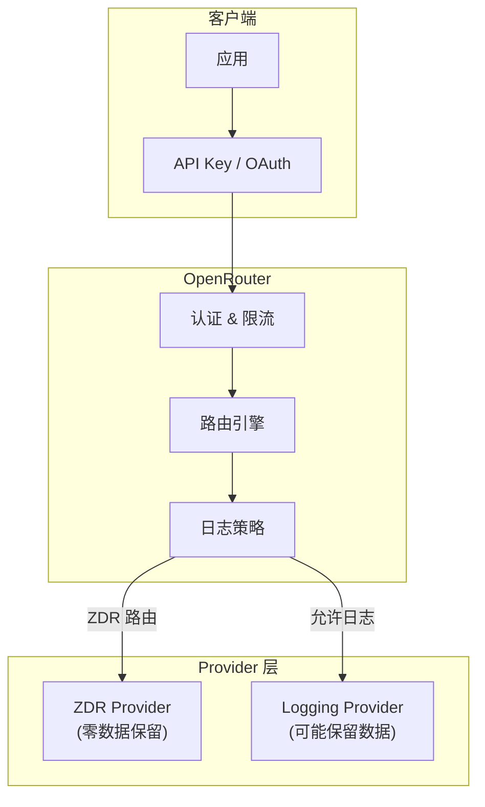

title: 安全、隐私与数据治理
description: '# 安全、隐私与数据治理'
category: ai-coding
tags:
- ai
- coding
- copilot
- code-generation
last_updated: 2026-05
difficulty: intermediate
reading_level: intermediate
audience:
- 开发工程师
- AI 工程师
estimated_read_time: 5min
intent_queries:
- 安全、隐私与数据治理 是什么
- 如何 安全、隐私与数据治理
trigger_keywords:
- 安全
- 隐私与数据治理
- ai
- coding
authors:
- name: KUDIG Team
 role: contributor
k8s_versions:
- '1.28'
- '1.29'
- '1.30'
- '1.31'
- '1.32'
---
# 安全、隐私与数据治理

> **文档类型**: 安全指南 | **最后更新**: 2026-03 | **关键词**: OpenRouter, Security, Privacy, Data Collection, Zero Data Retention, ZDR, EU Residency, BYOK, API Key, OAuth PKCE

---

## 概述

本文覆盖 OpenRouter 的安全架构与数据治理体系：包括三种认证方式、API Key 安全实践、数据收集策略（Opt-in 日志 + 1% 折扣）、Zero Data Retention (ZDR)、EU Data Residency、BYOK（Bring Your Own Key）、Provisioning Keys 以及开发/生产/企业三阶段安全检查清单。

---

## 1. 安全架构概览



---

## 2. 认证方式

OpenRouter 支持三种认证方式：

| 方式 | 用途 | 格式 |
|------|------|------|
| **API Key (Bearer)** | API 访问（最常用） | `Authorization: Bearer sk-or-v1-xxx` |
| **Cookie** | Web 界面 / Chatroom | 浏览器 Session |
| **Management API Key** | 程序化管理 API Key | Provisioning Key |

### 2.1 API Key 安全实践

| 实践 | 说明 |
|------|------|
| **环境变量** | 永远不要硬编码 API Key，使用 `.env` |
| **Credit Limit** | 为每个 Key 设置额度上限 |
| **Limit Reset** | 设置周期重置（daily/weekly/monthly） |
| **最小权限** | 每个应用/环境使用独立 Key |
| **定期轮转** | 定期更换 API Key |
| **监控用量** | 通过 `/api/v1/key` 端点实时监控 |

---

## 3. 数据收集策略

### 3.1 OpenRouter 日志策略

| 数据类型 | 默认行为 | 说明 |
|---------|---------|------|
| **请求元数据** | 记录 | 时间戳、模型、token 数 |
| **Prompt 内容** | **不记录** | 默认零日志 |
| **Completion 内容** | **不记录** | 默认零日志 |
| **Chatroom 对话** | 本地存储 | 存储在用户浏览器，不同步 |

### 3.2 Opt-in 日志

用户可选择性开启 Prompt/Completion 日志，换取 **1% 用量折扣**：

- 在 Settings 中开启 "Log prompts and completions"
- 即使出现错误也不记录（除非主动开启）

### 3.3 Provider 级数据收集控制

```json
{
  "provider": {
    "data_collection": "deny"
  }
}
```

| 值 | 行为 |
|----|------|
| `"allow"` | 允许使用可能记录数据的 Provider（默认） |
| `"deny"` | 仅使用已确认不记录/不训练的 Provider |

> 设置 `data_collection: "deny"` 后，隐私策略不明确的 Provider 会被排除。

---

## 4. Zero Data Retention (ZDR)

### 4.1 启用 ZDR

```json
{
  "provider": {
    "zdr": true
  }
}
```

ZDR 确保请求仅路由到 **零数据保留** 的 Provider 端点——这些 Provider 承诺不存储、不保留、不用于训练任何请求数据。

### 4.2 ZDR vs data_collection

| 策略 | 严格程度 | 说明 |
|------|:--------:|------|
| `data_collection: "deny"` | 中 | 排除可能记录的 Provider |
| `zdr: true` | 高 | 仅使用明确承诺零保留的端点 |

---

## 5. EU Data Residency

### 5.1 企业级 EU 路由

OpenRouter 为企业客户提供 EU 区域内路由，确保 Prompt 和 Completion 完全在 EU 内处理。

> 需要 EU 合规路由，请联系 OpenRouter 企业团队。

### 5.2 enforce_distillable_text

```json
{
  "provider": {
    "enforce_distillable_text": true
  }
}
```

仅路由到允许文本蒸馏（distillation）的模型——某些 Provider 明确禁止将输出用于训练其他模型。

---

## 6. BYOK（Bring Your Own Key）

### 6.1 概述

BYOK 允许你使用自己的 Provider API Key 通过 OpenRouter 路由请求：

| 维度 | 说明 |
|------|------|
| **免费额度** | 首 100 万次 BYOK 请求/月免费 |
| **超额费用** | 之后按等价 OpenRouter 价格的 5% 收费 |
| **计费方式** | 从 OpenRouter Credits 扣减 |
| **独立 Rate Limit** | 直接与 Provider 协商，不受 OpenRouter 限制 |

### 6.2 BYOK 用量追踪

```json
// /api/v1/key 响应中包含 BYOK 用量
{
  "data": {
    "byok_usage": 15.5,
    "byok_usage_daily": 2.3,
    "byok_usage_weekly": 8.1,
    "byok_usage_monthly": 15.5,
    "include_byok_in_limit": false
  }
}
```

### 6.3 BYOK 与 Credit Limit 的交互

```json
{
  "include_byok_in_limit": true  // BYOK 用量也计入 Key 额度限制
}
```

---

## 7. API Key 管理

### 7.1 Key 属性

| 属性 | 说明 |
|------|------|
| `label` | 描述标签 |
| `limit` | 额度上限（美元），null=无限 |
| `limit_reset` | 重置周期（null=不重置） |
| `limit_remaining` | 剩余额度 |
| `is_free_tier` | 是否从未购买过 Credits |

### 7.2 Provisioning Keys

用于程序化创建和管理 API Key（企业场景）。通过 Management API 端点操作：

```bash
# 创建新 Key
POST /api/v1/keys

# 列出所有 Key
GET /api/v1/keys

# 更新 Key
PATCH /api/v1/keys/{key_id}

# 删除 Key
DELETE /api/v1/keys/{key_id}
```

---

## 8. 安全检查清单

### 8.1 开发阶段

| 检查项 | 说明 |
|--------|------|
| API Key 使用环境变量 | 不硬编码在源代码中 |
| `.env` 文件已加入 `.gitignore` | 防止泄露 |
| 开发环境使用独立 Key | 与生产隔离 |
| 设置低额度限制 | 防止开发期间意外消耗 |

### 8.2 生产阶段

| 检查项 | 说明 |
|--------|------|
| 每个服务使用独立 Key | 最小权限原则 |
| 设置合理 Credit Limit | 防止异常消费 |
| 启用 Limit Reset | 定期重置额度 |
| 配置 `data_collection` | 根据合规要求设置 |
| 评估 ZDR 需求 | 敏感数据场景必须启用 |
| 配置 `user` 参数 | 传递终端用户标识用于滥用检测 |
| 监控用量告警 | 设置 Credits 消耗阈值通知 |

### 8.3 企业合规

| 检查项 | 说明 |
|--------|------|
| EU Data Residency | GDPR 合规场景 |
| `enforce_distillable_text` | 防止输出用于训练 |
| Provisioning Keys | 程序化 Key 管理 |
| BYOK 审计 | 追踪自有 Key 用量 |
| Opt-in 日志策略 | 明确是否开启日志 |

---

## 9. 安全事件响应

| 场景 | 处理方式 |
|------|---------|
| **API Key 泄露** | 立即在 Dashboard 删除该 Key，创建新 Key |
| **异常消费** | 检查 Activity 页面，降低 Credit Limit |
| **402 错误** | 余额不足，充值或检查是否被恶意消费 |
| **数据合规事件** | 检查 `data_collection` / `zdr` 配置是否正确 |

---

## 关联文档

| 文档 | 关系 |
|------|------|
| [04 - 智能路由](./04-openrouter-provider-routing.md) | ZDR 与 data_collection 路由参数 |
| [08 - Prompt Caching](./08-openrouter-prompt-caching-[[concepts/model-training|optimization]].md) | BYOK 与成本控制 |
| [12 - 企业级实践](./12-openrouter-enterprise-advanced.md) | Provisioning Keys 与 Key 管理 |
| [02 - 快速接入](./02-openrouter-quickstart-setup.md) | API Key 创建与配置 |

---

*本文档基于 OpenRouter 官方文档（openrouter.ai/docs/guides/privacy）整理。*

---

## Obsidian 相关文档

- [[17_AI_Coding/MOC_OpenRouter_OpenCode.md|MOC]]
- [[17_AI_Coding/OpenRouter_OpenCode_Guide|AI 编程与 网关专题 — OpenRouter & OpenCode 全量指南]]
- [[17_AI_Coding/02_Tools/OpenRouter/01-openrouter-overview-architecture|OpenRouter 概述与核心架构]]
- [[17_AI_Coding/02_Tools/OpenRouter/02-openrouter-quickstart-setup|快速接入与环境配置]]
- [[17_AI_Coding/02_Tools/OpenRouter/03-openrouter-models-providers|模型与 Provider 生态]]
- [[17_AI_Coding/02_Tools/OpenRouter/04-openrouter-provider-routing|智能路由与 Provider 选择]]
- [[17_AI_Coding/02_Tools/OpenRouter/05-openrouter-api-reference|API 参考与请求/响应规范]]
- [[17_AI_Coding/02_Tools/OpenRouter/06-openrouter-structured-outputs-tools|Structured Outputs 与 Tool Calling]]
- [[17_AI_Coding/02_Tools/OpenRouter/07-openrouter-plugins-web-search|插件体系与 Web Search]]
- [[17_AI_Coding/02_Tools/OpenRouter/08-openrouter-prompt-caching-optimization|Prompt Caching 与成本优化]]
- [[17_AI_Coding/02_Tools/OpenRouter/09-openrouter-frameworks-integrations|框架集成与生态系统]]
- [[17_AI_Coding/02_Tools/OpenRouter/10-openrouter-streaming-multimedia|流式传输与多模态输入]]

## Related

- [[17_AI_Coding/02_Tools/OpenCode/21-opencode-overview-architecture]] — 21-opencode-overview-architecture (共享: ai, ai-coding)
- [[17_AI_Coding/02_Tools/OpenCode/22-opencode-installation-quickstart]] — 22-opencode-installation-quickstart (共享: ai, ai-coding)
- [[17_AI_Coding/02_Tools/OpenCode/23-opencode-providers-models]] — 23-opencode-providers-models (共享: ai, ai-coding)
- [[17_AI_Coding/02_Tools/OpenCode/24-opencode-agents-system]] — 24-opencode-agents-system (共享: ai, ai-coding)
