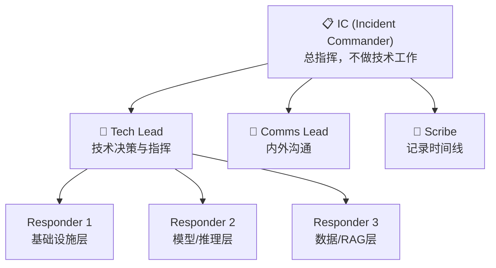
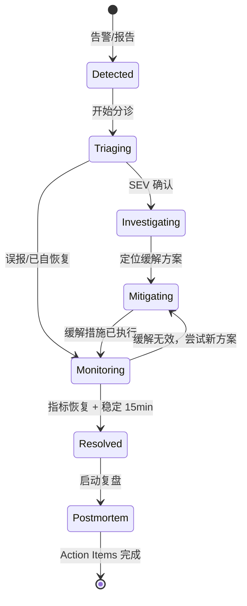

# AI 系统事故响应手册

> 🎯 **目标**：建立 AI/LLM 生产系统的事故响应体系 —— 从 Runbook 模板、War Room 流程、分诊决策树到自动化修复脚本，确保团队在高压下一致、高效地处理故障。

---

## 一、事故响应框架

### 1.1 核心原则

```
事故响应黄金法则:
═══════════════════
1. 缓解优先于根治 — 先止血，再治病
2. 沟通即响应 — 无声的事故处理比事故本身更可怕
3. 单一指挥 — 一个 IC (Incident Commander)，一个决策链
4. 记录一切 — 时间线、决策、命令，全部留痕
5. Blameless — 不追责，只追因
```

### 1.2 角色分工



| 角色 | 人数 | 职责 | 不应该做的 |
|------|------|------|-----------|
| **IC** | 1 | 全局指挥、优先级决策、资源调度 | 不亲自排查技术问题 |
| **Tech Lead** | 1 | 技术方案决策、分配排查任务 | 不写对外沟通 |
| **Comms Lead** | 1 | Status Page 更新、利益方通知 | 不参与技术排查 |
| **Scribe** | 1 | 记录时间线、截图、命令 | 不发表技术意见 |
| **Responder** | 2-4 | 按分工排查和执行修复 | 不自行决定回滚/降级 |

### 1.3 响应时间 SLA

| SEV | 首次响应 | 首次更新 | 后续更新间隔 | 升级时限 |
|-----|---------|---------|------------|---------|
| **SEV1** | 5 min | 10 min | 15 min | 15min 无缓解 → L3 |
| **SEV2** | 15 min | 30 min | 30 min | 30min 无缓解 → L3 |
| **SEV3** | 30 min | 1h | 2h | 2h 无缓解 → L2 |
| **SEV4** | 4h | 下一工作日 | 按需 | N/A |

---

## 二、分诊决策树

### 2.1 通用分诊流程

```
告警触发 / 用户报告
        │
        ▼
┌─── 是否影响用户？ ───┐
│                       │
No                      Yes
│                       │
├── 记录，降级 SEV4     ▼
│                  ┌─── 是否完全不可用？ ───┐
│                  │                         │
│                  Yes                       No
│                  │                         │
│                  ├── SEV1                  ▼
│                  │                    ┌─── SLO 是否违规中？ ───┐
│                  │                    │                         │
│                  │                    Yes                       No
│                  │                    │                         │
│                  │                    ├── SEV2                  ├── SEV3
│                  │                    │                         │
│                  ▼                    ▼                         ▼
│              立即 War Room        启动标准流程               排入工单
```

### 2.2 AI 系统专属分诊检查

```markdown
## AI 事故分诊快速检查（2 分钟完成）

### 基础设施层
- [ ] 推理服务是否可达？ → curl /health
- [ ] GPU 集群是否正常？ → nvidia-smi / GPU 利用率
- [ ] 网络是否正常？ → 排查 LB / DNS / CDN

### 模型层
- [ ] 是否有模型部署变更？ → git log / deploy history
- [ ] 模型是否响应？ → 发送测试 Prompt
- [ ] 输出质量是否正常？ → 抽样检查 5 个请求

### 数据层
- [ ] RAG 索引是否最新？ → 检查索引时间戳
- [ ] 向量数据库是否可达？ → 健康检查
- [ ] Embedding 服务是否正常？ → 测试请求

### 依赖层
- [ ] 上游 LLM API 是否正常？ → 供应商 Status Page
- [ ] Token 配额是否耗尽？ → 检查余额/限流状态
- [ ] 缓存是否正常？ → 缓存命中率检查
```

---

## 三、Runbook 模板库

### 3.1 通用 Runbook 结构

```markdown
# [RUNBOOK] 故障场景名称

## 概述
- **触发条件**: 哪个告警触发
- **影响范围**: 影响什么服务/用户
- **严重级别**: SEV1/2/3
- **预估恢复时间**: 典型 MTTR

## 快速缓解（5 分钟内）
1. 第一步操作
2. 第二步操作
3. 验证缓解

## 深度排查
### 检查 1: [检查项名称]
```bash
# 执行命令
<command>
```
- 正常结果: ...
- 异常处理: ...

### 检查 2: ...

## 修复方案
### 方案 A: [首选]
步骤 + 命令

### 方案 B: [备选]
步骤 + 命令

## 回滚方案
如果修复失败的回滚步骤

## 验证
修复后的验证检查清单

## 升级
如果无法在 X 分钟内解决，联系谁
```

### 3.2 Runbook: LLM 推理超时

```markdown
# [RUNBOOK] LLM 推理超时 / TTFT 飙升

## 概述
- 触发: ttft_p95 > SLO 持续 5 分钟
- 影响: 用户等待时间过长，部分请求超时
- 级别: SEV2（若完全不可用则 SEV1）
- 预估 MTTR: 15-30 分钟

## 快速缓解（5 分钟内）
1. 确认影响范围:
```bash
# 检查当前 TTFT 分布
curl -s 'http://grafana/api/datasources/proxy/1/api/v1/query' \
  --data-urlencode 'query=histogram_quantile(0.95, sum(rate(llm_ttft_seconds_bucket[5m])) by (le))'
```

2. 如果单集群异常，切流到备用集群:
```bash
# 将集群 A 流量切到集群 B
ansible-playbook switch_traffic.yml \
  -e "from=cluster-a" \
  -e "to=cluster-b" \
  -e "reason=ttft-spike-$(date +%Y%m%d%H%M)"
```

3. 如果无备用集群，启用降级（切换到更快的小模型）:
```bash
# 降级到小模型
kubectl patch deployment llm-gateway \
  -p '{"spec":{"template":{"spec":{"containers":[{"name":"gateway","env":[{"name":"MODEL_OVERRIDE","value":"fast-model"}]}]}}}}'
```

## 深度排查

### 检查 1: GPU 利用率
```bash
# 检查各 GPU 利用率
kubectl top nodes -l role=llm-inference
nvidia-smi --query-gpu=utilization.gpu,memory.used,memory.total --format=csv
```
- 正常: GPU Util 50-80%, Memory < 90%
- 异常（100%）: 资源饱和 → 扩容或分流

### 检查 2: 是否有 Batch 任务抢占
```bash
# 检查推理集群上的非推理任务
kubectl get pods -n inference -o wide | grep -v llm-serving
```
- 正常: 只有 llm-serving 相关 Pod
- 异常: 有训练/评估任务 → 驱逐

### 检查 3: Batch Size / 并发配置
```bash
# 检查推理引擎配置
kubectl exec -it llm-serving-0 -- cat /etc/llm/config.json | jq '.max_batch_size, .max_concurrent_requests'
```
- 近期变更? → 回滚配置

### 检查 4: 上游供应商
```bash
# 如果使用外部 API
curl -s https://status.openai.com/api/v2/status.json | jq '.status'
curl -s https://status.anthropic.com | grep -i incident
```

## 修复方案

### 方案 A: 扩容推理集群
```bash
# 水平扩容
kubectl scale deployment llm-serving --replicas=8 -n inference
```

### 方案 B: 驱逐非推理任务
```bash
# 驱逐 Batch 任务
kubectl delete job batch-training-xxx -n inference
```

### 方案 C: 降级到轻量模型
```bash
# 紧急降级
./scripts/model-fallback.sh fast-model
```

## 验证
- [ ] TTFT P95 < SLO
- [ ] 错误率 < 0.1%
- [ ] 持续观察 15 分钟稳定

## 升级
- 15 分钟未缓解 → 联系 ML Platform Lead (@ml-lead)
- 30 分钟未缓解 → 启动 SEV1 流程 → VP 通知
```

### 3.3 Runbook: 模型输出质量退化

```markdown
# [RUNBOOK] 模型输出质量退化 / 幻觉率飙升

## 概述
- 触发: 幻觉率 > 8% 或用户投诉激增
- 影响: 输出错误/幻觉内容流入生产
- 级别: SEV2（若有安全影响则 SEV1）
- 预估 MTTR: 30-60 分钟

## 快速缓解（5 分钟内）
1. 确认退化范围:
```bash
# 运行质量评估抽样
python scripts/quality_spot_check.py --sample-size 20 --model current
```

2. 检查是否与模型变更相关:
```bash
# 检查最近部署
kubectl rollout history deployment/llm-serving --revision=0 | head -5
```

3. 如有近期部署 → 立即回滚:
```bash
kubectl rollout undo deployment/llm-serving --to-revision=N-1
```

## 深度排查

### 检查 1: Prompt 版本
```bash
git log --oneline -5 -- prompts/
```
- Prompt 变更可能导致输出变化

### 检查 2: RAG 知识库新鲜度
```bash
# 检查索引最后更新时间
curl -s http://vector-db:9200/_cat/indices?v | grep rag-index
```
- 过期索引 → 知识不准确 → 幻觉

### 检查 3: 输入分布变化
```bash
# 检查最近请求 Topic 分布
python scripts/analyze_input_distribution.py --hours 24
```

### 检查 4: Temperature / 参数漂移
```bash
# 检查当前推理参数
curl -s http://llm-gateway:8080/config | jq '.generation_params'
```

## 修复方案
### 方案 A: 回滚模型版本（最常见）
### 方案 B: 修正 Prompt + 参数
### 方案 C: 更新 RAG 索引
### 方案 D: 添加输出过滤层（临时）

## 验证
- [ ] 幻觉率回到基线（< 5%）
- [ ] 抽样 20 条输出，人工确认质量
- [ ] 自动化评估通过
```

### 3.4 Runbook: Token 成本突增

```markdown
# [RUNBOOK] Token 成本 / API 调用突增

## 概述
- 触发: 日 Token 消耗超过预算 2x
- 影响: 成本失控
- 级别: SEV3（若影响服务则 SEV2）
- 预估 MTTR: 15 分钟

## 快速缓解
1. 确认成本来源:
```bash
# 按 Team/Endpoint 分组查看消耗
python scripts/cost_breakdown.py --hours 24 --group-by team
```

2. 定位 Top 消费者:
```bash
# 找到消耗最多 Token 的请求模式
python scripts/top_consumers.py --top 20 --hours 6
```

3. 临时措施:
```bash
# 对异常消费者限流
python scripts/rate_limit.py --team anomaly-team --limit 10000tok/h
```

## 深度排查
- 是否有循环调用？（Agent 死循环 → 无限 Token 消耗）
- 是否有超长上下文请求？（100k+ Token 单次请求）
- 是否有异常流量？（爬虫/滥用）
- 是否有模型变更导致 Token 消耗增加？

## 修复方案
- 限流异常来源
- 添加请求 Token 上限
- 启用缓存减少重复调用
- 降级到更便宜的模型处理低优先级请求
```

---

## 四、War Room 运营手册

### 4.1 War Room 启动检查

```markdown
## War Room 启动 Checklist

### 通讯准备
- [ ] 创建事故 Slack 频道: #inc-YYYY-MMDD-NNN
- [ ] 创建 Zoom/Meet 会议桥
- [ ] 邀请相关 On-Call 人员
- [ ] 通知 Stakeholders

### 角色分配
- [ ] 指定 IC (Incident Commander)
- [ ] 指定 Tech Lead
- [ ] 指定 Comms Lead
- [ ] 指定 Scribe

### 信息收集
- [ ] 确认事故开始时间
- [ ] 确认影响范围（用户百分比/功能）
- [ ] 确认当前 SEV 等级
- [ ] 确认是否有近期变更

### 第一次更新（5 分钟内）
- [ ] Status Page 更新
- [ ] Slack 频道发布事故公告
```

### 4.2 War Room 协作规范

```
沟通纪律:
═════════
1. 所有关键信息发在事故频道（不私聊）
2. 命令/操作前在频道声明："我要执行 XXX，预计影响 YYY"
3. 结果即时反馈："XXX 执行完成，结果是 YYY"
4. 不要说"可能"、"大概"—— 说具体数字和证据
5. 每个假设标注来源："根据日志 XXX，怀疑 YYY"
```

### 4.3 事故状态流转



---

## 五、自动化缓解脚本库

### 5.1 智能降级脚本

```python
#!/usr/bin/env python3
"""
emergency_fallback.py — 根据故障类型自动选择降级策略
用法: python emergency_fallback.py --reason ttft-spike
"""

import argparse
import subprocess
import json
import sys

FALLBACK_CHAINS = {
    "ttft-spike": [
        {"action": "switch_cluster", "from": "primary", "to": "secondary"},
        {"action": "reduce_max_tokens", "limit": 2048},
        {"action": "switch_model", "target": "fast-model"},
    ],
    "quality-degradation": [
        {"action": "rollback_model", "revisions": 1},
        {"action": "disable_rag", "fallback_message": "知识库暂时不可用"},
        {"action": "enable_strict_filter", "level": "high"},
    ],
    "cost-spike": [
        {"action": "enable_cache", "ttl": 3600},
        {"action": "rate_limit", "limit": "10000tok/h"},
        {"action": "switch_model", "target": "cheap-model"},
    ],
    "upstream-down": [
        {"action": "switch_provider", "from": "primary", "to": "secondary"},
        {"action": "switch_provider", "from": "secondary", "to": "tertiary"},
        {"action": "maintenance_mode", "message": "服务暂时不可用"},
    ],
}

def execute_action(action: dict, dry_run: bool = False):
    cmd = ["python", f"scripts/actions/{action['action']}.py"]
    for k, v in action.items():
        if k != "action":
            cmd.extend([f"--{k}", str(v)])
    if dry_run:
        cmd.append("--dry-run")
    result = subprocess.run(cmd, capture_output=True, text=True, timeout=30)
    return {"cmd": " ".join(cmd), "rc": result.returncode, "stdout": result.stdout[:500]}

def main():
    parser = argparse.ArgumentParser()
    parser.add_argument("--reason", required=True, choices=FALLBACK_CHAINS.keys())
    parser.add_argument("--dry-run", action="store_true")
    parser.add_argument("--step", type=int, help="执行第几步（默认全部）")
    args = parser.parse_args()

    chain = FALLBACK_CHAINS[args.reason]
    if args.step is not None:
        chain = [chain[args.step - 1]]

    for i, action in enumerate(chain, 1):
        print(f"[{i}/{len(chain)}] Executing: {action['action']}")
        result = execute_action(action, dry_run=args.dry_run)
        print(f"  RC: {result['rc']}")
        print(f"  Output: {result['stdout']}")
        if result["rc"] != 0:
            print(f"  FAILED! Stopping chain.")
            sys.exit(1)
        print(f"  OK")

    print(f"\nFallback chain complete for: {args.reason}")

if __name__ == "__main__":
    main()
```

### 5.2 快速诊断脚本

```bash
#!/usr/bin/env bash
# diagnose.sh — AI 系统一键诊断
# 用法: ./diagnose.sh [--full]

set -euo pipefail

RED='\033[0;31m'; GREEN='\033[0;32m'; YELLOW='\033[1;33m'; NC='\033[0m'

check() {
    local name="$1" cmd="$2" expected="$3"
    local result
    result=$(eval "$cmd" 2>&1) && status="OK" || status="FAIL"
    if [[ "$status" == "OK" && -n "$expected" ]]; then
        echo "$result" | grep -q "$expected" || status="WARN"
    fi
    local color="$GREEN"
    [[ "$status" == "WARN" ]] && color="$YELLOW"
    [[ "$status" == "FAIL" ]] && color="$RED"
    printf "  ${color}%-8s${NC} %-35s %s\n" "$status" "$name" "${result:0:60}"
}

echo "=== AI System Diagnostics ==="
echo "Time: $(date -u '+%Y-%m-%d %H:%M:%S UTC')"
echo ""

echo "[Infrastructure]"
check "GPU Nodes"      "kubectl get nodes -l role=llm-inference --no-headers | wc -l" "[1-9]"
check "GPU Util"       "nvidia-smi --query-gpu=utilization.gpu --format=csv,noheader,nounits | head -1" ""
check "GPU Memory"     "nvidia-smi --query-gpu=memory.used --format=csv,noheader | head -1" ""
check "Inference Pods" "kubectl get pods -n inference --field-selector=status.phase=Running --no-headers | wc -l" "[1-9]"

echo ""
echo "[Service Health]"
check "LLM Gateway"    "curl -sf http://llm-gateway:8080/health" "ok"
check "Vector DB"      "curl -sf http://vector-db:9200/_cluster/health" "green"
check "Embedding Svc"  "curl -sf http://embedding:8080/health" "ok"
check "Cache (Redis)"  "redis-cli -h cache ping" "PONG"

echo ""
echo "[SLI Quick Check]"
check "TTFT P95 (30m)" 'curl -sf "http://grafana/api/v1/query?query=histogram_quantile(0.95,sum(rate(llm_ttft_seconds_bucket[30m]))by(le))" | jq ".data.result[0].value[1]"' ""
check "Error Rate"     'curl -sf "http://grafana/api/v1/query?query=sum(rate(http_requests_total{status=~\"5..\"}[30m]))/sum(rate(http_requests_total[30m]))" | jq ".data.result[0].value[1]"' ""
check "Cache Hit Rate" 'curl -sf "http://grafana/api/v1/query?query=sum(rate(cache_hits_total[30m]))/sum(rate(cache_requests_total[30m]))" | jq ".data.result[0].value[1]"' ""

echo ""
echo "=== Done ==="
```

---

## 六、事故后复盘流程

### 6.1 复盘时间线要求

| 事故级别 | 复盘会议 | 报告提交 | Action Items 截止 |
|---------|---------|---------|------------------|
| SEV1 | 48h 内 | 3 工作日 | 视紧急程度 1-2 周 |
| SEV2 | 72h 内 | 5 工作日 | 视紧急程度 2-4 周 |
| SEV3 | 下一周 | 不强制 | 按优先级排期 |

### 6.2 复盘会议议程

```
事故复盘会议议程 (45-60 min)
═════════════════════════════

1. 开场 (5 min)
   - 宣读 Blameless 原则
   - 确认参会人员

2. 时间线回顾 (15 min)
   - Scribe 按时间线走读
   - 关键决策点标注

3. 根因分析 (15 min)
   - 5 Whys 深挖
   - 系统性因素识别

4. Action Items (15 min)
   - 预防类（防止再发）
   - 检测类（更早发现）
   - 缓解类（更快恢复）
   - 每项指定 Owner + 截止日期

5. Wrap-up (5 min)
   - 确认无遗漏
   - 发送会议纪要
```

### 6.3 Action Items 分类框架

```yaml
# Action Items 分类
categories:
  prevention:
    goal: "防止同类事故再发"
    examples:
      - "添加 GPU 资源隔离策略"
      - "模型部署增加质量门禁"
      - "输入验证增强"

  detection:
    goal: "更早发现类似问题"
    examples:
      - "添加 TTFT P95 多窗口告警"
      - "幻觉率实时监控"
      - "成本突增预警"

  mitigation:
    goal: "更快恢复"
    examples:
      - "自动化降级脚本"
      - "Runbook 更新"
      - "一键回滚工具"

  process:
    goal: "流程改进"
    examples:
      - "扩容 Checklist 更新"
      - "On-Call 培训"
      - "Runbook 演练"
```

---

## 七、事故演练计划

### 7.1 季度 Game Day 场景

| 季度 | 场景 | 注入方式 | 验证目标 |
|------|------|---------|---------|
| Q1 | 推理节点全挂 | Chaos Mesh 杀 Pod | 自动切换 + < 5min 恢复 |
| Q2 | 上游 API 限流 | 代理层注入 429 | 供应商降级 + 缓存兜底 |
| Q3 | 模型幻觉激增 | 注入畸形 Prompt | 质量监控 + 自动熔断 |
| Q4 | 数据库故障 | 停止向量 DB | RAG 降级 + 无 RAG 模式 |

### 7.2 演练评估标准

```markdown
## Game Day 评估卡

| 维度 | 目标 | 实际 | 评分 |
|------|------|------|------|
| 发现时间 | < 5 min | ___ min | ⬜ |
| 分诊准确率 | 正确 SEV | ___ | ⬜ |
| 缓解时间 | < 15 min | ___ min | ⬜ |
| 沟通质量 | 按时更新 | ___ | ⬜ |
| Runbook 有用性 | 覆盖场景 | ___ | ⬜ |
| 自动化程度 | 自动缓解 | ___ | ⬜ |

评分: ⬜ 优秀 | ⬜ 合格 | ⬜ 需改进
```

---

## 八、事故指标看板

### 8.1 关键运维 KPI

```
┌──────────────────────────────────────────────────┐
│            运维可靠性 KPI 看板                      │
├────────────────┬────────────┬───────────┬─────────┤
│ 指标           │ 目标       │ 当前      │ 趋势    │
├────────────────┼────────────┼───────────┼─────────┤
│ MTTR (SEV1)    │ < 30 min   │ 22 min    │ ↗ 改善  │
│ MTTR (SEV2)    │ < 60 min   │ 45 min    │ → 稳定  │
│ MTTD (平均发现)│ < 5 min    │ 3.2 min   │ ↗ 改善  │
│ SEV1 次数/季度 │ < 2        │ 1         │ → 稳定  │
│ Postmortem 完成率│ 100%     │ 100%      │ ✅      │
│ Action Items 按时率│ > 90%  │ 87%       │ ⚠️      │
│ 部署成功率     │ > 95%      │ 97.2%     │ ✅      │
│ On-Call 误报率 │ < 10%      │ 8%        │ ✅      │
│ Runbook 覆盖率 │ > 80%      │ 72%       │ ⚠️      │
└────────────────┴────────────┴───────────┴─────────┘
```

### 8.2 事故趋势分析

```python
# 事故根因分布统计（季度）
ROOT_CAUSE_DISTRIBUTION = {
    "模型退化/质量": 28,
    "资源饱和/GPU": 22,
    "上游依赖故障": 18,
    "配置错误": 14,
    "部署引入": 10,
    "网络/基础设施": 5,
    "安全事件": 3,
}

# 按修复时间分布
MTTR_DISTRIBUTION = {
    "< 15 min": 35,   # 35%
    "15-30 min": 30,  # 30%
    "30-60 min": 20,  # 20%
    "> 60 min": 15,   # 15%
}
```

---

## 🔗 相关主题

- [SRE for AI Systems](./SRE_for_AI_Systems.md) — SLI/SLO 设计与错误预算
- [AI Ops 2026](./AI_Ops_2026.md) — 智能运维完整体系
- [Cloud Ops 2026](../18_Cloud_Ops_Agent/Cloud_Product_Ops_2026.md) — 云产品运维 Agent
- [部署与推理](../09_Deployment_Inference/Inference-in-nutshell.md) — 推理优化
- [AI 测试](../15_Testing/AI-Testing-in-nutshell.md) — AI 测试体系

> 📅 **最后更新**：2026-04-11 | **方法论**：PagerDuty Incident Response + Google SRE + AI 生产实践
