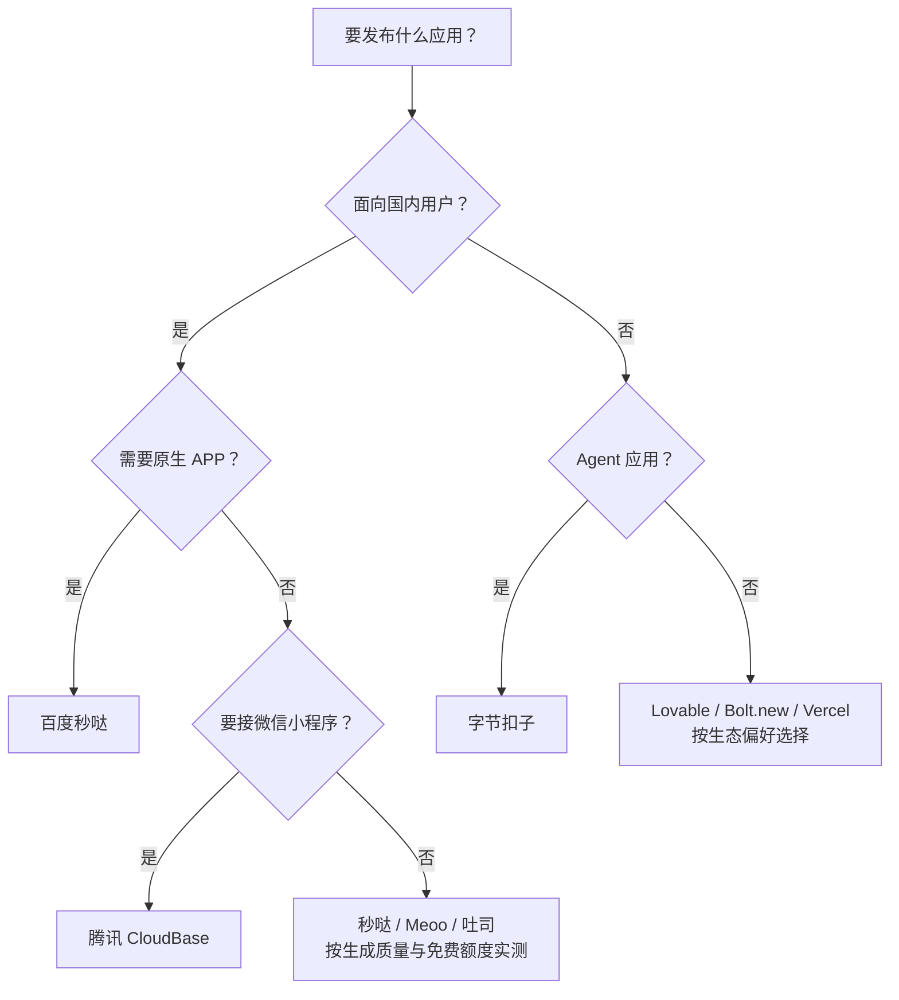

# AI 应用生成与发布平台全景 2026

> 中文简称：AI 应用生成平台全景 2026

> **一句话理解**: 用一句大白话描述需求，AI 自动生成带前后端和数据库的完整应用并一键上线 —— 这些"AI 应用生成平台"就像雇了一个会编程、会部署的全能助手，本文对比国内外各家助手的本领、门槛和"在国内好不好用"。

---

## 1. 平台演进与分类

### 1.1 从低代码到对话式生成

```
应用开发平台演进:
2015: 低代码拖拽 (Bubble/OutSystems) — 可视化编排
2019: 云开发 (CloudBase/Serverless) — 免运维后端
2022: 无代码 + AI 辅助 (Retool/Glide) — 表格驱动
2024: 对话式生成 (百度秒哒/阿里 Meoo) — 一句话生成
2026: Vibe Coding 平台 (腾讯吐司/Lovable) — 自然语言全栈交付

核心转变:
  拖拽搭 → 表格拼 → 人说AI写 → 人定目标AI交付上线
```

### 1.2 2026 主流平台总览

| 平台 | 出品方 | 类型 | 生成能力 | 发布方式 |
|------|--------|------|----------|---------|
| 秒悟 Meoo | 阿里云 | 对话式全栈 | 前端 + 后端 + 数据库 | 一键 CDN 发布 |
| 百度秒哒 | 百度 | 对话式无代码 | H5/网站/小程序/原生 APP | 平台内一键发布 |
| 腾讯吐司 Tusi | 腾讯 | Vibe Coding | 应用原型 + 全栈 | 平台内发布 |
| 腾讯云 CloudBase | 腾讯云 | AI-Native Serverless | 全栈 + 小程序 | 一键部署上线 |
| 扣子 Coze | 字节跳动 | Agent 编排 | 智能体/Bot 应用 | 多端分发 |
| Lovable | 海外 | 对话式全栈 | React + Supabase 全栈 | 一键发布自带域名 |
| Bolt.new | StackBlitz | 浏览器内全栈 | 完整项目代码 | 部署到 Netlify 等 |
| Replit | 海外 | Agent + 云 IDE | 全栈应用 | 一键部署子域名 |
| Vercel v0 | Vercel | UI/全栈生成 | 代码产物 | Git/CLI 部署 |
| Bubble | 海外 | 可视化拖拽 | 全栈业务逻辑 | 平台托管 |
| Glide / Softr | 海外 | 表格驱动 | 数据应用 | 平台托管 |

---

## 2. 基准平台：阿里云秒悟 Meoo

Meoo（秒悟）是阿里云推出的云端 AI 应用创作平台，定位"会编程、懂设计、自部署的 AI 伙伴"，深度融合通义千问（Qwen）等大模型能力与阿里云基础设施。

### 2.1 核心能力

- **全栈生成**：自然语言生成包含前端、后端、数据库的完整应用，告别拼凑式开发
- **一键部署**：构建产物发布到阿里云 OSS/CDN，生成公网地址 `https://<id>.meoo.fun`
- **云服务一体化**：每项目一个 Supabase 实例（PostgreSQL + Auth + Storage + Realtime），Edge Functions 运行在 Deno
- **内置模型生态**：Qwen 3.6 Plus（默认）、Kimi K2.5、DeepSeek V3.2、GLM 5、MiniMax M2.5
- **模板体系**：`react-project`（React 18 + Webpack）、`react-vite-project`（Vite 5）、`react-design`（React 19 + shadcn/ui）、`vue-project`（Vue 3 + Pinia）、`taro-project`（Taro 4 小程序）

### 2.2 CLI 工作流

```
meoo login                      # 浏览器授权登录
meoo init <template>            # 初始化本地模板（与 projects create 必须成对执行）
meoo projects create "App"      # 创建云端项目并绑定目录
pnpm install && pnpm dev        # 本地开发（固定端口 3015）
meoo cloud enable               # 按需开通数据库/认证/存储
meoo fn deploy <name>           # 部署 Edge Function（Deno）
meoo deploy --force             # 构建 + 推送沙箱 + 发布 CDN
```

### 2.3 沙箱 vs CDN 双发布路径

| 维度 | Sandbox（沙箱测试环境） | CDN（公网访问） |
|------|------------------------|-----------------|
| 用途 | 平台内预览、调试、协作 | 公网正式访问 |
| 内容 | 源码 → dev server 实时编译 | `dist/` 构建产物 |
| 更新方式 | `meoo sandbox push` / `deploy` | `meoo deploy` |
| 访问入口 | `meoo.com/chat/<projectId>` | `https://<id>.meoo.fun` |

> 关键坑点：`meoo deploy --skip-push` 只更新 CDN 不同步沙箱，会导致平台内编辑器预览空白 —— 两个系统独立运作，需发布时默认同步源码。

### 2.4 平台硬约束

- 固定端口 3015（`strictPort: true`）、Hash 路由、`dist/` 构建目录、包管理器仅限 pnpm
- 禁止启动任何后端服务器进程，后端能力全部走 Edge Functions + Supabase
- 仅支持 React/Vue/Taro 模板，无 Angular/Svelte；不支持原生 iOS/Android
- 免费版只能推送代码到沙箱，不能拉取；AI 服务消耗积分，配额超限需升级套餐

---

## 3. 海外同类平台

### 3.1 直接竞品（AI 对话生成 + 一键发布）

| 平台 | 特点 | 价格 | 优势 | 短板 |
|------|------|------|------|------|
| Lovable | 自然语言生成 React + Supabase 全栈应用 | $25/月起 | 与 Meoo 模式最像，产品成熟、模板精美 | 需国际信用卡；底层 Supabase 国内延迟明显 |
| Bolt.new | 浏览器内 AI 全栈开发，生成完整项目代码 | $20/月起 | 代码可完整导出、可迁移出平台 | 生成质量依赖上下文管理 |
| Replit | AI Agent + 云端 IDE + 数据库/认证 | 订阅制 | 从想法到部署全程浏览器内完成 | 平台锁定感较强 |
| Vercel v0 | AI 生成 UI/全栈，对接 Vercel 部署体系 | 免费版 + 订阅 | 代码归你，生态与 Git 工作流无缝 | 主要产出前端，后端能力弱 |

### 3.2 无代码/低代码（可视化拖拽）

| 平台 | 特点 | 适用场景 |
|------|------|----------|
| Bubble | 老牌全栈无代码平台，可视化编辑器 | 复杂业务逻辑应用，学习曲线较陡 |
| Glide / Softr | 基于表格数据快速生成应用 | 内部工具、目录类、移动端优先应用 |

---

## 4. 国内同类平台

### 4.1 直接竞品（对话式 AI 生成 + 一键发布）

| 平台 | 出品方 | 上线时间 | 核心特点 | 独有卖点 |
|------|--------|----------|----------|----------|
| 百度秒哒 | 百度 | 2024.11 | 国内首个对话式无代码平台，基于文心大模型，多智能体协作开发 | 商业化最成熟（50 万+ 应用）；**3.0 支持原生 APP 一键打包安装包**；企业版多人协作 |
| 腾讯吐司 Tusi | 腾讯 | 2026.05 | "探索型氛围编程（Vibe Coding）"，自然语言 → 功能拆解 → 原型预览 | 最新一代 Vibe Coding 体验 |
| 腾讯云 CloudBase | 腾讯云 | 持续迭代 | AI-Native 全栈平台：AI 对话中直接建库、部署云函数、配置静态托管 | **微信小程序生态无缝衔接**；每应用独立环境隔离；个人版约 19.9 元/月 |

### 4.2 字节系（偏 Agent 应用）

| 平台 | 核心特点 | 差异点 |
|------|----------|--------|
| 扣子 Coze | 一站式 AI 开发平台，拖拽式编排 + 800+ 插件 | 生成的是智能体/Bot 应用而非传统 Web 应用；可发布到抖音、飞书；2026 年与小米应用商店合作打通分发渠道 |

### 4.3 老牌低代码（AI 能力较弱）

- **钉钉宜搭 / 简道云 / 明道云**：企业表单、流程类应用，面向内部业务系统，不适合公网应用发布
- **腾讯微搭 WeDa**：面向小程序/H5 的低代码平台，比秒哒更早，但以拖拽为主、AI 生成能力弱

---

## 5. 国内访问可达性（关键决策维度）

> **两个层面必须分开看**：① 平台官网/开发环境能否直连（决定开发时是否要挂代理）；② 发布后的应用对国内用户是否可达（决定用户能否访问）。

### 5.1 海外平台：国内访问情况

| 平台 | 官网/开发环境 | 发布产物对国内用户 |
|------|--------------|-------------------|
| Lovable | ⚠️ 需翻墙 | 托管在海外（AWS/Supabase），延迟明显，未备案域名易被限速 |
| Bolt.new | ⚠️ 需翻墙 | Netlify 等海外 CDN，访问不稳定 |
| Replit | ⚠️ 长期不稳定，需代理 | `replit.app` 子域名国内基本不可直连 |
| Vercel v0 | ⚠️ 需翻墙 | `vercel.app` 域名已被 DNS 污染（被墙），**必须自定义域名 + 国内 CDN** |
| Bubble | ⚠️ 需代理 | 海外托管，国内访问慢 |
| Glide / Softr | ⚠️ 需代理 | 海外托管，国内可达性差 |

### 5.2 国内平台：全部直连

| 平台 | 官网/开发环境 | 发布产物对国内用户 |
|------|--------------|-------------------|
| 秒悟 Meoo | ✅ 直连快 | 阿里云 OSS/CDN，国内秒开 |
| 百度秒哒 | ✅ 直连快 | 国内直接访问 |
| 腾讯吐司 | ✅ 直连快 | 腾讯云基础设施 |
| 腾讯云 CloudBase | ✅ 直连快 | 腾讯云基础设施 |
| 扣子 Coze | ✅ 直连快 | 字节生态分发 |

---

## 6. 各家差异化定位与选型决策

### 6.1 大厂定位总结

| 大厂 | 产品 | 主打差异 |
|------|------|---------|
| 阿里 | 秒悟 Meoo | 通义生态 + 阿里云基础设施，CLI 本地开发 + CDN 发布，模板规范（React/Vue/Taro） |
| 百度 | 秒哒 | 起步最早、商业化最成熟，**原生 APP 打包**是独有卖点 |
| 腾讯 | 吐司 + CloudBase | 吐司专注 Vibe Coding 原型体验；CloudBase 面向开发者，微信小程序生态优势 |
| 字节 | 扣子 | 主攻 Agent 应用 + 流量分发（抖音/飞书/应用商店） |

### 6.2 按场景选择

| 你的场景 | 推荐平台 | 理由 |
|----------|----------|------|
| 面向国内用户频繁发布网站/H5 | 百度秒哒、秒悟 Meoo、腾讯吐司 | 开发与发布全程无需翻墙，产物国内直连快 |
| 生成原生 APP 安装包 | 百度秒哒 | 目前国内唯一支持一键打包安装包 |
| 接微信小程序生态 | 腾讯 CloudBase | 小程序后端一体化能力最强 |
| 做 AI 智能体/对话类应用 | 字节扣子 | 国内 Agent 分发生态首选 |
| 面向海外/全球用户 | Lovable、Bolt.new、Vercel | 生态和集成更丰富，但开发需翻墙 |
| 海外开发 + 国内用户访问 | 海外平台 + 自定义域名 + 国内 CDN | 需额外备案与加速成本，工作量明显增加 |

### 6.3 决策流程



> 决策要点：**面向国内用户时，"平台直连 + 产物可达"是海外平台无法替代的核心优势**；海外平台从开发到发布全程绕不开"翻墙 + 域名备案 + CDN 加速"三道坎。

---

## 7. 参考与延伸阅读

- 秒悟 Meoo 产品文档：https://docs.meoo.com（套餐与积分：https://docs.meoo.com/coindesc）
- 百度秒哒：百度智能云 MIAODA 产品文档
- 腾讯云 CloudBase：https://cloud.tencent.com/product/tcb
- 相关文档：[AI 编程助手全景（Cursor/Windsurf/Claude Code）](../05_开发工具/01_AI_编程_Assistants_2026.md) ｜ [AI IDE 全景 2026](./01_AI_IDE_全景_2026.md)
- 阿里云产品矩阵（含秒悟 Meoo 归属）：[Alibaba Cloud README](../../12_架构基建/06_云厂商/Alibaba_Cloud/README.md)
- AI 工具 2026 全景（编码/对话/图像视频分类）：[06_AI工具2026全景](../../00_入门/02_技术概览/06_AI工具2026全景.md)

---

*Last updated: 2026-08-22*
