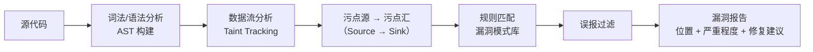
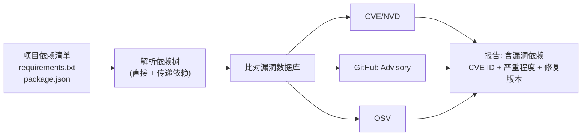
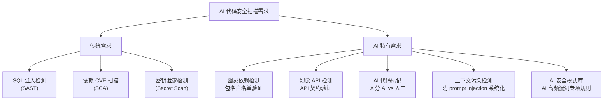
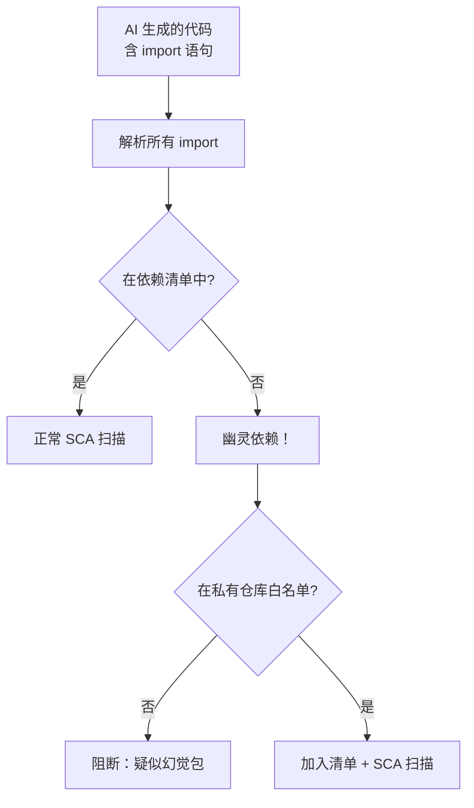
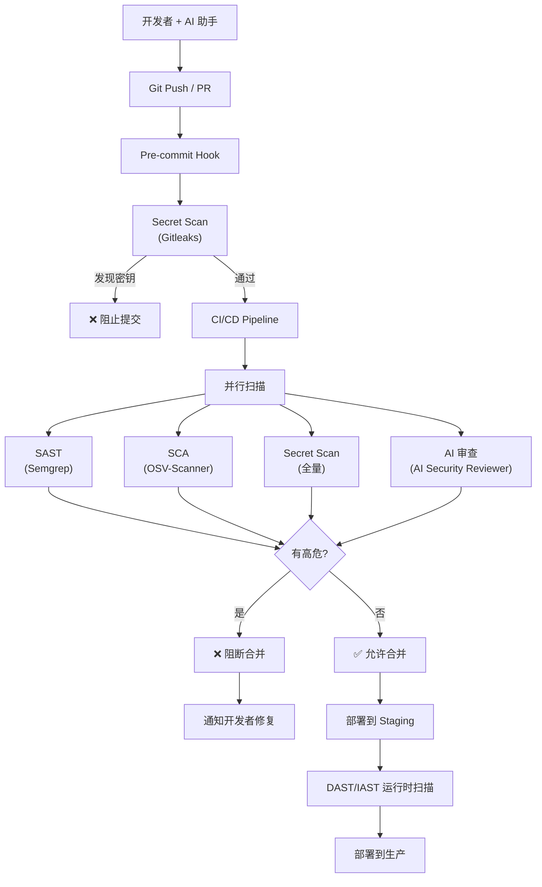
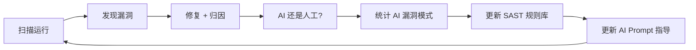

# SAST 与 SCA 在 AI 编程中的应用

> 中文简称：SAST 与 SCA 在 AI 编程中的应用

> **一句话理解**: SAST（静态应用安全测试）逐行扫描源代码寻找已知漏洞模式，SCA（软件组成分析）检查第三方依赖中的已知 CVE——两者是拦截 AI 生成代码安全风险的自动化第一道防线。

---

## Table of Contents

1. [SAST 与 SCA 基础](#1-sast-与-sca-基础)
2. [AI 代码对 SAST/SCA 的新挑战](#2-ai-代码对-sastsca-的新挑战)
3. [SAST 工具全景与配置](#3-sast-工具全景与配置)
4. [SCA 工具全景与配置](#4-sca-工具全景与配置)
5. [Secret Scanning：第三种关键扫描](#5-secret-scanning第三种关键扫描)
6. [CI/CD 集成实践](#6-cicd-集成实践)
7. [AI 辅助安全审查工具](#7-ai-辅助安全审查工具)
8. [工具选型决策框架](#8-工具选型决策框架)
9. [效果度量与持续改进](#9-效果度量与持续改进)
10. [Checklist](#10-checklist)
11. [Related](#11-related)

---

## 1. SAST 与 SCA 基础

### 1.1 什么是 SAST

SAST（Static Application Security Testing，静态应用安全测试）在**不运行代码**的情况下，通过分析源代码、字节码或二进制文件，识别已知的安全漏洞模式（如 SQL 注入、硬编码密码、不安全加密）。



### 1.2 什么是 SCA

SCA（Software Composition Analysis，软件组成分析）扫描项目的**第三方依赖**（库、框架、包），比对已知漏洞数据库（CVE/NVD/GHSA/OSV），识别使用了含漏洞版本的依赖。



### 1.3 SAST vs SCA vs DAST vs IAST

| 类型 | 全称 | 分析方式 | 扫描时机 | 覆盖范围 | AI 代码适配性 |
|------|------|---------|---------|---------|-------------|
| **SAST** | Static AST | 源码静态分析 | 提交/CI | 代码逻辑漏洞 | **核心** |
| **SCA** | Software Composition Analysis | 依赖清单分析 | 提交/CI | 第三方依赖 CVE | **核心** |
| DAST | Dynamic AST | 运行时探测 | 09_测试/预发布 | 运行时漏洞 | 补充 |
| IAST | Interactive AST | 运行时插桩 | 测试中 | 代码+运行时 | 补充 |
| Secret Scan | 密钥扫描 | 模式匹配 | 提交/CI | 硬编码密钥 | **核心** |

---

## 2. AI 代码对 SAST/SCA 的新挑战

### 2.1 传统 SAST 的局限

| 局限 | 对 AI 代码的影响 | 解决方向 |
|------|----------------|---------|
| 规则滞后 | AI 幻觉 API/幽灵依赖不在规则库中 | AI 辅助规则生成 |
| 误报率高 | AI 大量生成相似代码，误报堆积 | AI 辅助误报过滤 |
| 上下文理解不足 | 不理解 AI 生成的"伪安全"模式 | 语义级分析 |
| 多语言覆盖不均 | AI 混用语言（前端 TS + 后端 Python） | 统一扫描流水线 |

### 2.2 AI 特有的扫描需求



### 2.3 AI 代码扫描频率的提升

AI 代码生成速度快、批量大，传统"每日扫描"已不够：

| 扫描阶段 | 传统频率 | AI 时代推荐频率 |
|---------|---------|---------------|
| IDE 实时 | 无 | 每次保存（轻量 SAST） |
| Git Pre-commit | 可选 | **强制**（Secret Scan + SAST） |
| CI/CD 流水线 | 每日 | **每次 PR**（SAST + SCA） |
| 合并门禁 | 可选 | **强制门禁**（零高危） |
| 定期全量 | 每周 | 每日（含历史提交扫描） |

---

## 3. SAST 工具全景与配置

### 3.1 主流 SAST 工具对比

| 工具 | 适用语言 | 开源/商业 | AI 代码增强 | 特点 |
|------|---------|----------|-----------|------|
| **Semgrep** | 30+ 语言 | 开源 + Pro | ✅ AI 规则生成 | 速度快、自定义规则 |
| **SonarQube** | 25+ 语言 | 开源 + 商业 | 部分 | 企业级、质量+安全 |
| **CodeQL** | 12 语言 | 开源(GitHub) | ✅ AI 增强 | 数据流分析深度 |
| **Bandit** | Python | 开源 | 否 | Python 专用轻量 |
| **ESLint security** | JS/TS | 开源 | 否 | 前端专用 |
| **Snyk Code** | 10+ 语言 | 商业 | ✅ AI 驱动 | AI 原生 SAST |
| **Checkmarx** | 25+ 语言 | 商业 | 部分 | 企业级 SAST |
| **Fortify** | 25+ 语言 | 商业 | 部分 | 传统 SAST 领导者 |

### 3.2 Semgrep 深度配置

Semgrep 是 AI 代码审查中最推荐的 SAST 工具，因速度快、规则可自定义、支持 AI 辅助规则生成。

**基础配置（`.semgrep.yml`）**：
```yaml
# Semgrep 规则集
rules:
  # 1. 官方安全规则集
  - url: https://semgrep.dev/r/python.lang.security
  - url: https://semgrep.dev/r/javascript.lang.security
  - url: https://semgrep.dev/r/java.lang.security

  # 2. AI 特有规则
  - id: ai-hardcoded-secret-pattern
    patterns:
      - pattern-either:
          - pattern: 'aws_access_key_id = "AKIA..."'
          - pattern: 'password = "..."'
          - pattern: 'api_key = "sk-..."'
    message: "疑似 AI 生成的硬编码密钥"
    severity: ERROR
    metadata:
      source: "ai-code-audit"

  # 3. 禁止 os.system / shell=True
  - id: ai-command-injection
    patterns:
      - pattern-either:
          - pattern: 'os.system(...)'
          - pattern: 'subprocess.call(..., shell=True)'
          - pattern: 'subprocess.run(..., shell=True)'
    message: "AI 生成的命令注入风险——使用 shell=False"
    severity: ERROR

  # 4. 禁止不安全反序列化
  - id: ai-insecure-deserialization
    pattern-either:
      - pattern: 'pickle.loads($X)'
      - pattern: 'yaml.load($X)'
      - pattern: 'jsonpickle.decode($X)'
    message: "不安全反序列化——AI 常见高危模式"
    severity: ERROR
```

**CI/CD 中运行**：
```bash
# 扫描并生成报告
semgrep ci --config .semgrep.yml --json --output semgrep-report.json

# 阻断高危发现
semgrep ci --config .semgrep.yml --error  # 有 ERROR 级别发现时返回非零退出码
```

### 3.3 CodeQL 配置（GitHub Advanced Security）

```yaml
# .github/workflows/codeql.yml
name: CodeQL Analysis
on: [push, pull_request]

jobs:
  analyze:
    runs-on: ubuntu-latest
    strategy:
      matrix:
        language: [python, javascript, java]
    steps:
      - uses: actions/checkout@v4
      - uses: github/codeql-action/init@v3
        with:
          languages: ${{ matrix.language }}
          queries: security-extended  # 扩展安全规则
      - uses: github/codeql-action/analyze@v3
```

### 3.4 自定义 AI 漏洞规则示例

```python
# Semgrep 自定义规则：检测 AI 生成的伪加密
rules:
  - id: ai-base64-as-encryption
    pattern: 'base64.b64encode($DATA)'
    inside:
      pattern: 'def encrypt(...)'
    message: >
      AI 常见错误：用 base64 编码当作加密。
      base64 是可逆编码，不是加密。请使用 AES-256-GCM。
    severity: WARNING

  # 检测 AI 生成的弱哈希密码存储
  - id: ai-md5-password-hash
    pattern: 'hashlib.md5($PASSWORD)'
    message: >
      AI 生成的弱密码哈希：MD5 已被破解。
      请使用 bcrypt 或 argon2id。
    severity: ERROR
```

---

## 4. SCA 工具全景与配置

### 4.1 主流 SCA 工具对比

| 工具 | 生态覆盖 | 开源/商业 | 特点 | AI 增强功能 |
|------|---------|----------|------|-----------|
| **Dependabot** | GitHub 生态 | 免费（GitHub 内置） | PR 自动修复 | AI 修复建议 |
| **Snyk** | 全生态 | 商业（免费限额） | 漏洞数据库大 | AI 修复 PR |
| **OSV-Scanner** | 全生态 | 开源（Google） | OSV 数据库 | 开源免费 |
| **Trivy** | 容器+代码 | 开源 | 一体化扫描 | 无 |
| **Grype** | 容器+代码 | 开源（Anchore） | 速度快 | 无 |
| **Renovate** | 全生态 | 开源 | 自动更新依赖 | AI 配置生成 |
| **Socket** | npm/PyPI | 商业 | 供应链安全 | AI 行为分析 |

### 4.2 SCA 配置实践

**OSV-Scanner（开源推荐）**：
```bash
# 扫描项目依赖
osv-scanner --lockfile requirements.txt
osv-scanner --lockfile package-lock.json
osv-scanner --lockfile go.sum

# 扫描整个目录
osv-scanner -r ./

# CI/CD 集成
osv-scanner --lockfile requirements.txt --format json --output osv-report.json
```

**Dependabot 配置（`.github/dependabot.yml`）**：
```yaml
version: 2
updates:
  # Python 依赖
  - package-ecosystem: "pip"
    directory: "/"
    schedule:
      interval: "daily"
    open-pull-requests-limit: 10
    # 仅自动合并安全更新
    allow:
      - update-type: "security"

  # npm 依赖
  - package-ecosystem: "npm"
    directory: "/"
    schedule:
      interval: "daily"
```

### 4.3 AI 幽灵依赖检测

传统 SCA 只检查锁文件中的依赖，AI 幽灵依赖（import 了但不在依赖清单中的包）需要额外检测：

```bash
# 检测幽灵依赖（Python）
pip-audit --strict  # 检查 requirements.txt 与实际 import 的一致性

# 检测幽灵依赖（npm）
npx depcheck  # 检测 package.json 与实际 import 不匹配的包
```



---

## 5. Secret Scanning：第三种关键扫描

### 5.1 为什么 Secret Scan 对 AI 代码至关重要

AI 生成代码时填入形似真实的密钥是最高频的安全问题之一，必须用专用工具拦截。

### 5.2 Secret Scan 工具

| 工具 | 类型 | 特点 | 推荐场景 |
|------|------|------|---------|
| **Gitleaks** | 开源 | Git 历史扫描 | CI/CD 集成 |
| **TruffleHog** | 开源 | 深度验证（验证密钥是否有效） | 全面扫描 |
| **GitHub Secret Scanning** | 平台内置 | Push 保护 | GitHub 用户 |
| **GitLab Secret Detection** | 平台内置 | CI 模板 | GitLab 用户 |
| **Detect-secrets** | 开源（Yelp） | 基线管理 | Python 项目 |

**Gitleaks 配置**：
```bash
# 扫描当前提交
gitleaks detect --source . --report-path gitleaks-report.json

# 扫描 Git 全历史
gitleaks detect --source . --log-opts="--all" --report-path full-scan.json

# Pre-commit hook
gitleaks protect --staged
```

**自定义规则（`.gitleaks.toml`）**：
```toml
[[rules]]
id = "custom-aws-key"
description = "AWS Access Key"
regex = '''AKIA[0-9A-Z]{16}'''
tags = ["aws", "key"]

[[rules]]
id = "ai-hardcoded-password"
description = "AI 生成的硬编码密码"
regex = '''(?i)(password|passwd|pwd)\s*[=:]\s*["'][^"']{6,}["']'''
tags = ["ai", "password"]
```

---

## 6. CI/CD 集成实践

### 6.1 完整 AI 代码安全扫描流水线



### 6.2 GitHub Actions 完整配置

```yaml
# .github/workflows/ai-code-security.yml
name: AI Code Security
on: [push, pull_request]

jobs:
  sast:
    runs-on: ubuntu-latest
    steps:
      - uses: actions/checkout@v4
      - name: Semgrep Scan
        uses: returntocorp/semgrep-action@v1
        with:
          config: .semgrep.yml
        continue-on-error: false  # 高危阻断

  sca:
    runs-on: ubuntu-latest
    steps:
      - uses: actions/checkout@v4
      - name: OSV-Scanner
        uses: google/osv-scanner-action@v1
        with:
          scan-args: |-
            --recursive
            ./

  secret-scan:
    runs-on: ubuntu-latest
    steps:
      - uses: actions/checkout@v4
        with:
          fetch-depth: 0  # 完整历史
      - name: Gitleaks
        uses: gitleaks/gitleaks-action@v2
        env:
          GITHUB_TOKEN: ${{ secrets.GITHUB_TOKEN }}

  ai-review:
    runs-on: ubuntu-latest
    if: github.event_name == 'pull_request'
    steps:
      - uses: actions/checkout@v4
      - name: AI Security Review
        uses: ai-security-reviewer/action@v1
        with:
          api_key: ${{ secrets.AI_REVIEWER_KEY }}
          focus: security  # 聚焦安全审查
```

---

## 7. AI 辅助安全审查工具

### 7.1 AI 驱动的安全审查工具

| 工具 | 功能 | 原理 |
|------|------|------|
| **GitHub Copilot Autofix** | 自动修复 SAST 发现 | LLM 生成修复补丁 |
| **Snyk Code (DeepCode AI)** | AI 驱动 SAST | 训练于安全代码的模式识别 |
| **CodeRabbit** | AI 代码审查 | LLM 审查 PR 含安全维度 |
| **DryRun Security** | AI 安全审查 | 自动安全风险评估 |
| **Custom GPT/Claude 审查** | 自建 AI 审查 | 自定义 prompt + 安全规则 |

### 7.2 自建 AI 安全审查器（示例）

```python
# 使用 LLM 对 AI 生成的代码进行安全审查
import anthropic

def ai_security_review(code_diff: str) -> dict:
    client = anthropic.Anthropic()

    prompt = f"""你是安全代码审查专家。审查以下代码变更中的安全风险。

重点检查：
1. 注入漏洞（SQL、命令、XSS、Prompt 注入）
2. 硬编码密钥或密码
3. 不安全的依赖引用
4. 认证/授权缺陷
5. 加密实现错误
6. 不安全反序列化
7. 过度权限配置

代码变更：
```diff
{code_diff}
```

输出 JSON 格式：
{{
  "findings": [
    {{
      "severity": "critical|high|medium|low",
      "type": "漏洞类型",
      "location": "文件:行号",
      "description": "漏洞描述",
      "fix_suggestion": "修复建议"
    }}
  ],
  "overall_risk": "high|medium|low"
}}
"""

    response = client.messages.create(
        model="claude-sonnet-4-5",
        max_tokens=2000,
        messages=[{"role": "user", "content": prompt}]
    )
    return parse_json_response(response.content[0].text)
```

### 7.3 AI 审查 vs 传统 SAST 的互补

| 维度 | 传统 SAST | AI 安全审查 | 推荐组合 |
|------|----------|-----------|---------|
| 已知漏洞模式 | **强**（精确规则） | 中（可能遗漏） | SAST 为主 |
| AI 幻觉检测 | 弱（规则外） | **强**（语义理解） | AI 为主 |
| 逻辑漏洞 | 弱 | **强**（上下文推理） | AI 为主 |
| 误报率 | 高 | 低（可推理排除） | AI 过滤 |
| 速度 | 快（秒级） | 慢（分钟级） | SAST 快筛 |
| 可解释性 | 高（规则名） | 中（自然语言） | SAST 输出 |

**推荐策略**：SAST 快速扫描全部代码 → AI 审查 SAST 标记的高危区域 + AI 代码标记文件。

---

## 8. 工具选型决策框架

### 8.1 按团队规模选型

| 团队规模 | SAST | SCA | Secret Scan | AI 审查 |
|---------|------|-----|------------|--------|
| **初创（<10人）** | Semgrep（开源） | Dependabot（免费） | Gitleaks（开源） | Copilot 内置 |
| **中型（10-100人）** | Semgrep + SonarQube | Snyk（免费层） | Gitleaks + 平台内置 | Snyk Code |
| **大型（100+人）** | CodeQL + Checkmarx | Snyk 商业 + Black Duck | TruffleHog + 平台 | 自建 AI 审查 |
| **金融/医疗** | Fortify + CodeQL | 全覆盖商业方案 | 全历史扫描 + 轮换 | 自建 + 合规审计 |

### 8.2 按编程语言选型

| 语言 | 最佳 SAST | 最佳 SCA | 特殊检查 |
|------|----------|---------|---------|
| Python | Semgrep + Bandit | pip-audit + OSV | pickle/yaml 反序列化 |
| JavaScript/TS | Semgrep + ESLint security | npm audit + Socket | XSS/Prototype Pollution |
| Java | Semgrep + SpotBugs | OWASP Dependency-Check | 反序列化、JNDI |
| Go | Semgrep + Govulncheck | Govulncheck | goroutine 泄露 |
| Rust | Semgrep + Cargo Audit | Cargo Audit | unsafe 块 |
| 多语言混合 | **Semgrep（统一）** | OSV-Scanner（统一） | 统一报告 |

---

## 9. 效果度量与持续改进

### 9.1 安全扫描 KPI

| 指标 | 目标 | 计算方式 |
|------|------|---------|
| **MTTD**（平均发现时间） | < 1 小时（CI 阻断） | 从提交到发现漏洞的时间 |
| **MTTR**（平均修复时间） | 高危 < 24h, 中危 < 7d | 从发现到修复的时间 |
| **扫描覆盖率** | > 95% 代码 | 已扫描代码 / 总代码 |
| **高危逃逸率** | < 1% | 生产漏洞 / 已知漏洞 |
| **误报率** | < 10% | 误报 / 总发现 |
| **AI 代码标记率** | > 80% | 已标记 AI 代码 / AI 生成代码 |

### 9.2 持续改进循环



---

## 10. Checklist

### SAST 配置清单
- [ ] SAST 工具已配置并集成到 CI/CD（Semgrep/CodeQL/SonarQube）
- [ ] 覆盖所有主力编程语言（Python/JS/TS/Java/Go）
- [ ] 自定义 AI 漏洞规则（硬编码密钥、命令注入、伪加密等）
- [ ] 高危发现阻断 CI（非仅告警）
- [ ] 误报率定期审查和规则调优
- [ ] 扫描结果关联到 PR 评论（开发者可见）

### SCA 配置清单
- [ ] SCA 工具已集成（Dependabot/Snyk/OSV-Scanner）
- [ ] 使用锁文件确保版本一致性（package-lock.json / poetry.lock / uv.lock）
- [ ] 高危 CVE 自动创建修复 PR
- [ ] 幽灵依赖检测已启用（import 与清单一致性检查）
- [ ] 私有仓库为唯一依赖源（防依赖混淆）
- [ ] 新依赖引入需安全评估审批

### Secret Scan 配置清单
- [ ] Git Pre-commit hook 启用 Secret Scan
- [ ] Git 全历史已扫描（历史泄露已处理）
- [ ] 泄露密钥轮换流程已建立（不仅是删除）
- [ ] 自定义规则覆盖内部密钥格式
- [ ] 平台级 Push 保护已启用（GitHub/GitLab）

### AI 审查配置清单
- [ ] AI 代码已被标记（AI 生成的 commit/PR 可识别）
- [ ] AI 安全审查工具已集成 PR 流程
- [ ] AI 审查 prompt 包含安全检查项
- [ ] SAST + AI 审查互补策略已定义
- [ ] AI 漏洞模式库定期更新

---

## 11. Related

- [[16_编程/09_Security/AI_Code_Security_Audit_Runbook]] — AI 代码安全审计 Runbook (共享: security, sast, sca, ci-cd)
- [[16_编程/09_Security/AI_Code_Vulnerabilities]] — AI 代码漏洞类型 (共享: vulnerabilities, security)
- [[16_编程/09_Security/AI_Code_Review_Security]] — AI 代码审查安全实践 (共享: code-review, security, sast)
- [[16_编程/09_Security/Secure_Prompt_Engineering]] — 安全提示工程 (共享: security, ai-coding)
