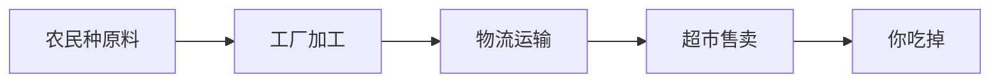
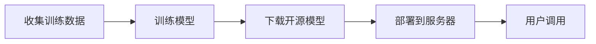
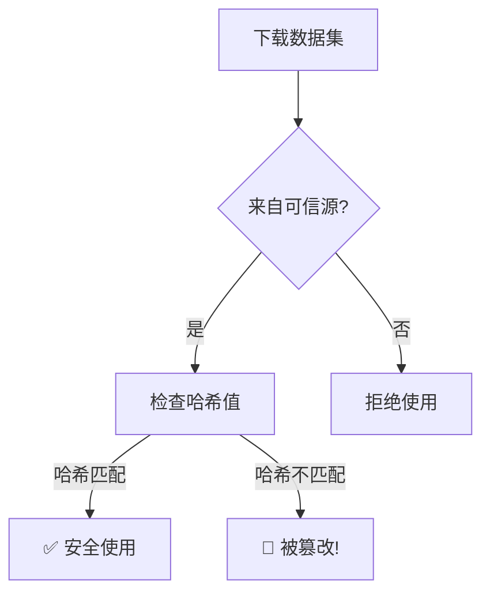
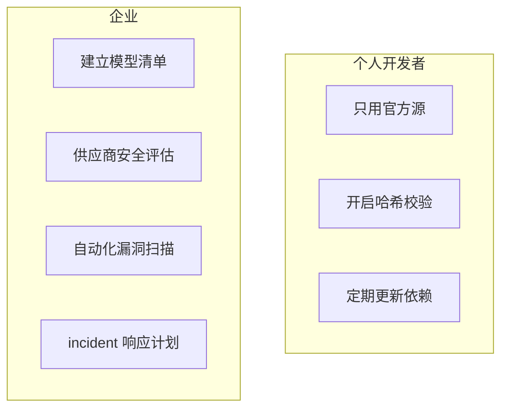

# AI 供应链安全小白指南 (AI Supply Chain Security for Dummy)

> **一句话理解**: AI 供应链安全就像检查"AI 食物的来源"——确保训练数据、模型文件和依赖库没有被坏人投毒或篡改。

---

## 🤔 什么是 AI 供应链？

### 用食品供应链来比喻

你吃的零食要经过很多环节：



**AI 系统也一样**：



**AI 供应链安全** = 确保每个环节都没被坏人动手脚。

---

## 🧨 有哪些风险？

| 风险 | 就像... | 后果 |
|------|--------|------|
| **毒化数据** | 往牛奶里加三聚氰胺 | 模型学到有害偏见 |
| **恶意模型** | 假药包装成真药 | 模型暗藏后门 |
| **依赖漏洞** | 运输卡车被劫持 | PyTorch/TensorFlow 库被篡改 |
| **权重窃取** | 配方被偷 | 价值百万的模型被复制 |

### 真实案例

- **2023 年 Hugging Face 令牌泄露**：攻击者上传恶意模型到 HF，用户下载后电脑被控制
- **XCodeGhost**：苹果开发工具被篡改，影响数千个 App

---

## 🛡️ 如何保护自己？

### 1. 验证数据来源



### 2. 模型安全检查清单

| 检查项 | 怎么做 |
|--------|--------|
| **来源验证** | 只从官方渠道下载（Hugging Face 官方、GitHub 官方仓库） |
| **哈希校验** | 下载后比对 MD5/SHA256 |
| **模型扫描** | 用工具检测模型文件是否包含恶意代码 |
| **沙箱测试** | 先在隔离环境运行新模型 |
| **依赖审计** | 定期检查 pip/conda 包的漏洞 |

### 3. 简单命令

```bash
# 检查文件哈希（确保和官网一致）
sha256sum model.bin

# 扫描 Python 依赖漏洞
pip install safety
safety check

# 检查模型文件是否异常
ls -lh model.bin  # 文件大小是否合理？
```

---

## 🎯 企业和个人该怎么做？



| 角色 | 关键行动 |
|------|---------|
| **个人** | 不下载来路不明的模型；更新 pip 包 |
| **小企业** | 建立模型来源记录；用 SBOM 工具 |
| **大企业** | 供应商安全审计；红队测试；合规检查 |

---

## ⚠️ 常见问题

| 问题 | 解答 |
|------|------|
| **开源模型安全吗？** | 大部分安全，但要验证来源和哈希 |
| **怎么知道数据被投毒了？** | 看模型行为是否异常（输出有害内容、性能骤降） |
| **供应链攻击常见吗？** | 越来越常见，2023-2024 年攻击增长 300%+ |
| **小企业需要担心吗？** | 需要。用第三方 API 也要考虑供应商安全 |

---

## 💡 核心要点

```mermaid
flowchart TB
    A[AI 供应链安全 = 检查 AI 的"食材来源"] --> B[数据：验证来源和完整性]
    B --> C[模型：校验哈希、扫描漏洞]
    C --> D[依赖：定期审计和更新]
    D --> E[一句话：只从可信源下载，下载后验证]
```

---

## 🔗 相关主题

- [AI 安全红队测试](../AI_Safety_RedTeaming/AI_Safety_RedTeaming.md) — 主动发现安全漏洞
- [AI 治理合规](../AI_Governance_Compliance_2026.md) — 法规要求
- [Value Alignment](../Value_Alignment/Value_Alignment.md) — 模型价值观对齐

---

*Last updated: 2026-05-07*
