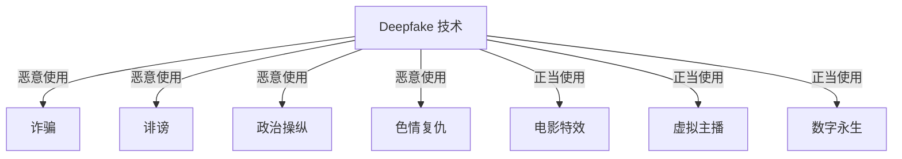
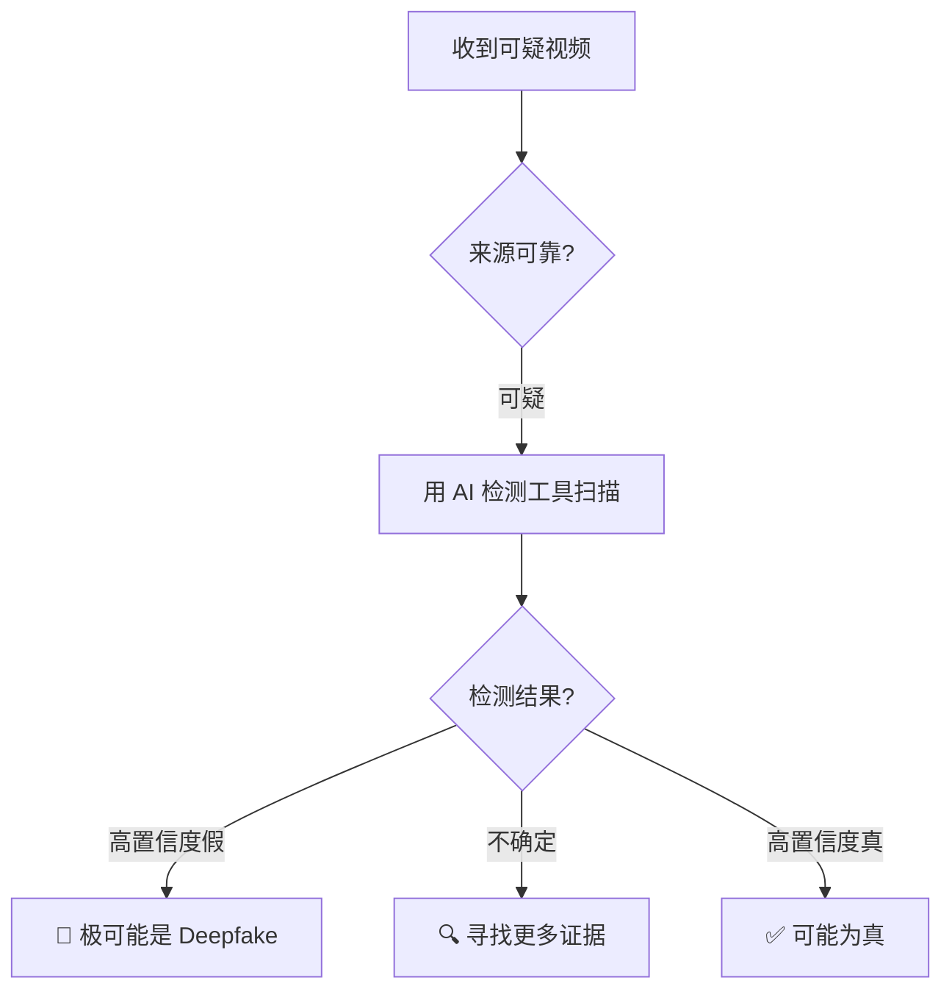

# 深度伪造安全小白指南 (Deepfake Security for Dummy)

> **一句话理解**: Deepfake 就像"数字变脸魔术"——用 AI 把你的脸换到别人身上，或者让某人说出从没说过的话，真假难辨。

---

## 🤔 什么是 Deepfake？

### 两个主要类型

| 类型 | 通俗说法 | 例子 |
|------|---------|------|
| **换脸** | "AI 变脸" | 把你的脸换到电影明星身上 |
| **语音克隆** | "AI 假声音" | 用你的声音说任何话 |
| **全身合成** | "AI 假人" | 生成不存在的人跳舞、说话 |

```mermaid
flowchart LR
    A[真视频<br/>奥巴马演讲] -->|AI 分析<br/>面部特征| B[Deepfake 模型]
    C[目标人脸<br/>你的照片] --> B
    B --> D[假视频<br/>"你"在演讲]
```

---

## 🧨 Deepfake 的危害

### 就像一个危险的玩具



| 危害 | 真实案例 |
|------|---------|
| **诈骗** | 用老板声音打电话，骗走 24 万欧元 |
| **假新闻** | 伪造政客演讲视频，影响选举 |
| **名誉损害** | 把普通人脸换到色情视频上 |
| **信任危机** | "有视频为证"不再可靠 |

---

## 🔍 如何识别 Deepfake？

### 肉眼观察技巧（不够准，但有用）

| 观察点 | 假视频的表现 |
|--------|-------------|
| **眼睛** | 不眨眼或眨眼频率异常 |
| **牙齿** | 模糊或不自然 |
| **耳朵** | 细节缺失，耳环穿帮 |
| **头发边缘** | 有奇怪的模糊边界 |
| **光照** | 脸部光和背景光不一致 |
| **声音** | 机械感，没有呼吸声 |

### AI 检测工具

| 工具 | 用途 | 准确度 |
|------|------|--------|
| **Microsoft Video Authenticator** | 视频真伪 | 中等 |
| **Deepware Scanner** | 手机扫描 | 入门 |
| **Intel FakeCatcher** | 实时检测 | 较高 |
| **商业方案** | 企业级检测 | 高 |



---

## 🛡️ 如何保护自己？

### 个人防护

| 措施 | 怎么做 |
|------|--------|
| **少晒高清正面照** | 减少被换脸的素材 |
| ** watermark 你的视频** | 加数字水印，方便追溯 |
| **警惕视频通话诈骗** | 涉及钱的视频通话，回拨确认 |
| **保护声音样本** | 不要随意提供语音录音 |

### 企业防护

- 部署 Deepfake 检测 API
- 员工安全意识培训
- 重要决策需要多重验证（视频+文字确认）

---

## ⚖️ 法律与伦理

| 国家/地区 | 法规 |
|-----------|------|
| **中国** | 《深度合成管理规定》：必须标识 AI 生成内容 |
| **美国** | 部分州立法禁止选举相关 Deepfake |
| **欧盟** | AI 法案要求高风险 AI 系统透明 |

**底线**：未经同意制作他人 Deepfake 是违法的。

---

## ⚠️ 常见问题

| 问题 | 解答 |
|------|------|
| **所有 AI 生成视频都是 Deepfake 吗？** | Deepfake 特指"伪造真实人物"，AI 动画、虚拟主播不算 |
| **Deepfake 检测 100% 准吗？** | 不是。检测和伪造在"军备竞赛" |
| **普通人需要担心吗？** | 需要。诈骗电话、假视频越来越逼真 |
| **怎么向长辈解释？** | "现在视频也能造假了，看到奇怪视频先别信" |

---

## 💡 核心要点

```mermaid
flowchart TB
    A[Deepfake = AI 变脸/变声] --> B[技术本身中性]
    B --> C[恶意使用：诈骗/诽谤/操纵]
    C --> D[防护：检测工具 + 提高警惕 + 法律]
    D --> E[记住：视频不再"有图有真相"]
```

---

## 🔗 相关主题

- [AI 安全红队测试](../AI_Safety_RedTeaming/AI_Safety_RedTeaming.md) — 主动测试 AI 安全
- [AI 治理合规](../AI_Governance_Compliance_2026.md) — 法律法规
- [Privacy Preserving AI](../Privacy_Preserving_AI/Privacy_Preserving_AI.md) — 保护个人数据

---

*Last updated: 2026-05-07*
