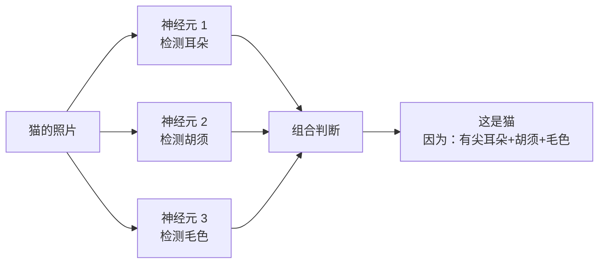
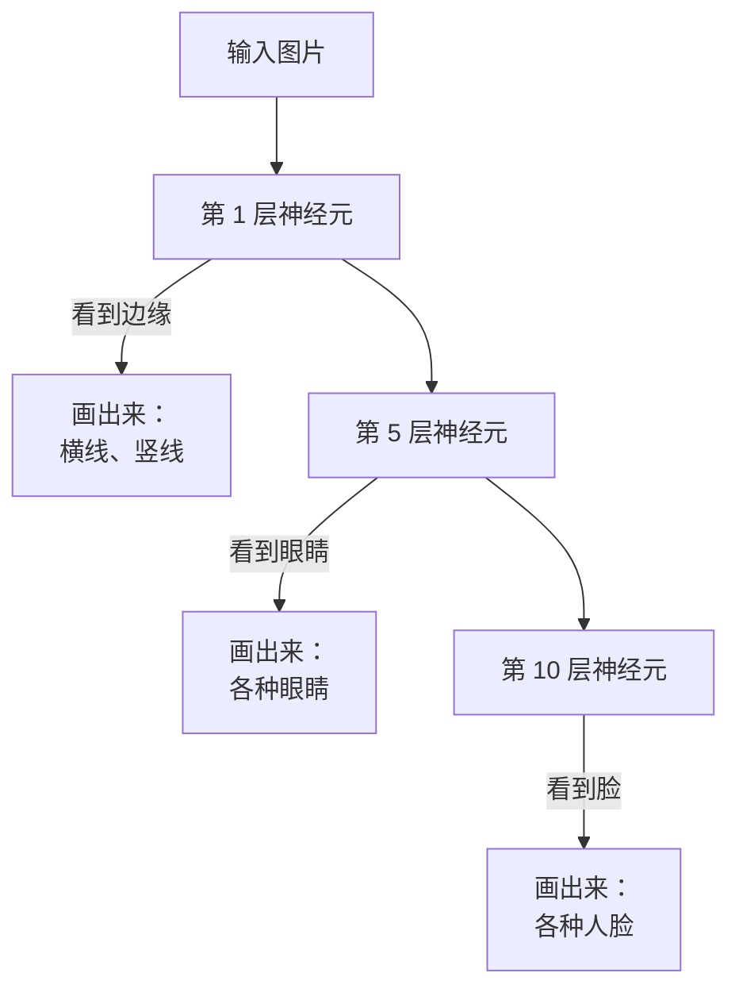
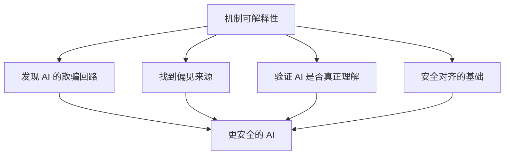
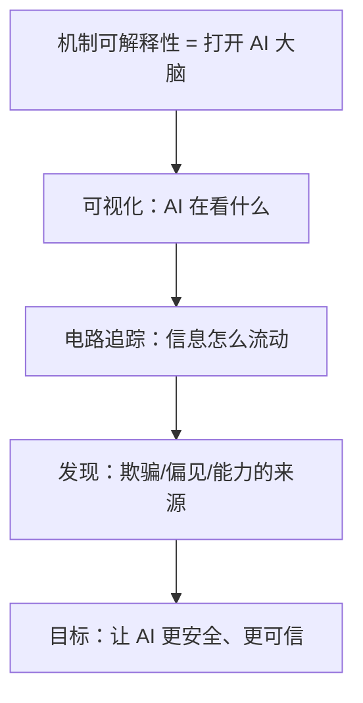

# 机制可解释性小白指南 (Mechanistic Interpretability for Dummy)

> **一句话理解**: 机制可解释性就像"打开 AI 的脑子看它在想什么"——不再把 AI 当黑盒，而是解剖它的神经元，看看它是怎么理解"狗"和"猫"的。

---

## 🤔 为什么 AI 是"黑盒"？

### 一个比喻

你问一个资深厨师："这道菜为什么这么好吃？"

- 他说："就是好吃啊，我也不知道为什么。"
- 这就是**黑盒**——知道结果，不知道原因。

普通 AI 也是这样：
- 你问："为什么判断这是猫？"
- AI："概率 99% 是猫。"
- 你："为什么？？"
- AI："..."

```mermaid
flowchart LR
    A[输入<br/>猫的照片] -->|黑盒 AI| B[???]
    B --> C[输出<br/>"这是猫"]
    style B fill:#333,color:#fff
```

---

## 🧠 机制可解释性要做什么？

### 目标：把黑盒变透明



### 核心问题

| 问题 | 解释 |
|------|------|
| **AI 怎么理解"爱"？** | 看哪些神经元在"爱"出现时激活 |
| **AI 会不会说谎？** | 看它有没有"欺骗"相关的神经回路 |
| **AI 怎么算数学？** | 找负责加减乘除的神经元小组 |

---

## 🔧 主要方法（简化版）

### 1. 特征可视化

把 AI "看到的"东西画出来：



### 2. 电路追踪

找到 AI 内部的"电路板"：

```
输入: "法国 的 首都 是"
    ↓
神经元 A: 识别"法国"
    ↓
神经元 B: 关联"首都"
    ↓
神经元 C: 提取"巴黎"
    ↓
输出: "巴黎"
```

### 3. 叠加（Superposition）

一个神经元可能同时干好几件事：
- 神经元 X = 既识别"圆形"，又识别"红色"
- 就像大脑的一个区域同时处理多种信息

---

## 🏆 重要发现

| 发现 | 意义 |
|------|------|
| ** induction circuits** | AI 学会了"A 跟着 B 出现，所以 B 可能跟着 A" |
| **间接对象识别** | GPT-4 有专门处理"谁给了谁什么"的电路 |
| **Truthful direction** | 模型内部有"说真话"和"说谎"的方向 |

---

## 🎯 为什么这很重要？



| 应用场景 | 说明 |
|----------|------|
| **AI 安全** | 找到 AI "使坏"的能力是怎么产生的 |
| **消除偏见** | 定位导致性别/种族偏见的神经元 |
| **能力迁移** | 把 GPT-4 的数学能力"移植"到小模型 |
| **医疗 AI** | 确保 AI 看 X 光时真的在看病灶 |

---

## ⚠️ 局限与挑战

| 挑战 | 说明 |
|------|------|
| **模型太大** | GPT-4 有 1.8 万亿参数，不可能全看 |
| **叠加问题** | 一个神经元干多件事，很难分离 |
| **需要大量计算** | 分析一个模型要数百万 GPU 小时 |
| **结果难验证** | 怎么确定"这就是 AI 的真实想法"？ |

---

## 💡 核心要点



---

## 🔗 相关主题

- [Value Alignment](../Value_Alignment/Value_Alignment.md) — AI 价值观对齐
- [AI 安全红队测试](../AI_Safety_RedTeaming/AI_Safety_RedTeaming.md) — 主动发现风险
- [AI Governance](../AI_Governance_Compliance_2026.md) — AI 治理框架

---

*Last updated: 2026-05-07*
