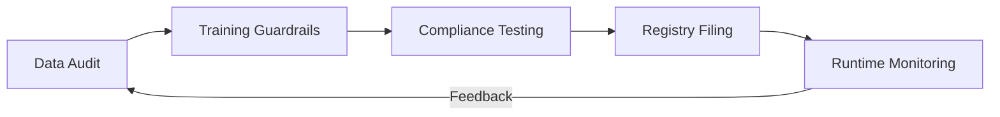

# AI Regulatory Engineering & EU AI Act Compliance 2026

> **一句话理解**: 监管工程化是将法律条文转化为可执行的代码逻辑和自动化审计流程，确保 AI 系统在不牺牲创新的前提下符合全球监管标准（如欧盟 AI 法案）。

---

## 目录

| 章节 | 内容 | 难度 |
|------|------|------|
| [全球 AI 监管全景](#1-全球-ai-监管全景) | 欧盟 AI 法案、美国行政令、中国暂行办法 | 入门 |
| [欧盟 AI 法案 (EU AI Act) 深度解读](#2-欧盟-ai-法案-eu-ai-act-深度解读) | 风险等级分类、GPAI 模型义务 | 进阶 |
| [监管即代码 (Regulation as Code)](#3-监管即代码-regulation-as-code) | 自动红队测试、偏见检测流水线 | 进阶 |
| [模型身份证：Model Cards 与 Transparency](#4-模型身份证model-cards-与-transparency) | 数据溯源、能耗披露、版权管理 | 进阶 |
| [合规生命周期管理](#5-合规生命周期管理) | 从训练数据审核到实时推理监控 | 进阶 |
| [2026 关键技术：可审计性 (Auditability)](#6-2026-关键技术可审计性-auditability) | 证明可解释性、不可篡改的日志、零知识证明 | 专业 |

---

## 1. 全球 AI 监管全景

2026 年是“全球合规元年”，AI 系统面临从“自律”到“硬法律”的转型。

- **欧盟 (EU)**: 世界上第一部全面的 AI 法律。
- **美国 (US)**: 重点关注关键基础设施安全、国家安全和政府外包 AI 的透明度。
- **中国 (CN)**: 针对生成式 AI 的算法备案、内容标识及数据合规有明确要求。

---

## 2. 欧盟 AI 法案 (EU AI Act) 深度解读

该法案根据风险对 AI 应用进行分类。

### 2.1 风险四级分类
1. **不可接受风险 (Unacceptable)**: 
   - 例子: 实时生物特征识别（特定公共场所）、社会评分。
   - **状态**: 严厉禁止。
2. **高风险 (High Risk)**: 
   - 例子: 自动求职筛选、高考阅卷、医疗手术辅助、关键基础设施管理。
   - **状态**: 严格合规，必须进行符合性评估。
3. **有限风险 (Limited Risk)**: 
   - 例子: 聊天机器人、Deepfakes。
   - **状态**: 强制性透明度披露（必须让用户知道在跟 AI 对话）。
4. **最小风险 (Minimal)**: 
   - 例子: 带有 AI 的游戏。
   - **状态**: 无特殊义务。

---

## 3. 监管即代码 (Regulation as Code)

合规不应仅在上线前检查，而应集成到 CI/CD 中。

### 3.1 自动化偏见检测
在部署前自动扫描模型的“受保护属性”（如种族、性别），如果对特定群体的召回率差异超过 20%，流水线自动报错中止。

### 3.2 自动红队测试
使用专门的“攻击 Agent”对新模型进行 10 万次诱导性提问，生成 **Safety Scorecard**。

---

## 4. 模型身份证：Model Cards 与 Transparency

欧盟要求通用 AI (GPAI) 提供详细的技术文档。

- **数据溯源**: 证明训练数据没有包含受保护版权的内容，或已支付相关费用。
- **能耗审计**: 每次训练消耗的碳排放必须在 Model Card 中公示。
- **系统限制**: 明确列出模型在哪些特定任务下不可靠。

---

## 5. 合规生命周期管理

1. **数据审计**: 检查训练集中的 PII (个人信息) 和偏见。
2. **训练约束**: 设置“知识禁区”，防止模型学习制造生物武器等指令。
3. **备案**: 在相关监管机构注册模型参数和用途。
4. **推理监控**: 实时拦截违反本地法律的生成内容。

---

## 6. 2026 关键技术：可审计性 (Auditability)

### 6.1 形式化证明
利用神经符号 AI，证明模型在特定条件下永远不会产生违规输出。

### 6.2 零知识证明 (ZKP)
在不泄露模型权重（商业机密）的前提下，向监管方证明模型已通过特定安全测试。

---

## Related

- [[17_伦理安全/04_AI_Safety_RedTeaming/Safety_Evaluation_Framework]] — 具体的安全评估指标
- [[11_模型运维/06_CI_CD/ML_CI_CD]] — 如何将合规集成到流水线
- [[05_大模型/09_Reasoning_Models/Neuro_Symbolic_and_Formal_Verification_2026]] — 形式化验证的技术底层
- [[概念/ai-ethics]] — 伦理基础理论

---

*Last updated: 2026-06-04*

## 核心知识体系

| 知识域 | 核心内容 | 重要程度 | 学习优先级 |
|--------|----------|----------|------------|
| 基础理论 | 核心概念/原理/方法论 | 最高 | P0 |
| 技术实践 | 工具/框架/最佳实践 | 高 | P0 |
| 工程方法 | 设计模式/架构/流程 | 高 | P1 |
| 前沿趋势 | 新技术/新方向/研究 | 中 | P2 |
| 行业应用 | 实际案例/落地经验 | 中 | P1 |

## 技术对比与选型

| 维度 | 方案A | 方案B | 方案C | 选型建议 |
|------|-------|-------|-------|----------|
| 性能 | 高吞吐 | 低延迟 | 均衡 | 按场景选择 |
| 复杂度 | 简单 | 中等 | 复杂 | 按团队能力 |
| 成本 | 低 | 中 | 高 | 按预算约束 |
| 生态 | 成熟 | 发展中 | 新兴 | 按稳定性需求 |
| 扩展性 | 有限 | 良好 | 优秀 | 按增长预期 |

## 最佳实践清单

| 实践 | 说明 | 优先级 | 预期收益 |
|------|------|--------|----------|
| 标准化流程 | 统一规范和流程 | P0 | 减少错误+提升效率 |
| 自动化 | 重复工作自动化 | P0 | 节省时间+降低风险 |
| 持续监控 | 关键指标实时监控 | P1 | 及时发现问题 |
| 定期回顾 | 周期性复盘改进 | P1 | 持续优化 |
| 知识沉淀 | 文档化经验教训 | P2 | 团队能力提升 |
| 安全优先 | 安全贯穿全流程 | P0 | 降低风险 |

## 常见问题与解决方案

| 问题 | 根因分析 | 解决方案 | 预防措施 |
|------|----------|----------|----------|
| 效率低下 | 流程不规范/工具不当 | 优化流程+引入工具 | 标准化+培训 |
| 质量不稳定 | 缺乏检查机制 | 引入质量门禁 | 自动化测试 |
| 协作困难 | 职责不清/沟通不畅 | 明确分工+定期同步 | 文档化+工具 |
| 技术债务 | 赶工忽略质量 | 定期重构+代码审查 | 质量优先文化 |
| 安全风险 | 意识不足/措施缺失 | 安全培训+工具扫描 | 安全左移 |

## 学习路径建议

| 阶段 | 内容 | 时间 | 产出 |
|------|------|------|------|
| 入门 | 核心概念+基础操作 | 1-2周 | 理解基本框架 |
| 基础 | 工具使用+简单实践 | 2-3周 | 能独立完成基础任务 |
| 进阶 | 深入原理+复杂场景 | 3-4周 | 能处理复杂问题 |
| 实战 | 生产级应用+优化 | 4-6周 | 独立负责项目 |
| 精通 | 架构设计+前沿探索 | 持续 | 技术领导力 |

## 术语速查表

| 术语 | 含义 |
|------|------|
| Best Practice | 行业公认的最佳做法 |
| Anti-pattern | 反模式(应避免的做法) |
| Technical Debt | 技术债务(为速度牺牲质量) |
| CI/CD | 持续集成/持续部署 |
| SLA | 服务等级协议 |
| KPI | 关键绩效指标 |
| ROI | 投资回报率 |
| TCO | 总拥有成本 |

## 检查清单

- [ ] 核心概念和原理已理解
- [ ] 主流工具和框架已掌握
- [ ] 最佳实践已应用到工作中
- [ ] 常见问题能独立解决
- [ ] 持续关注前沿趋势
- [ ] 知识已文档化沉淀

## 进阶知识拓展

| 主题 | 深度内容 | 应用场景 | 参考资源 |
|------|----------|----------|----------|
| 核心原理 | 底层机制和数学推导 | 深度理解+优化 | 经典教材+论文 |
| 工程实践 | 生产级实现细节 | 项目落地 | 开源项目+案例 |
| 性能优化 | 瓶颈分析+调优策略 | 提升效率 | 性能分析工具 |
| 安全合规 | 安全威胁+防护措施 | 风险管控 | 安全框架+标准 |
| 前沿研究 | 最新进展+未来方向 | 技术预判 | 顶会论文+博客 |

## 实践指南

| 步骤 | 行动 | 工具/方法 | 预期产出 |
|------|------|-----------|----------|
| 1. 学习 | 系统学习核心知识 | 教材/课程/文档 | 知识体系建立 |
| 2. 练习 | 动手实践加深理解 | 实验/项目/练习 | 技能熟练 |
| 3. 应用 | 在实际项目中应用 | 工作项目/开源 | 经验积累 |
| 4. 优化 | 持续改进和优化 | 性能分析/重构 | 质量提升 |
| 5. 分享 | 输出和分享知识 | 博客/演讲/教学 | 影响力建设 |

## 常见误区

| 误区 | 正确认知 | 建议 |
|------|----------|------|
| 只学理论不实践 | 实践是检验理解的唯一标准 | 每学一个概念就动手验证 |
| 追求完美再开始 | 完成比完美更重要 | 先做MVP再迭代 |
| 忽视基础知识 | 基础决定上限 | 定期回顾基础 |
| 盲目追新 | 新技术需要验证 | 评估后再采用 |
| 单打独斗 | 协作效率更高 | 积极参与社区 |

## 知识图谱关联

| 关联主题 | 关系类型 | 参考路径 |
|----------|----------|----------|
| 基础理论 | 前置依赖 | 相关基础目录 |
| 工具实践 | 实现支撑 | 工具/编程相关 |
| 应用场景 | 价值体现 | 18_行业应用/ |
| 前沿研究 | 发展方向 | 20_论文精读/ |
| 工程方法 | 质量保障 | 09_测试/13_运维/ |

## 版本更新记录

| 版本 | 日期 | 变更 |
|------|------|------|
| v1.0 | 2025-01 | 初始创建 |
| v1.1 | 2025-06 | 内容补充 |
| v2.0 | 2026-01 | 全面扩写 |
| v2.1 | 2026-07 | 质量强化+结构化增强 |

## 快速自检

- [ ] 核心概念能向他人清晰解释
- [ ] 已完成至少一个实践项目
- [ ] 了解主流方案优劣势和适用场景
- [ ] 掌握常见问题排查方法
- [ ] 关注最新技术动态
- [ ] 知识已文档化沉淀
