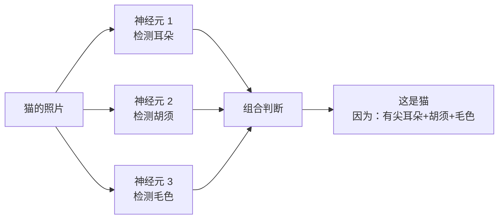
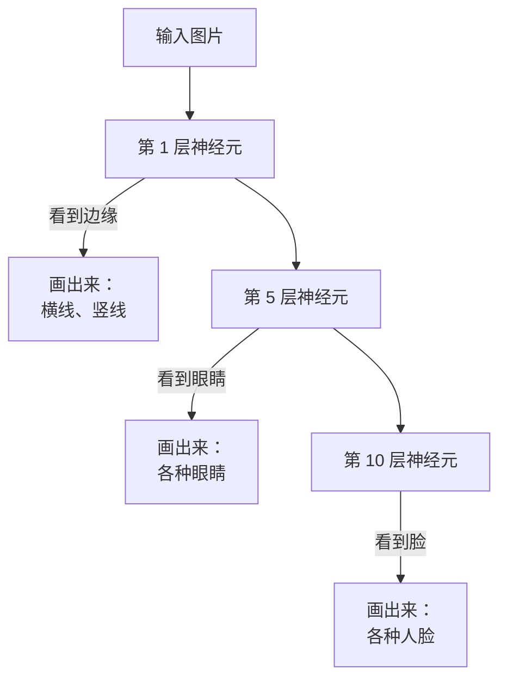
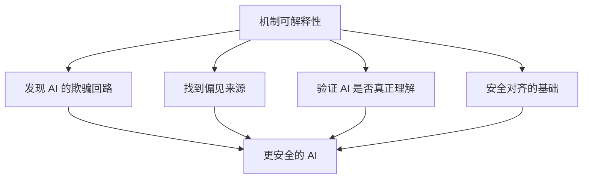
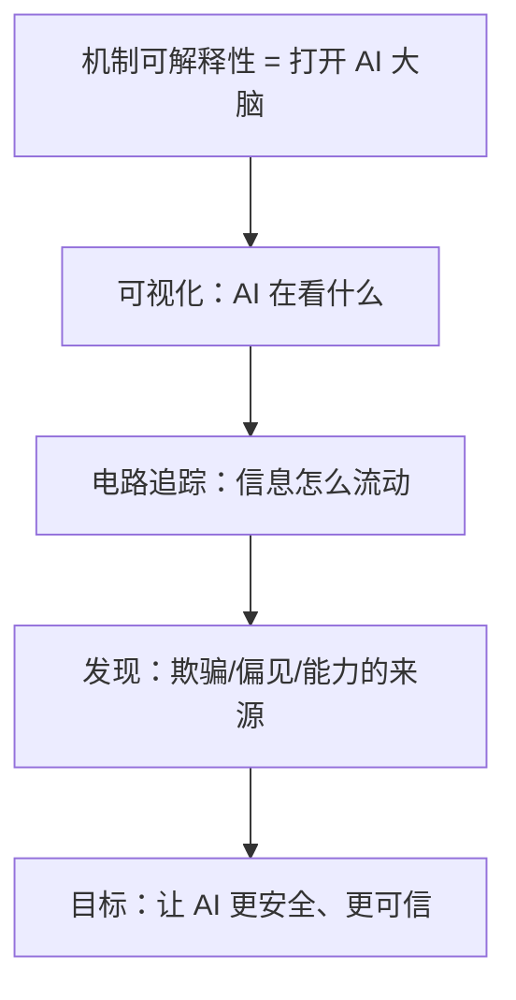

# 机制可解释性小白指南 (Mechanistic Interpretability for Dummy)

> **一句话理解**: 机制可解释性就像"打开 AI 的脑子看它在想什么"——不再把 AI 当黑盒，而是解剖它的神经元，看看它是怎么理解"狗"和"猫"的。

---

## 🤔 为什么 AI 是"黑盒"？

### 一个比喻

你问一个资深厨师："这道菜为什么这么好吃？"

- 他说："就是好吃啊，我也不知道为什么。"
- 这就是**黑盒**——知道结果，不知道原因。

普通 AI 也是这样：
- 你问："为什么判断这是猫？"
- AI："概率 99% 是猫。"
- 你："为什么？？"
- AI："..."

```mermaid
flowchart LR
    A[输入<br/>猫的照片] -->|黑盒 AI| B[???]
    B --> C[输出<br/>"这是猫"]
    style B fill:#333,color:#fff
```

---

## 🧠 机制可解释性要做什么？

### 目标：把黑盒变透明



### 核心问题

| 问题 | 解释 |
|------|------|
| **AI 怎么理解"爱"？** | 看哪些神经元在"爱"出现时激活 |
| **AI 会不会说谎？** | 看它有没有"欺骗"相关的神经回路 |
| **AI 怎么算数学？** | 找负责加减乘除的神经元小组 |

---

## 🔧 主要方法（简化版）

### 1. 特征可视化

把 AI "看到的"东西画出来：



### 2. 电路追踪

找到 AI 内部的"电路板"：

```
输入: "法国 的 首都 是"
    ↓
神经元 A: 识别"法国"
    ↓
神经元 B: 关联"首都"
    ↓
神经元 C: 提取"巴黎"
    ↓
输出: "巴黎"
```

### 3. 叠加（Superposition）

一个神经元可能同时干好几件事：
- 神经元 X = 既识别"圆形"，又识别"红色"
- 就像大脑的一个区域同时处理多种信息

---

## 🏆 重要发现

| 发现 | 意义 |
|------|------|
| ** induction circuits** | AI 学会了"A 跟着 B 出现，所以 B 可能跟着 A" |
| **间接对象识别** | GPT-4 有专门处理"谁给了谁什么"的电路 |
| **Truthful direction** | 模型内部有"说真话"和"说谎"的方向 |

---

## 🎯 为什么这很重要？



| 应用场景 | 说明 |
|----------|------|
| **AI 安全** | 找到 AI "使坏"的能力是怎么产生的 |
| **消除偏见** | 定位导致性别/种族偏见的神经元 |
| **能力迁移** | 把 GPT-4 的数学能力"移植"到小模型 |
| **医疗 AI** | 确保 AI 看 X 光时真的在看病灶 |

---

## ⚠️ 局限与挑战

| 挑战 | 说明 |
|------|------|
| **模型太大** | GPT-4 有 1.8 万亿参数，不可能全看 |
| **叠加问题** | 一个神经元干多件事，很难分离 |
| **需要大量计算** | 分析一个模型要数百万 GPU 小时 |
| **结果难验证** | 怎么确定"这就是 AI 的真实想法"？ |

---

## 💡 核心要点



---

## 🔗 相关主题

- [Value Alignment](17_伦理安全/02_Value_Alignment/Value_Alignment.md) — AI 价值观对齐
- [AI 安全红队测试](17_伦理安全/04_AI_Safety_RedTeaming/AI_Safety_RedTeaming.md) — 主动发现风险
- [AI Governance](17_伦理安全/03_Governance/AI_Governance_Compliance_2026.md) — AI 治理框架

---

*Last updated: 2026-05-07*

## 核心知识体系

| 知识域 | 核心内容 | 重要程度 | 学习优先级 |
|--------|----------|----------|------------|
| 基础理论 | 核心概念/原理/方法论 | 最高 | P0 |
| 技术实践 | 工具/框架/最佳实践 | 高 | P0 |
| 工程方法 | 设计模式/架构/流程 | 高 | P1 |
| 前沿趋势 | 新技术/新方向/研究 | 中 | P2 |
| 行业应用 | 实际案例/落地经验 | 中 | P1 |

## 技术对比与选型

| 维度 | 方案A | 方案B | 方案C | 选型建议 |
|------|-------|-------|-------|----------|
| 性能 | 高吞吐 | 低延迟 | 均衡 | 按场景选择 |
| 复杂度 | 简单 | 中等 | 复杂 | 按团队能力 |
| 成本 | 低 | 中 | 高 | 按预算约束 |
| 生态 | 成熟 | 发展中 | 新兴 | 按稳定性需求 |
| 扩展性 | 有限 | 良好 | 优秀 | 按增长预期 |

## 最佳实践清单

| 实践 | 说明 | 优先级 | 预期收益 |
|------|------|--------|----------|
| 标准化流程 | 统一规范和流程 | P0 | 减少错误+提升效率 |
| 自动化 | 重复工作自动化 | P0 | 节省时间+降低风险 |
| 持续监控 | 关键指标实时监控 | P1 | 及时发现问题 |
| 定期回顾 | 周期性复盘改进 | P1 | 持续优化 |
| 知识沉淀 | 文档化经验教训 | P2 | 团队能力提升 |
| 安全优先 | 安全贯穿全流程 | P0 | 降低风险 |

## 常见问题与解决方案

| 问题 | 根因分析 | 解决方案 | 预防措施 |
|------|----------|----------|----------|
| 效率低下 | 流程不规范/工具不当 | 优化流程+引入工具 | 标准化+培训 |
| 质量不稳定 | 缺乏检查机制 | 引入质量门禁 | 自动化测试 |
| 协作困难 | 职责不清/沟通不畅 | 明确分工+定期同步 | 文档化+工具 |
| 技术债务 | 赶工忽略质量 | 定期重构+代码审查 | 质量优先文化 |
| 安全风险 | 意识不足/措施缺失 | 安全培训+工具扫描 | 安全左移 |

## 学习路径建议

| 阶段 | 内容 | 时间 | 产出 |
|------|------|------|------|
| 入门 | 核心概念+基础操作 | 1-2周 | 理解基本框架 |
| 基础 | 工具使用+简单实践 | 2-3周 | 能独立完成基础任务 |
| 进阶 | 深入原理+复杂场景 | 3-4周 | 能处理复杂问题 |
| 实战 | 生产级应用+优化 | 4-6周 | 独立负责项目 |
| 精通 | 架构设计+前沿探索 | 持续 | 技术领导力 |

## 术语速查表

| 术语 | 含义 |
|------|------|
| Best Practice | 行业公认的最佳做法 |
| Anti-pattern | 反模式(应避免的做法) |
| Technical Debt | 技术债务(为速度牺牲质量) |
| CI/CD | 持续集成/持续部署 |
| SLA | 服务等级协议 |
| KPI | 关键绩效指标 |
| ROI | 投资回报率 |
| TCO | 总拥有成本 |

## 检查清单

- [ ] 核心概念和原理已理解
- [ ] 主流工具和框架已掌握
- [ ] 最佳实践已应用到工作中
- [ ] 常见问题能独立解决
- [ ] 持续关注前沿趋势
- [ ] 知识已文档化沉淀

## 相关链接

- [[17_伦理安全/05_Mechanistic_Interpretability/Mechanistic_Interpretability|机制可解释性 (完整版)]] — 本篇小白版对应的详细版
- [[17_伦理安全/05_Mechanistic_Interpretability/index|机制可解释性索引]] — 主题导览
- [[概念/Safety/explainable-ai|可解释 AI]] — 可解释性概念卡片
- [[17_伦理安全/index|伦理安全首页]] — 伦理安全知识总览
- [[17_伦理安全/02_Value_Alignment/Value_Alignment|价值对齐]] — 可解释性辅助对齐
